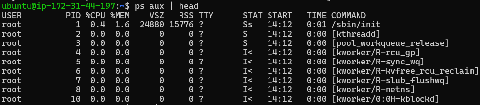
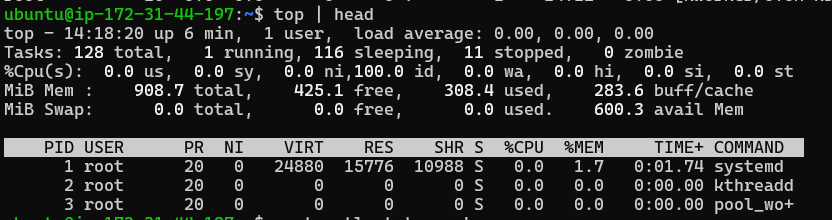
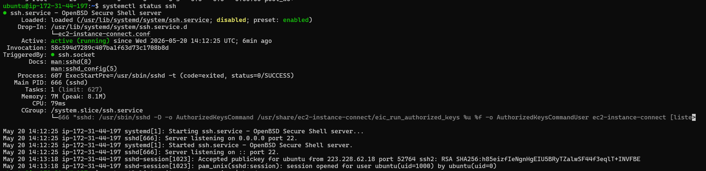
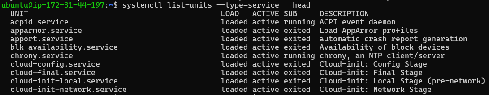
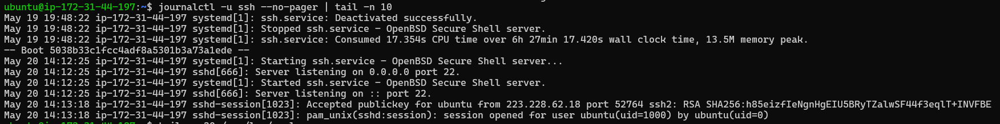
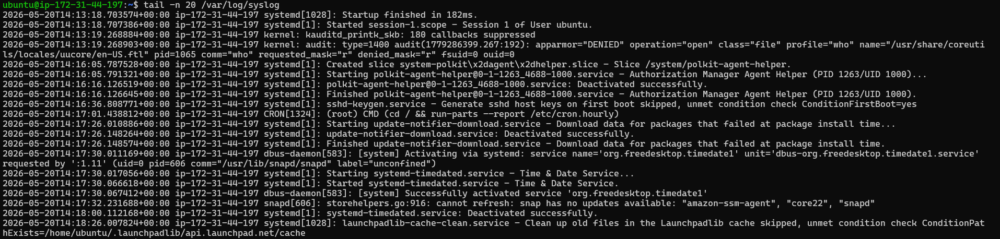
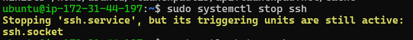
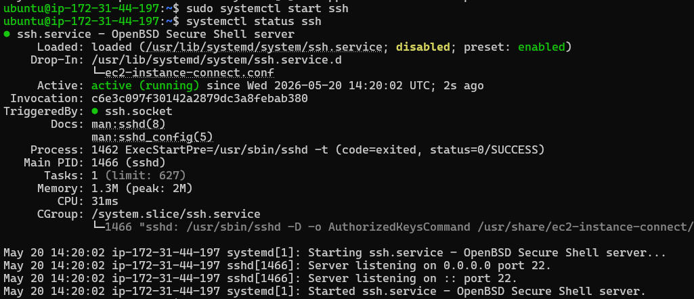

# Day 04 – Linux Practice: Processes and Services

## Real time output of commands I practiced

---

## Process commands

ps aux | head - List running processes (top lines)  

top - Monitor processes in real time  

---

## Service commands

systemctl status ssh - Check SSH service status  

systemctl list-units --type=service - List running services  

---

## Log commands

journalctl -u ssh --no-pager | tail -n 10 - Shows SSH logs  

tail -n 20 /var/log/syslog - Shows system logs  

---

## Service for inspection (SSH)

systemctl status ssh  

It is running. Now stopping the service:

Checking logs for issue:

Logs show service is stopped.

Starting SSH service again:

Service is active now and working fine.

---

## What I learned

- How to check running processes using ps and top  
- How to inspect services using systemctl  
- How to read logs using journalctl and tail  
- Basic troubleshooting by stopping and restarting services  