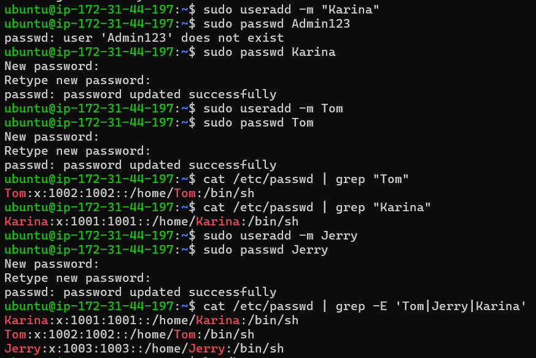
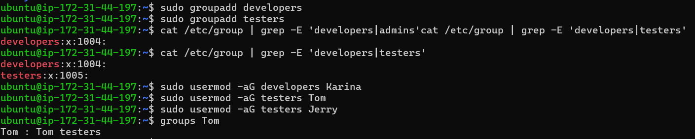
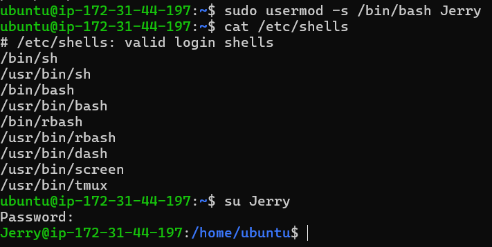
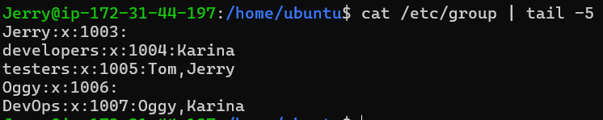
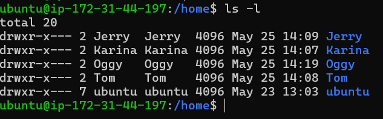
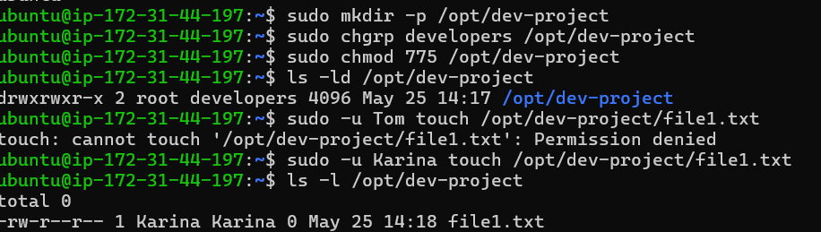
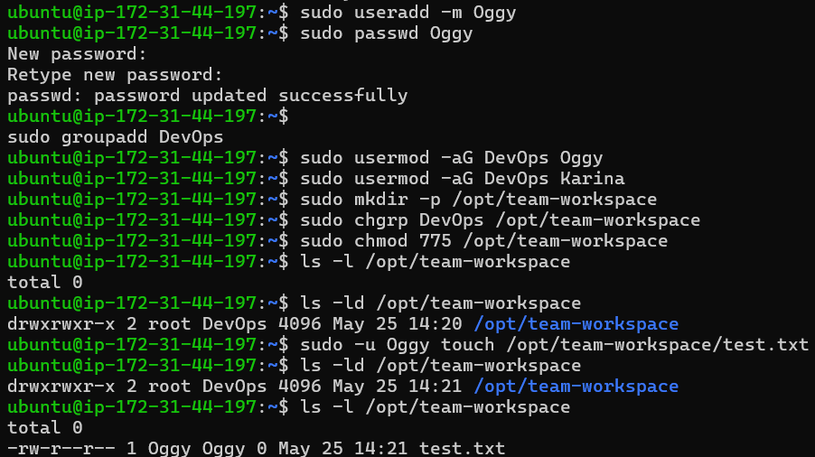

# Linux User & Group Management (Day 09)

## 👤 Users Created
Command used:
useradd -m username → creates user with home directory

📸 Snapshot:

Users:
- Karina
- Tom
- Jerry
- Oggy

---

## 👥 Groups Created
Command used:
groupadd groupname → creates new group

Groups:
- developers
- testers

📸 Snapshot:

---

## 🔧 Changed Default Shell
Command used:
sudo usermod -s /bin/bash username → changes default shell

📸 Snapshot:

---

## 🔗 Group Assignment
Assigned users to groups using:
sudo usermod -aG group user → adds user to group without removing existing ones

📸 Snapshot:

---

## 📁 Home Directories of Users
Each user got a separate home directory in /home

📸 Snapshot:

---

## 📂 Shared Directory (Dev Project)

Steps:
- Created directory: /opt/dev-project
- Set group: developers
- Permissions: 775 (rwxrwxr-x)

Commands:
sudo mkdir -p /opt/dev-project  
sudo chgrp developers /opt/dev-project  
sudo chmod 775 /opt/dev-project  

Test:
- Created file using Karina 

📸 Snapshots:
  

---

## 👨‍💻 Team Workspace

Steps:
- Created user Oggy
- Created group testers
- Added Karina & Oggy to group
- Created directory: /opt/team-workspace
- Set group and permissions (775)

Commands:
sudo mkdir -p /opt/team-workspace  
sudo chgrp testers /opt/team-workspace  
sudo chmod 775 /opt/team-workspace  

Test:
- Created file using Oggy

📸 Snapshots:
  

---

## 🛠️ Commands Used

- useradd -m → create user with home directory  
- adduser → interactive user creation  
- passwd → set password  
- groupadd → create group  
- usermod -s → change shell  
- usermod -aG → assign group  
- chgrp → change group ownership  
- chmod 775 → set permissions  
- mkdir -p → create directory  
- ls -l → check permissions  
- groups → check group membership  
- sudo -u → run command as another user  

---

## 💡 What I Learned

- Understood how Linux manages users and groups internally  
- Learned how permissions control access in shared environments  
- Even if users are in same group, they cannot edit each other's files by default  

👉 Why?
- File owner = creator  
- Default permission = only owner can write  
- Group gets read access mostly  

👉 Real Example:
In shared directory, team members can see files but not edit unless permissions are changed

- Learned how to enable SSH access for new users securely  

---
