# Day 10 – File Permissions & File Operations Challenge

## 📂 Files Created

- Created empty file:
```bash
touch devops.txt
```

- Created file with content:
```bash
echo "My DevOps Notes" > notes.txt
```

- Created script file using vim:
```bash
vim script.sh
```

Added inside:
```bash
echo "Hello DevOps"
```

- Verified permissions:
```bash
ls -l
```

📸 Snapshot:  
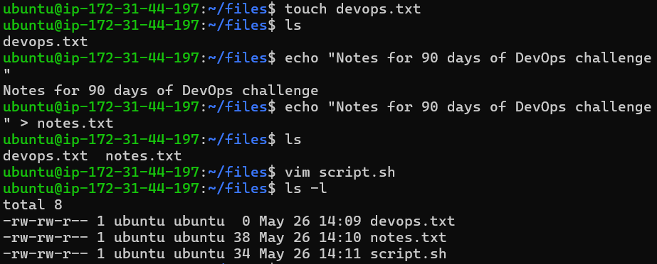

---

## 📖 Read Files

- Read content of notes.txt:
```bash
cat notes.txt
```

📸 Snapshot:  
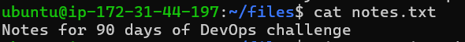

- Open script in read-only mode:
```bash
vim -R script.sh
```

📸 Snapshot:  
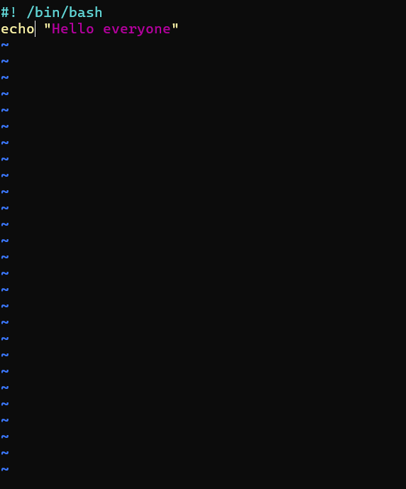

---

## 📊 File Content Preview

- First 5 lines of `/etc/passwd`:
```bash
head -5 /etc/passwd
```

📸 Snapshot:  
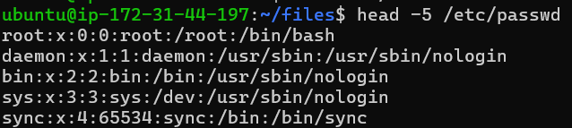

- Last 5 lines of `/etc/passwd`:
```bash
tail -5 /etc/passwd
```

📸 Snapshot:  
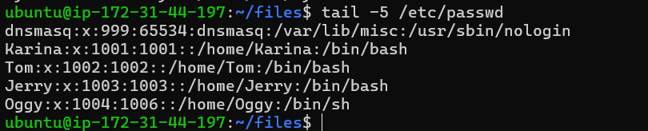

---

## 🔐 Permission Changes

### Understanding Permissions

Current permission:
```
devops.txt : -rw-rw-r--
```

- `-` → normal file  
- `rw-` → owner can read & write  
- `rw-` → group can read & write  
- `r--` → others can only read  

Same applied for:
- notes.txt  
- script.sh  

📸 Snapshot:  
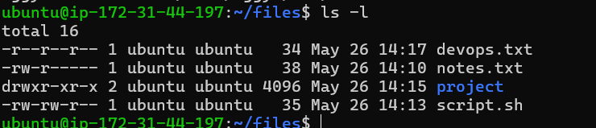

---

## ⚙️ Modify Permissions

- Make script executable:
```bash
chmod +x script.sh
./script.sh
```

📸 Snapshot:  
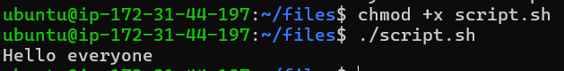

---

- Make devops.txt read-only:
```bash
chmod -w devops.txt
```

📸 Snapshot:  
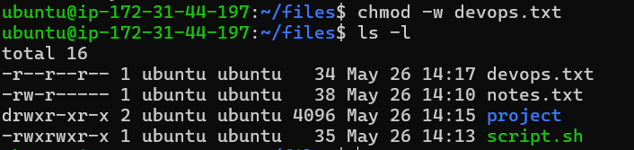

---

- Set notes.txt permission to 640:
```bash
chmod 640 notes.txt
```

📸 Snapshot:  
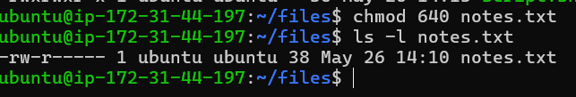

---

- Create directory with 755 permission:
```bash
mkdir -m 755 project
```

📸 Snapshot:  
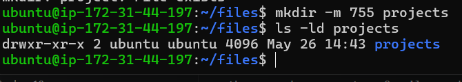

---

## 🧪 Test Permissions

### Writing to Read-Only File

Tried writing:
```bash
echo "test" > devops.txt
```

👉 Output: Permission denied  

✔️ Insight:
- Normal user → cannot write  
- Using sudo → possible (with tee)  
- Immutable file → even sudo won’t work  

📸 Snapshot:  
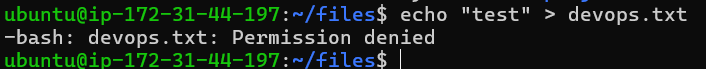

---

### Executing Without Execute Permission

Removed execute:
```bash
chmod -x script.sh
./script.sh
```

👉 Output: Permission denied  

✔️ But this works:
```bash
bash script.sh
```

✔️ Insight:
- Execute bit is required  
- sudo also cannot bypass this  
- Interpreter can still run it  

📸 Snapshot:  
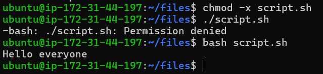

---

## 🧰 Commands Used

```bash
touch file          # create empty file
echo "text" > file  # create file with content
vim file            # open file
cat file            # read file
vim -R file         # read-only mode
head -5 file        # first 5 lines
tail -5 file        # last 5 lines
chmod +x file       # add execute
chmod -w file       # remove write
chmod 640 file      # set specific permission
mkdir -m 755 dir    # create dir with permission
```

---

## 🚀 What I Learned

- How file permissions actually work in real  
- Difference between read, write, execute  
- sudo can override read/write but not execute  
- Even without execute, script can run via interpreter  
- Small concept but very important in real systems.  