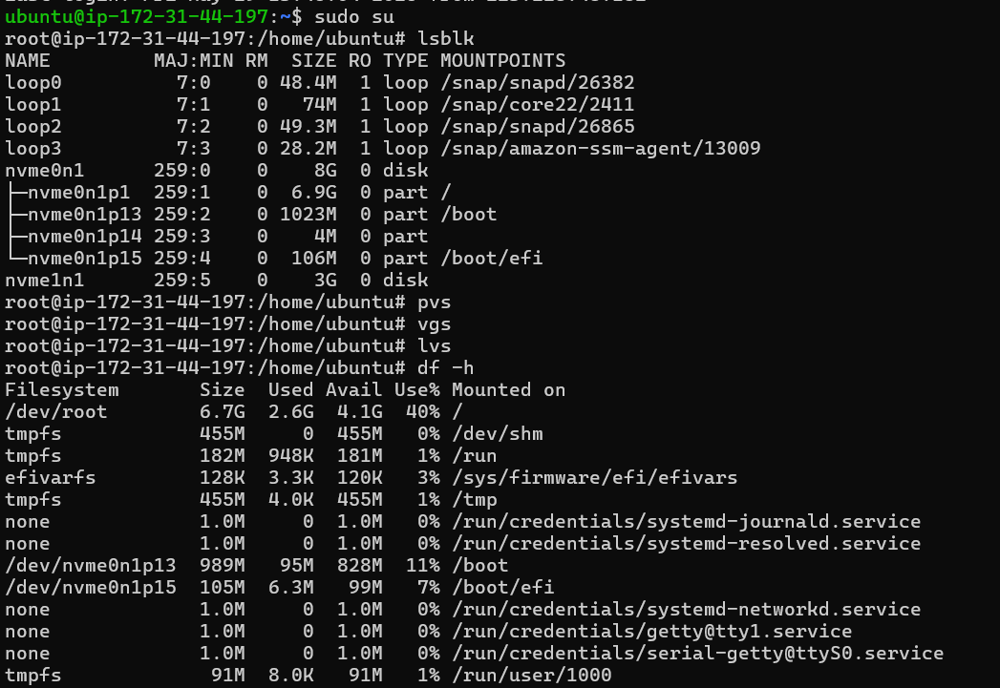
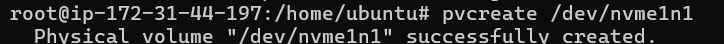
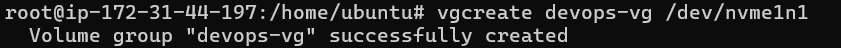
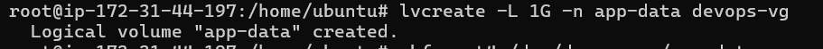
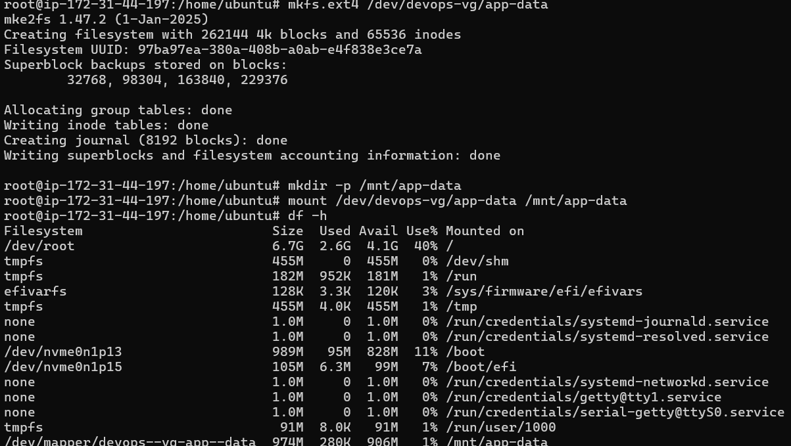
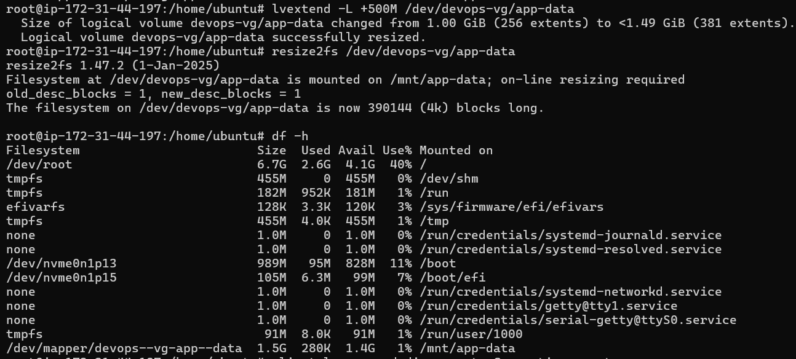
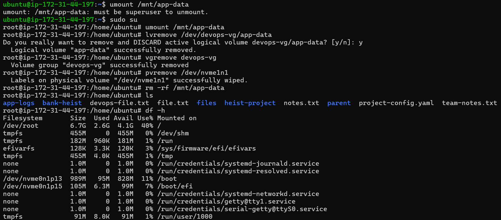

# Day 13 – Linux Volume Management (LVM)

## 🎯 Goal
Learn to manage storage using LVM – create, mount, and extend volumes.

---

## ⚙️ Storage Setup (Disk Identification)
Commands practiced:
- `lsblk` → Identified available disks and partitions  
- `df -h` → Checked mounted filesystem usage  

  

---

## 📦 Physical Volume (PV)
Commands practiced:
- `pvcreate /dev/nvme1n1` → Initialized disk as Physical Volume  
- `pvs` → Verified PV creation  

  

---

## 🧱 Volume Group (VG)
Commands practiced:
- `vgcreate devops-vg /dev/nvme1n1` → Created Volume Group  
- `vgs` → Verified VG  

  

---

## 💽 Logical Volume (LV)
Commands practiced:
- `lvcreate -L 1G -n app-data devops-vg` → Created Logical Volume  
- `lvs` → Verified LV  

  

---

## 🗂️ Mounting & Filesystem
Commands practiced:
- `mkfs.ext4 /dev/devops-vg/app-data` → Formatted volume  
- `mkdir -p /mnt/app-data` → Created mount directory  
- `mount /dev/devops-vg/app-data /mnt/app-data` → Mounted volume  
- `df -h` → Verified mount  

  

---

## 🔼 Volume Extension
Commands practiced:
- `lvextend -L +500M /dev/devops-vg/app-data` → Extended volume  
- `resize2fs /dev/devops-vg/app-data` → Resized filesystem  
- `df -h` → Verified updated size  

  

---

## 🔁 Cheat Sheet Refresh (Top Commands)
- `lsblk` → View disk structure  
- `pvcreate` → Create Physical Volume  
- `vgcreate` → Create Volume Group  
- `lvcreate` → Create Logical Volume  
- `lvextend + resize2fs` → Extend storage  

---

## 🧹 Cleanup (Delete Everything Created)

> ⚠️ Run in order. Do NOT skip steps.

```bash
# 1. Unmount the volume
- 'umount /mnt/app-data'

# 2. Remove Logical Volume
-'lvremove /dev/devops-vg/app-data'

# 3. Remove Volume Group
-'vgremove devops-vg'

# 4. Remove Physical Volume
-'pvremove /dev/nvme1n1'

# 5. (Optional) Remove mount directory
-'rm -rf /mnt/app-data'

  

## 🧪 Mini Self-Check

### 1. What is LVM hierarchy?
- Physical Volume (PV) → Volume Group (VG) → Logical Volume (LV)

### 2. Why use LVM instead of partitions?
- Flexible resizing  
- Better storage management  
- Combine multiple disks  

### 3. How do you extend storage?
- `lvextend -L +size /dev/vg/lv`  
- `resize2fs /dev/vg/lv`  

### 4. What issue did you face?
- Tried using `/dev/loop0` which was already mounted  
- Fixed by using `/dev/nvme1n1`  

---

## 📌 Key Takeaways
- Clear understanding of LVM architecture  
- Hands-on with real disk instead of loop device  
- Learned resizing volumes without downtime  
- Improved debugging approach  

---

