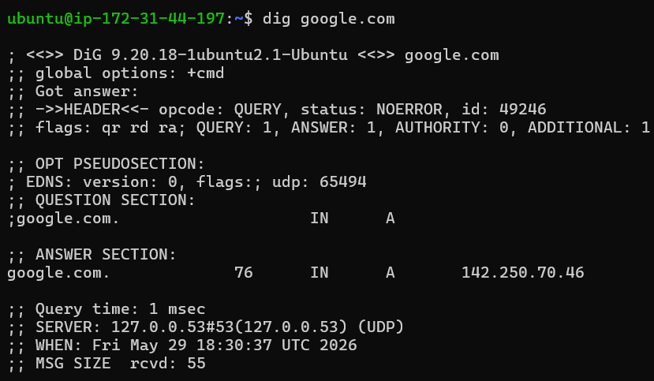
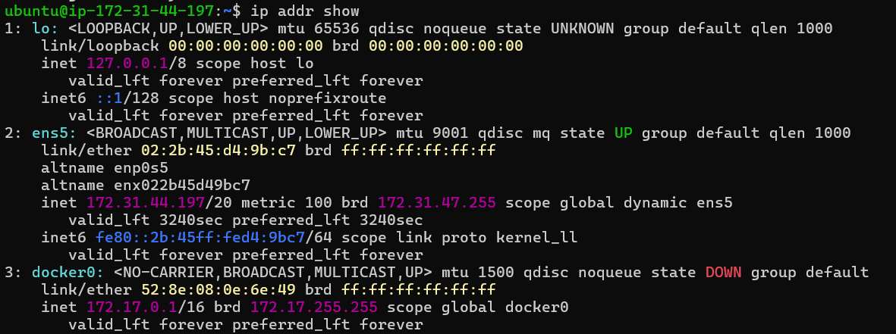

# Day 15 – Networking Concepts: DNS, IP, Subnets & Ports

---

## 🌐 Task 1: DNS – How Names Become IPs

### What happens when you type google.com in a browser?

1. Browser checks local cache for the IP address.  
2. If not found, it queries DNS to resolve the domain name.  
3. A TCP connection is established (HTTPS).  
4. Request is routed via load balancer to the correct server.  
5. Server processes request and returns the webpage.  

---

### DNS Record Types

- **A** – Maps domain to IPv4 address  
- **AAAA** – Maps domain to IPv6 address  
- **CNAME** – Alias from one domain to another  
- **MX** – Mail servers for the domain  
- **NS** – Authoritative name servers  

---

### dig Output

```bash
dig google.com
```

**Observation:**
- A Record IP: `142.250.70.46`  
- TTL: `46 seconds`  

📸 Screenshot

---

## 🌍 Task 2: IP Addressing

### What is an IPv4 address?

An IPv4 address is a unique numerical identifier assigned to each device in a network.

- **Network Portion** – Identifies network  
- **Host Portion** – Identifies device  

**Example:**
- IP: `192.168.1.10`  
- Network: `192.168.1.0`  
- Host: `10`  

---

### Public vs Private IP

| Public IP | Private IP |
|----------|-----------|
| Assigned by ISP | Used within private network |
| Globally unique | Not routable on internet |
| Example: 8.8.8.8 | Example: 192.168.x.x |

---

### Private IP Ranges

- `10.x.x.x` → Large networks  
- `172.16.x.x – 172.31.x.x` → Medium networks  
- `192.168.x.x` → Home/small networks  

---

### ip addr Output

```bash
ip addr show
```

**Observation:**
- `127.0.0.1` → Loopback  
- `172.31.44.197/20` → Private IP  

📸 Screenshot

---

## 🧩 Task 3: CIDR & Subnetting

### What does /24 mean?

/24 means first 24 bits are for network.

- Total IPs: 256  
- Usable: 254  
- Range: `192.168.1.0 – 192.168.1.255`

---

### Usable Hosts

- `/24` → 254  
- `/16` → 65,534  
- `/28` → 14  

---

### Why Subnet?

- Improves performance  
- Enhances security  
- Easier troubleshooting  

---

### CIDR Table

| CIDR | Subnet Mask | Total IPs | Usable Hosts |
|------|------------|----------|--------------|
| /24  | 255.255.255.0 | 256 | 254 |
| /16  | 255.255.0.0 | 65,536 | 65,534 |
| /28  | 255.255.255.240 | 16 | 14 |

---

## 🚪 Task 4: Ports – The Doors to Services

### What is a Port?

A port is a logical endpoint used to identify services on a device.

- IP → identifies device  
- Port → identifies service  

---

### Common Ports

| Port | Service |
|------|--------|
| 22 | SSH |
| 80 | HTTP / Nginx / Apache |
| 443 | HTTPS |
| 53 | DNS |
| 3306 | MySQL |
| 6379 | Redis |
| 27017 | MongoDB |

---

### ss Output

```bash
ss -tulpn
```

**Observation:** 
- Port 80 → nginx 

---

## 🔗 Task 5: Putting It Together

### curl http://localhost:80

- Protocol: HTTP  
- Localhost → `127.0.0.1`  
- Port 80 → Web server (Apache/Nginx)  

---

### App can't reach DB (10.0.1.50:3306)

**Checks:**

```bash
ss -tulpn | grep 3306
systemctl status mysql
nc -zv 10.0.1.50 3306
journalctl -u mysql
```

---

## 📌 Learnings

- DNS converts domain names into IP addresses  
- Subnetting helps manage and secure networks  
- Ports allow multiple services on a single machine  

---

