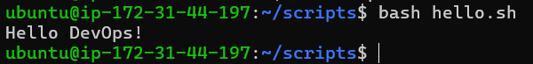
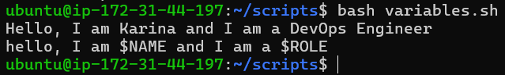
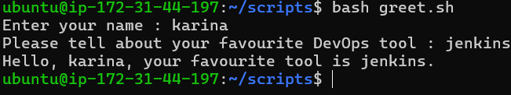
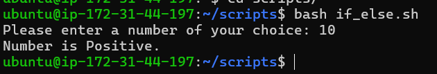
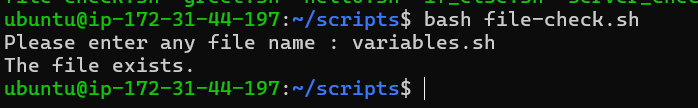
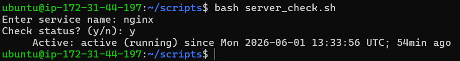

# 🐚 Shell Scripting Basics

---

## 🚀 Task 1: First Script

- Create a file `hello.sh`
- Add the shebang line at the top:

```bash
#!/bin/bash
```

- Print:

```bash
echo "Hello, DevOps!"
```

- Make it executable and run it:

```bash
chmod +x hello.sh
./hello.sh
```

📸 Screenshot


### ❓ What happens if you remove the shebang line?

- `./hello.sh` → Kernel looks for a shebang. If not found, it uses current shell.
- `bash hello.sh` → The shell explicitly uses bash.
- `sh hello.sh` → It uses sh.

---

## 📦 Task 2: Variables

Create `variables.sh`:

```bash
#!/bin/bash

NAME="YourName"
ROLE="DevOps Engineer"

echo "Hello, I am $NAME and I am a $ROLE"
```

📸 Screenshot


### ❓ Single vs Double Quotes

- `" "` → Variables and commands are evaluated
- `' '` → Everything is taken literally, no evaluation happens

---

## 🧑‍💻 Task 3: User Input with read

Create `greet.sh`:

```bash
#!/bin/bash

read -p "Enter your name: " name
read -p "Enter your favourite tool: " tool

echo "Hello $name, your favourite tool is $tool"
```
📸 Screenshot

---

## 🔀 Task 4: If-Else Conditions

### 📊 `check_number.sh`

```bash
#!/bin/bash

read -p "Enter a number: " num

if [ "$num" -gt 0 ]; then
    echo "Positive"
elif [ "$num" -lt 0 ]; then
    echo "Negative"
else
    echo "Zero"
fi
```
📸 Screenshot

---

### 📁 `file_check.sh`

```bash
#!/bin/bash

read -p "Enter filename: " file

if [ -f "$file" ]; then
    echo "File exists"
else
    echo "File does not exist"
fi
```
📸 Screenshot

---

## 🔧 Task 5: Combine It All

### ⚙️ `server_check.sh`

```bash
#!/bin/bash

service="nginx"

read -p "Do you want to check the status? (y/n): " answer

if [[ "$answer" == "y" || "$answer" == "Y" ]]; then
    systemctl status "$service" | grep "Active"
elif [[ "$answer" == "n" || "$answer" == "N" ]]; then
    echo "Skipped"
else
    echo "Invalid input"
fi
```
📸 Screenshot

---

## 📚 What I Learned

- How to write and run shell scripts with shebang (`#!/bin/bash`)
- Variables and user input using `read`
- Difference between single vs double quotes
- Conditional logic using `if`, `elif`, `else`
- Test operators:
  - `-f`
  - `-gt`, `-lt`
- Error redirection:
  - `>/dev/null`
  - `2>/dev/null`
  - `&>/dev/null`

---

✅ Strong foundation in Shell Scripting Basics