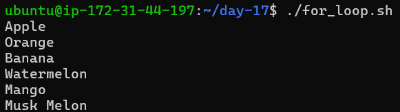
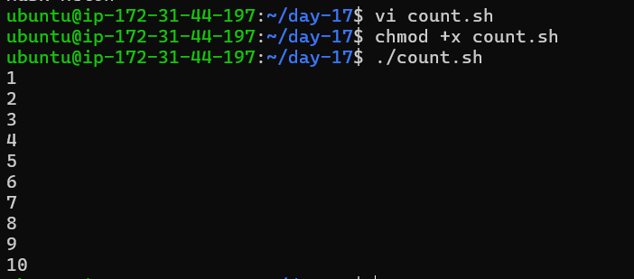
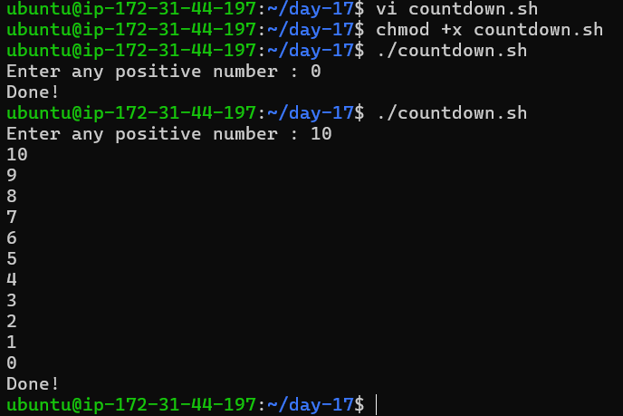
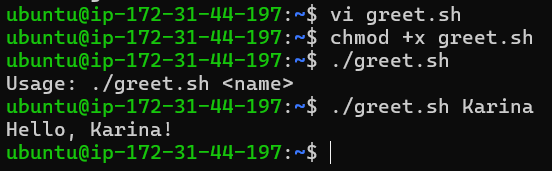
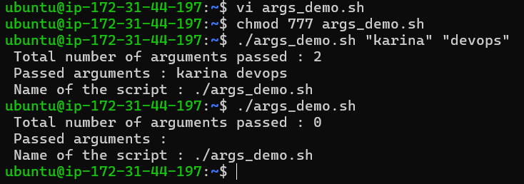
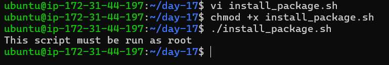

# Day 17 – Shell Scripting: Loops, Arguments & Error Handling

## 🎯 Goal

Level up shell scripting by using loops, handling arguments, automating installations, and adding error handling.

---

## 📌 Task 1: For Loop

### 🔹 for_loop.sh

```bash
#!/bin/bash

fruits=("Apple" "Orange" "Banana" "Watermelon" "Mango" "Musk Melon")
for fruit in "${fruits[@]}"; do
    echo "$fruit"
done
```

📸 Output


---

### 🔹 count.sh

```bash
#!/bin/bash
for((i=1;i<=10;i++)); do
    echo "$i"
done
```

📸 Output


---

## 📌 Task 2: While Loop

### 🔹 countdown.sh

```bash
#!/bin/bash

read -p "Enter any positive number : " num

if ! [[ "$num" =~ ^-?[0-9]+$ ]]; then
    echo "Enter valid number"
    exit 1
fi

if [ "$num" -gt 0 ]; then
    while [ "$num" -ge 0 ]; do
        echo "$num"
        ((num--))
    done
elif [ "$num" -lt 0 ]; then
    while [ "$num" -le 0 ]; do
        echo "$num"
        ((num++))
    done
fi

echo "Done!"
```
📸 Output

---

## 📌 Task 3: Command-Line Arguments

### 🔹 greet.sh

```bash
#!/bin/bash

if [ "$#" -eq 0 ]; then
    echo "Usage: ./greet.sh <name>"
    exit 1
fi

echo "Hello, $1!"
```
📸 Output

---

### 🔹 args_demo.sh

```bash
#!/bin/bash

echo "Total number of arguments passed: $#"
echo "Passed arguments: $@"
echo "Name of the script: $0"
```
📸 Output

---

## 📌 Task 4: Install Packages via Script

### 🔹 install_packages.sh

```bash
#!/bin/bash

packages=("nginx" "curl" "wget")

if [ "$EUID" -ne 0 ]; then
    echo "This script must be run as root"
    exit 1
fi

echo "Running as root..."

for pkg in "${packages[@]}"; do
    if dpkg -s "$pkg" &>/dev/null; then
        echo "$pkg already installed"
    else
        echo "$pkg installing..."
        apt install "$pkg" -y &>/dev/null
    fi
done

for pkg in "${packages[@]}"; do
    dpkg -s "$pkg" &>/dev/null && \
    echo "STATUS - $pkg is INSTALLED" || \
    echo "STATUS - $pkg is NOT INSTALLED"
done
```
📸 Output

---

## 📌 Task 5: Error Handling

### 🔹 safe_script.sh

```bash
#!/bin/bash

set -e

mkdir /tmp/devops-test 2>/dev/null || echo "Directory already exists"

cd /tmp/devops-test || { echo "Failed to enter directory"; exit 1; }

touch demo.txt 2>/dev/null || echo "demo.txt already exists"

echo "Script completed successfully"
```
📸 Output

---

## 🧠 What I Learned

* How to use **for and while loops** to automate repetitive tasks
* How to handle **command-line arguments ($1, $@, $#)** in scripts
* How to add **basic error handling using `set -e`, `||`, and validations**

---

## 🚀 Summary

Today’s focus was on making scripts smarter and production-ready by:

* Automating tasks with loops
* Making scripts dynamic with arguments
* Handling failures gracefully

---

