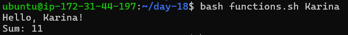
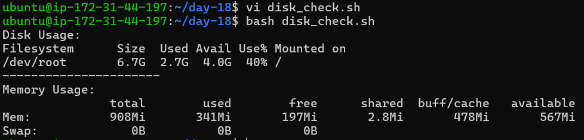
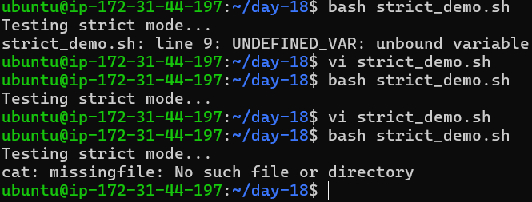
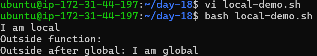
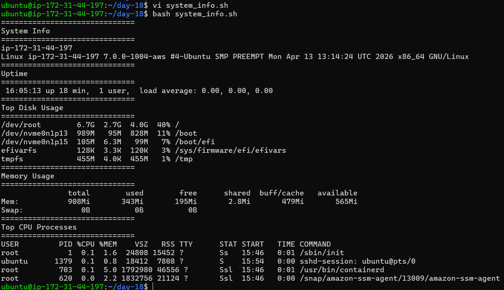

# Day 18 – Shell Scripting: Functions & Intermediate Concepts

## 🎯 Goal

Learn to write cleaner and reusable shell scripts using functions, strict mode, and better scripting practices.

---

## 📌 Task 1: Basic Functions

### 📄 functions.sh

```bash
#!/bin/bash

greet() {
    echo "Hello, $1!"
}

add() {
    sum=$(( $1 + $2 ))
    echo "Sum: $sum"
}

# Calling functions
greet "karina"
add 5 6
```

📸 Output


---

## 📌 Task 2: Functions with System Checks

### 📄 disk_check.sh

```bash
#!/bin/bash

check_disk() {
    echo "Disk Usage:"
    df -h /
}

check_memory() {
    echo "Memory Usage:"
    free -h
}

main() {
    check_disk
    echo "----------------------"
    check_memory
}

main
```

📸 Output


## 📌 Task 3: Strict Mode

### 📄 strict_demo.sh

```bash
#!/bin/bash
set -euo pipefail

echo "Testing strict mode..."

# Uncomment one by one to test behavior

# Undefined variable (set -u)
# echo $UNDEFINED_VAR

# Command failure (set -e)
# false

# Pipe failure (set -o pipefail)
# cat missingfile | grep "test"
```
📸 Output


### 📘 Explanation

* **set -e →** Script exits immediately if any command fails
* **set -u →** Script exits when using an undefined variable
* **set -o pipefail →** Fails the entire pipeline if any command in the pipe fails

---


## 📌 Task 4: Local Variables

### 📄 local_demo.sh

```bash
#!/bin/bash

demo_local() {
    local var="I am local"
    echo $var
}

demo_global() {
    var="I am global"
}

demo_local
echo "Outside function: $var"

demo_global
echo "Outside after global: $var"
```

📸 Output


---

## 📌 Task 5: System Info Reporter

### 📄 system_info.sh

```bash
#!/bin/bash
set -euo pipefail

print_header() {
    echo "=============================="
    echo "$1"
    echo "=============================="
}

system_info() {
    print_header "System Info"
    hostname
    uname -a
}

uptime_info() {
    print_header "Uptime"
    uptime
}

disk_usage() {
    print_header "Top Disk Usage"
    df -h | sort -hr -k5 | head -n 5
}

memory_usage() {
    print_header "Memory Usage"
    free -h
}

cpu_usage() {
    print_header "Top CPU Processes"
    ps aux --sort=-%cpu | head -n 5
}

main() {
    system_info
    uptime_info
    disk_usage
    memory_usage
    cpu_usage
}

main
```

📸 Output


## 🧠 What I Learned

* Functions make scripts modular and reusable
* `set -euo pipefail` prevents silent failures and improves script safety
* Local variables help avoid unintended side effects

---

## 🚀 Summary

Day 18 focused on writing production-level shell scripts using:

* Functions for modular design
* Strict mode for reliability
* System-level scripting for real-world use cases

---