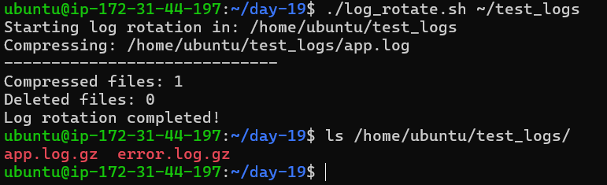
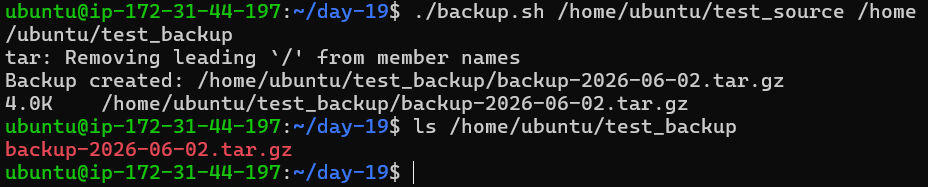
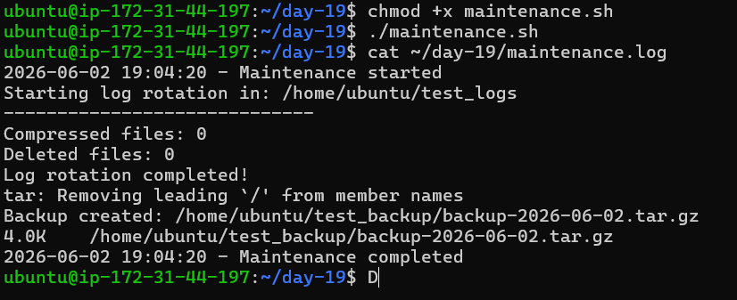

# Day 19 – Shell Scripting Project: Log Rotation, Backup & Crontab

## 🎯 Goal

Apply shell scripting concepts to real-world tasks like log rotation, backups, and automation using cron.

---

# 🧩 Task 1: Log Rotation Script

## 📜 Script: `log_rotate.sh`

```bash
#!/bin/bash

set -euo pipefail

LOG_DIR=${1:-}

if [[ -z "$LOG_DIR" || ! -d "$LOG_DIR" ]]; then
  echo "Error: Directory does not exist"
  exit 1
fi

compressed_count=0
deleted_count=0

# Compress .log files older than 7 days
while IFS= read -r file; do
  gzip "$file"
  ((compressed_count++))
done < <(find "$LOG_DIR" -type f -name "*.log" -mtime +7)

# Delete .gz files older than 30 days
while IFS= read -r file; do
  rm "$file"
  ((deleted_count++))
done < <(find "$LOG_DIR" -type f -name "*.gz" -mtime +30)

echo "Compressed files: $compressed_count"
echo "Deleted files: $deleted_count"
```

📸 Output



# 🧩 Task 2: Server Backup Script

## 📜 Script: `backup.sh`

```bash
#!/bin/bash

set -euo pipefail

SOURCE=${1:-}
DEST=${2:-}

if [[ -z "$SOURCE" || ! -d "$SOURCE" ]]; then
  echo "Error: Source directory does not exist"
  exit 1
fi

if [[ -z "$DEST" || ! -d "$DEST" ]]; then
  echo "Error: Destination directory does not exist"
  exit 1
fi

TIMESTAMP=$(date +%Y-%m-%d)
ARCHIVE="$DEST/backup-$TIMESTAMP.tar.gz"

# Create backup
tar -czf "$ARCHIVE" "$SOURCE"

# Verify backup
if [[ -f "$ARCHIVE" ]]; then
  echo "Backup created: $ARCHIVE"
  du -h "$ARCHIVE"
else
  echo "Backup failed!"
  exit 1
fi

# Delete backups older than 14 days
find "$DEST" -type f -name "backup-*.tar.gz" -mtime +14 -delete
```
📸 Output



# 🧩 Task 3: Crontab

## 🔍 Check existing cron jobs

```bash
crontab -l
```

## ⏰ Cron Entries

```bash
# Run log rotation daily at 2 AM
0 2 * * * /home/ubuntu/day-19/log_rotate.sh /var/log/myapp

# Run backup every Sunday at 3 AM
0 3 * * 0 /home/ubuntu/day-19/backup.sh /home/ubuntu/source /home/ubuntu/backup

```

---

# 🧩 Task 4: Combined Maintenance Script

## 📜 Script: `maintenance.sh`

```bash
#!/bin/bash

set -euo pipefail

LOG_FILE="$HOME/day-19/maintenance.log"

log_message() {
  echo "$(date '+%Y-%m-%d %H:%M:%S') - $1" >> "$LOG_FILE"
}

log_message "Maintenance started"

# Call log rotation
$HOME/day-19/log_rotate.sh $HOME/test_logs >> "$LOG_FILE" 2>&1

# Call backup
$HOME/day-19/backup.sh $HOME/test_source $HOME/test_backup >> "$LOG_FILE" 2>&1

log_message "Maintenance completed"
```

📸 Output


## ⏰ Cron Entry

```bash
# Run maintenance daily at 1 AM
0 1 * * * /home/ubuntu/day-19/maintenance.sh
```

---

# 📚 What I Learned

### 1️⃣ Automation is Powerful

Using cron, repetitive tasks like backups and log cleanup can run automatically without manual effort.

### 2️⃣ Error Handling is Critical

Using `set -euo pipefail` prevents silent failures and makes scripts reliable.

### 3️⃣ Real-World Scripting

Combining multiple scripts into one (`maintenance.sh`) simulates real DevOps workflows.

---

---

# 🎉 Conclusion

This project helped me understand how real systems manage logs, backups, and scheduled maintenance using shell scripting.

---
