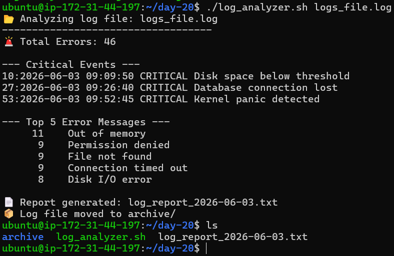

# Day 20 – Log Analyzer & Report Generator

## 📌 Overview

In this project, I built a Bash script to automate log analysis and generate a structured report.

---

## ⚙️ Script Features

* Accepts log file as input
* Validates file existence
* Counts total errors (ERROR / Failed)
* Extracts CRITICAL events with line numbers
* Finds Top 5 most frequent error messages
* Generates a summary report
* Archives processed logs

---

## 🛠️ Commands Used

* `grep` → Searching logs
* `awk` → Cleaning log messages
* `sort` → Sorting results
* `uniq -c` → Counting occurrences
* `wc -l` → Line count
* `date` → Dynamic filenames
* `mv` → Archiving logs

---

## Script

[Here is the script log_analyzer.sh](./log_analyzer.sh)



[Here is the report file generated](archive/log_report_2026-02-14-01-55.txt)

## 📊 Sample Output

```
📂 Analyzing log file: sample_log.log
🚨 Total Errors: 120

--- Critical Events ---
84: CRITICAL Disk space below threshold
217: CRITICAL Database connection lost

--- Top 5 Error Messages ---
45 Connection timed out
32 File not found
28 Permission denied
15 Disk I/O error
9 Out of memory
```

---

## 📄 Report Generated

File: `log_report_<date>.txt`

Includes:

* Date
* Log file name
* Total lines
* Error count
* Top errors
* Critical events

---

## 📚 Key Learnings

1. How to process real-world log data using Bash
2. Combining multiple Linux tools for automation
3. Writing production-style scripts with validation & reporting

---

## 🚀 Conclusion

This project simulates a real DevOps task — monitoring and analyzing logs efficiently using shell scripting.
