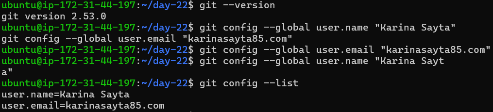
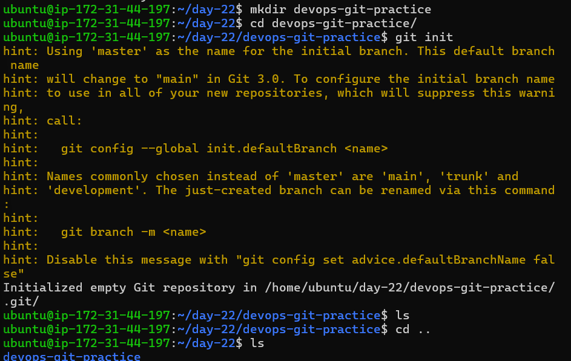
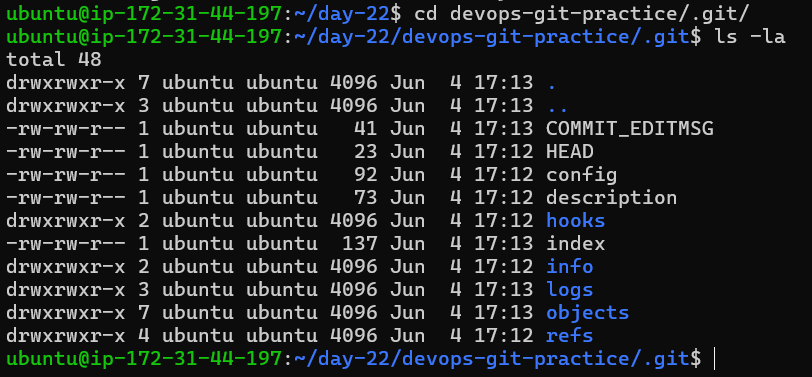
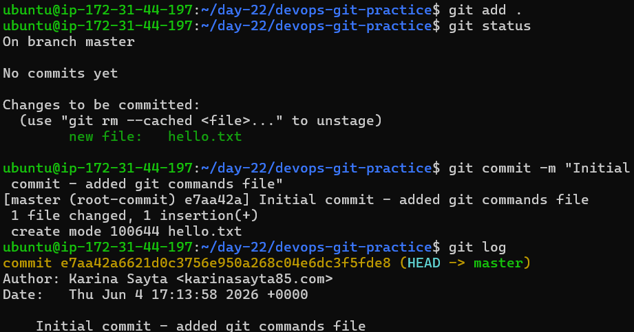
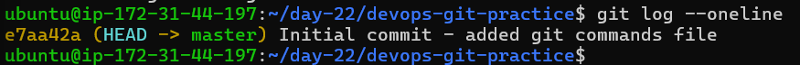

# Day 22 – Introduction to Git: Your First Repository

## Task 1: Install and Configure Git

### Verify Git Installation

```bash
git --version
```

Checks if Git is installed and shows the installed version.

---

### Set Git Identity

```bash
git config --global user.name "Your Name"
git config --global user.email "your@email.com"
```

Sets your identity for commits (who made the changes).

---

### Verify Configuration

```bash
git config --list
```

Displays all Git configuration settings.

---


## Task 2: Create Your Git Project

### Create Project Folder

```bash
mkdir devops-git-practice
cd devops-git-practice
```

Creates a new directory and moves into it.

---

### Initialize Git Repository

```bash
git init
```

Converts your folder into a Git repository.
Creates a hidden `.git/` folder where Git stores all data.

---


### Check Repository Status

```bash
git status
```

Shows:

* Untracked files
* Changes not staged
* Changes ready to commit

---

### View Hidden Files

```bash
ls -la
```
Lists all files including hidden ones like `.git/`.



---

## Task 4: Stage and Commit

### Stage Files

```bash
git add .
```

Adds all files to the staging area, preparing them for commit.

---

### Check Staged Changes

```bash
git status
```

Confirms which files are staged and ready to commit.

---

### Commit Changes

```bash
git commit -m "Initial commit - added git commands file"
```

Saves staged changes into repository history with a message.
Each commit has a unique commit ID.

---


### View Commit History

```bash
git log
```

Shows:

* Commit ID
* Author
* Date
* Commit message

---

## Task 5: Build Commit History

### Check Changes

```bash
git status
```

Shows what changed since the last commit.

---

### Stage and Commit Again

```bash
git add .
git commit -m "Updated git commands with more examples"
```

Creates a new version (snapshot) of your project.

---

### View Compact History

```bash
git log --oneline
```



Displays commits in a short, one-line format.

---

## Task 6: Understand Git Workflow

### Difference between `git add` and `git commit`

* git add
  Moves changes to the staging area and prepares them for commit

* git commit
  Saves staged changes permanently and creates a new snapshot

---

### What does the staging area do?

The staging area acts as a checkpoint before committing.

* Helps review changes before committing
* Prevents accidental commits
* Allows grouping multiple changes into a single commit

---

### What does `git log` show?

Displays complete commit history including:

* Commit ID
* Author
* Timestamp
* Message

---

### What is the `.git/` folder?

The core of the repository.

Contains:

* Commit history
* Branches
* Configuration
* Metadata

If deleted:

* Entire Git history is lost
* Project becomes a normal folder

---

### Working Directory vs Staging Area vs Repository

* Working Directory
  Where files are created and modified; changes are not tracked yet

* Staging Area
  Intermediate step where selected changes are prepared for commit

* Repository
  Stores all commits and project history

---

## Key Takeaways

* Git tracks changes over time
* Staging area provides control before committing
* Commits build project history
* `.git` stores everything related to version control

---

## Final Thought

Git is not just a tool, it is a system that records the evolution of your project.

---
