# Day 23 – Git Branching & Working with GitHub

## Task 1: Understanding Branches

### What is a branch in Git?

A branch is a separate workspace used to make changes without affecting the main project.
A branch points to a specific commit in Git history.

---

### Why do we use branches instead of committing everything to main?

If we commit everything directly to main, production can break.
Main should always remain stable and production-ready.

That is why we:

* Work on separate branches
* Experiment safely
* Merge to main only after verification

---

### What is HEAD in Git?

HEAD points to the latest commit in the current branch you are working on.

---

### What happens to your files when you switch branches?

Git does not store multiple copies of files for each branch.

When you switch branches:

* Git rewrites your working directory to match the selected branch
* If the branch has an older version, you will see older files
* Untracked files remain unchanged
* Tracked files change based on the branch commit
* Uncommitted changes may block switching (you may need to stash them)

---

## Task 2: Branching Commands — Hands-On

### List all branches

```bash
git branch
```

Shows all local branches. Current branch is marked with `*`.

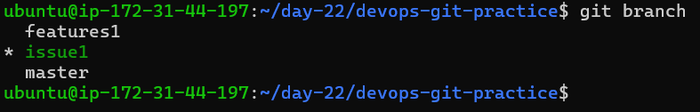
---

### Create a new branch

```bash
git branch feature
```

Creates a new branch from the current commit.

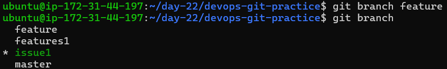
---

### Switch to a branch

```bash
git checkout feature
```

Moves to the specified branch.
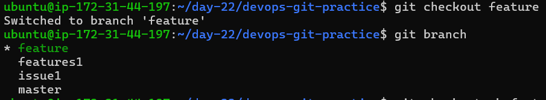

---

### Create and switch in one command

```bash
git checkout -b feature-2
```

Creates and switches to a new branch in one step.
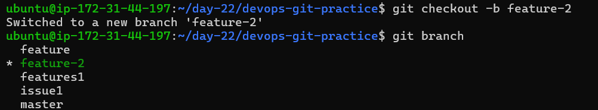
---

### Using git switch

```bash
git switch feature
```

Used only for switching branches.
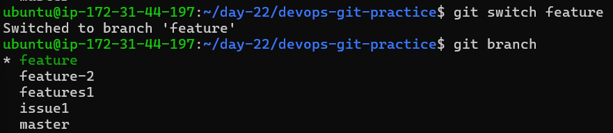

Difference:

* `git switch` is focused and safer for branch operations
* `git checkout` can also modify files and restore states

---

### Make a commit on feature branch

```bash
echo "Feature work" >> file.txt
git add .
git commit -m "Added feature work"
```

This commit will exist only in `feature-1`, not in `main`.

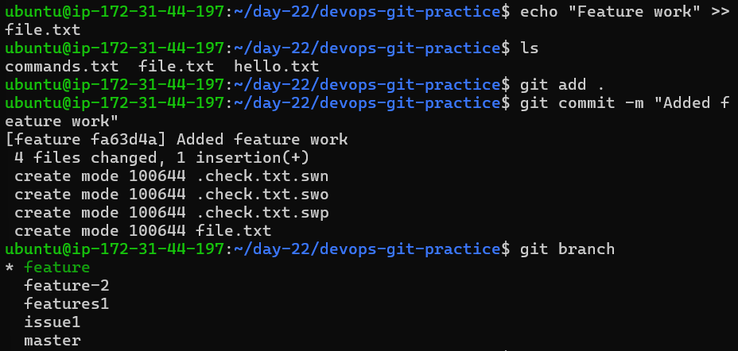

---

### Switch back to main

```bash
git switch master
```

You will not see the feature branch commit here.

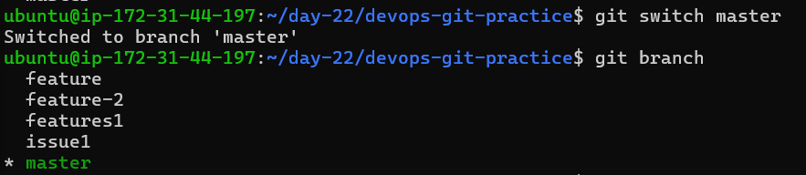
---

### Delete a branch

```bash
git branch -d feature-2
```

Deletes a branch that is no longer needed.

---

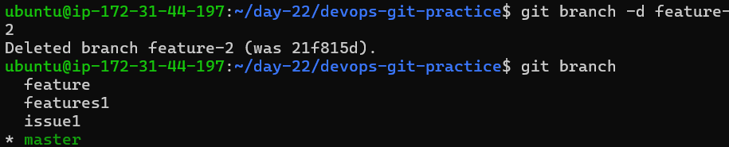

### Note

All branching commands should be added to `git-commands.md`.

---

## Task 3: Push to GitHub

### Add remote repository

```bash
git remote add origin https://github.com/username/repo.git
```

Connects your local repository to GitHub.

---


### Push main branch

```bash
git push -u origin main
```

Pushes your code and sets upstream tracking.

---
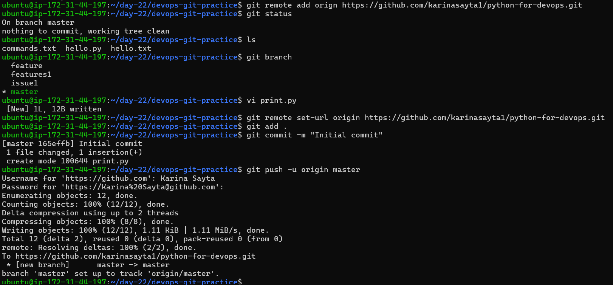

### Push feature branch

```bash
git push -u origin feature-1
```

Pushes the feature branch to GitHub.

---
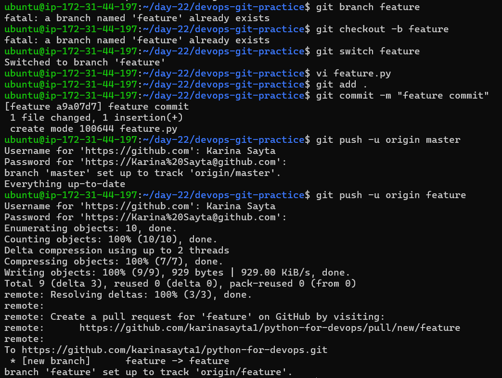

### Difference between origin and upstream

* origin
  Points to your remote repository

* upstream
  Points to the original repository you forked from

If you did not fork, upstream is not required.

---

## Task 4: Pull from GitHub

### Pull changes

```bash
git pull origin main
```

Downloads and merges changes from the remote repository.

---
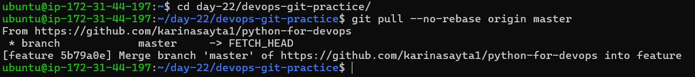

### Difference between git fetch and git pull

* git fetch
  Downloads changes but does not merge them
  Stores reference in `FETCH_HEAD`

* git pull
  Downloads and merges changes into your current branch

---

## Task 5: Clone vs Fork

### Clone repository

```bash
git clone https://github.com/user/repo.git
```

Creates a local copy of a repository and connects it to the remote.

---

### Fork repository

Forking is done via GitHub UI.
It creates a copy of someone else’s repository in your GitHub account.

---

### Difference between clone and fork

* Clone
  Copy of repository on your local machine

* Fork
  Copy of repository in your GitHub account

---


### When to use clone vs fork

* Use fork when working on public repositories you don’t own
* Use clone when you want a local working copy

---

### Keep fork in sync with original repository

Option 1 (GitHub UI):
Use **Sync fork** button on GitHub

Option 2 (CLI):

```bash
git remote add upstream https://github.com/original/repo.git
git fetch upstream
git merge upstream/main
```

---
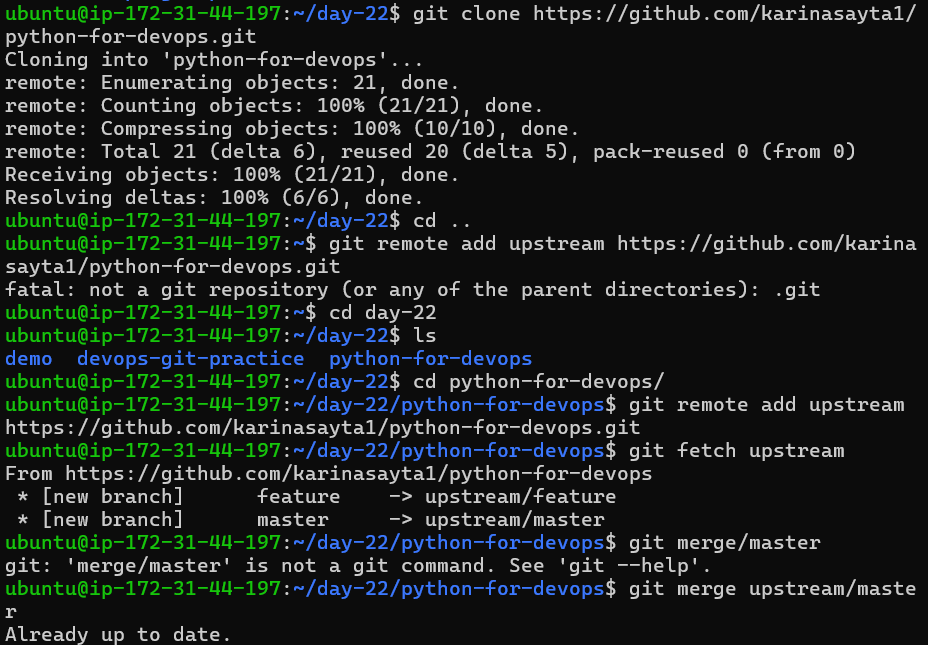

## Key Learnings

* Branches allow safe and isolated development
* Main branch should always stay stable
* Git rewrites working directory when switching branches
* Fetch gives control, pull automates merge
* Forking is essential for open-source contribution

---


## Final Thought

Branching is one of the most powerful features of Git.
It allows you to experiment, build features, and collaborate without risking your main codebase.

---
