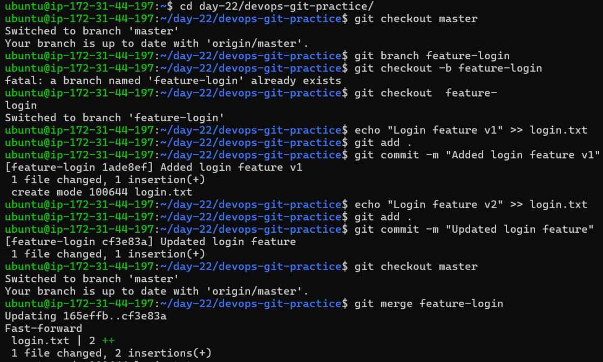
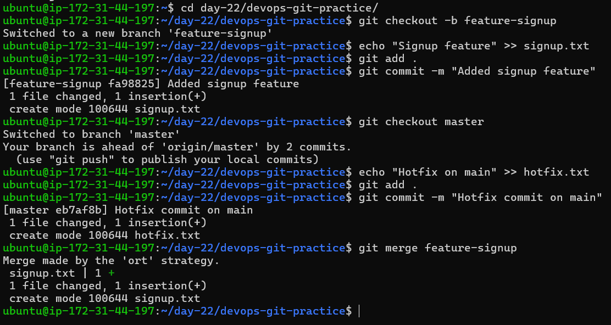
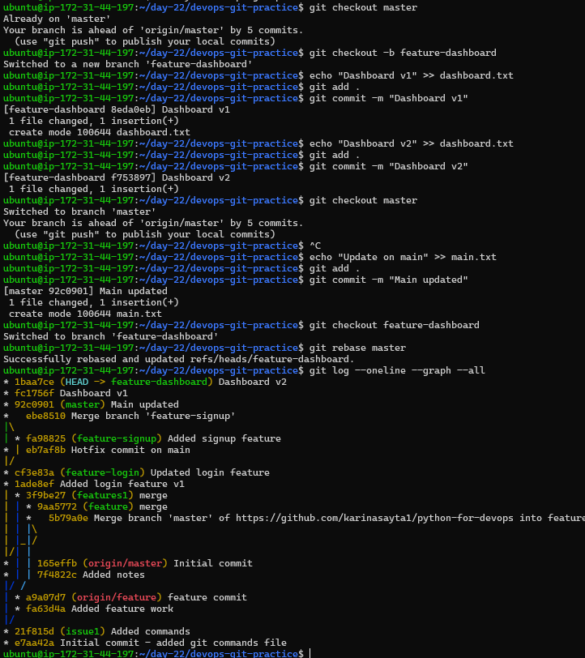
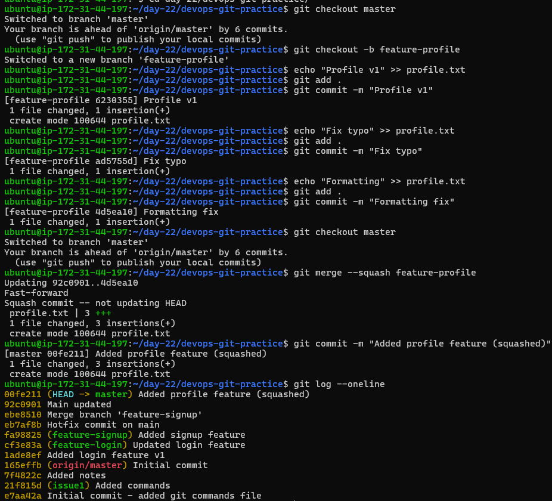
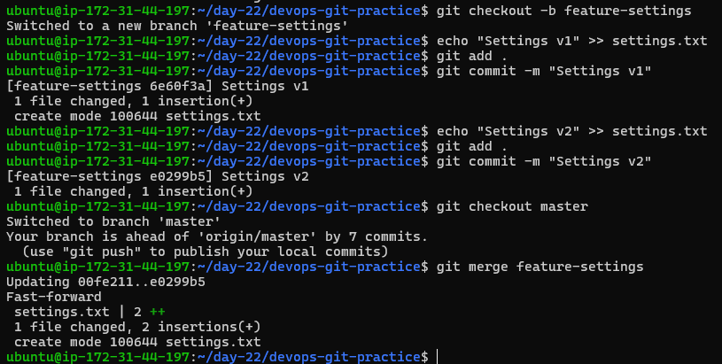
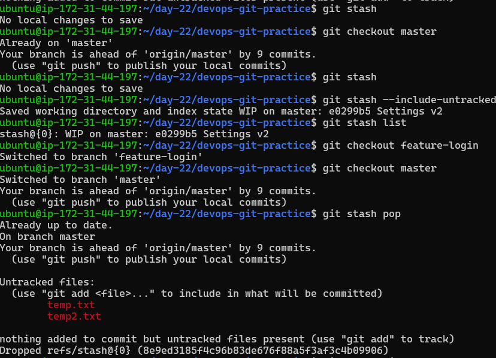
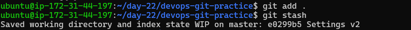

# Day 24 – Advanced Git: Merge, Rebase, Stash & Cherry Pick

---

## Task 1: Git Merge — Hands-On

Create a new branch `feature-login` from `main`, add a couple of commits to it.
Switch back to `main` and merge `feature-login` into `main`.

Observe the merge — did Git do a fast-forward merge or a merge commit?
**Answer:** fast-forward

**Snapshot:**

---

Now create another branch `feature-signup`, add commits to it — but also add a commit to `main` before merging.

Merge `feature-signup` into `main` — what happens this time?
**Answer:** merge commit

**Snapshot:**

---

### Notes

**What is a fast-forward merge?**
It merges two branches without creating a new commit. Instead, it simply moves the current branch’s pointer forward to match the branch being merged.

**When does Git create a merge commit instead?**
When you try to merge two branches that have diverged. Git makes a new commit to combine the incoming changes.

**What is a merge conflict?**
A merge conflict occurs when the same part of a file is changed in two branches. When merging, Git cannot automatically decide which change to keep. Git will pause and require you to resolve the conflict before completing the merge.

---

## Task 2: Git Rebase — Hands-On

Create a branch `feature-dashboard` from `main`, add 2–3 commits.

While on `main`, add a new commit (so `main` moves ahead).

Switch to `feature-dashboard` and rebase it onto `main`.

Observe your `git log --oneline --graph --all`.

**Snapshot:**

---

### Notes

**What does rebase actually do to your commits?**
Rebase creates linear history.

**How is the history different from a merge?**
Merge doesn’t change history, it shows commits as they were.
Rebase changes history by placing `main` commits first and then replaying feature branch commits to make it linear.

**Why should you never rebase commits that have been pushed and shared with others?**
Because rebase rewrites commit history. If others have already pulled those commits, it will create confusion and conflicts.

**When would you use rebase vs merge?**
Merge, as it preserves when the commit was exactly made.

---

## Task 3: Squash Commit vs Merge Commit

Create a branch `feature-profile`, add 4–5 small commits (typo fix, formatting, etc.).

Merge it into `main` using `--squash`.

**Snapshot:**

Check `git log` — how many commits were added to `main`?

---

Now create another branch `feature-settings`, add a few commits.

Merge it into `main` without `--squash` (regular merge).

**Snapshot:**

---

### Notes

**What does squash merging do?**
It combines multiple commits from a branch and merges them into another branch as a single commit.

**When would you use squash merge vs regular merge?**
If one file has multiple commits, then squashing is better. Else regular merge.

**What is the trade-off of squashing?**
Detailed commit history is lost from feature branch as only one commit will be shown in main branch.

---

## Task 4: Git Stash — Hands-On

Start making changes to a file but do not commit.

Now imagine you need to urgently switch to another branch — try switching. What happens?

**Answer:**
If changes don't conflict with the branch you are switching to, it will let you switch; else it will not allow switching.

Use `git stash` to save your work-in-progress.

Switch to another branch, do some work, switch back.

Apply your stashed changes using `git stash pop`.

Try stashing multiple times and list all stashes.

Try applying a specific stash from the list.

**Snapshots:**

---

### Notes

**What is the difference between `git stash pop` and `git stash apply`?**
`git stash pop` applies stash changes to your working directory and deletes the stash entry.
`git stash apply` applies stash changes to your working directory but keeps the stash entry.

**When would you use stash in a real-world workflow?**
When an urgent fix comes up, I would stash changes from my current branch and switch to another branch to work on urgent fix first.

---

## Task 5: Cherry Picking

Create a branch `feature-hotfix`, make 3 commits with different changes.

Switch to `main`.

Cherry-pick only the second commit from `feature-hotfix` onto `main`.

Verify with `git log` that only that one commit was applied.

**Snapshots:**

---

### Notes

**What does cherry-pick do?**
It lets you pick and apply one/range commit from another branch to your current branch instead of merging all.

**When would you use cherry-pick in a real project?**
Suppose I made 3 changes but I want only one change to be applied to main branch. Then I would cherry-pick that single commit instead of merging the whole branch.

**What can go wrong with cherry-picking?**
If the same branch is merged then it will create duplicate commits.
It may create conflicts if the commit depends on previous commits.

---
