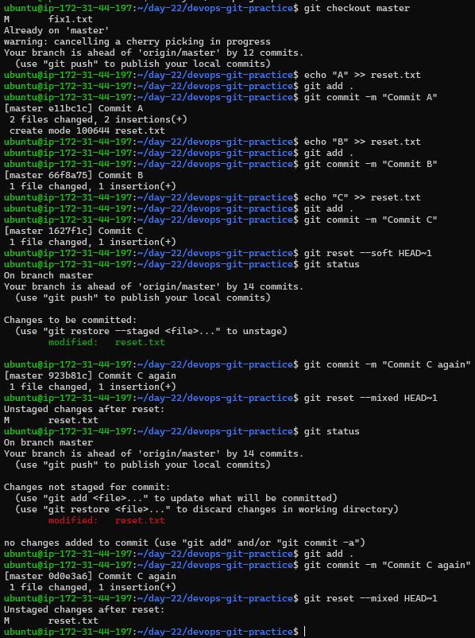
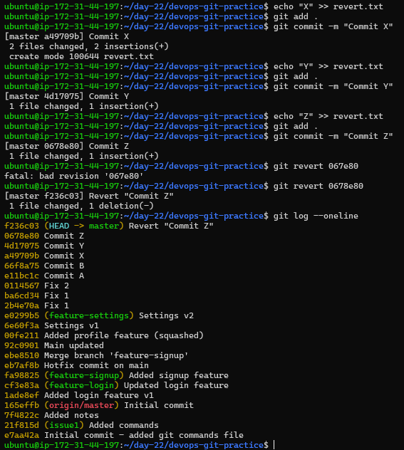
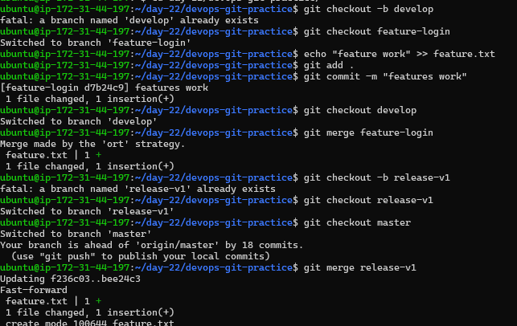
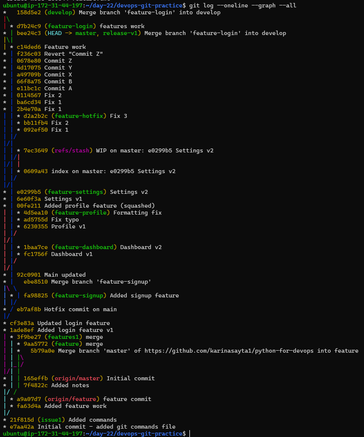

# Day 25 – Git Reset vs Revert & Branching Strategies

---

## 🔹 Task 1: Git Reset — Hands-On

Make 3 commits in your practice repo (commit A, B, C)

### ✅ Create commits

```bash
git checkout master

echo "A" >> reset.txt
git add .
git commit -m "Commit A"

echo "B" >> reset.txt
git add .
git commit -m "Commit B"

echo "C" >> reset.txt
git add .
git commit -m "Commit C"
```
---

### 🔁 git reset --soft

Moves HEAD back to the given commit.
All commits after that point are removed from history, but the changes remain in your working directory and are **staged**.

```bash
git reset --soft HEAD~1
git status
```

**Observation:**

* Commit removed
* Changes remain **staged**

---

### 🔁 git reset --mixed

Moves HEAD back to the given commit.
All commits after that point are removed from history, but the changes remain **unstaged**.

```bash
git commit -m "Commit C again"
git reset --mixed HEAD~1
git status
```

**Observation:**

* Commit removed
* Changes remain **unstaged**

---

### 🔁 git reset --hard

Moves HEAD back to the given commit.
All commits after that point are removed from history, and changes are **deleted completely**.

```bash
git add .
git commit -m "Commit C again"
git reset --hard HEAD~1
```

**Observation:**

* Commit removed
* Changes deleted completely

---



### 🧠 Notes

**Difference between --soft, --mixed, and --hard:**

* `--soft` → Removes commits but keeps changes staged
* `--mixed` → Removes commits and keeps changes unstaged
* `--hard` → Removes commits and deletes changes completely

---

**Which one is destructive and why?**

`--hard` is destructive because it permanently deletes history and changes.

---

**When would you use each one?**

* `--soft` → To change commit message or regroup commits
* `--mixed` → To modify changes before recommitting
* `--hard` → To completely discard unwanted changes

---

**Should you use git reset on pushed commits?**

No. It rewrites history and causes conflicts for others.

---

## 🔹 Task 2: Git Revert — Hands-On

Make 3 commits (commit X, Y, Z)

### ✅ Create commits

```bash
echo "X" >> revert.txt
git add .
git commit -m "Commit X"

echo "Y" >> revert.txt
git add .
git commit -m "Commit Y"

echo "Z" >> revert.txt
git add .
git commit -m "Commit Z"
```

---

### 🔁 Revert middle commit

```bash
git log --oneline
git revert <commit-hash-of-Y>
```

---

### 🔍 Observation

```bash
git log --oneline
```

* Commit Y still exists
* New commit: **Revert "Commit Y"**

---


### 🧠 Notes

**What happens?**
Git creates a new commit that undoes the changes made in commit Y.

**Is commit Y still in history?**
Yes, but its effect is reversed.

**Difference from reset:**

* `git reset` → removes commits (history rewritten)
* `git revert` → adds new commit (history preserved)

**Why is revert safer?**
Because it does not rewrite history.

**When to use?**

* Use **revert** → shared branches
* Use **reset** → local cleanup

---

## 🔹 Task 3: Reset vs Revert — Summary

| Feature                     | git reset                            | git revert                         |
| --------------------------- | ------------------------------------ | ---------------------------------- |
| What it does                | Rewrites history and removes commits | Creates new commit to undo changes |
| Removes commit from history | Yes                                  | No                                 |
| Safe for shared branches?   | No                                   | Yes                                |
| When to use                 | Remove commits completely            | Safely undo changes                |

---

## 🔹 Task 4: Branching Strategies

### 🔷 GitFlow

* `master` → Production-ready code
* `develop` → Integration branch
* `feature` → New features
* `release` → Prepare releases
* `hotfix` → Urgent fixes

**Use Case:** Large teams with scheduled releases

**Pros:** Structured workflow
**Cons:** Complex

---


### 🔷 GitHub Flow

* `main` → Production-ready
* Feature branches → merged into main

**Use Case:** Continuous deployment

**Pros:** Simple
**Cons:** Can get messy

---

### 🔷 Trunk-Based Development

* `main` → Single main branch
* Short-lived branches

**Use Case:** Startups / fast-moving teams

**Pros:** Fast
**Cons:** Risky

---

### 📸 Branching Strategy Diagram


---

### 🧠 Answers

**Startup shipping fast?**
Trunk-Based Development

**Large team?**
GitFlow

**Open-source?**
Trunk-Based Development

---

## 🔹 Task 5: Extra Hands-On (Visualization)

```bash
git log --oneline --graph --all
```



---

## 🎯 Final Takeaways

* `reset` → powerful but dangerous (rewrites history)
* `revert` → safe and preferred for teams
* Use reset locally, revert in shared environments
* Choose branching strategy based on team size and workflow

---
