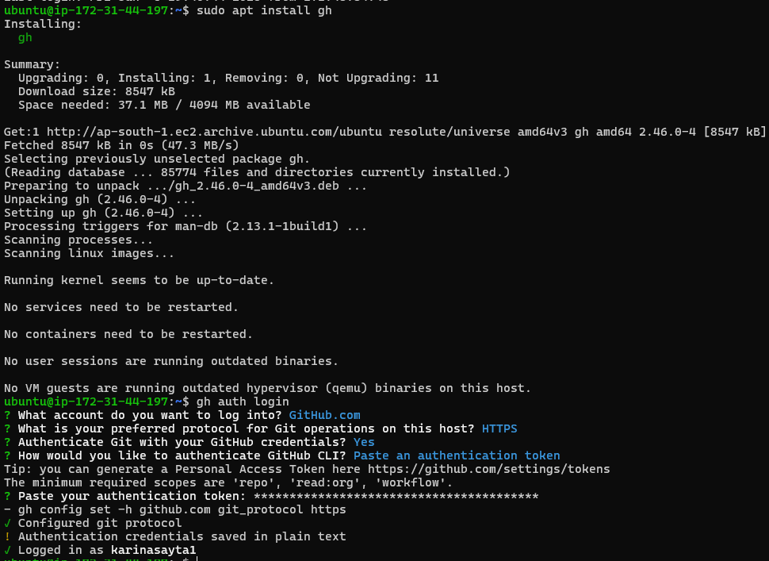
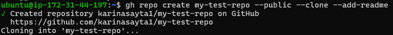
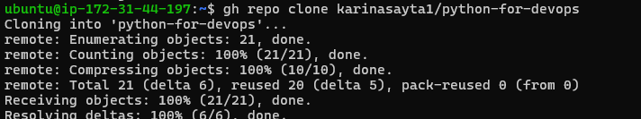
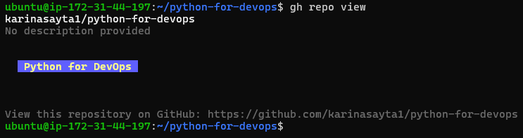
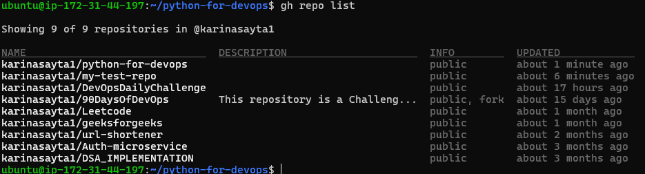
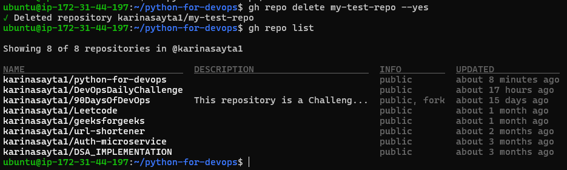
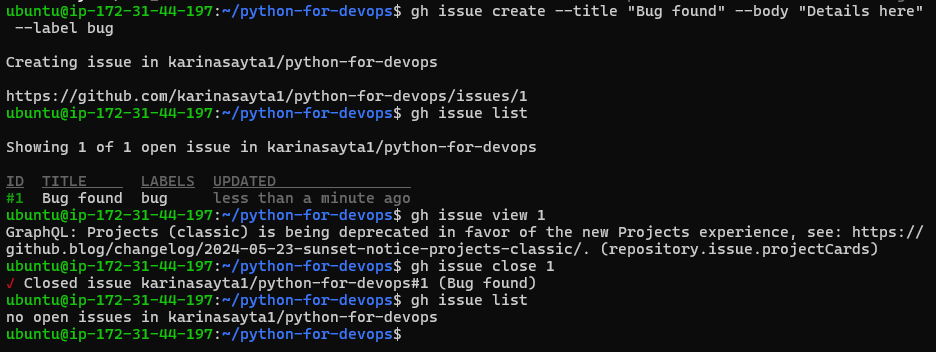
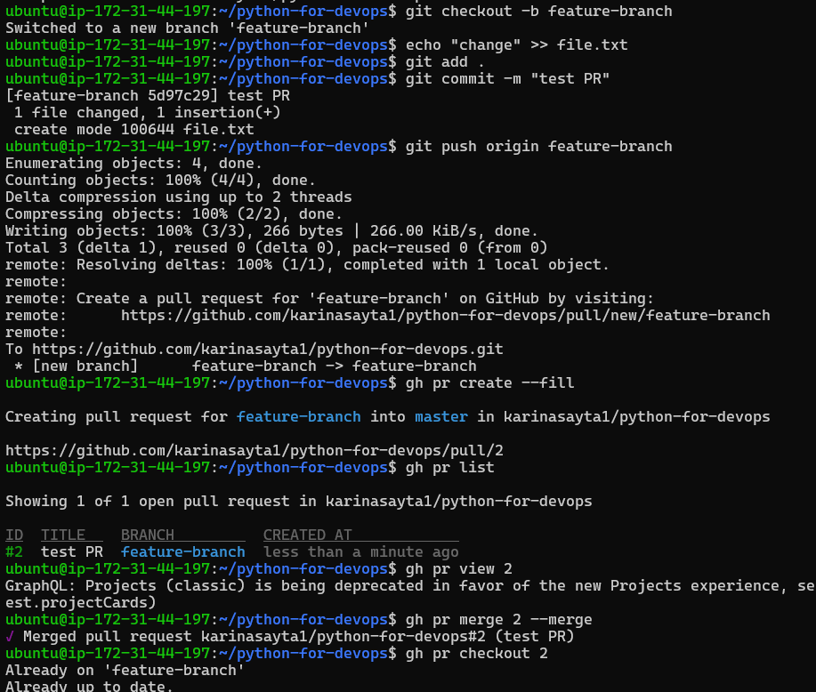
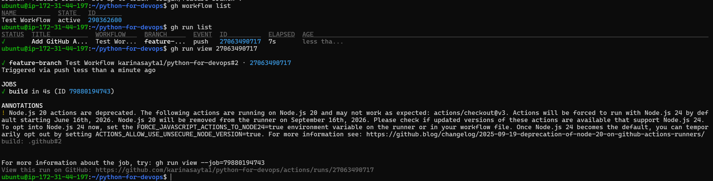

# Day 26 – GitHub CLI (gh): Manage GitHub from Terminal

## 🎯 Goal

Learn how to manage GitHub directly from the terminal using GitHub CLI (`gh`) — reducing context switching and enabling automation.

---

### What is GitHub CLI (`gh`)?

GitHub CLI is a command-line tool that allows you to interact with GitHub without using a browser.

Instead of:

* Opening GitHub
* Creating PRs manually
* Checking issues in UI

You can do everything from your terminal.

---

### Why is this important for DevOps?

In real DevOps workflows:

* You automate CI/CD pipelines
* You manage repositories programmatically
* You integrate GitHub with scripts

`gh` helps you:

* Automate PR creation
* Trigger workflows
* Manage issues from scripts

👉 Less UI → More automation

---

## 🔐 Task 1: Install & Authenticate

### Install GitHub CLI

```bash
# Ubuntu
sudo apt install gh

# Mac
brew install gh

# Windows (via winget)
winget install GitHub.cli
```
### Authenticate

```bash
gh auth login
```

Follow prompts:

* GitHub.com
* HTTPS
* Login via browser

### Verify Login

```bash
gh auth status
```


### 🧠 Answer

**Authentication methods supported:**

* Browser-based login
* Personal Access Token (PAT)

---

## 📦 Task 2: Working with Repositories

### Create Repo

```bash
gh repo create my-test-repo --public --clone --add-readme
```


### Clone Repo

```bash
gh repo clone username/repo-name
```


### View Repo

```bash
gh repo view
```


### List Repos

```bash
gh repo list
```


### Open in Browser

```bash
gh repo view --web
```


### Delete Repo

```bash
gh repo delete repo-name --yes
```


---

## 🐞 Task 3: Issues

### Create Issue

```bash
gh issue create --title "Bug found" --body "Details here" --label bug
```

### List Issues

```bash
gh issue list
```

### View Issue

```bash
gh issue view 1
```

### Close Issue

```bash
gh issue close 1
```


### 🧠 Answer

**Use in automation:**

* Auto-create issues from logs/errors
* Track incidents via scripts

---

## 🔀 Task 4: Pull Requests

### Create PR

```bash
git checkout -b feature-branch
echo "change" >> file.txt
git add .
git commit -m "test PR"
git push origin feature-branch

gh pr create --fill
```

### List PRs

```bash
gh pr list
```

### View PR

```bash
gh pr view 1
```

### Merge PR

```bash
gh pr merge 1 --merge
```


### 🧠 Answers

**Merge methods:**

* merge
* squash
* rebase

**Review PR:**

```bash
gh pr checkout <PR-number>
gh pr review --approve
```

---

## ⚙️ Task 5: GitHub Actions

### List Workflows

```bash
gh workflow list
```

### View Runs

```bash
gh run list
```

### View Specific Run

```bash
gh run view <run-id>
```


### 🧠 Answer

Useful in CI/CD:

* Monitor pipeline status
* Debug failures from terminal
* Automate workflow checks

---

## 🧪 Task 6: Useful gh Tricks

```bash
gh api
gh gist create
gh release create
gh alias set
gh search repos "devops"
```

---

## 🎯 Final Takeaways

* `gh` reduces dependency on GitHub UI
* Helps automate DevOps workflows
* Essential for scripting and CI/CD pipelines
* Saves time and improves productivity

---


