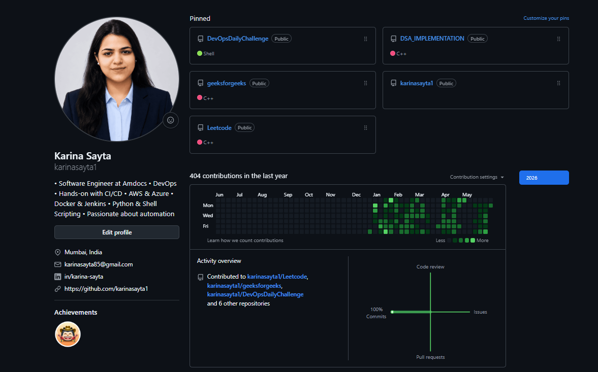

# Day 27 – GitHub Profile Makeover: Build Your Developer Identity

## Task 1: Audit Your Current GitHub Profile
Before making changes, assess where you stand:
1. Visit your own GitHub profile as if you were a stranger — what impression does it give?
2. Answer in your notes:
   - Is your profile picture professional? - **Yes**
   - Is your bio filled in? Does it say what you do? - **Yes**
   - Are your pinned repos relevant, or are they random forks? - **Relevant**
   - Do your repos have descriptions, or are they blank? - **They have description**
   - Would a recruiter understand what you've been working on? - **Yes**

---

## Task 2: Create Your Profile README

* **Created**

---

## Task 3: Organize Your Repositories

1. **90 Days of DevOps** — 
    1. **90 Days of DevOps** — 
    * [90 Days of DevOps Repository](https://github.com/karinasayta1/DevOpsDailyChallenge/tree/main/90DaysOfDevOps/2026)

    2. **Shell Scripts** — a dedicated repo for all your shell scripting work

    * [Shell Scripts Repository](https://github.com/karinasayta1/shell-scripting)

    3. **Python Scripts** — a dedicated repo for your Python projects

    * [Python Repository](https://github.com/karinasayta1/python-for-devops)

    4. **DevOps Notes** — a repo for your learning notes, cheat sheets, and references

    * [DevOps Notes](https://github.com/karinasayta1/Devops-Notes.git)

---

## Task 4: Pin Your Best Repos
* **Pinned**

---

## Task 6: Before & After

* Before

    
    
* After

    
    
    
---