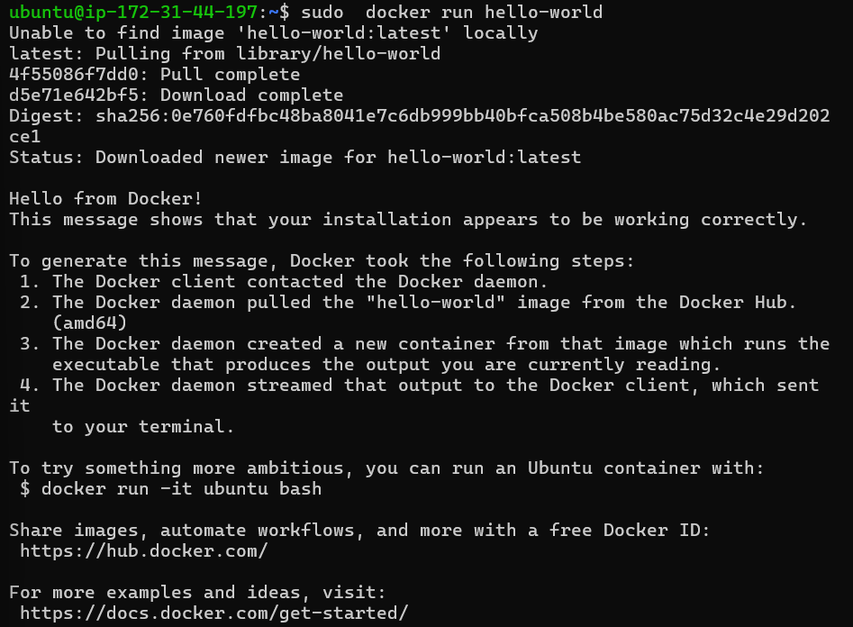
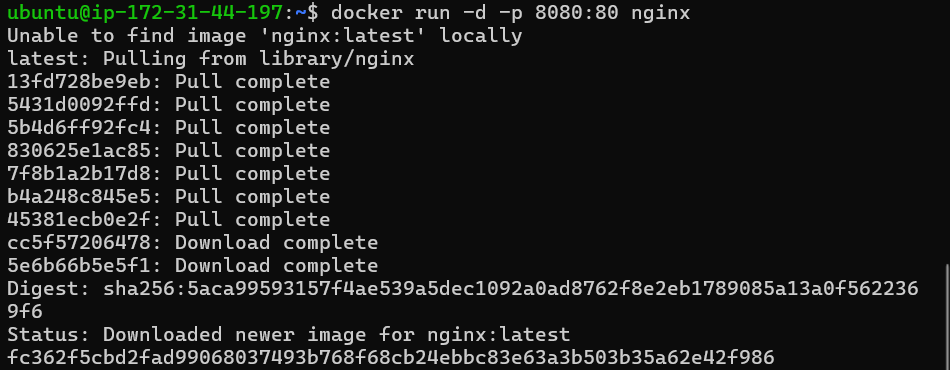
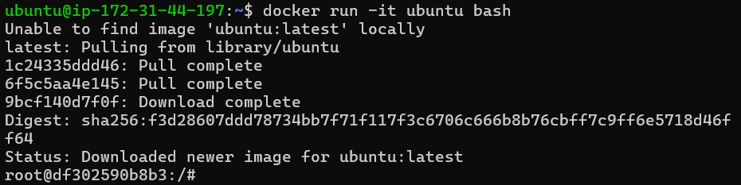
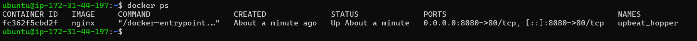
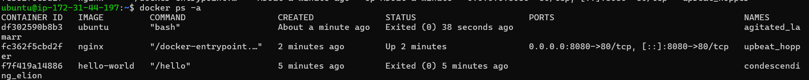
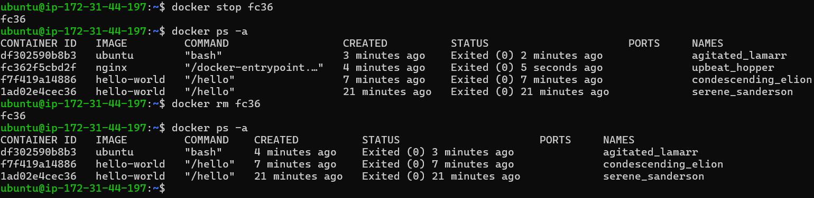
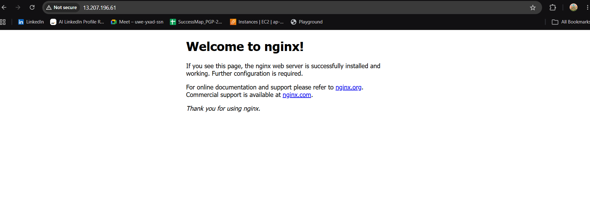
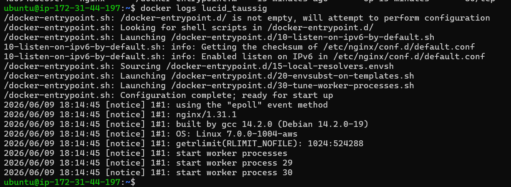
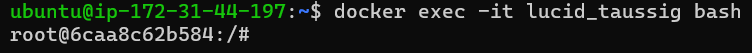

# Day 29 – Introduction to Docker

## Task 1: What is Docker?
Research and write short notes on:
- What is a container and why do we need them?

      A container is a run time instance of a docker image. It holds code, dependencies, libraries and 
      configuration needed to run the application.
      We need container to solve "It runs on my machine, fails on clients machine".
      Containers are isolated, lightweight, portable and runs on any OS.
      Containers are like virtualization running on docker engine.
     
- Containers vs Virtual Machines — what's the real difference?

    | Containers | Virtual Machines |
    |------------|------------------|
    | Uses Hosts OS | Have their own OS |
    | Shared resources from machine | Dedicated resources from machine |
    | Lightweight | Heavy |
    | Fast performance | Slow performance |
    | Highly portable | Less portable|
      
- What is the Docker architecture? (daemon, client, images, containers, registry)

    * Daemon - It manages containers, images, networks, volumes. In short all objects of Docker.
    * Client - It is used to command docker daemon. It can manage one or more docker daemon.
    * Images - It is the blueprint to build container. It contains all the commands to run an application.
    * Containers - It is the actual instance of an image. Application runs inside container isolated.
    * Registry - It is where all the images are stored. There are tow types :
       * Public : e.g. Docker Hub, accessible to everyone.
       * Private : Used by enterprises for internal images.

---

## Task 2: Install Docker
1. Install Docker on your machine (or use a cloud instance)
2. Verify the installation
3. Run the `hello-world` container
4. Read the output carefully — it explains what just happened
    
    
    
---

## Task 3: Run Real Containers
1. Run an **Nginx** container and access it in your browser

    
    
2. Run an **Ubuntu** container in interactive mode — explore it like a mini Linux machine

    
    
3. List all running containers

    
    
4. List all containers (including stopped ones)

    
    
5. Stop and remove a container

    

---

## Task 4: Explore
1. Run a container in **detached mode** — what's different?
  * Running a container in detached mode frees terminal, container run in background, we only get container id and 
    manage it using docker commands with its id.
  * Running directly without -d, runs it in foreground, it shows live logs.outputs, pressing ctl+c stops it 
    and exits container.
    
2. Give a container a custom **name**
3. Map a **port** from the container to your host

    
    
4. Check **logs** of a running container

    
    
5. Run a command **inside** a running container

    

---

## Deployed on nginx in container locally

    
