# Day 30 – Docker Images & Container Lifecycle

## Task 1: Docker Images
1. Pull the `nginx`, `ubuntu`, and `alpine` images from Docker Hub
     * `docker pull <image>`

```bash
docker pull nginx
docker pull ubuntu
docker pull alpine
```
👉 Downloads images from Docker Hub to your local machine
   
2. List all images on your machine — note the sizes

```bash
docker images
```
👉 Lists all images with repository, tag, size, and image ID

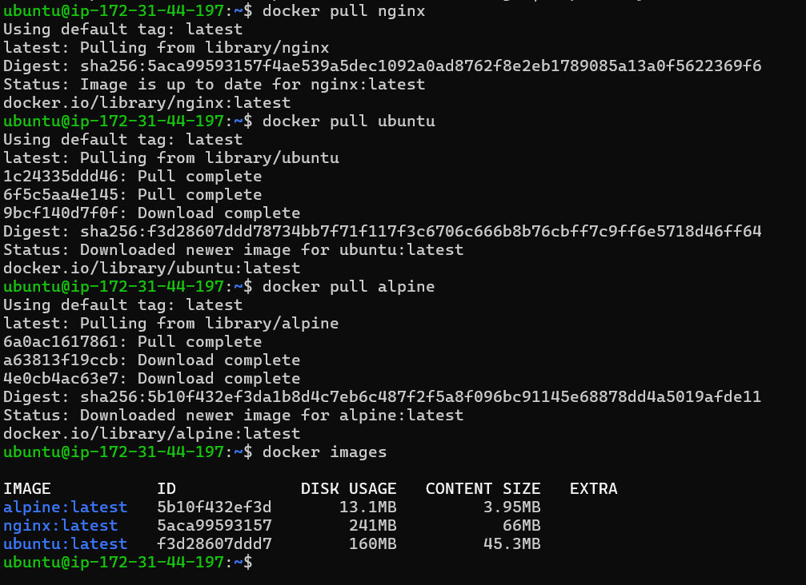
    
3. Compare `ubuntu` vs `alpine` — why is one much smaller?
     * `Ubuntu` - Larger image size because it includes many built-in tools, libraries, and GNU utilities.
               Heavier: slower startup and consumes more resources compared to Alpine.
     * `Alpine` - Smaller image size since it contains fewer tools and libraries by default, so you install only what you need.
               Lightweight: faster startup, minimal resource usage, ideal for microservices.
  
4. Inspect an image — what information can you see?

```bash
docker image inspect nginx
```
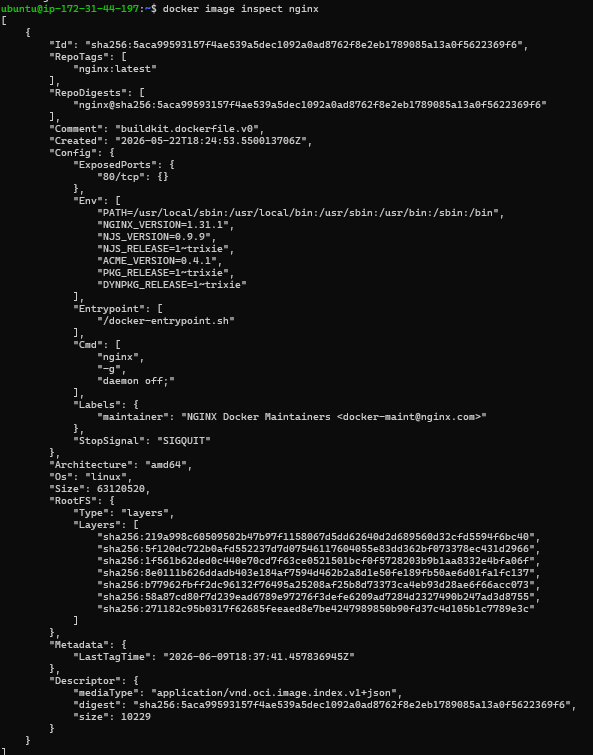

👉 Shows detailed JSON info about the image

  * Image ID
  * Image Tag
  * Created Time
  * Default Config
    * Ports
    * Environment variables
    * Entrypoint
    * CMD
  * Architecture
  * OS
  * Size
  * Graph Driver
  * Layers
  
5. Remove an image you no longer need
     * `docker rmi <image-id>`

```bash
docker rmi nginx
```
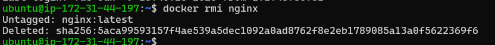
     
---

## Task 2: Image Layers
1. Run `docker image history nginx` — what do you see?

```bash
docker image history nginx
```
👉 Shows all layers used to build the image

2. Each line is a **layer**. Note how some layers show sizes and some show 0B

3. Write in your notes: What are layers and why does Docker use them?

       Docker image layers are created with every changes made to the file system.
       Every instruction in dockerfile creates a separate layer (FROM, COPY, RUN, CMD etc).
       Layers are very important as docker caches every layer while creating the image and stores it in docker engine.
       Now if you recreate after changing docker uses cached layers for unchanged layers. 
       Hence images are build faster and more efficient.
      
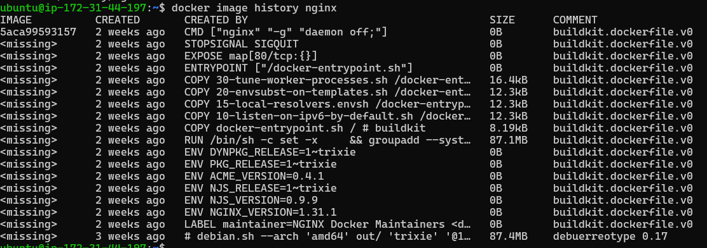
    
---

## Task 3: Container Lifecycle
Practice the full lifecycle on one container:

1. **Create** a container (without starting it)

```bash
docker create nginx
```
👉 Creates container but does not start it

2. **Start** the container

```bash
docker start <container_id>
```
👉 Starts the created container

3. **Pause** it and check status

```bash
docker pause <container_id>
docker ps
```
👉 Freezes container processes

4. **Unpause** it

```bash
docker unpause <container_id>
```
👉 Resumes paused container

5. **Stop** it

```bash
docker stop <container_id>
```
👉 Gracefully stops container

6. **Restart** it

```bash
docker restart <container_id>
```
👉 Stops and starts container again

7. **Kill** it

```bash
docker kill <container_id>
```
👉 Force stops container immediately

8. **Remove** it

```bash
docker rm <container_id>
```
👉 Deletes container

Check `docker ps -a` after each step — observe the state changes.

```bash
docker ps -a
```

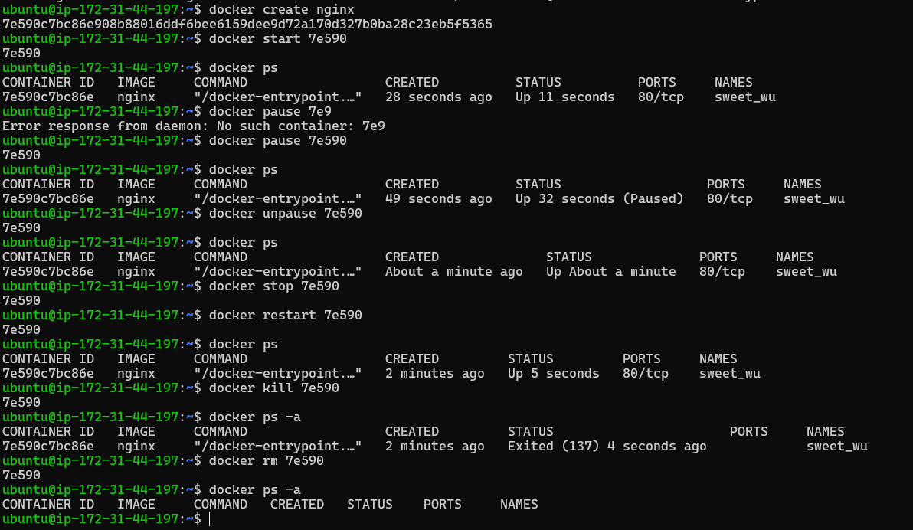
    
---

## Task 4: Working with Running Containers
1. Run an Nginx container in detached mode

```bash
docker run -d --name my-nginx -p 8080:80 nginx
```
👉 Runs container in background with name and port mapping

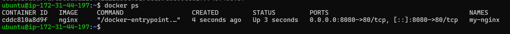
    
2. View its **logs**

```bash
docker logs my-nginx
```
👉 Shows container logs

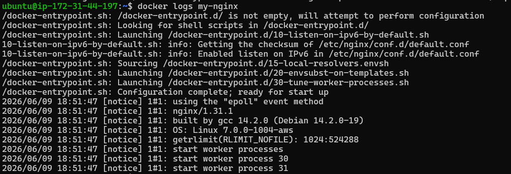
    
3. View **real-time logs** (follow mode)

```bash
docker logs -f my-nginx
```
👉 `-f` → Follow logs in real time

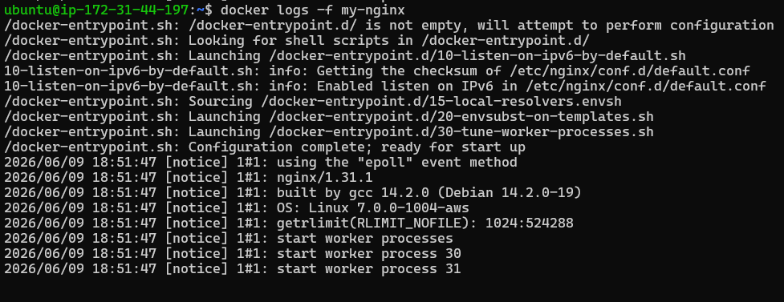
    
4. **Exec** into the container and look around the filesystem

```bash
docker exec -it my-nginx bash
```
👉 Opens terminal inside container

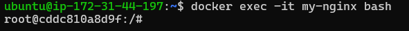
    
5. Run a single command inside the container without entering it

```bash
docker exec my-nginx ls /
```
👉 Runs command directly inside container

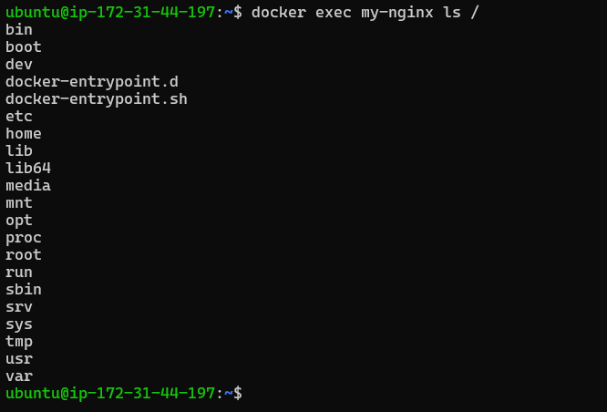
    
6. **Inspect** the container — find its IP address, port mappings, and mounts

```bash
docker inspect my-nginx
```
👉 Shows full container details in JSON

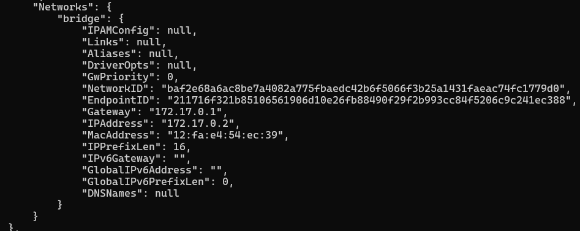
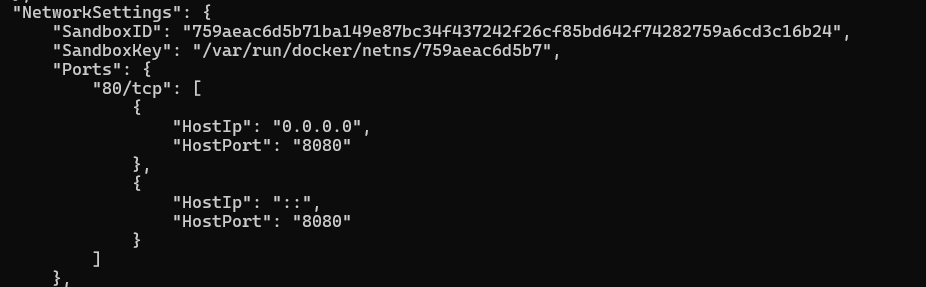
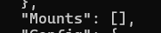

---

### Task 5: Cleanup
1. Stop all running containers in one command

```bash
docker stop $(docker ps -q)
```
👉 Stops all running containers

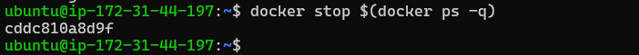
    
2. Remove all stopped containers in one command

```bash
docker rm $(docker ps -aq)
```
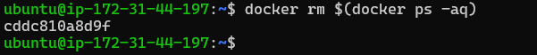

👉 Removes all containers

* Using prune

```bash
docker container prune
```
👉 Removes all stopped containers safely
    
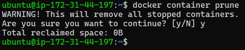
    
3. Remove unused images

```bash
docker image prune
```
👉 Deletes unused images

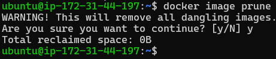
    
4. Check how much disk space Docker is using

```bash
docker system df
```
👉 Shows Docker disk usage

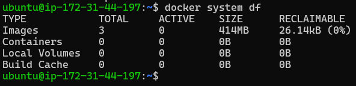
    
---