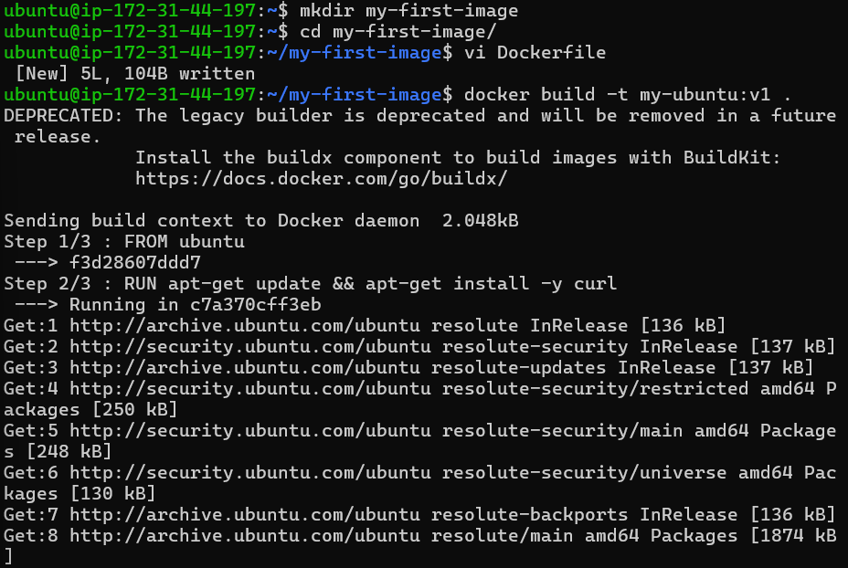
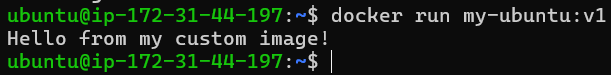
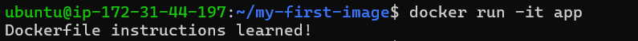
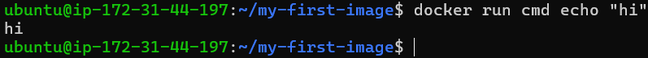
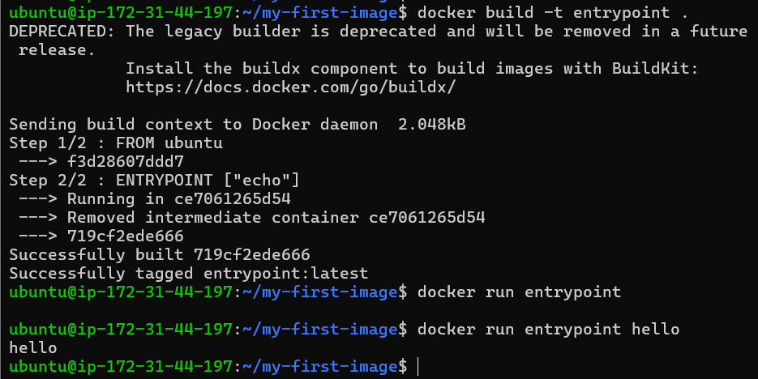
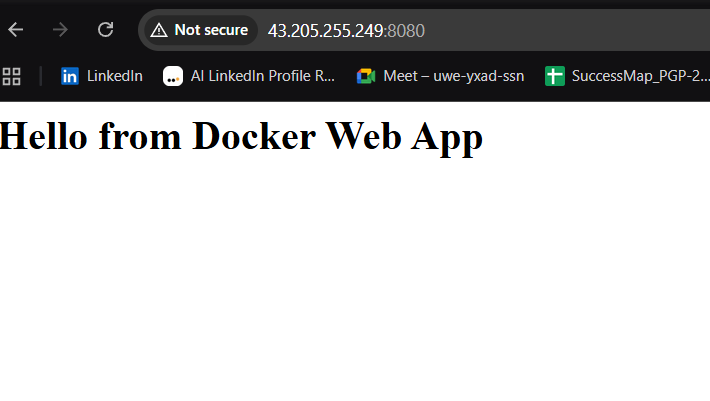
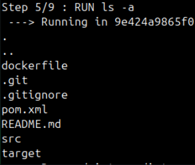
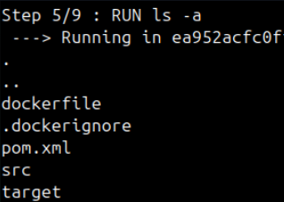

# Day 31 – Dockerfile: Build Your Own Images

## What you will learn today
By the end of this day, you will understand:
- What a Dockerfile is
- How Docker builds images step by step
- How to create your own custom images
- Difference between CMD and ENTRYPOINT
- How to optimize Docker builds

---
- **Dockerfile:** A text file that contains instructions to build a Docker image step by step.
- **Image:** A read-only template that includes everything needed to run an application (code, libraries, dependencies, OS).
- **Container:** A running instance of a Docker image, isolated and executing the application.

# Task 1: Your First Dockerfile

## Step 1: Create folder
```bash
mkdir my-first-image
cd my-first-image
````

## Step 2: Create Dockerfile

```dockerfile
FROM ubuntu

RUN apt-get update && apt-get install -y curl

CMD ["echo", "Hello from my custom image!"]
```

## Step 3: Build image

```bash
docker build -t my-ubuntu:v1 .
```


## Step 4: Run container

```bash
docker run my-ubuntu:v1
```


---

# Task 2: Dockerfile Instructions

## Create Dockerfile

```dockerfile
FROM ubuntu

WORKDIR /app

COPY . /app

RUN apt-get update && apt-get install -y curl

EXPOSE 8080

CMD ["echo", "Dockerfile instructions learned!"]
```


## Meaning of instructions

* FROM → base image
* WORKDIR → working directory inside container
* COPY → copy files into image
* RUN → execute commands during build
* EXPOSE → document port
* CMD → default command

---

# Task 3: CMD vs ENTRYPOINT

## CMD example

```dockerfile
FROM ubuntu

CMD ["echo", "hello"]
```

### Run

```bash
docker run cmd
```

### Override

```bash
docker run my-image echo "hi"
```


### Result

CMD is fully replaced
---

## ENTRYPOINT example

```dockerfile
FROM ubuntu

ENTRYPOINT ["echo"]
```

### Run

```bash
docker run my-image hello
```

---

## Difference

| CMD             | ENTRYPOINT            |
| --------------- | --------------------- |
| Default command | Fixed command         |
| Fully override  | Only arguments change |

---

# Task 4: Simple Web App (Nginx)

## Step 1: Create HTML file

```html
<h1>Hello from Docker Web App 🚀</h1>
```

## Step 2: Dockerfile

```dockerfile
FROM nginx:alpine

COPY index.html /usr/share/nginx/html/index.html
```

## Step 3: Build image

```bash
docker build -t my-website:v1 .
```

## Step 4: Run container

```bash
docker run -p 8080:80 my-website:v1
```

## Step 5: Open browser

```
http://localhost:8080
```



## Task 5: .dockerignore
1. Create a `.dockerignore` file in one of your project folders
2. Add entries for: `node_modules`, `.git`, `*.md`, `.env`
3. Build the image — verify that ignored files are not included
    
   
    
   

## Why

* Faster builds
* Smaller images
* Prevent unnecessary files in image

---

# Task 6: Build Optimization

## Key idea: Docker layers

* Each instruction creates a layer
* Docker caches layers

## Bad example

```dockerfile
COPY . .
RUN npm install
```

## Good example

```dockerfile
COPY package.json .
RUN npm install
COPY . .
```

## Why order matters

* Stable steps first
* Changing steps last

## Result

* Faster builds
* Better caching


