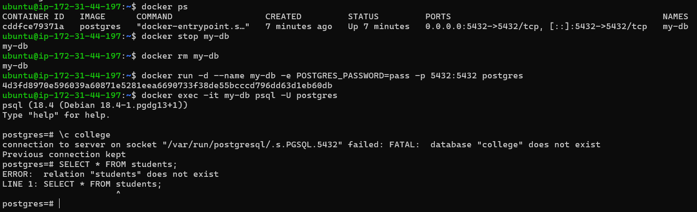
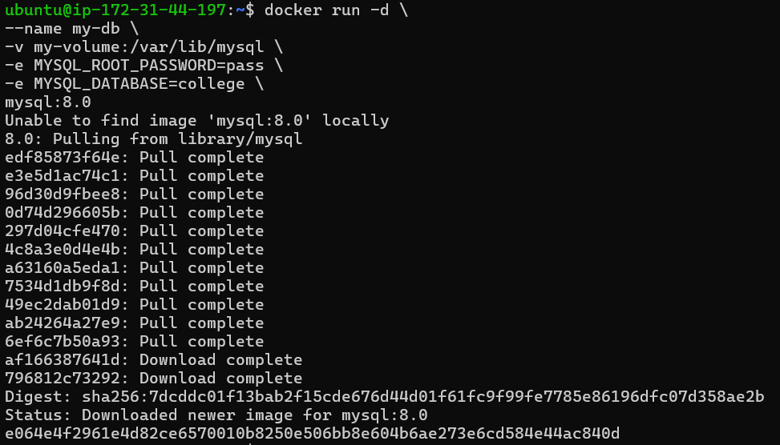
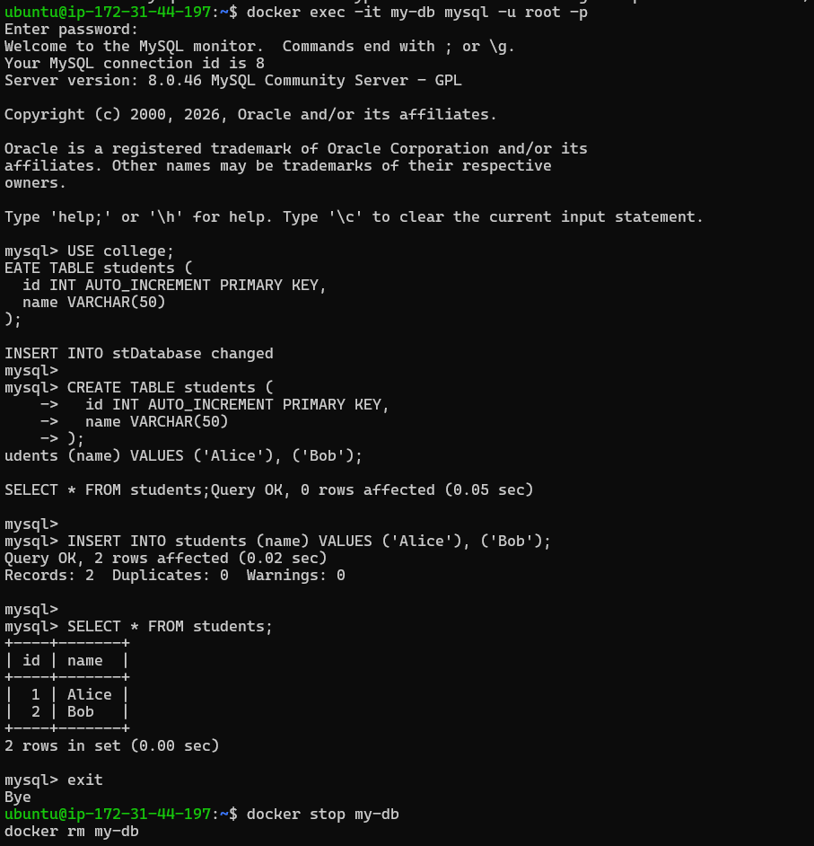
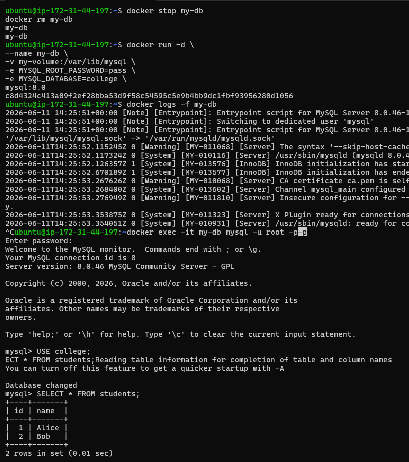
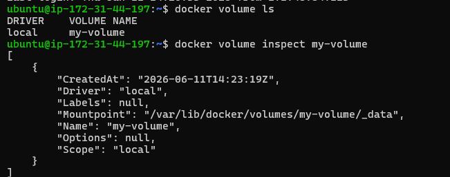
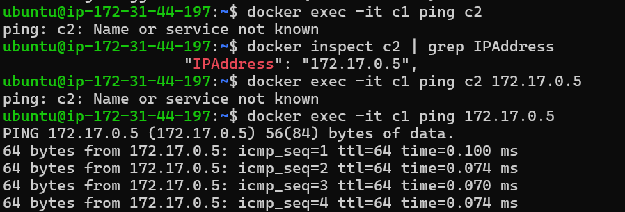
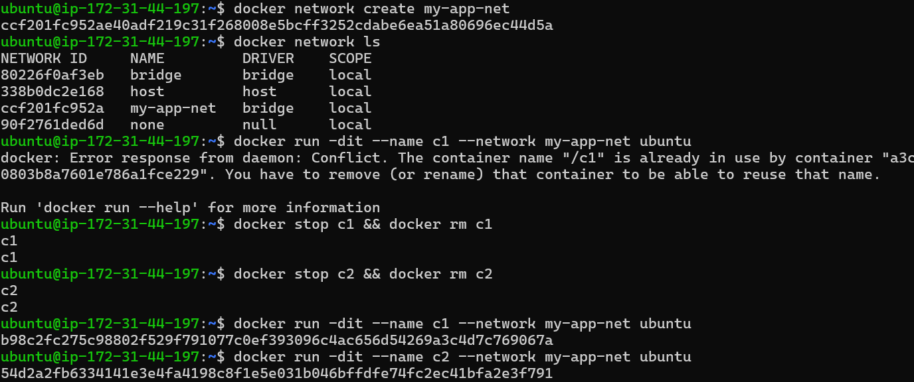
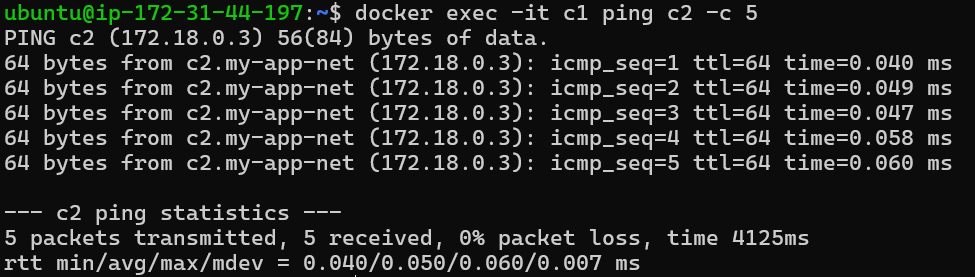
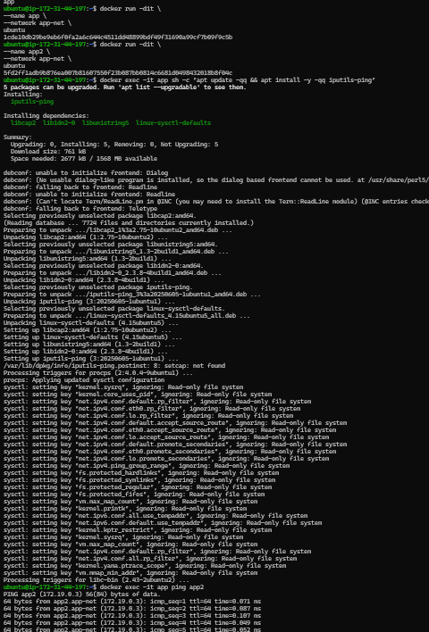

# Day 32 – Docker Volumes & Networking

## What you will learn today
By the end of this day, you will understand:
- Why containers lose data
- How to persist data using volumes
- Difference between named volumes and bind mounts
- How Docker networking works
- How containers communicate with each other

---

# Task 1: The Problem (Data Loss)

## Step 1: Run database container
```bash
docker run -d --name my-db -e POSTGRES_PASSWORD=pass -p 5432:5432 postgres
````

## Step 2: Enter container

```bash
docker exec -it my-db psql -U postgres
```

## Step 3: Create table & insert data


## Step 4: Stop and remove container

```bash
docker stop my-db
docker rm my-db
```

## Step 5: Run new container

```bash
docker run -d --name my-db -e POSTGRES_PASSWORD=pass -p 5432:5432 postgres
```

## Observation

❌ Data is lost



## Reason

Containers are **ephemeral** — once removed, all internal data is deleted.

---


# Task 2: Named Volumes (Data Persistence - MySQL)

## Step 1: Create volume

```bash
docker volume create my-volume
```

---

## Step 2: Run MySQL container with volume

```bash
docker run -d \
--name my-db \
-v my-volume:/var/lib/mysql \
-e MYSQL_ROOT_PASSWORD=pass \
-e MYSQL_DATABASE=college \
mysql
```

---

## Step 3: Enter container

```bash
docker exec -it my-db mysql -u root -p
```

Enter password:

```
pass
```

---

## Step 4: Use database

```sql
USE college;
```

---

## Step 5: Create table

```sql
USE college;

CREATE TABLE students (
  id INT AUTO_INCREMENT PRIMARY KEY,
  name VARCHAR(50)
);
```

---

## Step 6: Insert data

```sql
INSERT INTO students (name) VALUES ('Alice'), ('Bob');
```

---

## Step 7: Verify data

```sql
SELECT * FROM students;
```

---

## Step 8: Exit

```sql
exit;
```

---

## Step 9: Stop and remove container

```bash
docker stop my-db
docker rm my-db
```



---

## Step 10: Run new container with SAME volume

```bash
docker run -d \
--name my-db \
-v my-volume:/var/lib/mysql \
-e MYSQL_ROOT_PASSWORD=pass \
-e MYSQL_DATABASE=college \
mysql
```

---

## Step 11: Verify data again

```bash
docker exec -it my-db mysql -u root -p
```

Enter password:

```
pass
```

```sql
USE college;
SELECT * FROM students;
```

---

## Observation

✅ Data is still present

---

## Verify volume

```bash
docker volume ls
docker volume inspect my-volume
```

---

## Conclusion

Named volumes store MySQL data outside the container lifecycle, so data persists even after container removal.


---

# Task 3: Bind Mounts

## Step 1: Create folder

```bash
mkdir my-site
cd my-site
```

## Step 2: Create HTML file

```html
<h1>Hello from Bind Mount 🚀</h1>
```

## Step 3: Run Nginx container

```bash
docker run -d \
-p 8080:80 \
-v $(pwd):/usr/share/nginx/html \
nginx
```

## Step 4: Open browser

```
http://localhost:8080
```


## Step 5: Edit HTML → Refresh browser

✅ Changes reflect instantly


---

## Difference

| Named Volume             | Bind Mount           |
| ------------------------ | -------------------- |
| Managed by Docker        | Managed by user      |
| Stored in Docker storage | Uses host filesystem |
| Best for databases       | Best for development |

---

# Task 4: Docker Networking Basics

## List networks

```bash
docker network ls
```

## Inspect default bridge

```bash
docker network inspect bridge
```

## Run containers

```bash
docker run -dit --name c1 ubuntu
docker run -dit --name c2 ubuntu
```

## Ping by name

```bash
docker exec -it c1 ping c2
```

❌ Fails

## Ping by IP

```bash
docker inspect c2
docker exec -it c1 ping <IP>
```

✅ Works



---

# Task 5: Custom Networks

## Create network

```bash
docker network create my-app-net
```

## Run containers

```bash
docker run -dit --name c1 --network my-app-net ubuntu
docker run -dit --name c2 --network my-app-net ubuntu
```


## Ping by name

```bash
docker exec -it c1 ping c2
```

✅ Works



---

## Why?

* Default bridge → limited DNS (no automatic name resolution)
* Custom network → built-in DNS enabled

👉 Containers can communicate using names

---

# Task 6: Put It Together

## Step 1: Create network

```bash
docker network create app-net
```

## Step 2: Run database

```bash
docker run -dit \
--name app \
--network app-net \
ubuntu
```

## Step 3: Run app container
👉 Containers communicate using service/container names instead of IPs

```bash
docker run -dit \
--name app2 \
--network app-net \
ubuntu
```

## Step 4: Test connectivity

```bash
docker exec -it app ping app2
```

✅ Success



---

# Key Learnings

* Containers lose data → use volumes
* Named volumes → persistent storage
* Bind mounts → real-time file sync
* Default network → limited communication
* Custom network → name-based communication
* Docker DNS works in custom networks

---

# Summary

Docker containers are temporary, but:

* Volumes make data persistent
* Networks enable communication


