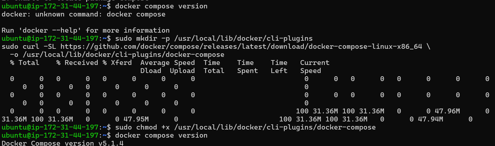
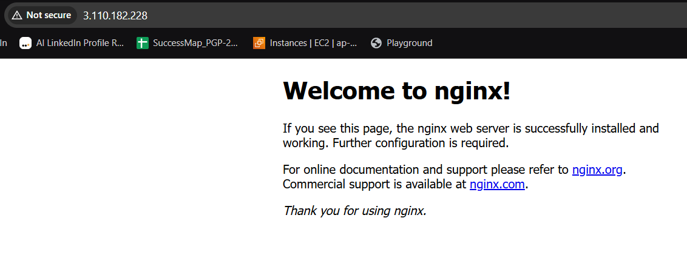
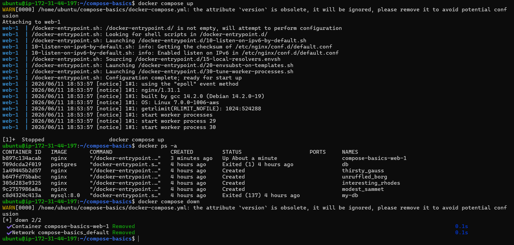
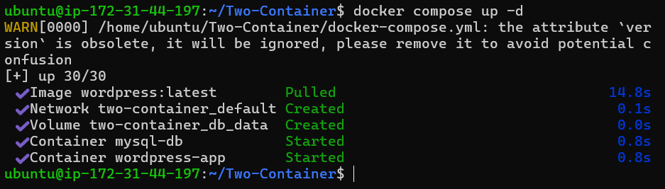
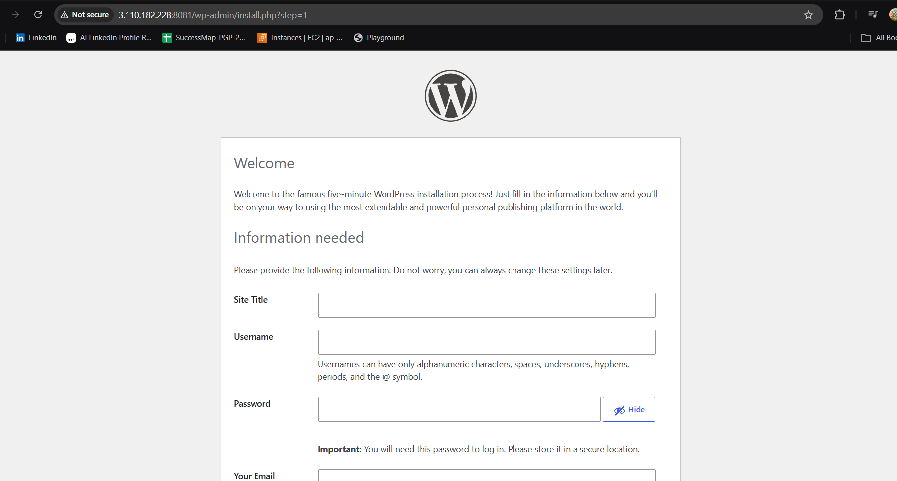

# Day 33 – Docker Compose: Multi-Container Basics

## What You Will Learn

By the end of this day, you will understand:

* What Docker Compose is
* Why we use it
* How to run multi-container applications
* How containers communicate using Compose
* How to persist data using volumes
* How to use environment variables
* Common Docker Compose commands

---

# 🧠 What is Docker Compose?

Docker Compose is a tool that lets you define and run **multi-container Docker applications** using a single YAML file.

Instead of running multiple `docker run` commands, you define everything in one file:

```bash
docker-compose.yml
```

---

# 📌 Task 1: Install & Verify

## Step 1: Check if Docker Compose is installed

```bash
docker compose version
```

## Expected Output:

```
Docker Compose version v2.x.x
```

✅ If this works → you're ready
❌ If not → install Docker Desktop or Compose plugin

---

# 📌 Task 2: Your First Compose File (Single Container)

## Step 1: Create project folder

```bash
mkdir compose-basics
cd compose-basics
```

## Step 2: Create `docker-compose.yml`

```yaml
version: "3.9"

services:
  web:
    image: nginx
    ports:
      - "8080:80"
```

## Step 3: Start container

```bash
docker compose up
```

## Step 4: Run in background (recommended)

```bash
docker compose up -d
```

## Step 5: Access in browser

```
http://localhost:8080
```


## Step 6: Stop and remove

```bash
docker compose down
```

---

# 📌 Task 3: Two-Container Setup (WordPress + MySQL)

## Step 1: Create folder

```bash
mkdir Two-Container
cd Two-Container
```

## Step 2: Create `docker-compose.yml`

```yaml
version: "3.9"

services:
  db:
    image: mysql:5.7
    container_name: mysql-db
    restart: always
    environment:
      MYSQL_ROOT_PASSWORD: rootpass
      MYSQL_DATABASE: wordpress
      MYSQL_USER: wpuser
      MYSQL_PASSWORD: wppass
    volumes:
      - db_data:/var/lib/mysql

  wordpress:
    image: wordpress:latest
    container_name: wordpress-app
    restart: always
    ports:
      - "8081:80"
    environment:
      WORDPRESS_DB_HOST: db:3306
      WORDPRESS_DB_USER: wpuser
      WORDPRESS_DB_PASSWORD: wppass
      WORDPRESS_DB_NAME: wordpress
    depends_on:
      - db

volumes:
  db_data:
```

---

## 🔥 Key Concepts

### 1. Service Name = DNS

```yaml
WORDPRESS_DB_HOST: db:3306
```

➡️ `db` is automatically resolved as hostname

---

### 2. Named Volume

```yaml
volumes:
  - db_data:/var/lib/mysql
```

➡️ Prevents data loss when container stops

---

## Step 3: Start services

```bash
docker compose up -d
```



## Step 4: Open WordPress

```
http://localhost:8081
```


## Step 5: Stop & test persistence

```bash
docker compose down
docker compose up -d
```

✅ Your WordPress data should still exist


---

# 📌 Task 4: Important Docker Compose Commands

## 1. Start in detached mode

```bash
docker compose up -d
```


## 2. View running containers

```bash
docker compose ps
```


## 3. View logs (all services)

```bash
docker compose logs
```


## 4. View logs (specific service)

```bash
docker compose logs wordpress
docker compose logs db
```


## 5. Stop services (without deleting)

```bash
docker compose stop
```


## 6. Start again

```bash
docker compose start
```


## 7. Remove everything

```bash
docker compose down
```


## 8. Remove including volumes (⚠️ data loss)

```bash
docker compose down -v
```


## 9. Rebuild containers

```bash
docker compose up --build
```


---

# 📌 Task 5: Environment Variables

## Method 1: Directly in Compose file

```yaml
environment:
  MYSQL_ROOT_PASSWORD: rootpass
```

---

## Method 2: Using `.env` file

### Step 1: Create `.env`

```env
MYSQL_ROOT_PASSWORD=rootpass
MYSQL_DATABASE=wordpress
MYSQL_USER=wpuser
MYSQL_PASSWORD=wppass
```

---

### Step 2: Update `docker-compose.yml`

```yaml
environment:
  MYSQL_ROOT_PASSWORD: ${MYSQL_ROOT_PASSWORD}
  MYSQL_DATABASE: ${MYSQL_DATABASE}
  MYSQL_USER: ${MYSQL_USER}
  MYSQL_PASSWORD: ${MYSQL_PASSWORD}
```

---

## Step 3: Verify variables

```bash
docker compose config
```

---

# ⚡ Quick Cheat Sheet

| Task            | Command                     |
| --------------- | --------------------------- |
| Start           | `docker compose up -d`      |
| Stop            | `docker compose stop`       |
| Remove          | `docker compose down`       |
| Logs            | `docker compose logs`       |
| List containers | `docker compose ps`         |
| Rebuild         | `docker compose up --build` |

---

# 🎯 Summary

* Docker Compose simplifies multi-container apps
* Uses a single YAML file
* Services communicate using service names
* Volumes prevent data loss
* `.env` helps manage configurations
* One command can control everything

---

# ✅ End of Day 33

You can now:

* Run multi-container apps
* Connect services easily
* Persist data
* Manage containers like a pro

Next → Production-ready setups 🚀
