# Day 34 – Docker Compose: Real-World Multi-Container Apps

---

# 🎯 Goal

Build a **production-like multi-container application** using:

* Web App
* Database
* Cache
* Healthchecks
* Restart Policies
* Networks & Volumes
* Scaling

---

# 📁 Initial Setup (Do this once)

```bash
mkdir -p 2026/day-34/app
```

👉 Creates project directory structure

```bash
cd 2026/day-34
```

👉 Moves into project folder

```bash
touch docker-compose.yml
```

👉 Creates main files

```bash
cd app
touch app.py requirements.txt Dockerfile
```

👉 Creates app-related files

---

# 🚀 Task 1: Build Your Own App Stack

## Step 1: Write Application

### app/app.py

```python
from flask import Flask
import psycopg2
import redis
import time

app = Flask(__name__)

def wait_for_db():
    while True:
        try:
            conn = psycopg2.connect(
                host="db",
                database="testdb",
                user="user",
                password="password"
            )
            return conn
        except:
            print("Waiting for DB...")
            time.sleep(2)

@app.route("/")
def home():
    wait_for_db()
    r = redis.Redis(host='redis', port=6379)
    count = r.incr('hits')
    return f"Hello! Visits: {count}"

app.run(host="0.0.0.0", port=5000)
```

---

### requirements.txt

```txt
flask
psycopg2-binary
redis
```

---

## Step 2: Dockerfile

```Dockerfile
FROM python:3.10

WORKDIR /app

COPY requirements.txt .
RUN pip install -r requirements.txt

COPY . .

CMD ["python", "app.py"]
```

---

## Step 3: docker-compose.yml

```yaml
version: "3.9"

services:
  web:
    build: ./app
    ports:
      - "5000:5000"
    networks:
      - app-network

  db:
    image: postgres:13
    environment:
      POSTGRES_DB: testdb
      POSTGRES_USER: user
      POSTGRES_PASSWORD: password
    networks:
      - app-network

  redis:
    image: redis:7
    networks:
      - app-network

networks:
  app-network:
```

---

## Step 4: Run

```bash
docker compose up
```

👉 Builds and starts all services

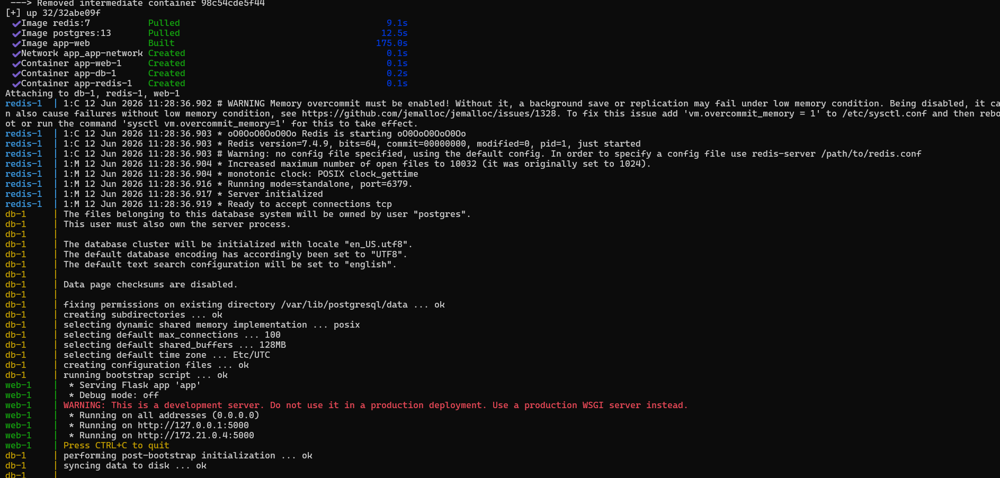


---

# 🔗 Task 2: depends_on & Healthchecks

## Update docker-compose.yml

```yaml
web:
  build: ./app
  ports:
    - "5000:5000"
  depends_on:
    db:
      condition: service_healthy
```

---

```yaml
db:
  image: postgres:13
  healthcheck:
    test: ["CMD-SHELL", "pg_isready -U user -d testdb"]
    interval: 5s
    timeout: 5s
    retries: 5
```

---

## Test

```bash
docker compose down
```

👉 Stops all containers

```bash
docker compose up
```

👉 Restarts and applies healthcheck logic
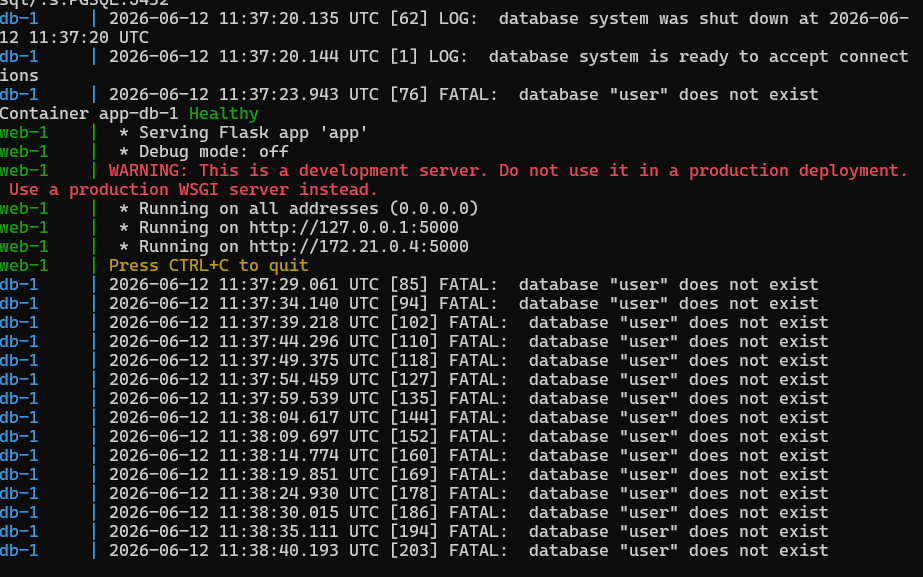

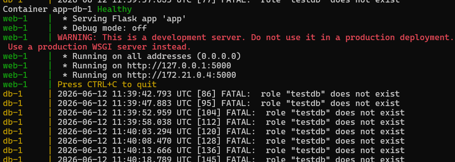

👉 App now waits until DB is **ready**, not just started

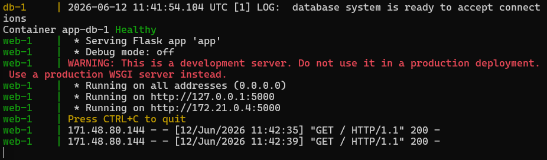

---

# 🔁 Task 3: Restart Policies

## Add to DB service

```yaml
restart: always
```

---

## Test

```bash
docker ps
```

👉 Shows running containers

```bash
systemctl restart docker
```
---

👉 DB restarts automatically
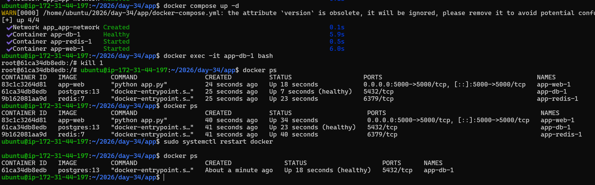

---

## Try Alternative

```yaml
restart: on-failure
```

# kill the container
```bash
docker exec app-db-1 sh -c "exit 1"
```

👉 Restarts only if container crashes
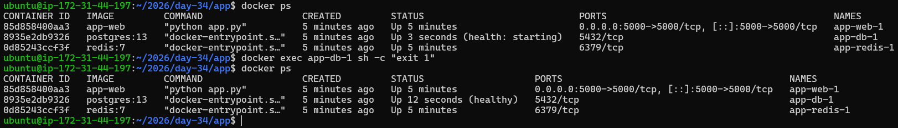

---

## When to Use

* `always` → critical services (DB)
* `on-failure` → jobs/scripts

---

# 🏗️ Task 4: Custom Dockerfiles in Compose

Already used:

```yaml
build: ./app
```

---

## Make Code Change → Rebuild

```bash
docker compose up --build
```

👉 Rebuilds image and restarts containers
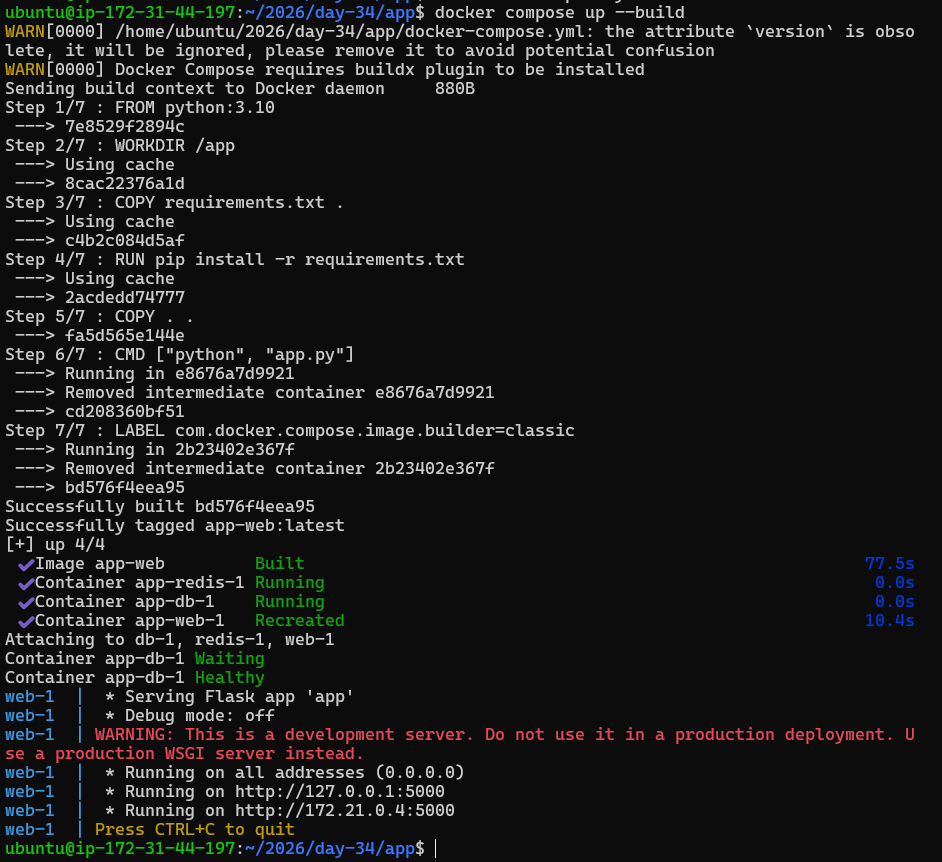


---

# 💾 Task 5: Named Networks & Voddlumes

## Add Volume

```yaml
db:
  volumes:
    - db-data:/var/lib/postgresql/data
```

---

```yaml
volumes:
  db-data:
```

---

## Add Network

```yaml
networks:
  app-network:
```

---

## Verify

```bash
docker volume ls
```

👉 Lists volumes

```bash
docker network ls
```

👉 Lists networks

---

Demonstration: Using named volumes ensures data remains intact across container restarts and rebuilds.

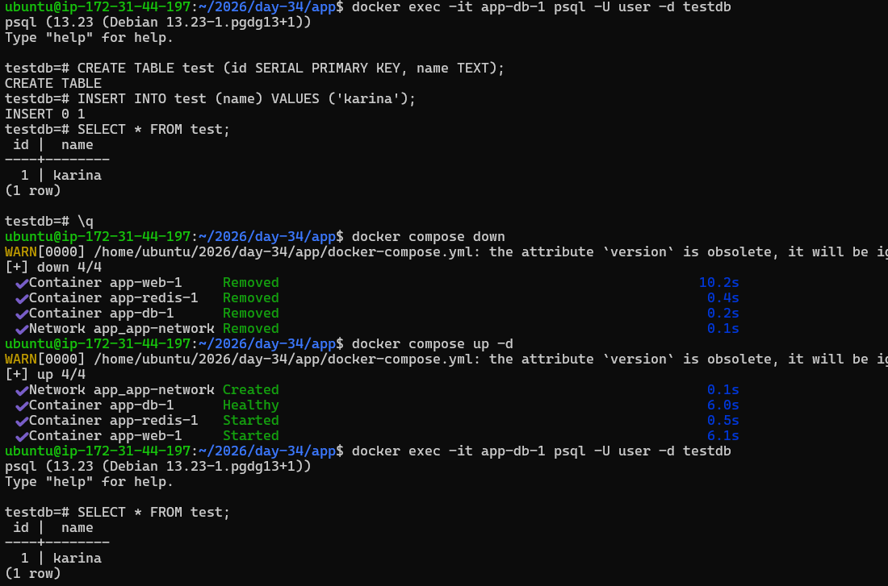

Demonstration: Without volumes, restarting containers results in complete data loss.

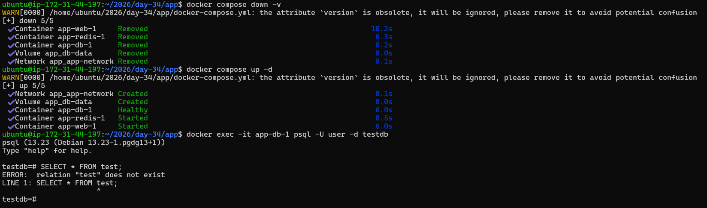

---

# ⚖️ Task 6: Scaling (Bonus)

```bash
docker compose up --scale web=3
```

👉 Tries to run 3 web containers

---

## Result

❌ Port conflict error

---

## Why?

* All containers try to use port 5000
* Only one container can bind to host port
---
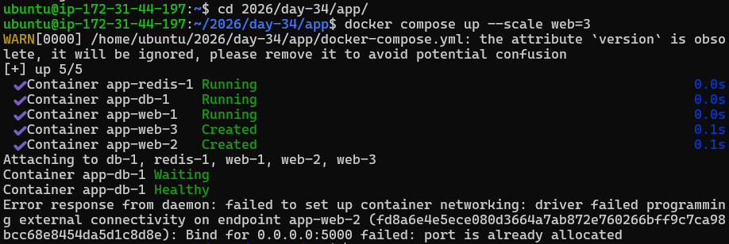

## ✅ Real Solution Implemented

To fix the scaling issue, I implemented a **load balancer using NGINX** and updated the architecture as follows:

### 🔹 1. Removed Port Mapping from Web Service

```yaml
web:
  build: .
  # ports removed to allow scaling
```

👉 This allows multiple web containers to run without port conflicts

---

### 🔹 2. Added NGINX as Load Balancer

```yaml
nginx:
  image: nginx:latest
  ports:
    - "5000:80"
  volumes:
    - ./nginx.conf:/etc/nginx/nginx.conf
  depends_on:
    - web
```

👉 NGINX acts as a single entry point for incoming traffic

---

### 🔹 3. Configured NGINX for Load Balancing

```nginx
events {}

http {
    upstream web_servers {
        server web:5000;
    }

    server {
        listen 80;

        location / {
            proxy_pass http://web_servers;
        }
    }
}
```

👉 Docker Compose automatically distributes requests across scaled containers

---

### 🔹 4. Used Internal Docker Networking

```yaml
networks:
  app-network:
```

👉 Enables communication between services without exposing ports externally

---
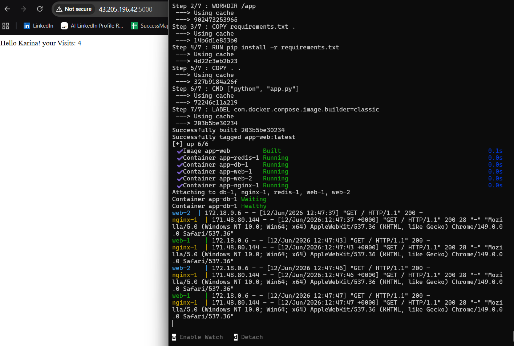

## 🚀 Final Result

* Successfully scaled web service to multiple containers
* No port conflicts
* Traffic distributed using NGINX
* Application accessible via single endpoint

---

## 📸 Scaling With Load Balancer

✅ NGINX distributes traffic across multiple containers, enabling horizontal scaling without port conflicts.

---

## 🧠 Key Learning

> Scaling containers requires a load balancer because multiple containers cannot share the same host port. Using NGINX with internal Docker networking enables proper horizontal scaling.


---

# 📊 Common Commands

```bash
docker compose up
```

👉 Start services

```bash
docker compose up -d
```

👉 Run in background

```bash
docker compose down
```

👉 Stop services

```bash
docker compose logs -f
```

👉 View logs

```bash
docker compose up --build
```

👉 Rebuild & run

---

# 🧠 Key Learnings

* Multi-container apps are real-world standard
* depends_on + healthcheck ensures proper startup
* restart policies improve reliability
* volumes prevent data loss
* scaling requires load balancing

---

# 🏁 Final Outcome

Successfully built:

* Web App (Flask)
* PostgreSQL DB
* Redis Cache
* Healthchecks
* Restart Policies
* Volumes & Networks
* Load balancer for scaling

---


