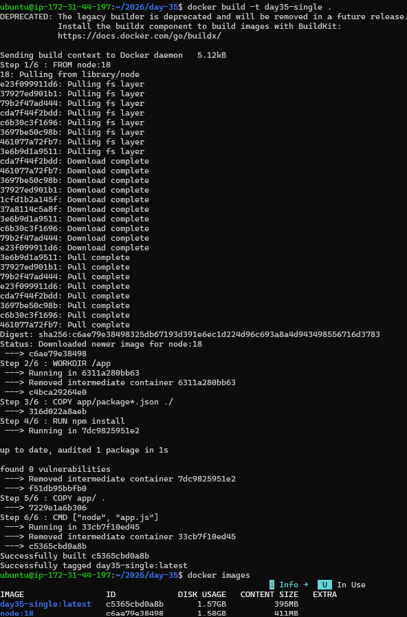
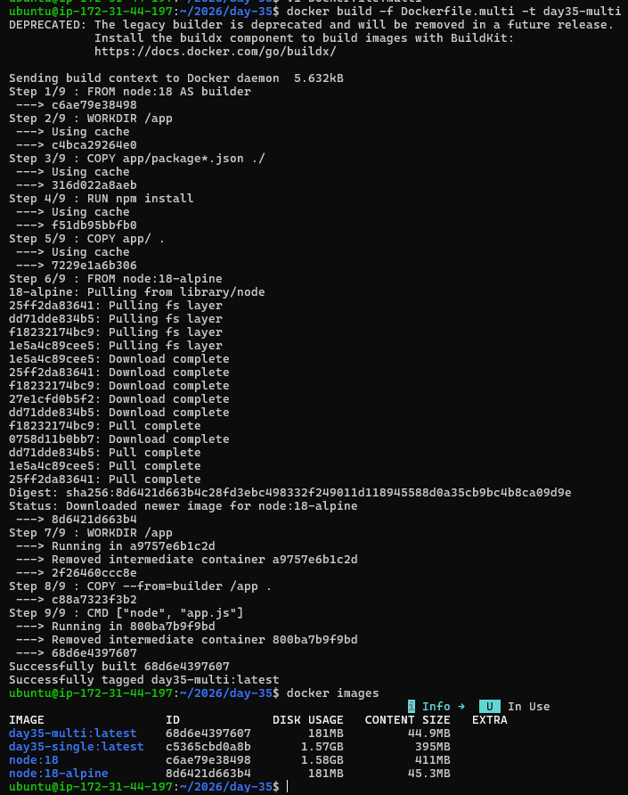
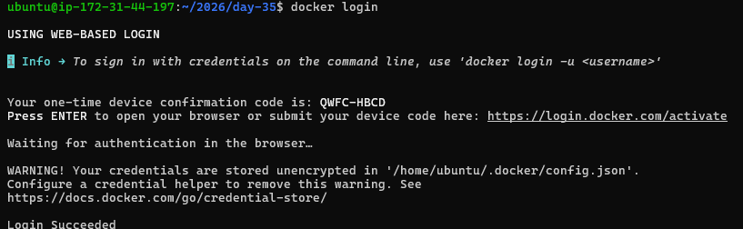
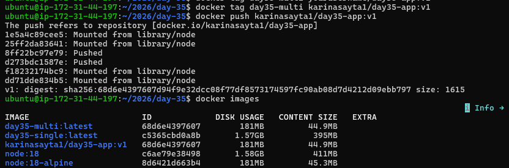
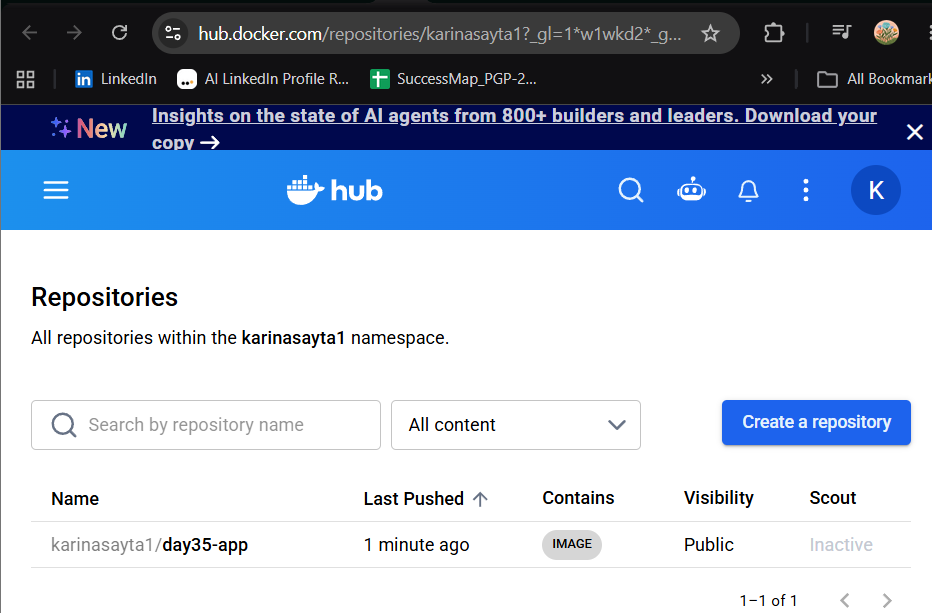
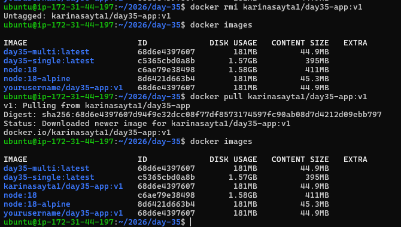
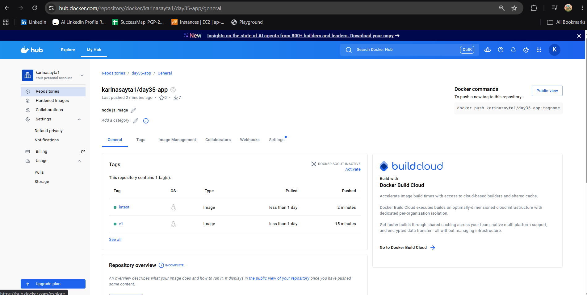
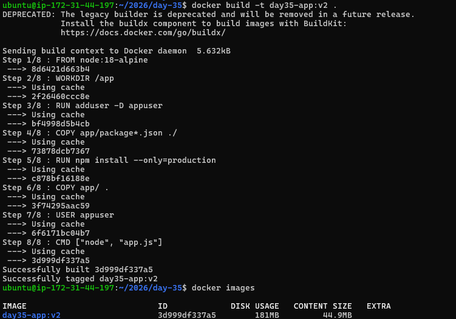

# Day 35 – Multi-Stage Builds & Docker Hub

---

# 🎯 Goal

Build **production-ready optimized Docker images** and publish them to Docker Hub.

You will work with:

* Multi-stage builds
* Image optimization
* Docker Hub (push, pull, tagging)
* Security best practices

---

# 📁 Initial Setup (Do this once)

```bash
mkdir -p 2026/day-35/app
```

👉 Creates project directory

```bash
cd 2026/day-35
touch Dockerfile Dockerfile.multi
```

👉 Create Dockerfiles

```bash
cd app
touch app.js package.json
```

👉 Create app files

---

# 🚀 Task 1: The Problem with Large Images

## Step 1: Write Simple Node App

### app/app.js

```javascript
console.log("Hello from Docker Multi-Stage!");
```

---

### app/package.json

```json
{
  "name": "demo-app",
  "version": "1.0.0",
  "main": "app.js",
  "dependencies": {}
}
```

---

## Step 2: Single-Stage Dockerfile (Bad Practice)

### Dockerfile

```Dockerfile
FROM node:18

WORKDIR /app

COPY app/package*.json ./
RUN npm install

COPY app/ .

CMD ["node", "app.js"]
```

---

## Step 3: Build Image

```bash
docker build -t day35-single .
```

---

## Step 4: Check Image Size

```bash
docker images
```

👉 You will see:

* Size ~400MB – 1GB ❌

---

## ❗ Problem

* Full Node image included
* Build tools included unnecessarily
* Larger attack surface
* Slow deployments

---



---

# 🚀 Task 2: Multi-Stage Build (Real Solution)

## Step 1: Create Multi-Stage Dockerfile

### Dockerfile.multi

```Dockerfile
# Stage 1: Builder
FROM node:18 AS builder

WORKDIR /app

COPY app/package*.json ./
RUN npm install

COPY app/ .

# Stage 2: Production
FROM node:18-alpine

WORKDIR /app

COPY --from=builder /app .

CMD ["node", "app.js"]
```

---

## Step 2: Build Optimized Image

```bash
docker build -f Dockerfile.multi -t day35-multi .
```

---

## Step 3: Compare Sizes

```bash
docker images
```

👉 Example:

| Image        | Size   |
| ------------ | ------ |
| day35-single | ~900MB |
| day35-multi  | ~100MB |

---


## 🧠 Why Multi-Stage Works

* First stage installs dependencies
* Second stage copies only required files
* Removes build tools & cache
* Uses lightweight base (`alpine`)

---


---

# 🔍 Task 3: Understanding Multi-Stage Internals

## Key Concepts

### 🔹 Stage Naming

```Dockerfile
FROM node:18 AS builder
```

👉 Name allows referencing later

---

### 🔹 Copy Between Stages

```Dockerfile
COPY --from=builder /app .
```

👉 Only required files move forward

---

### 🔹 Final Image

👉 Only last `FROM` is shipped

---

# ☁️ Task 4: Push to Docker Hub

## Step 1: Create Account

👉 Go to Docker Hub and sign up

---

## Step 2: Login from CLI

```bash
docker login
```

---

## Step 3: Tag Image

```bash
docker tag day35-multi yourusername/day35-app:v1
```

---

## Step 4: Push Image

```bash
docker push yourusername/day35-app:v1
```



---

## Step 5: Verify Pull

```bash
docker pull yourusername/day35-app:v1
```

---



---

# 📦 Task 5: Docker Hub Repository

## What to Do

* Open your repo on Docker Hub
* Add description
* Add README
* Explore tags section

---

## 🏷️ Tagging Explained

```bash
latest   → default
v1       → version 1
v2       → version 2
dev      → development
prod     → production
```

---

## Test Tags

```bash
docker pull yourusername/day35-app:latest
docker pull yourusername/day35-app:v1
```

---



---

# ⚙️ Task 6: Image Best Practices (Production Level)

## 🔹 1. Use Minimal Base Image

```Dockerfile
FROM node:18-alpine
```

👉 Smaller & faster

---

## 🔹 2. Run as Non-Root User

```Dockerfile
RUN adduser -D appuser
USER appuser
```

👉 Improves security

---

## 🔹 3. Combine RUN Commands

```Dockerfile
RUN apk add --no-cache curl && \
    apk add --no-cache bash
```

👉 Reduces layers

---

## 🔹 4. Use Specific Tags

```Dockerfile
FROM node:18.17-alpine
```

👉 Avoid `latest`

---

## 🔹 5. Use .dockerignore

### .dockerignore

```bash
node_modules
.git
Dockerfile
```

👉 Prevents unnecessary files

---

## 🔹 6. Final Optimized Dockerfile

```Dockerfile
FROM node:18-alpine

WORKDIR /app

RUN adduser -D appuser

COPY app/package*.json ./
RUN npm install --only=production

COPY app/ .

USER appuser

CMD ["node", "app.js"]
```

---



---

# ⚖️ Task 7: Compare Everything

| Feature          | Single Stage | Multi Stage |
| ---------------- | ------------ | ----------- |
| Image Size       | ❌ Large      | ✅ Small     |
| Security         | ❌ Weak       | ✅ Strong    |
| Speed            | ❌ Slow       | ✅ Fast      |
| Production Ready | ❌ No         | ✅ Yes       |

---

# 🧠 Key Learnings

* Multi-stage builds = industry standard
* Smaller images = faster deployments
* Docker Hub = image distribution
* Tags = version control
* Non-root users = security best practice

---

# 🏁 Final Outcome

You successfully built:

* Large single-stage image ❌
* Optimized multi-stage image ✅
* Docker Hub hosted image 🌍
* Production-ready Dockerfile 🚀

---

# 📊 Common Commands

```bash
docker build -t image-name .
```

👉 Build image

```bash
docker build -f Dockerfile.multi -t image-name .
```

👉 Build using specific Dockerfile

```bash
docker images
```

👉 List images

```bash
docker tag local-image username/repo:tag
```

👉 Tag image

```bash
docker push username/repo:tag
```

👉 Push image

```bash
docker pull username/repo:tag
```

👉 Pull image

---


