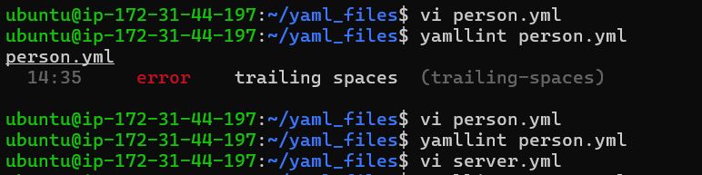
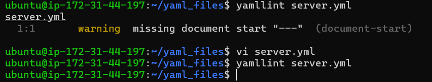

# Day 38 – YAML Basics

## 📌 Overview

Today’s focus was understanding YAML — the language used in almost every CI/CD pipeline.

I practiced writing YAML files, understanding syntax, validating them, and debugging common mistakes.

---

# 🧠 What is YAML?

YAML stands for **"YAML Ain’t Markup Language"**.

It is a human-readable data format used for:

* CI/CD pipelines (GitHub Actions, GitLab CI)
* Configuration files (Docker Compose, Kubernetes)
* Data storage

---

# ⚙️ YAML Rules

* Uses **spaces only (NO tabs)**
* Indentation defines structure (usually **2 spaces**)
* Key-value format: `key: value`
* Lists use `-`
* Booleans: `true` / `false` (without quotes)

---

# ✅ Task 1: Key-Value Pairs

### File: `person.yaml`

```yaml
name: Karina
role: DevOps Engineer
experience_years: 1
learning: true
```

✔ Verified using:

```bash
cat person.yaml
```

---

# ✅ Task 2: Lists

### Updated `person.yaml`

```yaml
name: Karina
role: DevOps Engineer
experience_years: 1
learning: true

tools:
  - docker
  - kubernetes
  - terraform
  - aws
  - github-actions

hobbies: [coding, reading, gaming]
```

### 📌 Two ways to write lists in YAML:

1. **Block format**

```yaml
tools:
  - docker
  - kubernetes
```

2. **Inline format**

```yaml
hobbies: [coding, reading, gaming]
```

---

# ✅ Task 3: Nested Objects

### File: `server.yaml`

```yaml
server:
  name: web-server
  ip: 192.168.1.10
  port: 8080

database:
  host: localhost
  name: mydb
  credentials:
    user: admin
    password: secret
```

### ❌ What happens if you use tabs?

* YAML will fail validation
* Error like:

```
found character '\t' that cannot start any token
```

---

# ✅ Task 4: Multi-line Strings

### Updated `server.yaml`

```yaml
startup_script_pipe: |
  echo "Starting server"
  npm install
  npm start

startup_script_fold: >
  echo "Starting server"
  npm install
  npm start
```

### 📌 Difference:

* `|` → preserves line breaks (multi-line script)
* `>` → converts into single line (folded text)

### When to use:

* `|` → scripts, logs, commands
* `>` → long text descriptions

---

# ✅ Task 5: Validate YAML

### Install yamllint

```bash
sudo apt install yamllint
```

### Validate files

```bash
yamllint person.yaml
yamllint server.yaml
```



### ❌ Example error (bad indentation):

```
error: wrong indentation: expected 2 but found 1
```

✔ Fix: Correct spacing → validate again

---

# ✅ Task 6: Spot the Difference

### Correct YAML

```yaml
name: devops
tools:
  - docker
  - kubernetes
```

### ❌ Broken YAML

```yaml
name: devops
tools:
- docker
  - kubernetes
```

### 🔍 What's wrong?

* `- docker` is not properly indented under `tools`
* YAML expects consistent indentation

✔ Fix:

```yaml
tools:
  - docker
  - kubernetes
```

---

# 🚀 How to Run / Use YAML

YAML itself is not executable. It is used by tools like:

### Docker Compose

```bash
docker compose up
```

### Kubernetes

```bash
kubectl apply -f file.yaml
```

### GitHub Actions

* YAML defines workflows inside `.github/workflows/`

---

# 📚 Key Learnings (3 Points)

1. **Indentation is everything** — even 1 space error breaks YAML
2. **Never use tabs** — always use spaces
3. YAML is simple but strict — small mistakes cause big failures

---

# 💡 My YAML Aha Moment

The biggest learning was realizing how **tabs vs spaces can completely break YAML**.
Even though everything looks correct, YAML fails silently unless validated.

---


