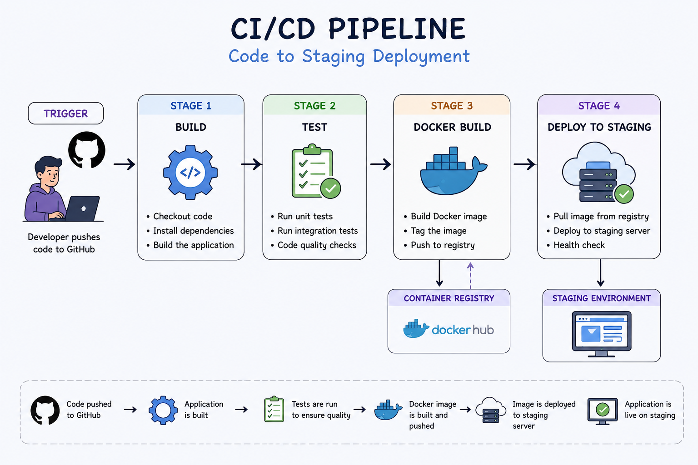

# Day 39 – CI/CD Concepts

## 📌 Overview

Today was focused on understanding **CI/CD fundamentals** — why it exists, how it works, and how modern teams use it to ship software faster and safer.

---

# 🚨 Task 1: The Problem

## 1. What can go wrong?

* Code conflicts between developers
* Bugs reaching production
* Manual deployment mistakes
* Different environments causing failures
* No proper testing before release

---

## 2. What does "It works on my machine" mean?

This means the code runs correctly on a developer’s local system but fails in another environment (like staging or production).

### Why it’s a problem:

* Different OS, dependencies, or configurations
* Leads to unpredictable bugs
* Slows down debugging and releases

---

## 3. How many times can a team safely deploy manually?

* Usually **1–2 times per day (max)**
* Manual deployments are slow and error-prone
* Not scalable for growing teams

---

# 🔄 Task 2: CI vs CD

## 1. Continuous Integration (CI)

CI is the practice of automatically building and testing code whenever changes are pushed to a repository.

* Happens frequently (every commit/push)
* Detects bugs early
* Ensures code integrates properly

### Example:

A developer pushes code → tests run automatically → build fails if tests fail

---

## 2. Continuous Delivery (CD)

CD ensures that code is always in a **deployable state**, but deployment is manual.

* Builds on CI
* Prepares code for release
* Requires approval before production

### Example:

Code passes tests → ready for deployment → developer clicks "deploy"

---

## 3. Continuous Deployment (CD)

Continuous Deployment automatically deploys every change that passes tests to production.

* Fully automated
* No manual intervention
* Used by high-maturity teams

### Example:

Push code → tests pass → automatically deployed to production

---

# 🧩 Task 3: Pipeline Anatomy

## 🔹 Trigger

Event that starts the pipeline
👉 Example: `git push`, pull request

---

## 🔹 Stage

A logical phase in the pipeline
👉 Example: build, test, deploy

---

## 🔹 Job

A set of tasks executed in a stage
👉 Example: run unit tests

---

## 🔹 Step

A single command inside a job
👉 Example: `npm install`

---

## 🔹 Runner

Machine that executes jobs
👉 Example: GitHub-hosted runner or self-hosted runner

---

## 🔹 Artifact

Output generated by a job
👉 Example: compiled app, Docker image

---

# 📊 Task 4: Pipeline Diagram

## Scenario:

Developer pushes code → app is tested → Docker image built → deployed to staging

---

## Task 5: Explore in the Wild
1. Open any popular open-source repo on GitHub (Kubernetes, React, FastAPI — pick one you know)
2. Find their `.github/workflows/` folder
3. Open one workflow YAML file
4. Write in your notes:

   [Kubernetes minikube workflow of built.yml](https://github.com/kubernetes/minikube/blob/master/.github/workflows/build.yml)

   - What triggers it?
      - Manual action.
      - Push on branch master, pushed only on specified files.
   - How many jobs does it have?
      - It has 3 jobs.
   - What does it do? (best guess)
      - First job build_minikube: It uses ubuntu 22.04 runner, checkouts the code,
        set-up environemnt.
           - download dependncies, builds binaries and uploads artifact.
      - Second job lint: 
           - checks code for style, formatting, and common errors before it runs.
      - Third job unit_test:
           - Does unit test(verifies the smallest pieces of code behaves as expected)
---

# 💡 Key Learnings

1. CI/CD is a **practice, not just a tool**
2. Automation reduces human error and speeds up delivery
3. A failing pipeline is helpful — it prevents bad code from reaching production

---

# 🚀 My CI/CD Aha Moment

The biggest realization was that **CI/CD is not about tools like Jenkins or GitHub Actions — it's about automating trust in your code**.

---

