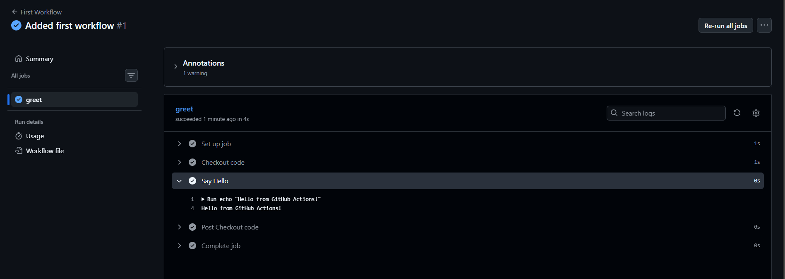
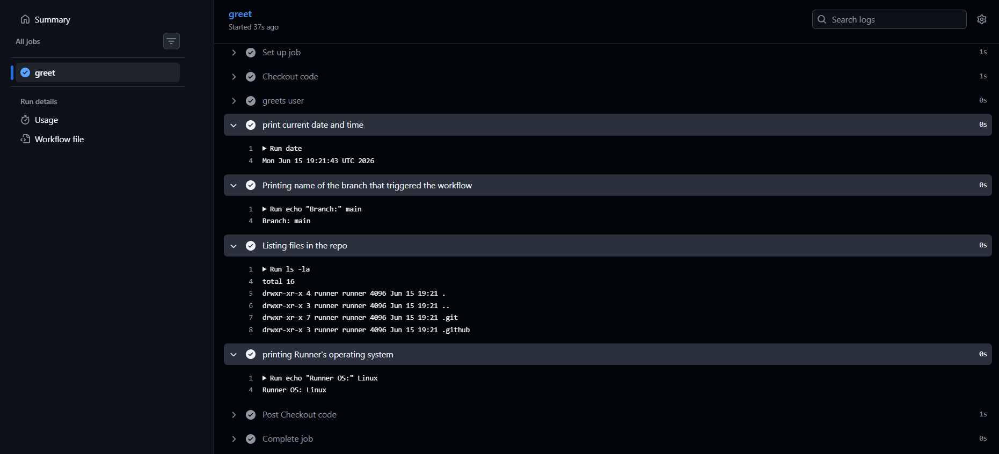
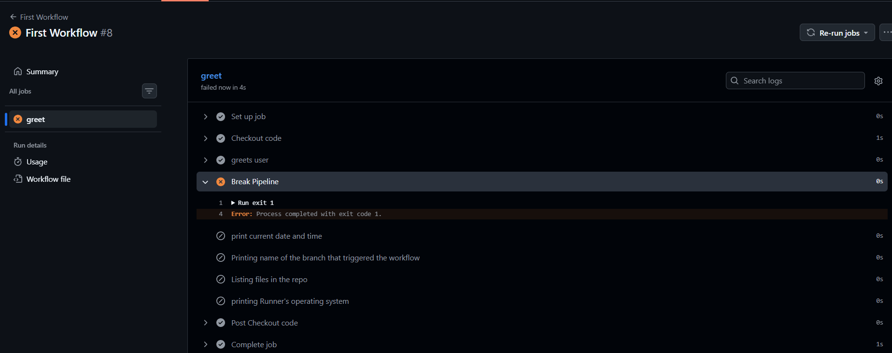
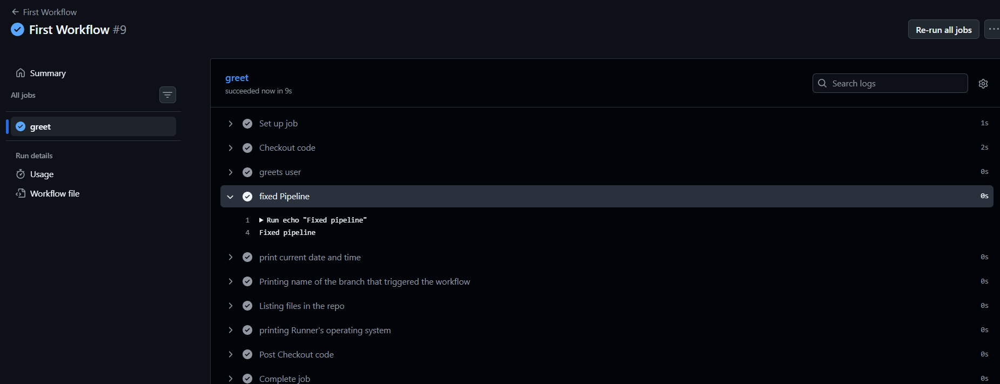

# Day 40 – Your First GitHub Actions Workflow

## 📌 Overview

Today I created my **first GitHub Actions workflow**, turning CI/CD from theory into practice.

This was my first time seeing a pipeline run automatically in the cloud — and that green checkmark felt different 🚀

---

# ⚙️ Task 1: Setup

## 🛠 Steps Performed

1. Created a new public repository:

   ```
   github-actions-practice
   ```

2. Cloned it locally:

   ```bash
   git clone https://github.com/<your-username>/github-actions-practice.git
   cd github-actions-practice
   ```

3. Created required folder structure:

   ```bash
   mkdir -p .github/workflows
   ```

---

# 🚀 Task 2: Hello Workflow

## 📄 File: `.github/workflows/hello.yml`

```yaml
name: First Workflow

on:
  push:

jobs:
  greet:
    runs-on: ubuntu-latest

    steps:
      - name: Checkout code
        uses: actions/checkout@v4

      - name: Say Hello
        run: echo "Hello from GitHub Actions!"
```

---
## Explaination of yaml file
* on: push - Every git push = trigger pipeline
* jobs: greet - A job = one unit of execution
* runs on: ubuntu latest -  GitHub gives you: A fresh Linux VM, Pre-installed tools
* steps: -Steps = instructions executed in order
* uses: actions/checkout@v4 - Without this: Your repo code is NOT available. This step:
✔ Clones your repo inside the runner
* - run: echo "Hello from GitHub Actions!" : Runs a shell command inside VM
---

## ✅ What Happened

* Pushed code to GitHub
* Workflow automatically triggered
* Pipeline ran on GitHub servers
* All steps executed successfully

✔ Result: **Green pipeline ✅**

---

# 🧠 Task 3: Workflow Anatomy

## 🔍 Key Components Explained

### 🔹 `on:`

Defines **when the workflow runs**
👉 Example: `push` → runs on every commit

---

### 🔹 `jobs:`

Defines all jobs in the workflow
👉 Each job runs independently

---

### 🔹 `runs-on:`

Specifies the environment
👉 Example: `ubuntu-latest`

---

### 🔹 `steps:`

Sequence of tasks inside a job

---

### 🔹 `uses:`

Used to call pre-built actions
👉 Example: checkout repo

---

### 🔹 `run:`

Executes shell commands

---

### 🔹 `name:` (step level)

Gives a readable label to steps

---

# 🔄 Task 4: Enhanced Workflow

## 📄 Updated `hello.yml`

```yaml
name: First Workflow

on:
  workflow_dispatch: 


jobs:
  greet:
    runs-on: ubuntu-latest
    steps:
      - name: Checkout code
        uses: actions/checkout@v4 

      - name: greets user
        run: echo "Hello from GitHub Actions!" 

      - name: print current date and time
        run : date
   
      - name: Printing name of the branch that triggered the workflow
        run: echo "Branch:" ${{ github.ref_name }}

      - name: Listing files in the repo
        run: ls -la
         
      - name: printing Runner's operating system
        run: echo "Runner OS:" ${{ runner.os }}
```

---

## ✅ New Learnings

* GitHub provides variables like `${{ github.ref_name }}`
* You can run any Linux command inside workflow
* Each push triggers a new pipeline run


---

# 💥 Task 5: Break It On Purpose

## ❌ Broken Step Added

```yaml
- name: Break Pipeline
  run: exit 1
```

---

## 🔴 What Happened

* Pipeline turned **red ❌**
* Execution stopped at the failing step
* Error logs clearly showed failure

---

## 🧠 What a Failed Pipeline Looks Like

* Red ❌ status
* Failed step highlighted
* Logs show exact error


---

## 🔍 How to Debug

1. Go to **Actions tab**
2. Click the failed workflow
3. Open the failed step
4. Read logs carefully

---

## ✅ Fix

* Removed failing command
* Pushed again
* Pipeline turned **green ✅**

---

# 📸 Screenshot


---

# 💡 Key Learnings

1. CI/CD pipelines run automatically on code push
2. Even simple workflows can automate tasks
3. Debugging pipelines is about reading logs carefully

---

# 🚀 My Aha Moment

The biggest realization was:

👉 *"My code is now running on GitHub’s servers automatically — without me doing anything manually."*

That’s the power of CI/CD.

---


