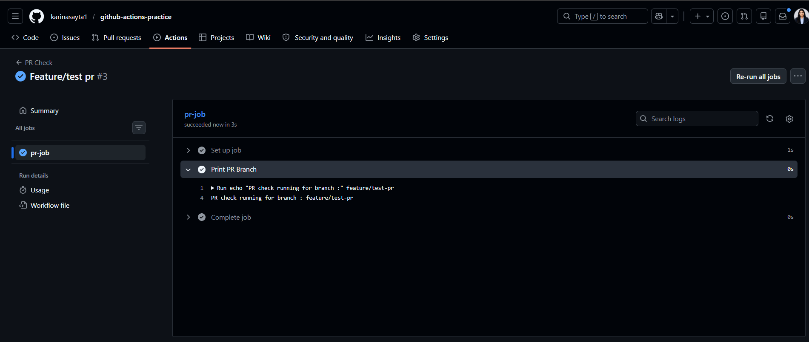
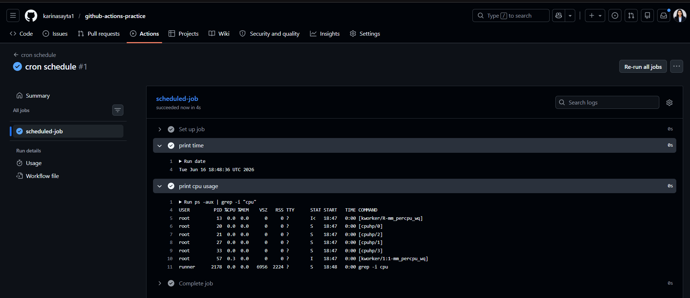
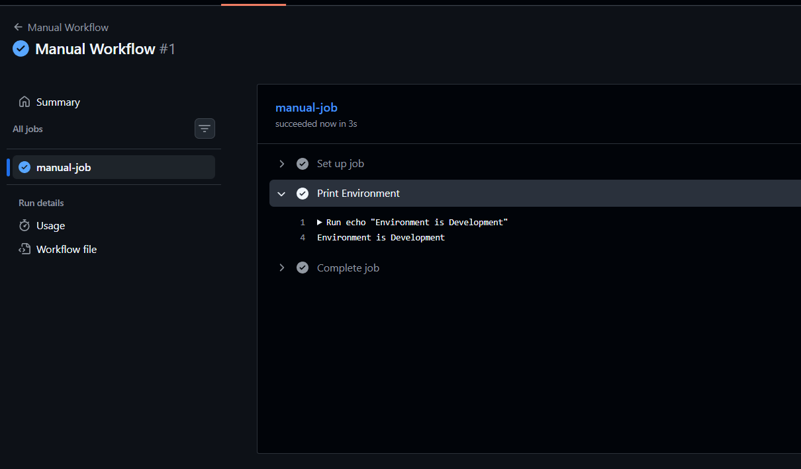
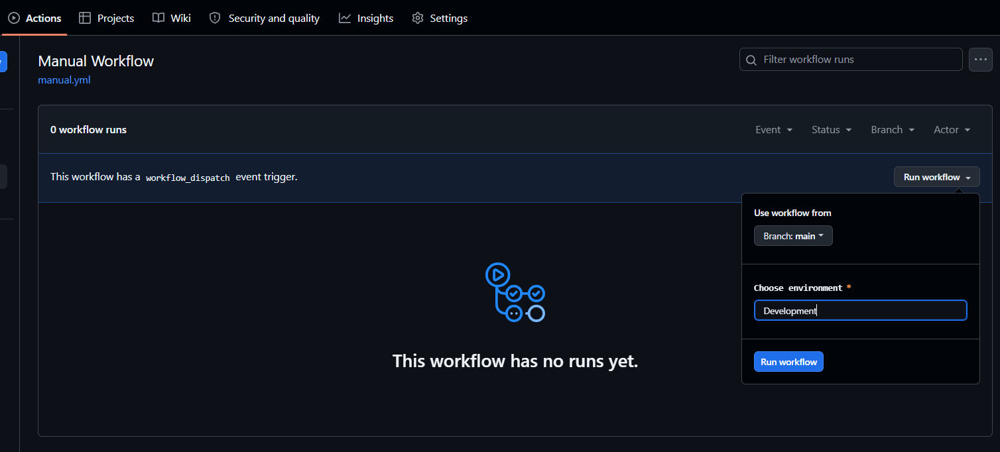
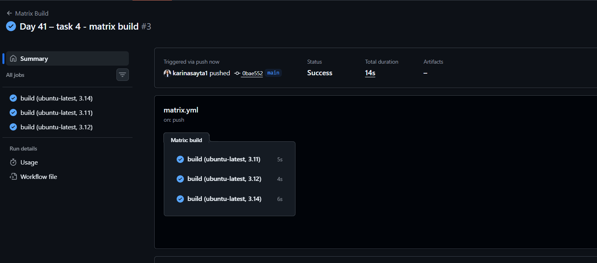
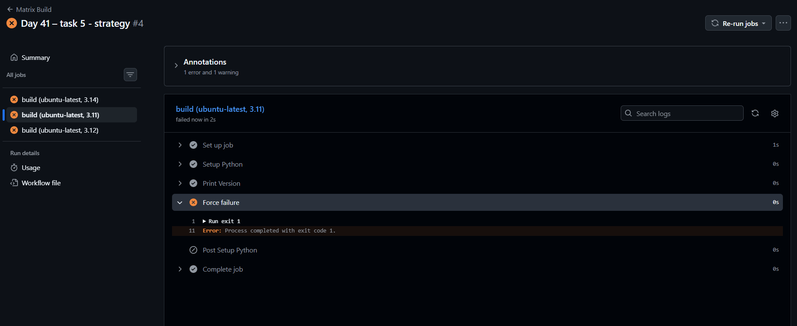

# Day 41 – Triggers & Matrix Builds

## 🚀 Overview

Today you will learn:

* Different ways to trigger GitHub Actions workflows
* How to run jobs across multiple environments using matrix builds
* How to control execution using exclude and fail-fast

---

# Important Concepts

## 1. GitHub Actions Basics

* Workflows are YAML files inside `.github/workflows/`
* Each workflow has:

  * `on:` → trigger
  * `jobs:` → tasks to run
  * `steps:` → commands inside jobs

## 2. Events (Triggers)

Common triggers:

* `push` → when code is pushed
* `pull_request` → when PR is created/updated
* `schedule` → cron-based automation
* `workflow_dispatch` → manual trigger

## 3. Matrix Strategy

* Runs the same job with different configurations
* Helps test across:

  * multiple OS
  * multiple language versions

---

# ✅ Task 1: Trigger on Pull Request

## 📌 What You Should Know

* PR workflows run when PR is opened, synchronized, or reopened
* `github.head_ref` gives branch name

## 🛠 Steps

1. Create file:

```
.github/workflows/pr-check.yml
```

2. Add this YAML:

```yaml
name: PR Check

on:
  pull_request:
    branches: [main]

jobs:
  pr-job:
    runs-on: ubuntu-latest

    steps:
      - name: Print PR Branch
        run: echo "PR check running for branch: ${{ github.head_ref }}"
```

## ▶️ Run It

1. Create a new branch:

```bash
git checkout -b feature/test-pr
```

2. Make a commit & push:

```bash
git push origin feature/test-pr
```

3. Open a Pull Request → target `main`

## ✅ Verify

* Go to PR page
* Check "Checks" tab
* You should see workflow running


---

# ✅ Task 2: Scheduled Trigger

## 📌 What You Should Know

* Uses cron syntax: `minute hour day month weekday`
* Runs in **UTC timezone**

## 🛠 Add to any workflow - cron.yaml:

```yaml
name: cron schedule
on:
  workflow_dispatch: 
    schedule:
        - cron: '0 0 * * *' # Runs every day at midnight
jobs:
    scheduled-job:
        runs-on: ubuntu-latest
        steps:
            - name: print time
              run: date
            - name: print cpu usage
              run : ps -aux | grep -i "cpu"
```

### ⏰ Meaning:

* Runs every day at **00:00 UTC**

## ❓ Answer:

**Every Monday at 9 AM UTC:**

```
0 9 * * 1
```



---

# ✅ Task 3: Manual Trigger

## 📌 What You Should Know

* Trigger manually from GitHub UI
* Supports inputs

## 🛠 Create file:

```
.github/workflows/manual.yml
```

## YAML:

```yaml
name: Manual Workflow

on:
  workflow_dispatch:
    inputs:
      environment:
        description: "Choose environment"
        required: true
        default: "staging"

jobs:
  manual-job:
    runs-on: ubuntu-latest

    steps:
      - name: Print Environment
        run: echo "Environment is ${{ github.event.inputs.environment }}"
```

## ▶️ Run It

1. Go to **Actions tab**
2. Select workflow
3. Click **Run workflow**
4. Enter input (staging/production)

## ✅ Verify

* Check logs → should print selected environment



---

# ✅ Task 4: Matrix Builds

## 📌 What You Should Know

* Matrix runs jobs in parallel
* Each combination = separate job

## 🛠 Create file:

```
.github/workflows/matrix.yml
```

## YAML:

```yaml
name: Matrix Build

on:
  push:

jobs:
  build:
    runs-on: ${{ matrix.os }}

    strategy:
      matrix:
        os: [ubuntu-latest]
        python-version: [3.14, 3.11, 3.12]

    steps:
      - name: Setup Python
        uses: actions/setup-python@v5
        with:
          python-version: ${{ matrix.python-version }}

      - name: Print Python Version
        run: python --version
```

## ▶️ Result

* 3 jobs run in parallel

---

## 🔁 Extend Matrix

```yaml
matrix:
  os: [ubuntu-latest, windows-latest]
  python-version: [3.10, 3.11, 3.12]
```

## ✅ Answer:

Total jobs = **2 × 3 = 6 jobs**

---

# ✅ Task 5: Exclude & Fail-Fast

## 📌 What You Should Know

* `exclude` removes specific combinations
* `fail-fast` controls cancellation behavior

## 🛠 Update matrix:

```yaml
strategy:
  fail-fast: false
  matrix:
    os: [ubuntu-latest, windows-latest]
    python-version: [3.10, 3.11, 3.12]

    exclude:
      - os: windows-latest
        python-version: "3.10"
```

## ❌ Trigger Failure (Optional)

Add step:

```yaml
- name: Force failure
  run: exit 1
```

---

## ✅ Behavior

### 🔹 fail-fast: true (default)

* If one job fails → all others stop

### 🔹 fail-fast: false

* All jobs continue even if one fails

---

# 🎯 Key Takeaways

* PR workflows validate code before merge
* Cron enables automation
* Manual triggers give flexibility
* Matrix builds scale testing
* Fail-fast controls pipeline behavior

---

🔥 You're now writing production-level pipelines.
