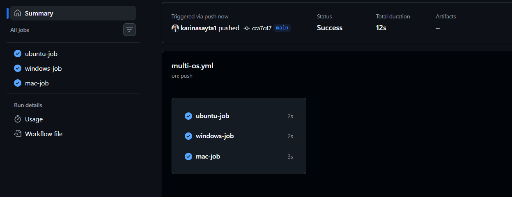
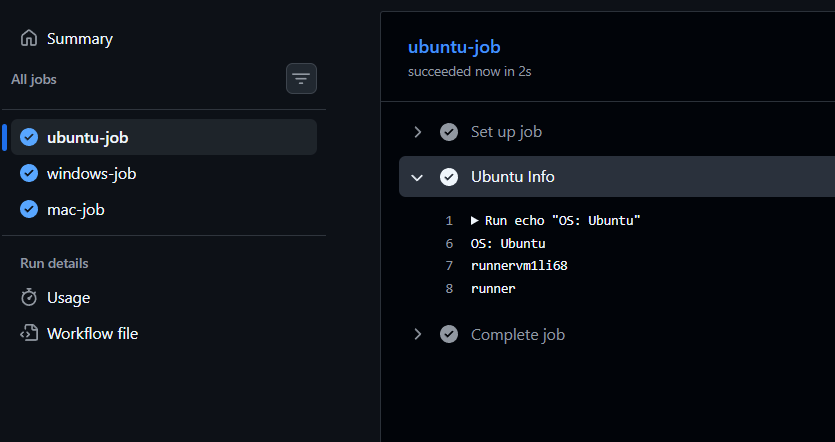
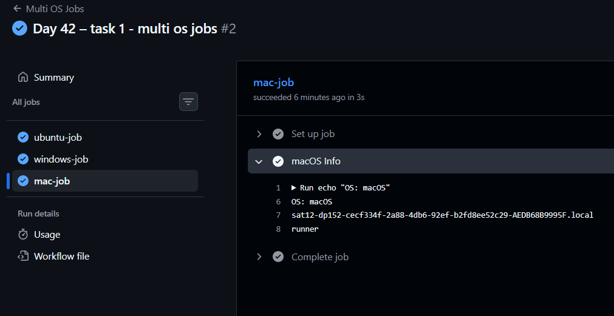
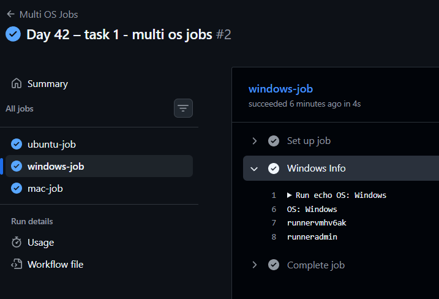
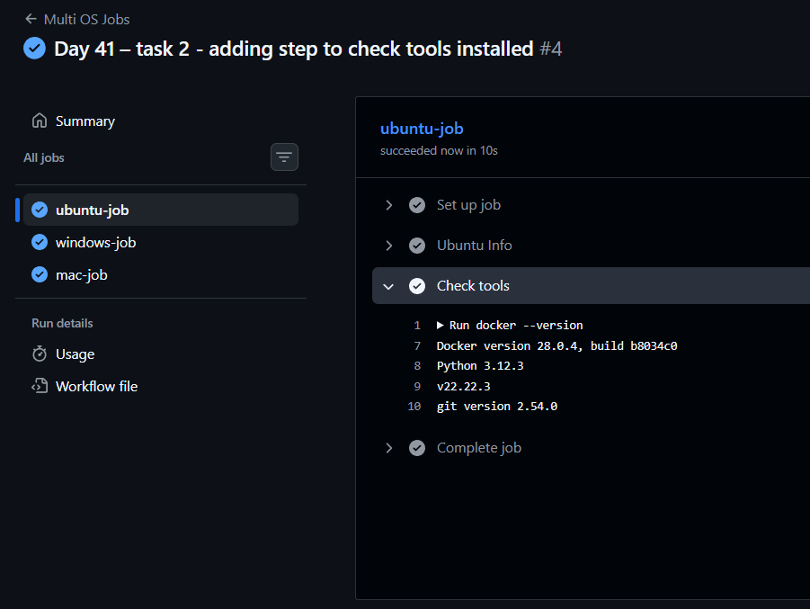
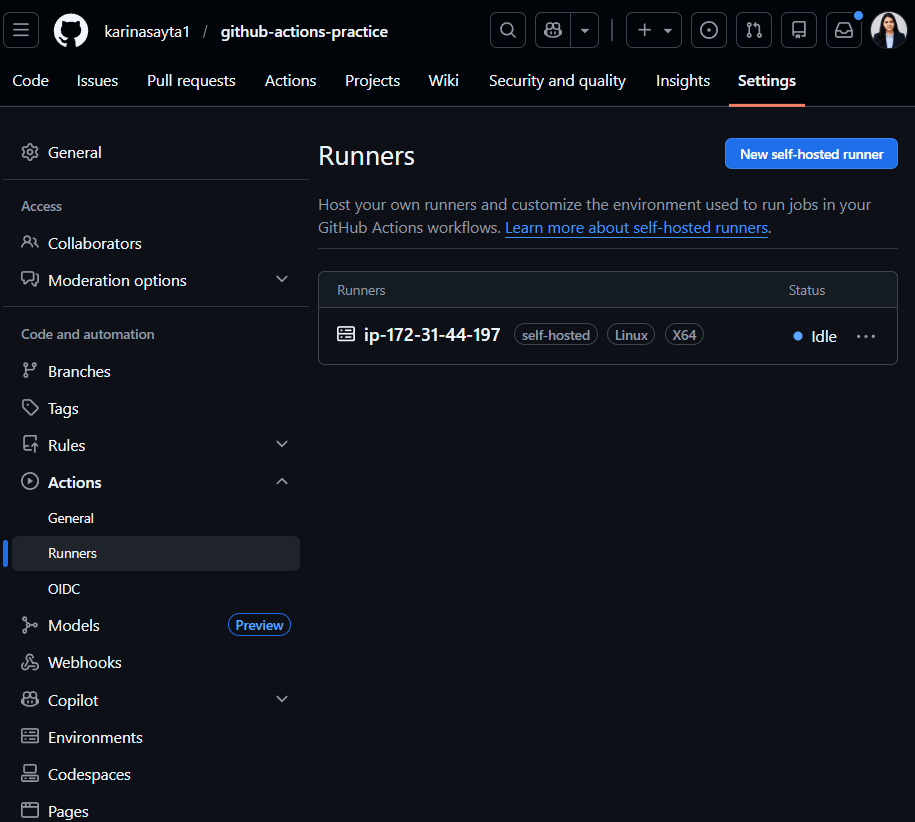
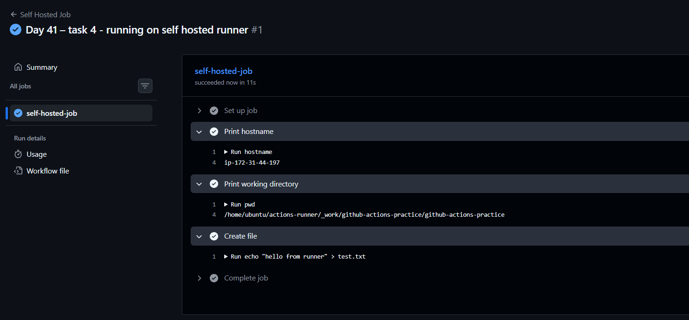
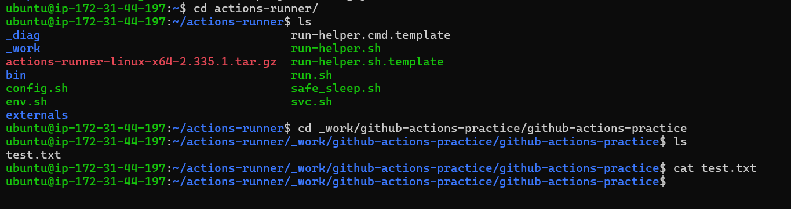
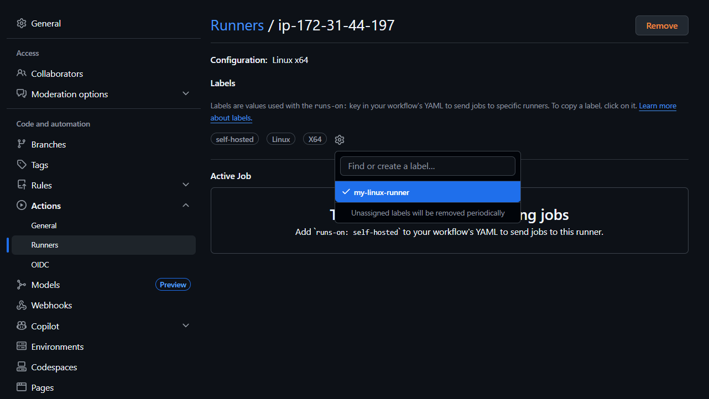
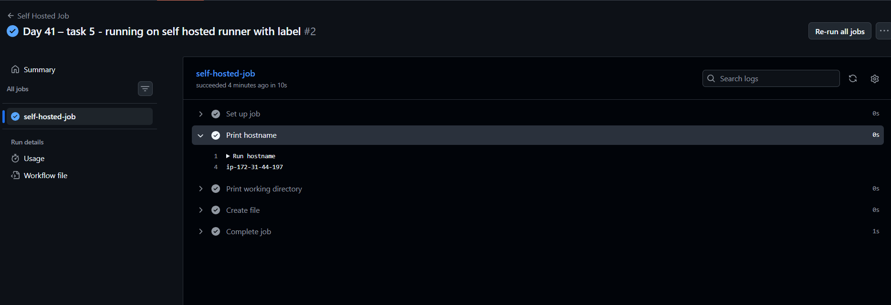

# Day 42 – Runners: GitHub-Hosted & Self-Hosted

---

# 🚀 Overview

Today you learned:

* What runners are in GitHub Actions
* Difference between GitHub-hosted and self-hosted runners
* How to set up your own runner
* How to run workflows on your own machine

---

# 🧠 What is a Runner?

A **runner** is a machine that executes your GitHub Actions jobs.

---

# ✅ Task 1: GitHub-Hosted Runners

## 📌 What You Should Know

* GitHub provides ready-to-use machines
* Each job runs in a fresh environment
* Fully managed by GitHub

---

## 🛠 Workflow

```yaml
name: Multi OS Jobs

on: push

jobs:
  ubuntu-job:
    runs-on: ubuntu-latest
    steps:
      - run: |
          echo "OS: Ubuntu"
          hostname
          whoami

  windows-job:
    runs-on: windows-latest
    steps:
      - run: |
          echo OS: Windows
          hostname
          whoami

  mac-job:
    runs-on: macos-latest
    steps:
      - run: |
          echo "OS: macOS"
          hostname
          whoami
```

---

## ✅ Observation

* All 3 jobs run in parallel




---

## 📝 Answer

**What is a GitHub-hosted runner?**
A machine provided and managed by GitHub to run workflows.

**Who manages it?**
GitHub manages everything (OS, updates, security).

---

# ✅ Task 2: Pre-installed Tools

## 🛠 Add Step (Ubuntu Job)

```yaml
- name: Check tools
  run: |
    docker --version
    python --version
    node --version
    git --version
```

---

## 📝 Answer

**Why pre-installed tools matter?**

* Saves setup time
* Faster pipelines
* No need to manually install dependencies

---

# ✅ Task 3: Set Up Self-Hosted Runner

## 📌 Options

* Local machine ✅ (easiest)
* Cloud VM (EC2 / VPS)

---

## 🛠 Steps

1. Go to:

   * Repo → Settings → Actions → Runners

2. Click:
   👉 **New self-hosted runner**

3. Choose: Any OS linux or windows
Example:

   * OS: Linux

4. Run commands (example):

```bash
mkdir actions-runner && cd actions-runner
curl -o actions-runner.tar.gz -L https://github.com/actions/runner/releases/latest/download/actions-runner-linux-x64.tar.gz
tar xzf ./actions-runner.tar.gz

./config.sh --url https://github.com/karinasayta1/github-actions-practice --token YOUR_TOKEN
```

5. Start runner:

```bash
./run.sh
```

---

## ✅ Verify

* Go to GitHub → Runners section
* You should see:
  🟢 **Idle (green dot)**

---

# ✅ Task 4: Use Self-Hosted Runner

## 🛠 Create Workflow

```yaml
name: Self Hosted Job

on: push

jobs:
  self-hosted-job:
    runs-on: self-hosted

    steps:
      - name: Print hostname
        run: hostname

      - name: Print working directory
        run: pwd

      - name: Create file
        run: echo "hello from runner" > test.txt
```

---

## ✅ Verify

* Workflow runs on your machine
* Check your system:

```bash
ls
```

👉 You should see `test.txt`

---

# ✅ Task 5: Labels

## 🛠 Add Label

* Go to Runner settings
* Add label: `my-linux-runner`

---

## Update Workflow

```yaml
runs-on: [self-hosted, my-linux-runner]
```

---

## 📝 Answer

**Why labels are useful?**

* Target specific machines
* Useful when multiple runners exist
* Helps control workload distribution

---

# ✅ Task 6: Comparison

| Feature             | GitHub-Hosted  | Self-Hosted            |
| ------------------- | -------------- | ---------------------- |
| Who manages it?     | GitHub         | You                    |
| Cost                | Free (limited) | Your infra cost        |
| Pre-installed tools | Yes            | You manage             |
| Good for            | Quick CI/CD    | Custom setups          |
| Security concern    | Less control   | Full control but risky |

---

# 🎯 Key Takeaways

* Runners = execution machines
* GitHub-hosted = easy, managed
* Self-hosted = powerful, customizable
* Labels help scale runners

---

🔥 You are now moving toward real DevOps infrastructure control.
