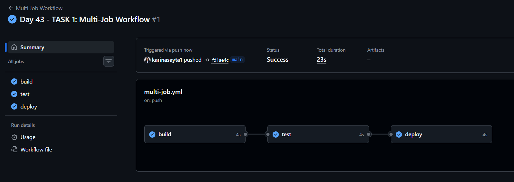
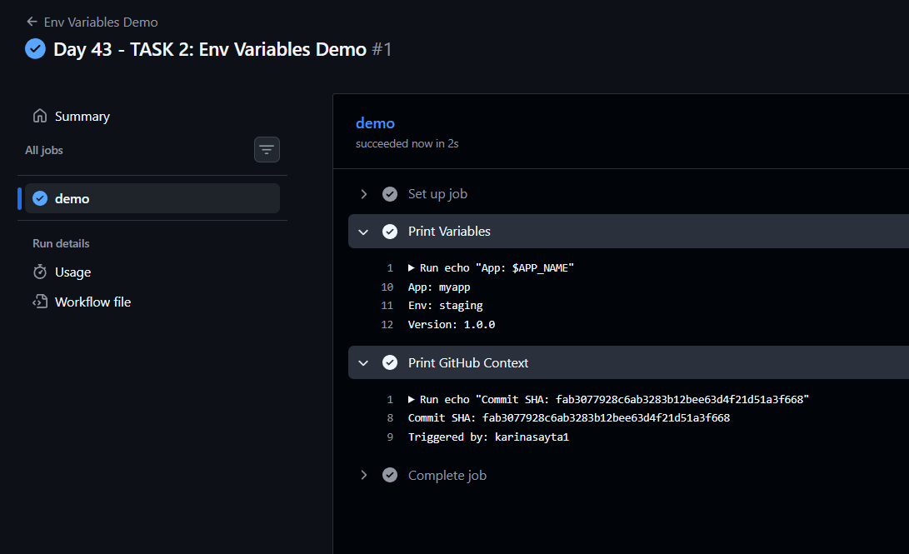
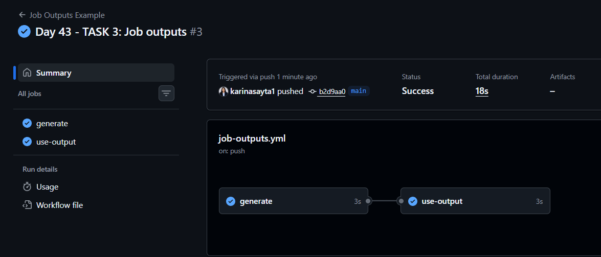
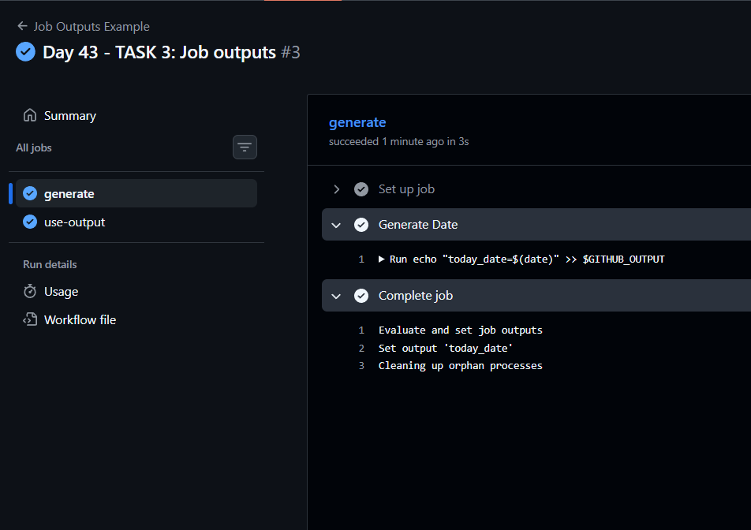
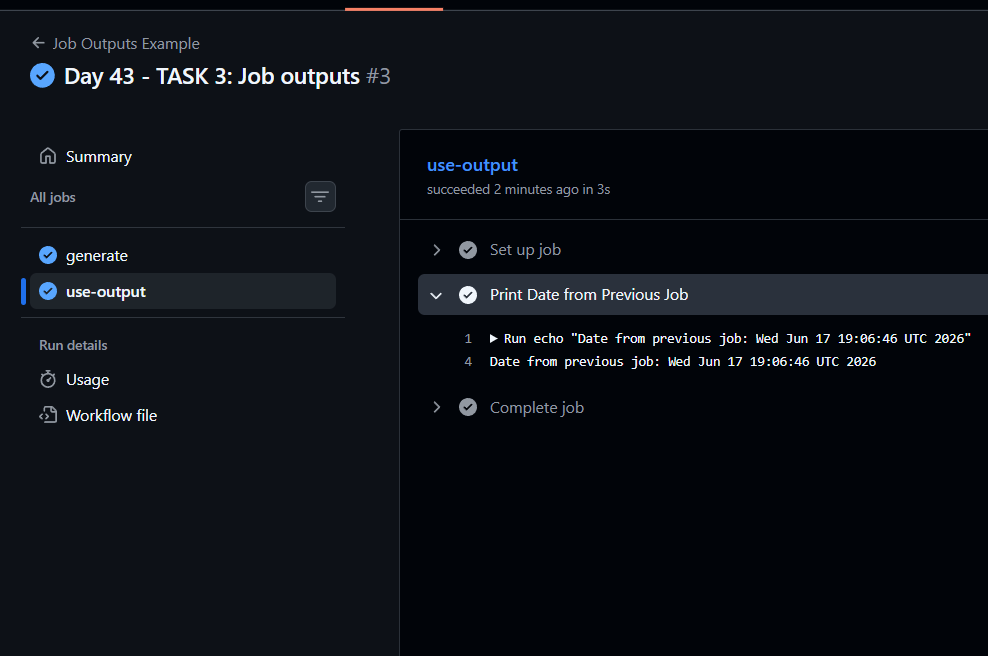
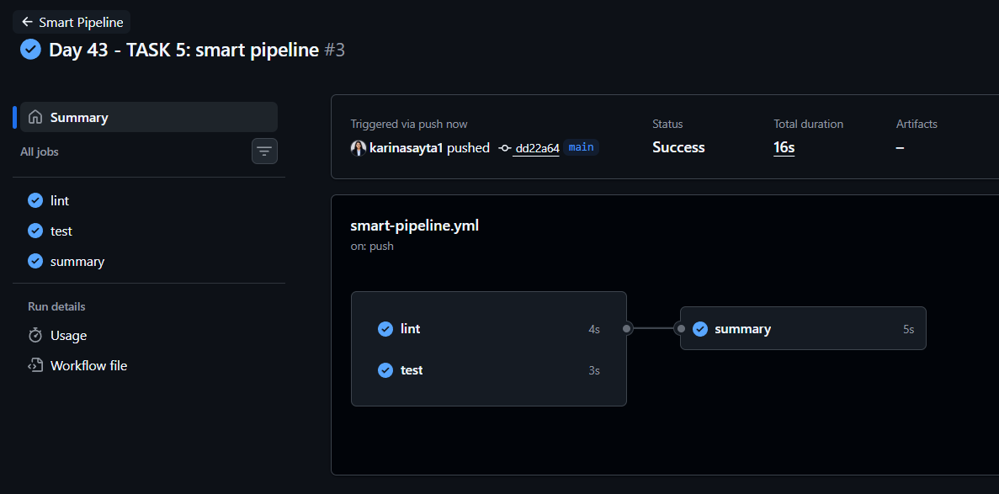
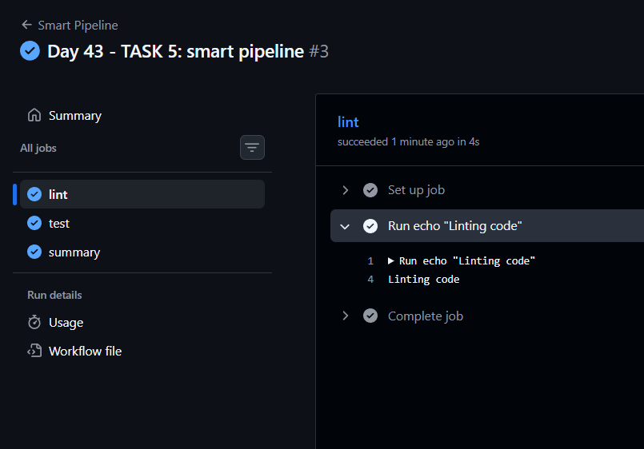
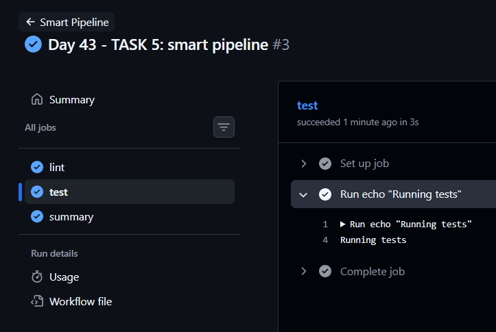
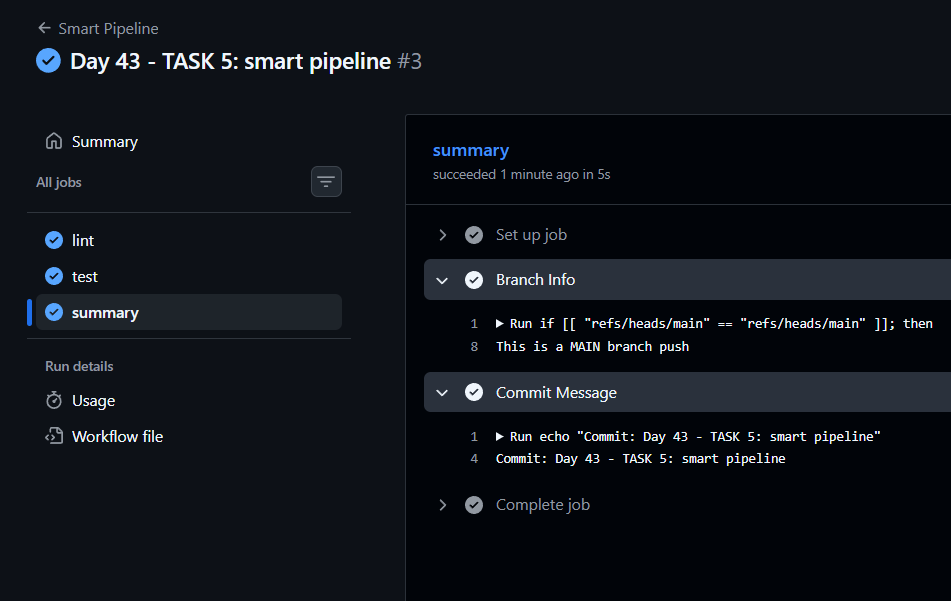

# Day 43 – Jobs, Steps, Env Vars & Conditionals

## 🚀 Overview

Today’s goal is to **control workflow execution** in GitHub Actions using:

* Multi-job pipelines
* Job dependencies (`needs`)
* Environment variables (3 levels)
* Passing data between jobs (`outputs`)
* Conditional execution (`if`, failure handling)

---

# 🧠 BEFORE YOU START (Important Concepts)

## 1. What is a Job?

A **job** is a collection of steps that runs on a runner (VM).

## 2. What is a Step?

A **step** is a single task:

* Running a command
* Using an action

## 3. Job Execution Behavior

* Jobs run **in parallel by default**
* Use `needs:` to create **dependency chains**

## 4. Environment Variables Priority

| Level    | Scope                 |
| -------- | --------------------- |
| Workflow | Available everywhere  |
| Job      | Only inside that job  |
| Step     | Only inside that step |

## 5. Outputs Between Jobs

Used when:

* One job generates data
* Another job needs it

Example:

* Build version → deploy job uses it

## 6. Conditionals

Used to control execution:

* Branch-specific runs
* Run only on failure
* Skip certain events

---

# ✅ TASK 1: Multi-Job Workflow

## 🎯 Goal

Create job dependency chain:

```
build → test → deploy
```

## 📁 File

`.github/workflows/multi-job.yml`

## 🧾 Code

```yaml
name: Multi Job Workflow

on: push

jobs:
  build:
    runs-on: ubuntu-latest
    steps:
      - name: Build Step
        run: echo "Building the app"

  test:
    runs-on: ubuntu-latest
    needs: build
    steps:
      - name: Test Step
        run: echo "Running tests"

  deploy:
    runs-on: ubuntu-latest
    needs: test
    steps:
      - name: Deploy Step
        run: echo "Deploying"
```

## 🔍 Steps to Verify

1. Push code to GitHub
2. Go to **Actions tab**
3. Open workflow
4. Check **graph view**

✅ Expected:

```
build → test → deploy
```

---

# ✅ TASK 2: Environment Variables

## 🎯 Goal

Use env vars at:

* Workflow level
* Job level
* Step level

## 📁 File

`.github/workflows/env-vars.yml`

## 🧾 Code

```yaml
name: Env Variables Demo

on: push

env:
  APP_NAME: myapp

jobs:
  demo:
    runs-on: ubuntu-latest
    env:
      ENVIRONMENT: staging

    steps:
      - name: Print Variables
        env:
          VERSION: 1.0.0
        run: |
          echo "App: $APP_NAME"
          echo "Env: $ENVIRONMENT"
          echo "Version: $VERSION"

      - name: Print GitHub Context
        run: |
          echo "Commit SHA: ${{ github.sha }}"
          echo "Triggered by: ${{ github.actor }}"
```

## 🔍 What to Check

* All variables print correctly
* GitHub context shows:

  * Commit SHA
  * Username


---

# ✅ TASK 3: Job Outputs

## 🎯 Goal

Pass data between jobs

## 📁 File

`.github/workflows/job-outputs.yml`

## 🧾 Code

```yaml
name: Job Outputs Example

on:
  push:

jobs:
  generate:
    runs-on: ubuntu-latest

    outputs:
      today_date: ${{ steps.set_date.outputs.today_date }}

    steps:
      - name: Generate Date
        id: set_date   
        run: |
          echo "today_date=$(date)" >> $GITHUB_OUTPUT

  use-output:
    runs-on: ubuntu-latest
    needs: generate   

    steps:
      - name: Print Date from Previous Job
        run: |
          echo "Date from previous job: ${{ needs.generate.outputs.today_date }}"
```

## 🔍 Why Outputs Matter (Write This in Your Notes)

* Share data between jobs
* Avoid recomputing values
* Useful in real pipelines:

  * Versioning
  * Build artifacts
  * Deployment metadata




---

# ✅ TASK 4: Conditionals

## 🎯 Goal

Control execution flow

## 📁 File

`.github/workflows/conditionals.yml`

## 🧾 Code

```yaml
name: Conditionals Demo

on:
  push:
  pull_request:

jobs:
  conditional-job:
    runs-on: ubuntu-latest
    if: github.event_name == 'push'

    steps:
      - name: Run only on main branch
        if: github.ref == 'refs/heads/main'
        run: echo "Running on main branch"

      - name: Intentional Failure
        id: fail_step
        run: exit 1
        continue-on-error: true

      - name: Runs if previous step failed
        if: failure()
        run: echo "Previous step failed"
```


## 🔍 Important Concepts

### 🔹 `if: github.ref == 'refs/heads/main'`

Runs only on main branch

### 🔹 `if: failure()`

Runs if previous step fails

### 🔹 `continue-on-error: true`

* Prevents workflow from stopping
* Allows next steps to run

### 🔹 Job-level condition

```yaml
if: github.event_name == 'push'
```

Prevents running on PR

---

# ✅ TASK 5: Smart Pipeline

## 🎯 Goal

Combine everything

## 📁 File

`.github/workflows/smart-pipeline.yml`

## 🧾 Code

```yaml
name: Smart Pipeline

on:
  push:

jobs:
  lint:
    runs-on: ubuntu-latest
    steps:
      - run: echo "Linting code"

  test:
    runs-on: ubuntu-latest
    steps:
      - run: echo "Running tests"

  summary:
    runs-on: ubuntu-latest
    needs: [lint, test]

    steps:
      - name: Branch Info
        run: |
          if [[ "${{ github.ref }}" == "refs/heads/main" ]]; then
            echo "This is a MAIN branch push"
          else
            echo "This is a FEATURE branch push"
          fi

      - name: Commit Message
        run: echo "Commit: ${{ github.event.commits[0].message }}"
```

## 🔍 Expected Behavior

* `lint` and `test` run **in parallel**
* `summary` runs **after both complete**





---

# 📌 FINAL CHECKLIST

## ✅ You have:

* [ ] Multi-job workflow with dependencies
* [ ] Env variables at 3 levels
* [ ] Job outputs working
* [ ] Conditional execution implemented
* [ ] Smart pipeline with parallel + dependent jobs

---

# 🧠 QUICK REVISION

## 🔹 `needs`

Controls job order

## 🔹 `outputs`

Pass data between jobs

## 🔹 `env`

Define variables

## 🔹 `if`

Control execution

---

🔥 You’re now moving from “running pipelines” → “engineering pipelines”
