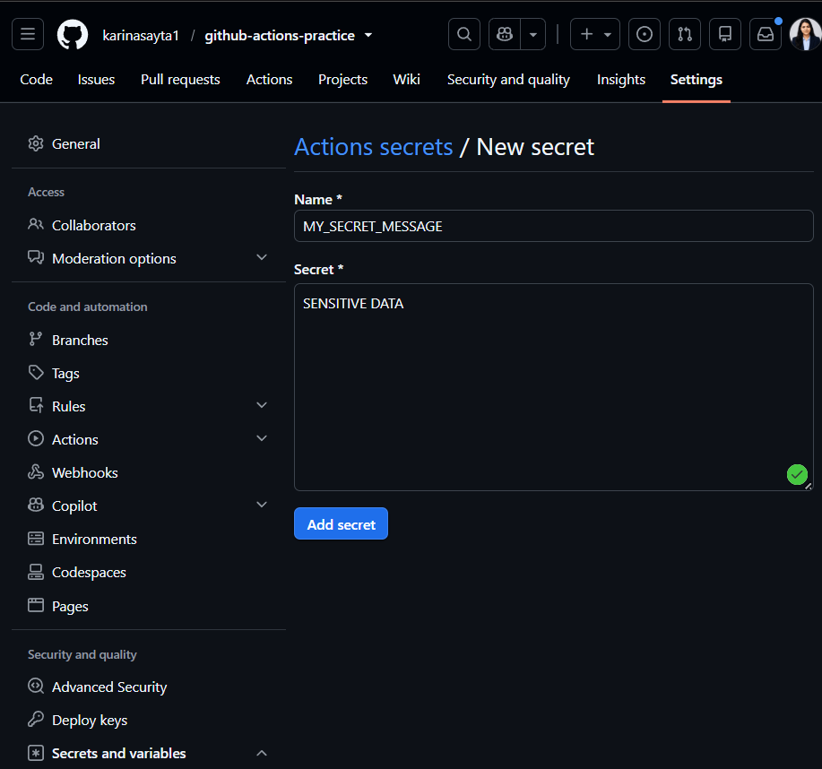
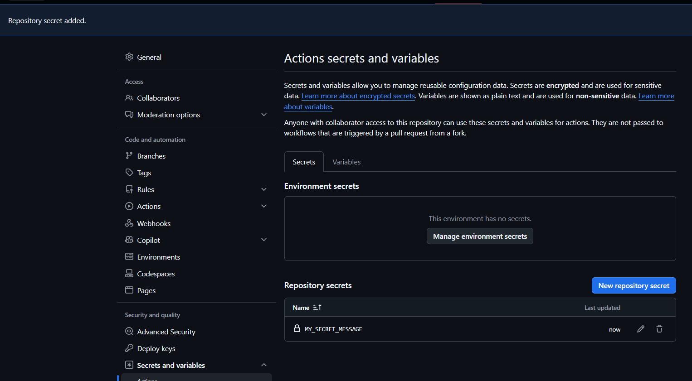
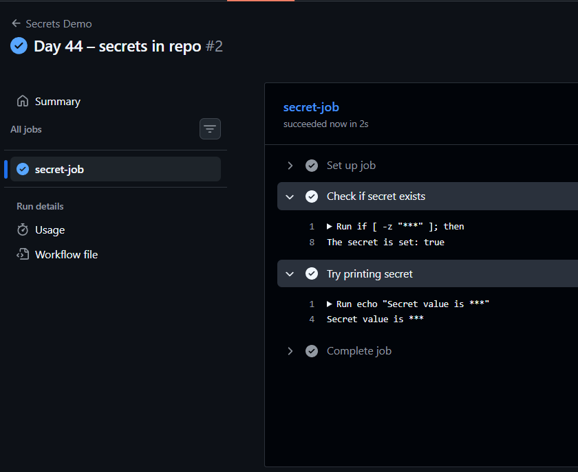
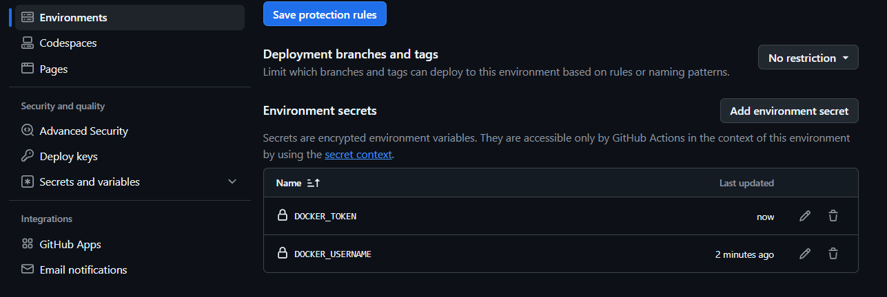
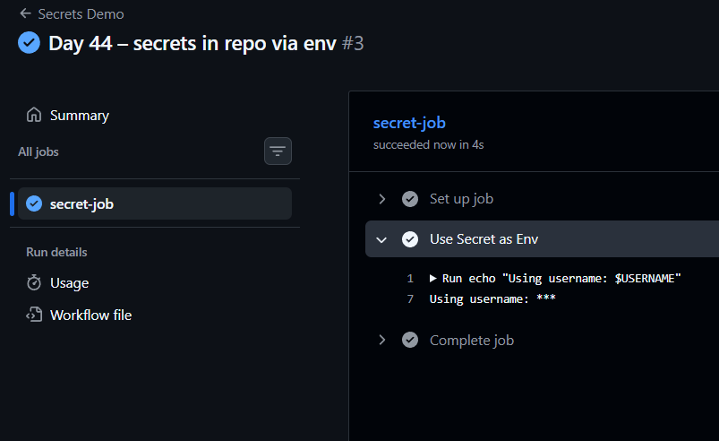
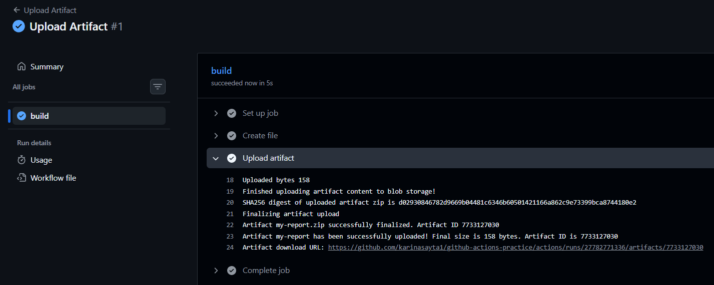
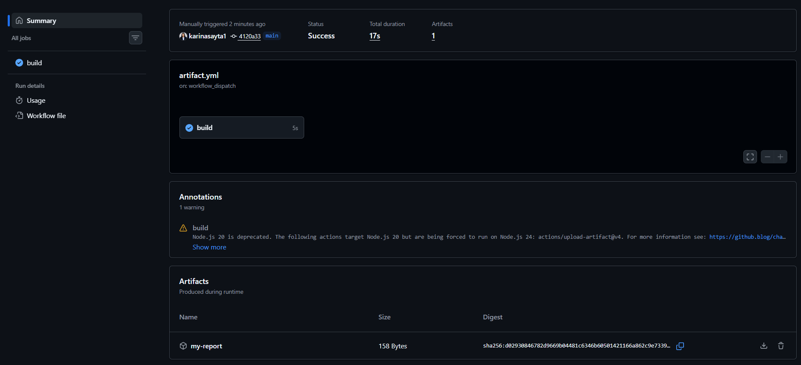
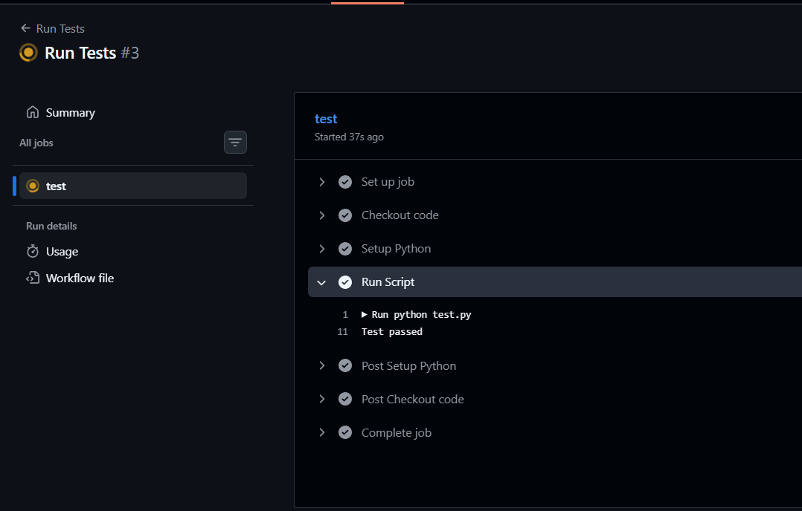
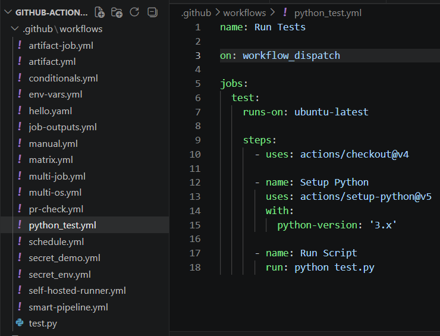
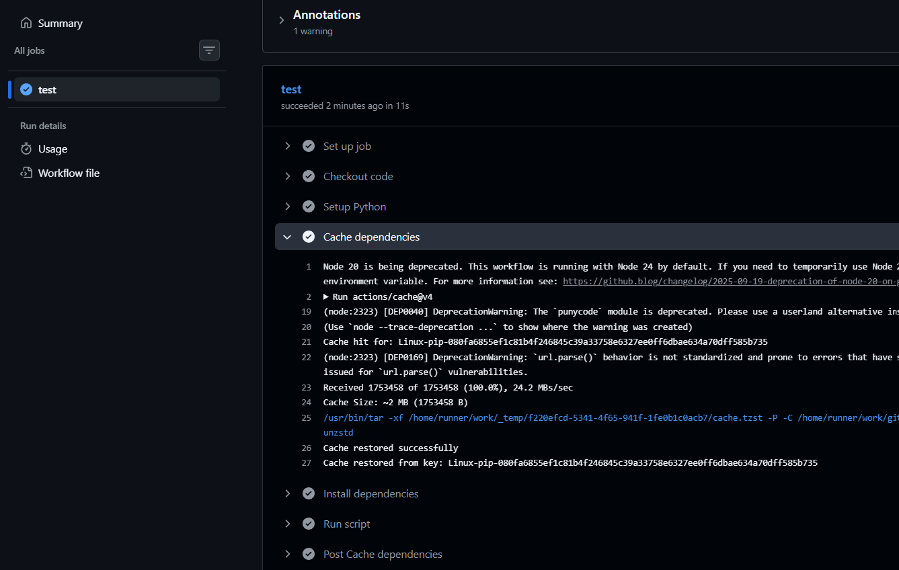

# Day 44 – Secrets, Artifacts & Running Real Tests in CI

## 🚀 Overview

Today focuses on making your CI pipeline production-ready by introducing:

* Secure handling of sensitive data (Secrets)
* Saving and sharing files between jobs (Artifacts)
* Running actual test scripts
* Optimizing pipelines using caching

---

# 🔐 Task 1: GitHub Secrets

## 🧠 What You Must Know Before Starting

* Secrets are **encrypted environment variables**
* Used for:

  * API keys
  * Tokens
  * Passwords
* GitHub **automatically masks secrets in logs**
* NEVER print secrets → logs are public in many cases

---

## ⚙️ Steps to Perform

### Step 1: Create Secret

1. Go to your repo
2. Click **Settings**
3. Navigate:

   ```
   Secrets and Variables → Actions → New Repository Secret
   ```
4. Add:

   * Name: `MY_SECRET_MESSAGE`
   * Value: any string


---

### Step 2: Create Workflow

```yaml
name: Secrets Demo

on: push

jobs:
  secret-job:
    runs-on: ubuntu-latest

    steps:
      - name: Check if secret exists
        run: |
          if [ -z "${{ secrets.MY_SECRET_MESSAGE }}" ]; then
            echo "The secret is set: false"
          else
            echo "The secret is set: true"
          fi

      - name: Try printing secret
        run: echo "Secret value is ${{ secrets.MY_SECRET_MESSAGE }}"
```

---

## 🔍 What You Will Observe

* Output: `The secret is set: true`
* Secret value will appear as:

  ```
  ***
  ```

---

## ❗ Important Note

**Why never print secrets?**

* Logs can be accessed by team members or attackers
* Even masked logs can sometimes be reverse-engineered
* Security best practice: **Never expose secrets in logs**

---

# 🌍 Task 2: Use Secrets as Environment Variables

## 🧠 Concept

* Secrets should be passed via `env`
* Never hardcode credentials

---

## ⚙️ Steps

### Add Secrets:

* `DOCKER_USERNAME`
* `DOCKER_TOKEN`

---

### Workflow Example

```yaml
name: Secrets Demo

on: push

jobs:
  secret-job:
    runs-on: ubuntu-latest
    environment: DOCKER_USERNAME   

    steps:
      - name: Use Secret as Env
        env:
          USERNAME: ${{ secrets.DOCKER_USERNAME }}
          TOKEN: ${{ secrets.DOCKER_TOKEN }}
        run: |
          echo "Using username: $USERNAME"
```


---

## 🔍 Key Learning

* Secrets are injected at runtime
* Safer than hardcoding in code

---

# 📦 Task 3: Upload Artifacts

## 🧠 Concept

Artifacts = files generated during workflow

Examples:

* Logs
* Test reports
* Build outputs

---

## ⚙️ Steps

```yaml
- name: Create file
  run: echo "This is a test report" > report.txt

- name: Upload artifact
  uses: actions/upload-artifact@v4
  with:
    name: my-report
    path: report.txt
```


---

## 🔍 Verify

1. Go to **Actions tab**
2. Open workflow run
3. Scroll → Artifacts
4. Download file


---

# 🔄 Task 4: Share Artifacts Between Jobs

## 🧠 Concept

* Jobs run on **different machines**
* Files are NOT shared automatically
* Artifacts bridge this gap

---

## ⚙️ Steps

```yaml
name: Artifact Sharing

on: push

jobs:
  job1:
    runs-on: ubuntu-latest
    steps:
      - run: echo "Hello from Job1" > file.txt

      - uses: actions/upload-artifact@v4
        with:
          name: shared-file
          path: file.txt

  job2:
    runs-on: ubuntu-latest
    needs: job1

    steps:
      - uses: actions/download-artifact@v4
        with:
          name: shared-file

      - run: cat file.txt
```


---

## 🔍 Real Use Cases

* Passing build output → deploy job
* Sharing test reports
* Debugging failures

---

# 🧪 Task 5: Run Real Tests in CI

## 🧠 Concept

CI = automatically test your code on every push

---

## ⚙️ Steps

### Example Python Script

```python
# test.py
print("Test passed")
```

---

### Workflow

```yaml
name: Run Tests

on: push

jobs:
  test:
    runs-on: ubuntu-latest

    steps:
      - uses: actions/checkout@v4

      - name: Setup Python
        uses: actions/setup-python@v5
        with:
          python-version: '3.x'

      - name: Run Script
        run: python test.py
```

---

## 🔴 Test Failure Demo

Break script:

```python
exit(1)
```

👉 Pipeline will FAIL (red ❌)

---

## 🟢 Fix It

Restore correct script → pipeline turns green ✅

---

## 💡 Key Learning

* Exit code != 0 → pipeline fails
* This is how CI ensures code quality

---

# ⚡ Task 6: Caching

## 🧠 Concept

Caching speeds up workflows by reusing dependencies

---

## ⚙️ Steps

```yaml
name: Python Cache Demo

on: workflow_dispatch

jobs:
  test:
    runs-on: ubuntu-latest

    steps:
      - name: Checkout code
        uses: actions/checkout@v4

      - name: Setup Python
        uses: actions/setup-python@v5
        with:
          python-version: '3.x'

      # cache step
      - name: Cache dependencies
        uses: actions/cache@v4
        with:
          path: ~/.cache/pip
          key: ${{ runner.os }}-pip-${{ hashFiles('**/requirements.txt') }}
          restore-keys: |
            ${{ runner.os }}-pip-

      # Install dependencies
      - name: Install dependencies
        run: pip install -r requirements.txt

      # Run your script
      - name: Run script
        run: python test.py
```


---

## 🔍 What Happens

* First run → installs dependencies
* Second run → uses cache → faster ⚡

---

## 📦 What is Cached?

* Dependency folders (pip, node_modules, etc.)

## 📍 Where Stored?

* GitHub’s cloud storage (not your repo)

---

# 🧠 Final Notes (Important for Interviews)

## Secrets

* Encrypted
* Masked in logs
* Never expose

## Artifacts

* Persist files between jobs
* Useful in multi-stage pipelines

## Tests

* Core of CI/CD
* Prevents broken code from shipping

## Cache

* Improves performance
* Reduces build time

---

# 🏁 Summary

Today you learned how to:

* Secure pipelines using secrets 🔐
* Store and share files using artifacts 📦
* Run real test scripts 🧪
* Speed up workflows using caching ⚡

---
