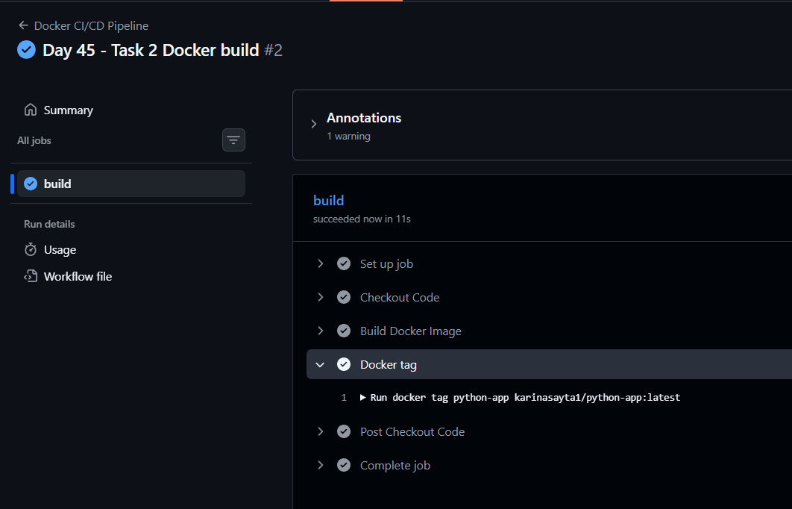
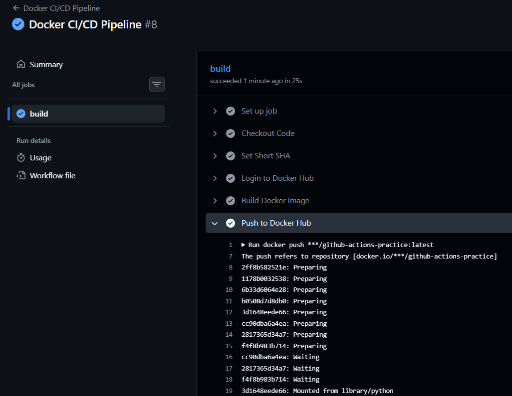
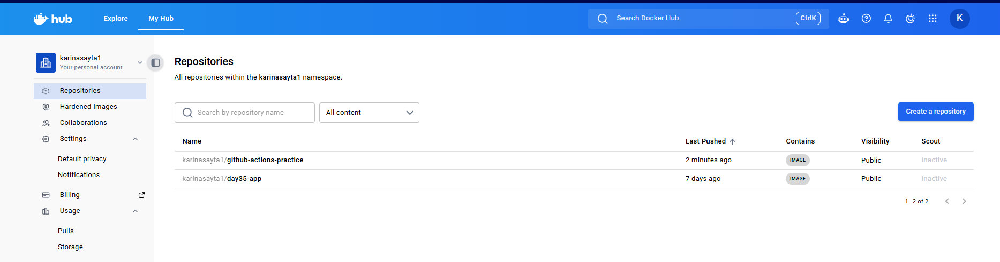
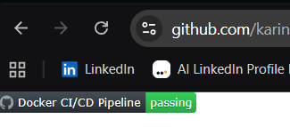
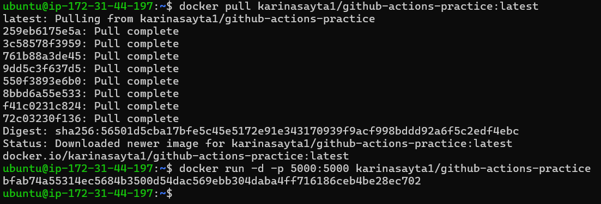
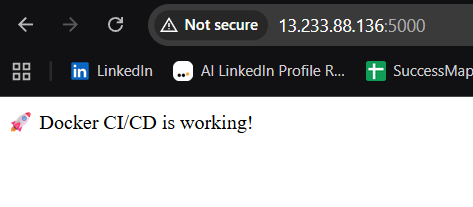

# 🚀 Day 45 – Docker Build & Push using GitHub Actions

## 📌 Objective

Build a **real-world CI/CD pipeline** where:

* Code push → triggers GitHub Actions
* Docker image is built automatically
* Image is pushed to Docker Hub
* You can pull & run it anywhere

---

# 🧠 Core Concepts (Before You Start)

## 🔹 What is CI/CD?

* **CI (Continuous Integration):** Automatically test & build code on every push
* **CD (Continuous Delivery/Deployment):** Automatically deliver code (Docker image here)

---

## 🔹 What is Docker in CI/CD?

* Your app is packaged into a **Docker Image**
* That image is pushed to **Docker Hub**
* Anyone can pull & run the same environment

---

## 🔹 Required Knowledge

### 1. Docker Basics

* `Dockerfile`
* `docker build`
* `docker tag`
* `docker push`

---

### 2. GitHub Actions

* Workflow file (`.yml`)
* Jobs & Steps
* Secrets (`DOCKER_USERNAME`, `DOCKER_TOKEN`)

---

### 3. Docker Hub

* Public image registry
* Format:

  ```
  username/repository:tag
  ```

---

# ⚙️ Task 1: Preparation

## ✅ What You Must Know

* Dockerfile must exist
* Repo must be connected to GitHub
* Secrets must be configured

---

## 🛠 Steps

### 1. Add Dockerfile

Example:

```dockerfile
FROM python:3.10-slim

WORKDIR /app

COPY requirements.txt .
RUN pip install -r requirements.txt

COPY . .

EXPOSE 5000

CMD ["python", "app.py"]
```
---

### 2. Add Secrets in GitHub

Go to:

```
Repo → Settings → Secrets → Actions
```

Add:

* `DOCKER_USERNAME`
* `DOCKER_TOKEN`

---

# ⚙️ Task 2: Build Docker Image in CI

## ✅ What You Must Know

* GitHub Actions runner acts like a Linux machine
* Docker is already installed in runner

---

## 🛠 Steps

Create file:

```
.github/workflows/docker-publish.yml
```

---

### ✅ Basic Workflow

```yaml
name: Docker CI/CD Pipeline

on:
  push:
    branches:
      - main

jobs:
  build:
    runs-on: ubuntu-latest

    steps:
      - name: Checkout Code
        uses: actions/checkout@v4

      - name: Build Docker Image
        run: docker build -t my-image .

      - name: Docker tag
        run: docker tag python-app karinasayta1/python-app:latest
```

---

## ✅ Verify

* Go to **Actions tab**
* Check logs
* Ensure build is successful


---

# ⚙️ Task 3: Push to Docker Hub

## ✅ What You Must Know

* Must login before pushing
* Use GitHub secrets securely
* Tag images properly

---

## 🛠 Steps

### ✅ Full Workflow (Build + Push)

```yaml
name: Docker CI/CD Pipeline

on:
  push:

jobs:
  build:
    runs-on: ubuntu-latest

    steps:
      - name: Checkout Code
        uses: actions/checkout@v4

      - name: Set Short SHA
        run: echo "SHORT_SHA=${GITHUB_SHA::7}" >> $GITHUB_ENV

      - name: Login to Docker Hub
        uses: docker/login-action@v3
        with:
          username: ${{ secrets.DOCKER_USERNAME }}
          password: ${{ secrets.DOCKER_TOKEN }}

      - name: Build Docker Image
        run: |
          docker build -t ${{ secrets.DOCKER_USERNAME }}/github-actions-practice:latest .
          docker tag ${{ secrets.DOCKER_USERNAME }}/github-actions-practice:latest \
          ${{ secrets.DOCKER_USERNAME }}/github-actions-practice:sha-${{ env.SHORT_SHA }}

      - name: Push to Docker Hub
        if: github.ref == 'refs/heads/main'
        run: |
          docker push ${{ secrets.DOCKER_USERNAME }}/github-actions-practice:latest
          docker push ${{ secrets.DOCKER_USERNAME }}/github-actions-practice:sha-${{ env.SHORT_SHA }}
```


---


## ✅ Verify

* Visit Docker Hub
* Check:

  * `latest`
  * `sha-xxxxxxx`


---

# ⚙️ Task 4: Push Only on Main

## ✅ What You Must Know

* Prevent pushing from feature branches
* Use `if condition`

---

## ✅ Already Implemented

```yaml
if: github.ref == 'refs/heads/main'
```

```
name: Docker CI/CD Pipeline

on:
  push:

jobs:
  docker:
    runs-on: ubuntu-latest

    steps:
      - name: Checkout Code
        uses: actions/checkout@v4

      - name: Set Short SHA
        run: echo "SHORT_SHA=${GITHUB_SHA::7}" >> $GITHUB_ENV

      - name: Login to Docker Hub
        uses: docker/login-action@v3
        with:
          username: ${{ secrets.DOCKER_USERNAME }}
          password: ${{ secrets.DOCKER_TOKEN }}

      - name: Build Docker Image
        run: |
          docker build -t ${{ secrets.DOCKER_USERNAME }}/github-actions-practice:latest .
          docker tag ${{ secrets.DOCKER_USERNAME }}/github-actions-practice:latest \
          ${{ secrets.DOCKER_USERNAME }}/github-actions-practice:sha-${{ env.SHORT_SHA }}

      - name: Push to Docker Hub (only on main)
        if: github.ref == 'refs/heads/main'
        run: |
          docker push ${{ secrets.DOCKER_USERNAME }}/github-actions-practice:latest
          docker push ${{ secrets.DOCKER_USERNAME }}/github-actions-practice:sha-${{ env.SHORT_SHA }}
```
---

## 🧪 Test It

* Create branch:

```
git checkout -b feature-test
```

* Push → Image should NOT be pushed

---

# ⚙️ Task 5: Add Status Badge

## ✅ What You Must Know

* Badge shows pipeline status (green/red)
* Useful for portfolio & recruiters

---

## 🛠 Steps

### Badge URL:

```
https://github.com/<username>/<repo>/actions/workflows/docker-publish.yml/badge.svg
```

---

### Add to README.md:

```md

```

---

## ✅ Verify

* Push changes
* Badge should turn **green**


---

# ⚙️ Task 6: Pull and Run Image

## ✅ What You Must Know

* Docker Hub acts like a distribution center
* Anyone can run your app

---

## 🛠 Steps

### Pull Image

```bash
docker pull username/github-actions-practice:latest
```

---

### Run Container

```bash
docker run -d -p 5000:5000 username/github-actions-practice
```

---

## ✅ Verify

* Open browser:

```
http://localhost:5000
```

---

# 🔥 Full Journey (IMPORTANT – Interview Question)

## 🧠 From `git push` → Running Container

1. Developer pushes code to GitHub
2. GitHub Actions workflow triggers
3. Runner machine starts (Ubuntu)
4. Code is checked out
5. Docker image is built
6. Image is tagged:

   * latest
   * commit SHA
7. GitHub logs into Docker Hub
8. Image is pushed to Docker Hub
9. Image becomes publicly available
10. User pulls image anywhere
11. Container runs with same environment

# 🏁 Final Outcome

You now have:

* Real CI/CD pipeline
* Docker automation
* Production-level workflow
* Portfolio-ready project 🚀

---

