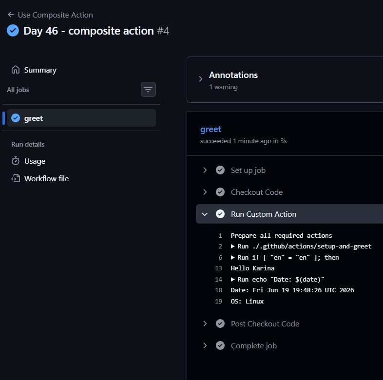

# 🚀 Day 46 – Reusable Workflows & Composite Actions

---

# 📌 Objective

Learn how to:

* Avoid repeating workflows
* Build reusable CI/CD pipelines
* Create custom composite actions

---

# 🧠 Task 1: Core Concepts (Must Know Before Coding)

## 🔹 What is a Reusable Workflow?

A reusable workflow is a GitHub Actions workflow that can be **called by another workflow**, just like a function.

---

## 🔹 What is `workflow_call`?

A special trigger that allows a workflow to be executed by another workflow.

---

## 🔹 Reusable Workflow vs Action

| Feature | Reusable Workflow | Action       |
| ------- | ----------------- | ------------ |
| Level   | Job level         | Step level   |
| Usage   | `jobs.<job>.uses` | `steps.uses` |

---

## 🔹 Where must it live?

```
.github/workflows/
```

---

# ⚙️ Task 2: Create Reusable Workflow

## 🧠 Before You Start

* Must use `workflow_call`
* Must define `inputs` and `secrets`
* Cannot run directly

---

## 📄 File:

```
.github/workflows/reusable-build.yml
```

## ✅ YAML

```yaml
name: Reusable Build Workflow

on:
  workflow_call:
    inputs:
      app_name:
        required: true
        type: string
      environment:
        required: true
        type: string
        default: staging
    secrets:
      docker_token:
        required: true
    outputs:
      build_version:
        value: ${{ jobs.build.outputs.build_version }}

jobs:
  build:
    runs-on: ubuntu-latest

    outputs:
      build_version: ${{ steps.set_version.outputs.version }}

    steps:
      - name: Checkout Code
        uses: actions/checkout@v4

      - name: Print App Info
        run: |
          echo "Building ${{ inputs.app_name }} for ${{ inputs.environment }}"

      - name: Check Secret
        run: |
          echo "Docker token is set: true"

      - name: Set Version
        id: set_version
        run: |
          echo "version=v1.0-${GITHUB_SHA::7}" >> $GITHUB_OUTPUT
```

---

# ⚙️ Task 3: Caller Workflow

## 🧠 Before You Start

* Caller triggers reusable workflow
* Uses `uses:` at job level

---

## 📄 File:

```
.github/workflows/call-build.yml
```

## ✅ YAML

```yaml
name: Call Reusable Workflow

on:
  push:
    branches:
      - main

jobs:
  build:
    uses: ./.github/workflows/reusable-build.yml
    with:
      app_name: "my-web-app"
      environment: "production"
    secrets:
      docker_token: ${{ secrets.DOCKER_TOKEN }}

  print-version:
    needs: build
    runs-on: ubuntu-latest

    steps:
      - name: Print Version
        run: echo "Build version is ${{ needs.build.outputs.build_version }}"
```

---

# ⚙️ Task 4: Outputs

## 🧠 Concept

Reusable workflows can return values using `outputs`

---

## ✅ What We Did

* Generated version: `v1.0-<short-sha>`
* Passed to caller using `needs`

---

# ⚙️ Task 5: Composite Action

## 🧠 Before You Start

* Used for reusable steps (not full workflows)
* Must define `runs: using: composite`

---

## 📄 File:

```
.github/actions/setup-and-greet/action.yml
```

## ✅ YAML

```yaml
name: Setup and Greet

inputs:
  name:
    required: true
  language:
    required: false
    default: en

outputs:
  greeted:
    value: "true"

runs:
  using: "composite"

  steps:
    - name: Greeting
      shell: bash
      run: |
        if [ "${{ inputs.language }}" = "en" ]; then
          echo "Hello ${{ inputs.name }}"
        else
          echo "Namaste ${{ inputs.name }}"
        fi

    - name: System Info
      shell: bash
      run: |
        echo "Date: $(date)"
        echo "OS: $RUNNER_OS"
```

---

## ✅ Use Composite Action

```yaml
name: Use Composite Action

on:
  push:

jobs:
  greet:
    runs-on: ubuntu-latest

    steps:
      - name: Checkout Code
        uses: actions/checkout@v4

      - name: Run Custom Action
        uses: ./.github/actions/setup-and-greet
        with:
          name: "Karina"
          language: "en""
```

---

# ⚙️ Task 6: Comparison Table

| Feature                      | Reusable Workflow    | Composite Action    |
| ---------------------------- | -------------------- | ------------------- |
| Triggered by                 | workflow_call        | uses: in step       |
| Can contain jobs?            | Yes                  | No                  |
| Can contain multiple steps?  | Yes                  | Yes                 |
| Lives where?                 | .github/workflows    | .github/actions     |
| Can accept secrets directly? | Yes                  | No                  |
| Best for                     | Full CI/CD pipelines | Reusable step logic |

---

# 🧪 Verification Checklist

## ✅ Reusable Workflow

* Caller workflow runs
* Inputs printed correctly

---

## ✅ Outputs

* Version printed in second job

---

## ✅ Composite Action

* Greeting printed
* Date and OS shown

---

# 🔥 Real DevOps Insight

* Reusable workflows = **pipeline as a function**
* Composite actions = **reusable building blocks**

---
