# 🚀 Day 47 – Advanced Triggers: PR Events, Cron & Event-Driven Pipelines

---

# 📌 Objective

Learn how to:

* Use advanced GitHub Actions triggers
* Handle PR lifecycle events
* Create scheduled jobs (cron)
* Build event-driven pipelines

---

# 🧠 Task 1: PR Lifecycle Events

## 🔹 What You Must Know

* `pull_request` has multiple event types:

  * opened
  * synchronize (new commits)
  * reopened
  * closed
* PR data is available via:

  * `${{ github.event.pull_request.* }}`

---

## 📄 File:

```
.github/workflows/pr-lifecycle.yml
```

## ✅ YAML

```yaml
name: PR Lifecycle

on:
  pull_request:
    types: [opened, synchronize, reopened, closed]

jobs:
  pr-info:
    runs-on: ubuntu-latest

    steps:
      - name: Print PR Info
        run: |
          echo "Action: ${{ github.event.action }}"
          echo "Title: ${{ github.event.pull_request.title }}"
          echo "Author: ${{ github.event.pull_request.user.login }}"
          echo "Source Branch: ${{ github.head_ref }}"
          echo "Target Branch: ${{ github.base_ref }}"

      - name: Run only if merged
        if: github.event.pull_request.merged == true
        run: echo "PR was merged 🎉"
```

---

## 🧪 How to Test

1. Create a new branch
2. Open PR → see `opened`
3. Push commit → see `synchronize`
4. Merge PR → see `closed + merged`

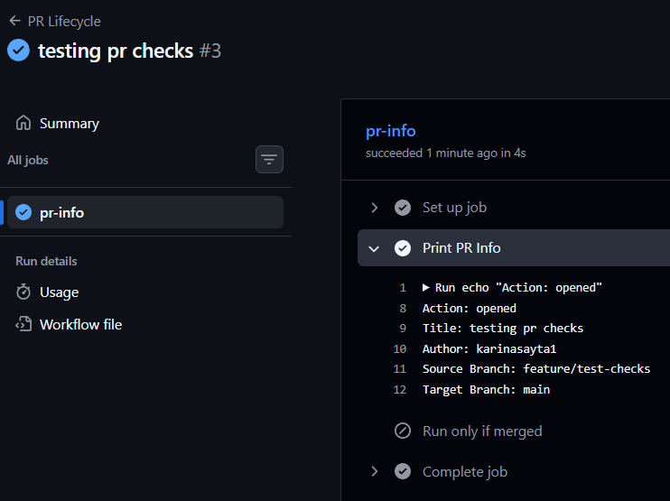
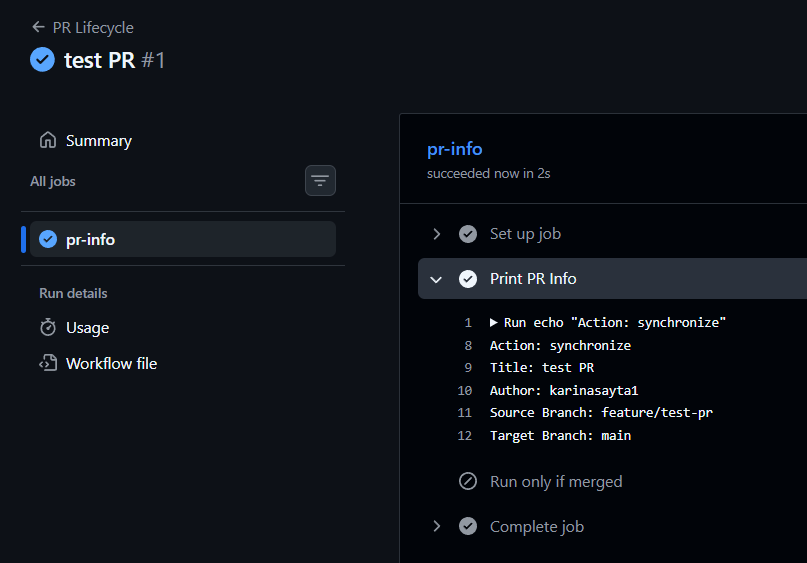
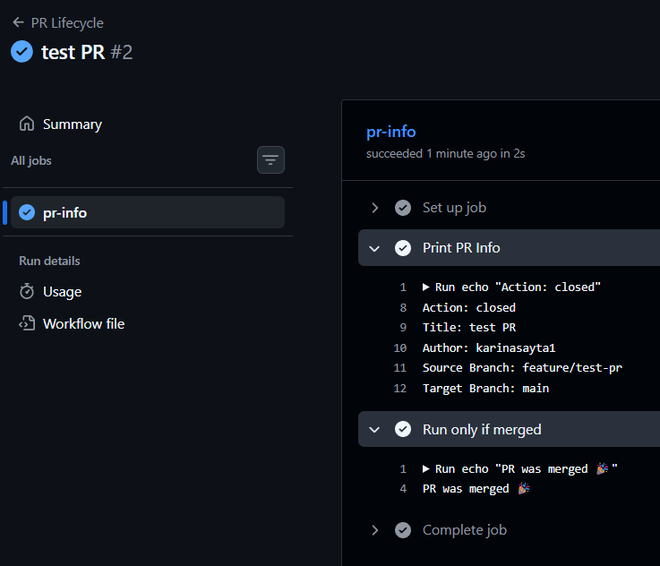
---

# ⚙️ Task 2: PR Validation Workflow

## 🔹 What You Must Know

* PR workflows act as **quality gates**
* Jobs can fail → block merge

---

## 📄 File:

```
.github/workflows/pr-checks.yml
```

## ✅ YAML

```yaml
name: PR Checks

on:
  pull_request:
    branches:
      - main

jobs:
  file-size-check:
    runs-on: ubuntu-latest
    steps:
      - uses: actions/checkout@v4

      - name: Check File Sizes
        run: |
          find . -type f -size +1M && echo "Large file found!" && exit 1 || echo "All good"

  branch-name-check:
    runs-on: ubuntu-latest
    steps:
      - name: Validate Branch Name
        run: |
          if [[ "${{ github.head_ref }}" =~ ^(feature|fix|docs)/ ]]; then
            echo "Valid branch"
          else
            echo "Invalid branch name!"
            exit 1
          fi

  pr-body-check:
    runs-on: ubuntu-latest
    steps:
      - name: Check PR Description
        run: |
          if [ -z "${{ github.event.pull_request.body }}" ]; then
            echo "Warning: PR description is empty"
          else
            echo "PR description present"
          fi
```

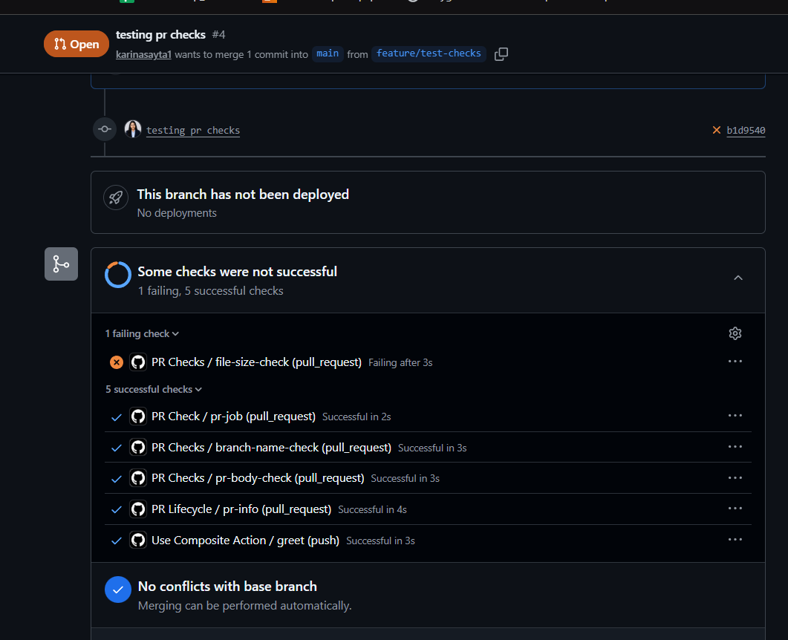
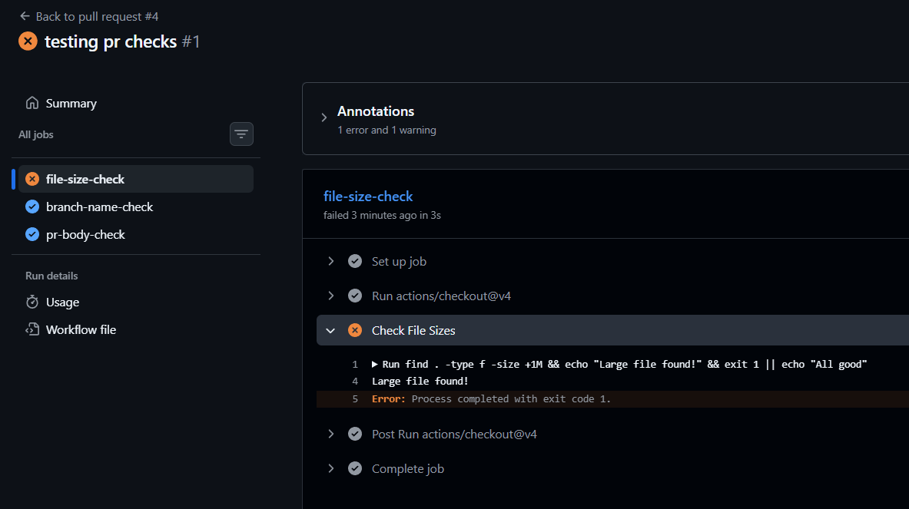
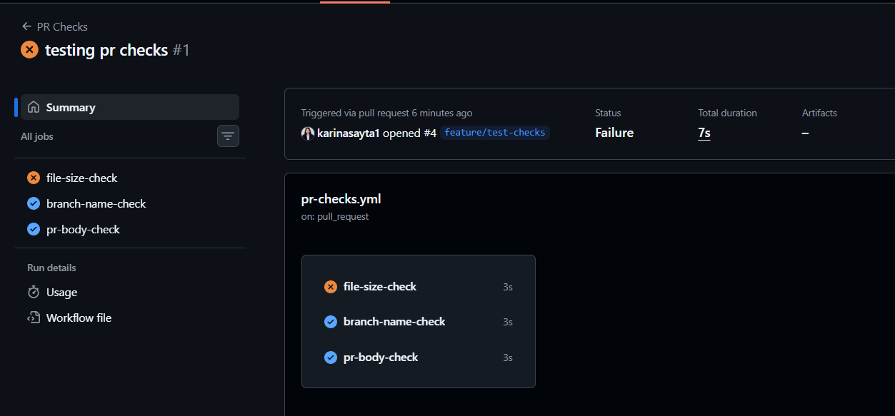
---

# ⚙️ Task 3: Scheduled Workflows (Cron)

## 🔹 What You Must Know

* Cron format:

```
minute hour day month day-of-week
```

* Runs on **default branch only**
* May delay on inactive repos

---

## 📄 File:

```
.github/workflows/scheduled-tasks.yml
```

## ✅ YAML

```yaml
name: Scheduled Tasks

on:
  schedule:
    - cron: '30 2 * * 1'
    - cron: '0 */6 * * *'
  workflow_dispatch:

jobs:
  scheduled-job:
    runs-on: ubuntu-latest

    steps:
      - name: Print Trigger
        run: echo "Triggered by ${{ github.event.schedule }}"

      - name: Health Check
        run: |
          curl -o /dev/null -s -w "%{http_code}" https://example.com
```
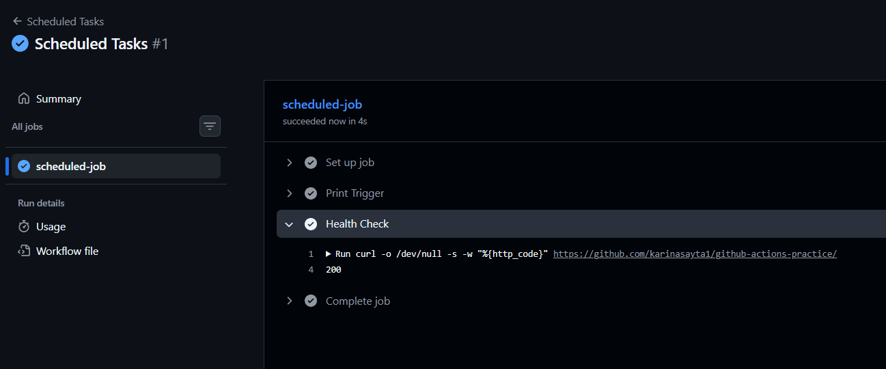
---

## 🧠 Cron Answers

* Weekday 9 AM IST → `30 3 * * 1-5`
* First day monthly → `0 0 1 * *`

---

# ⚙️ Task 4: Path & Branch Filters

## 🔹 What You Must Know

* `paths` → run ONLY when files match
* `paths-ignore` → skip certain changes

---

## 📄 File:

```
.github/workflows/smart-triggers.yml
```

## ✅ YAML

```yaml
name: Smart Triggers

on:
  push:
    branches:
      - main
      - 'release/*'
    paths:
      - '.github/workflows/**'
      - '.github/actions/**'

jobs:
  build:
    runs-on: ubuntu-latest
    steps:
      - run: echo "Code changed in .github/"
```
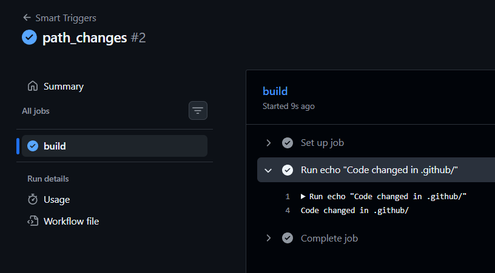
---

## 📄 Skip Docs Workflow

```yaml
name: Ignore Docs

on:
  push:
    paths-ignore:
      - '*.md'
      - 'docs/**'

jobs:
  skip-docs:
    runs-on: ubuntu-latest
    steps:
      - run: echo "Docs changes ignored"
```

---

# ⚙️ Task 5: workflow_run (Pipeline Chaining)

## 🔹 What You Must Know

* Triggers AFTER another workflow
* Used for CI → CD chaining

---

## 📄 tests.yml

```yaml
name: Run Tests

on:
  push:

jobs:
  test:
    runs-on: ubuntu-latest
    steps:
      - run: echo "Running tests..."
```

---

## 📄 deploy-after-tests.yml

```yaml
name: Deploy After Tests

on:
  workflow_run:
    workflows: ["Run Tests"]
    types: [completed]

jobs:
  deploy:
    if: github.event.workflow_run.conclusion == 'success'
    runs-on: ubuntu-latest

    steps:
      - run: echo "Deploying..."

  fail:
    if: github.event.workflow_run.conclusion != 'success'
    runs-on: ubuntu-latest

    steps:
      - run: echo "Tests failed. Not deploying."
```
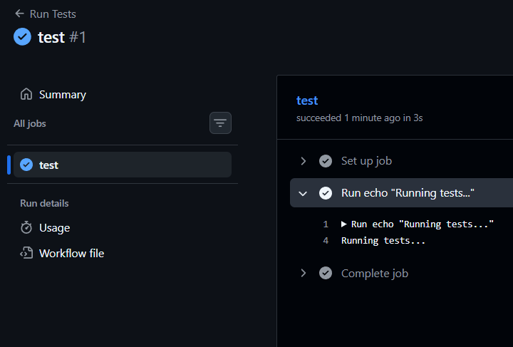
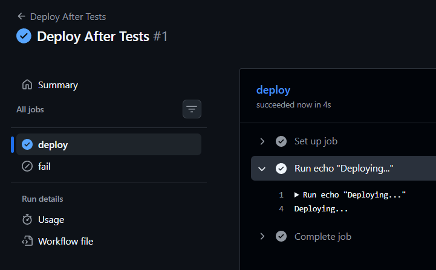
---

# ⚙️ Task 6: repository_dispatch (External Trigger)

## 🔹 What You Must Know

* Trigger workflows from external systems
* Requires GitHub token

---

## 📄 File:

```
.github/workflows/external-trigger.yml
```

## ✅ YAML

```yaml
nname: External Trigger

on:
  repository_dispatch:
    types: [deploy-request]

jobs:
  deploy:
    runs-on: ubuntu-latest

    steps:
      - name: Print Payload
        run: |
          echo "Environment: ${{ github.event.client_payload.environment }}"
```

---

## 🛠 Trigger Command

```bash
gh api repos/<owner>/<repo>/dispatches \
  -f event_type=deploy-request \
  -f client_payload='{"environment":"production"}'
```
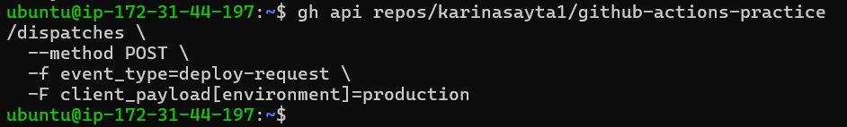
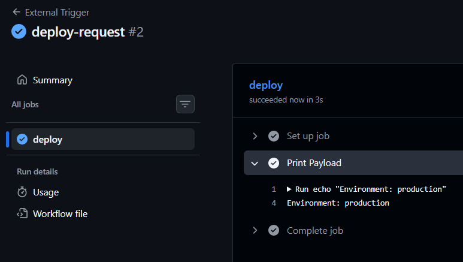


---

# 🧠 workflow_run vs workflow_call

| Feature      | workflow_run     | workflow_call      |
| ------------ | ---------------- | ------------------ |
| Trigger type | Event-based      | Manual call        |
| Use case     | CI → CD chaining | Reusable pipelines |
| Control      | Less flexible    | More structured    |

---

# 🧪 Verification Checklist

* PR lifecycle triggers working
* PR checks blocking invalid PRs
* Scheduled workflow visible
* Path filters working
* workflow_run chaining works
* repository_dispatch triggers manually

---

# 🏁 Final Outcome

You now understand:

* Event-driven CI/CD
* Advanced triggers
* Real-world pipeline control

---

🔥 This is how real production pipelines are built.
