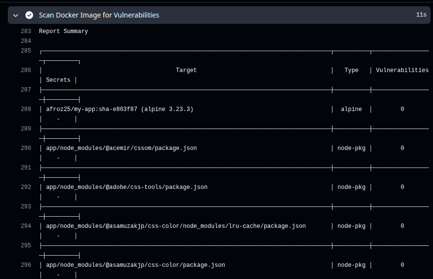
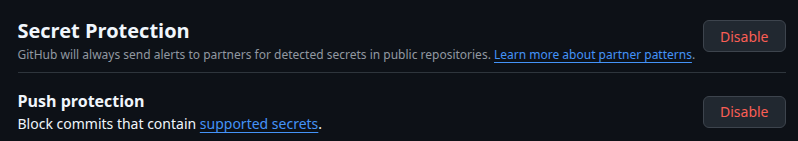
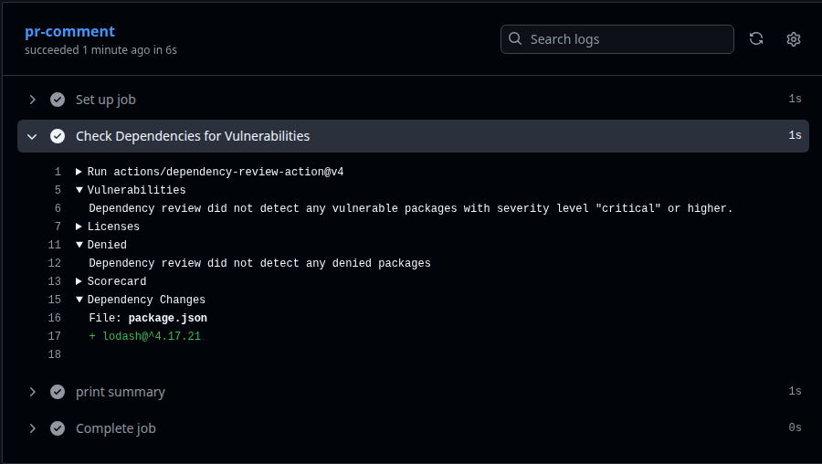
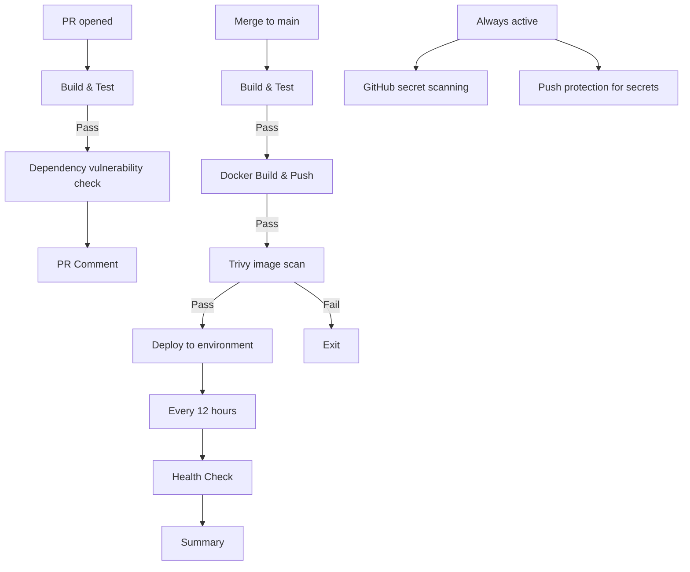
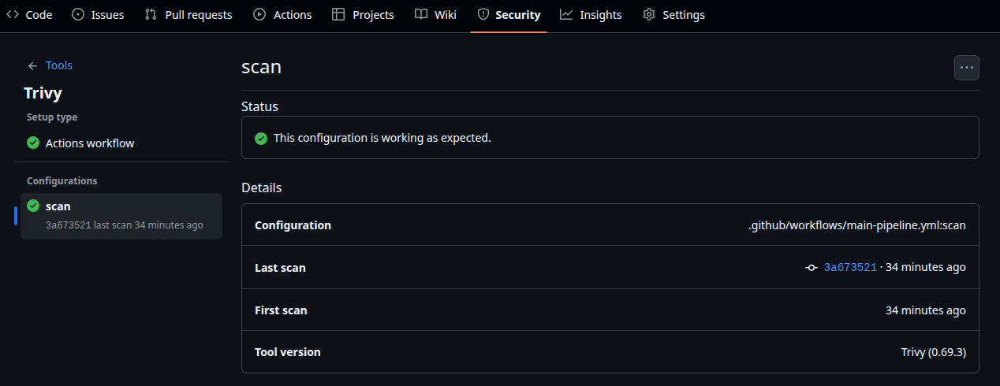
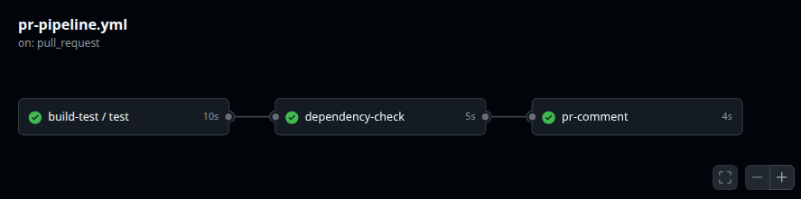
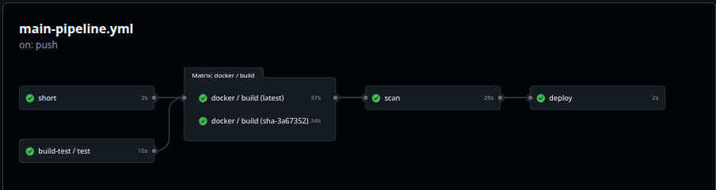

# Day 49 – DevSecOps: Add Security to Your CI/CD Pipeline

## What is DevSecOps?
DevSecOps is aprocess of integrating security in every stage of your CI/CD pipeline.
 Instead of cathing vulnerabilities late in production, DevSecOps insures they are identified and fixed early in CI/CD pipelines.

Think of it like this:

**Without DevSecOps:**
> You build the app → deploy it → a security team finds a vulnerability weeks later → you scramble to fix it

**With DevSecOps:**
> You open a PR → the pipeline automatically checks for vulnerabilities → you fix it before it ever gets merged

**That's it.** DevSecOps = adding security checks to the pipeline you already have. Not a separate process — just a few extra steps.

---

## Key Principles (Keep These in Mind)

1. **Catch problems early** — A vulnerability found in a PR takes 5 minutes to fix. The same vulnerability found in production takes days.

2. **Automate the checks** — Don't rely on someone remembering to check. Let the pipeline do it every time.

3. **Block on critical issues** — If a scan finds a serious vulnerability, the pipeline should fail — just like a failing test.

4. **Never put secrets in code** — Use GitHub Secrets (you learned this on Day 44). No `.env` files, no hardcoded API keys.

5. **Give only the access needed** — Your workflow doesn't need write access to everything. Limit permissions.

---

## Task 1: Scan Your Docker Image for Vulnerabilities
Your Docker image might use a base image with known security issues. Let's find out.

Add this step to your main branch pipeline (after Docker build, before deploy):
```yaml
- name: Scan Docker Image for Vulnerabilities
  uses: aquasecurity/trivy-action@master
  with:
    image-ref: 'your-username/your-app:latest'
    format: 'table'
    exit-code: '1'
    severity: 'CRITICAL,HIGH'
```

What this does:
- `trivy` scans your Docker image for known CVEs (Common Vulnerabilities and Exposures)
- `format: 'table'` prints a readable table in the logs
- `exit-code: '1'` means **fail the pipeline** if CRITICAL or HIGH vulnerabilities are found
- If it passes, your image is clean — proceed to push and deploy

Push and check the Actions tab. Read the scan output.

**Verify:** Can you see the vulnerability table in the logs? Did it pass or fail?
   * Trivy Scan Passed

   

Write in your notes: What CVEs (if any) were found? What base image are you using?
   * There were 11 critical issues,mainly coming from dependencies in the base image Node.js 20 
     and underlying Alpine Linux packages.
   * To fix this, the base image was upgraded to Node.js 22 and system packages were updated 
     to patched versions.

---

## Task 2: Enable GitHub's Built-in Secret Scanning
GitHub can automatically detect if someone pushes a secret (API key, token, password) to your repo.

1. Go to your repo → Settings → **Code security and analysis**
2. Enable **Secret scanning**
3. If available, also enable **Push protection** — this blocks the push entirely if a secret is detected

That's it — no workflow changes needed. GitHub does this automatically.

   

Write in your notes:
- What is the difference between secret scanning and push protection?
   - `Secret Scanning`:
      - It scans your entire repository for know secret patterns.
      - It idefntifies secrets after they have been commited to the repository and generates
        alerts in the security tab of the repository.
   - `Push protection` :
      - It aims to stop secrets fron entering your codebase in the first place.
      - It scans the code for secrets in real time during the `git push` process.
      - If a secret is detected, then push is blocked and developer receives error message 
        and remediation guidance 

- What happens if GitHub detects a leaked AWS key in your repo?
   -  When secret scanning finds a potential secret, GitHub generates an alert on your 
      repository's Security tab with details about the exposed credential.
      
---

## Task 3: Scan Dependencies for Known Vulnerabilities
If your app uses packages (pip, npm, etc.), those packages might have known vulnerabilities.

Add this to your **PR pipeline** (not the main pipeline):
```yaml
- name: Check Dependencies for Vulnerabilities
  uses: actions/dependency-review-action@v4
  with:
    fail-on-severity: critical
```

This checks any **new** dependencies added in the PR against a vulnerability database. If a dependency has a critical CVE, the PR check fails.

Test it:
1. Open a PR that adds a package to your app
2. Check the Actions tab — did the dependency review run?

**Verify:** Does the dependency review show up as a check on your PR?

   

---

## Task 4: Add Permissions to Your Workflows
By default, workflows get broad permissions. Lock them down.

Add this block near the top of your workflow files (after `on:`):
```yaml
permissions:
  contents: read
```

If a workflow needs to comment on PRs, add:
```yaml
permissions:
  contents: read
  pull-requests: write
```

Update at least 2 of your existing workflow files with a `permissions` block.

Write in your notes: Why is it a good practice to limit workflow permissions? What could go wrong if a compromised action has write access to your repo?
   * **Security** : If a workflow gets compromised, you don’t want it to have full control over your repo. Limiting permissions reduces risk.
   * If a compromised action has write access, it can modify, delete your code, steal
     secrets.

### **Note** : In March 2026, GitHub experienced a large-scale bot attack (HackerBot-Claw) that exploited insecure GitHub Actions workflows. To prevent similar compromises, always configure minimal workflow permissions and enable dependency graph + security analysis features.

---

## Task 5: See the Full Secure Pipeline
### Pipeline Architecture Diagram



---

## Brownie Points (Optional — For the Curious)

### Pin Actions to Commit SHAs
Tags like `@v4` can be moved by the action author. For extra security, pin to the exact commit:
```yaml
# Instead of this:
uses: actions/checkout@v4

# Use this:
uses: actions/checkout@b4ffde65f46336ab88eb53be808477a3936bae11 # v4.1.1
```
This protects against supply chain attacks where a tag is silently changed.

### Upload Scan Results to GitHub Security Tab
Add SARIF output to Trivy and upload it — your scan results will appear in the repo's **Security** tab:
```yaml
- uses: aquasecurity/trivy-action@master
  with:
    image-ref: 'your-username/your-app:latest'
    format: 'sarif'
    output: 'trivy-results.sarif'
- uses: github/codeql-action/upload-sarif@v3
  with:
    sarif_file: 'trivy-results.sarif'
```

   


- What you learned about secret scanning and dependency review
* **Secret Scanning** : It detects sensitive data accidently pushed to your repo.
  Preventing leaks.
* **Dependency review** : It analyzes project libraries to catch vulnerabilities, outdated packages, or risky changes before they’re merged.

---

## Capstone Project link

   [Link](https://github.com/karinasayta1/github-actions-capstone)

## Full PR Pipeline

   

## Full Main Pipeline

   

---


