# Day 50 – Kubernetes Architecture and Cluster Setup

## Task 1: Recall the Kubernetes Story
Before touching a terminal, write down from memory:

1. Why was Kubernetes created? What problem does it solve that Docker alone cannot? 
   * For Auto Healing & Auto Scaling. Docker allows containers to run but it if a container crashes,
     it doesn't auto heal, if traffic increases it can not auto scale.
   * Docker runs containers, kubernetes manages containers.
   * Kubernetes provides: 
     - Auto Scaling
     - Auto Healing
     - Load balancing
     - Rolling updates
     - Cluster Management

2. Who created Kubernetes and what was it inspired by?
   * Google created BORG, whenever they wanted to scale or heal a crashed container, it was manual,
     so google created a tool that could auto-heal and auto-scale and managed millions of containers across thousands of servers..
   * In 2014, Google open-sourced a next-generation version of Borg’s concepts, which 
     became Kubernetes. Today, it is maintained by the Cloud Native Computing Foundation (CNCF).

3. What does the name "Kubernetes" mean?
   * Kubernetes name means **captain of a ship**.
   * Kubernetes reflects the idea of a captain managing a ship, ensuring containers are handled,
     directed, and kept on course.

Do not look anything up yet. Write what you remember from the session, then verify against the official docs.

---

## Task 2: Draw the Kubernetes Architecture
From memory, draw or describe the Kubernetes architecture. Your diagram should include:

**Control Plane (Master Node):**
- API Server — the front door to the cluster, every command goes through it
- etcd — the database that stores all cluster state
- Scheduler — decides which node a new pod should run on
- Controller Manager — watches the cluster and makes sure the desired state matches reality

**Worker Node:**
- kubelet — the agent on each node that talks to the API server and manages pods
- kube-proxy — handles networking rules so pods can communicate
- Container Runtime — the engine that actually runs containers (containerd, CRI-O)

   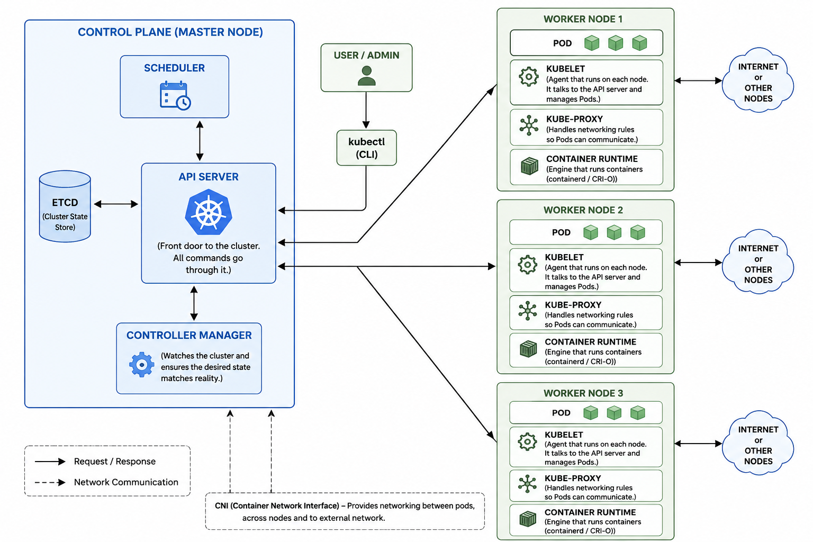

After drawing, verify your understanding:
- What happens when you run `kubectl apply -f pod.yaml`? Trace the request through each component.
   * Kubectl reads your pod.yml. Validates and converts it into internal JSON representation.
   * kubectl sends a REST request to API server.
   * API server authenticates and validates.
   * Then it writes the new/updated object in the etcd.
   * The schedular watches API server for any newly created pod that has not been assigned yet
     and assigns pod to nodes.
   * The kubelet works with container runtime to pull necessary images, create and start the
     container.
- What happens if the API server goes down?
   * The existing pods and services continues to run but no new resources can be created, deleted
     or updated. 
   * Control plane components such as controller manager, schedular becomes inactive.
   * The self-healing ability is compromised.
   * Monitoring and logging failures.
- What happens if a worker node goes down?
   * The existing pods on the worker node will stop functioning.
   * Kubernetes waits for `pod-eviction-timeout` of 5mins(configurable) before taking action to 
     ensure node is truly down.
   * After timeout the control plane will mark the pods for deletion and evection and create
     identical replacement pods on another healthy node.

---

# ⚙️ Task 3: Install kubectl

## 🔍 Before You Start

* kubectl = CLI to talk to Kubernetes
* Must be installed before cluster setup

## 🛠️ Installation

### Linux

```bash
curl -LO "https://dl.k8s.io/release/stable.txt"
curl -LO "https://dl.k8s.io/release/$(cat stable.txt)/bin/linux/amd64/kubectl"
chmod +x kubectl
sudo mv kubectl /usr/local/bin/
```

### Verify

```bash
kubectl version --client
```

---

# 🧪 Task 4: Set Up Local Cluster

## 🔍 Before You Start

### Option A: kind

* Runs Kubernetes inside Docker
* Lightweight
* Best for DevOps practice

### Option B: minikube

* Uses VM or Docker
* Slightly heavier
* More real-world simulation

---

## ✅ Chosen: kind

### 💡 Why?

* Fast
* Uses Docker (already familiar)
* Lightweight

---

## 🛠️ Steps

### Install kind

```bash
curl -Lo ./kind https://kind.sigs.k8s.io/dl/latest/kind-linux-amd64
chmod +x ./kind
sudo mv ./kind /usr/local/bin/kind
```

### Creates a Kubernetes cluster using Docker.

```bash
kind create cluster --name devops-cluster
```

### Verify
Creates a Kubernetes cluster using Docker.
Displays available nodes in cluster.

```bash
kubectl cluster-info
kubectl get nodes 
```
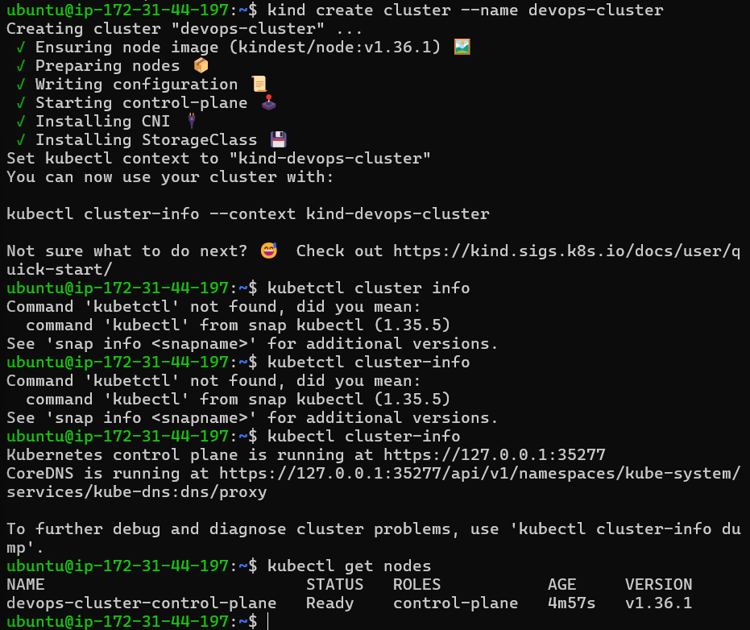
---

# 🔍 Task 5: Explore Cluster

## 🔍 Before You Start

* Kubernetes runs everything as pods
* Even core components run inside cluster

---

## 🛠️ Commands

### Cluster Info - Displays master and service endpoints

```bash
kubectl cluster-info
```

### Nodes - Shows nodes status and readiness

```bash
kubectl get nodes
```
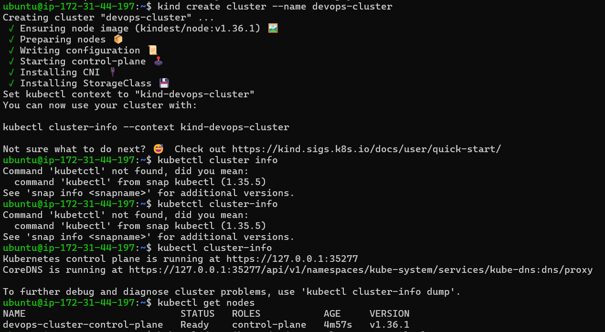

### Detailed Node Info - SHows detailed info like CPU, memory, pods

```bash
kubectl describe node <node-name>
```
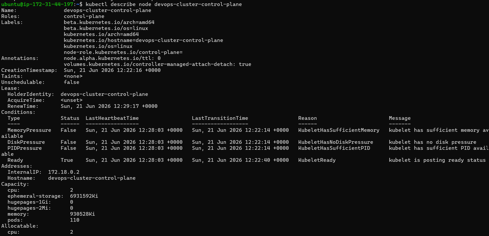

### Namespaces - list all namespaces

```bash
kubectl get namespaces
```
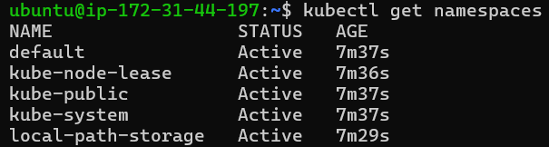

### All Pods - shows pods from all namespaces.

```bash
kubectl get pods -A
```
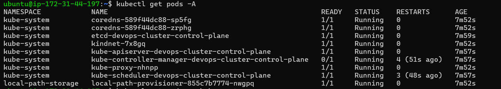

---

## 🔎 kube-system Pods  - Lists system pods running Kubernetes components.

```bash
kubectl get pods -n kube-system
```
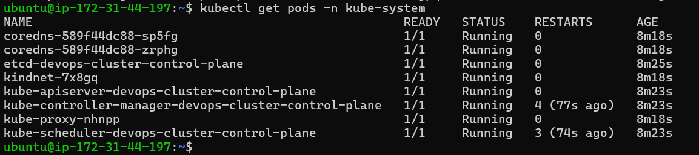

### 🧠 What They Do

| Pod                     | Purpose                 |
| ----------------------- | ----------------------- |
| etcd                    | Stores cluster state    |
| kube-apiserver          | Entry point             |
| kube-scheduler          | Assigns pods            |
| kube-controller-manager | Maintains desired state |
| coredns                 | DNS inside cluster      |
| kube-proxy              | Networking              |

You should see pods like `etcd`, `kube-apiserver`, `kube-scheduler`, `kube-controller-manager`, `coredns`, and `kube-proxy`. These are the architecture components you drew in Task 2 — running as pods inside the cluster.

**Verify:** Can you match each running pod in `kube-system` to a component in your architecture diagram? **YES**

### What each kube-system pod does

* `core dns` : Provides DNS services so pods can communicate using service names.
* `etcd-devops-cluster-control-plane ` : Distributed key-value store that holds all cluster configuration and state.
* `kindnet-8mkrr`: Networking plugin used by KIND to enable pod networking.
* `kube-apiserver-devops-cluster-control-plane` : Main API server that handles all Kubernetes API requests.
* `kube-controller-manager-devops-cluster-control-plane` : Runs controllers that manage cluster state such as nodes, replicas, and endpoints.
* `kube-proxy-xk4lf` : Manages network rules and enables service networking for pods.
* `kube-scheduler-devops-cluster-control-plane ` : Assigns newly created pods to available nodes.

---

# 🔁 Task 6: Cluster Lifecycle

## 🔍 Before You Start

* Clusters are temporary in local setups
* Practice deleting and recreating

---

## 🛠️ Commands

### Delete Cluster and free resources

```bash
kind delete cluster --name devops-cluster
```
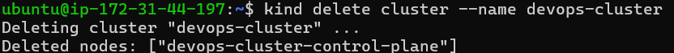

### Recreate 

```bash
kind create cluster --name devops-cluster
```
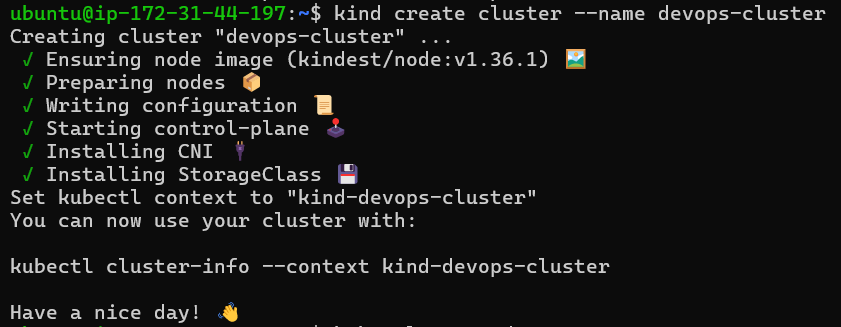 

### Verify - confirms cluster is running

```bash
kubectl get nodes
```
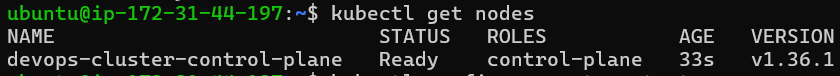
---

## ⚙️ Useful Commands

### Current Context

```bash
kubectl config current-context
```


### All Contexts

```bash
kubectl config get-contexts
```
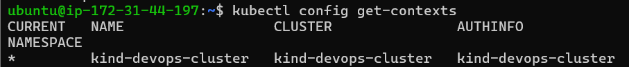

### View Config

```bash
kubectl config view
```
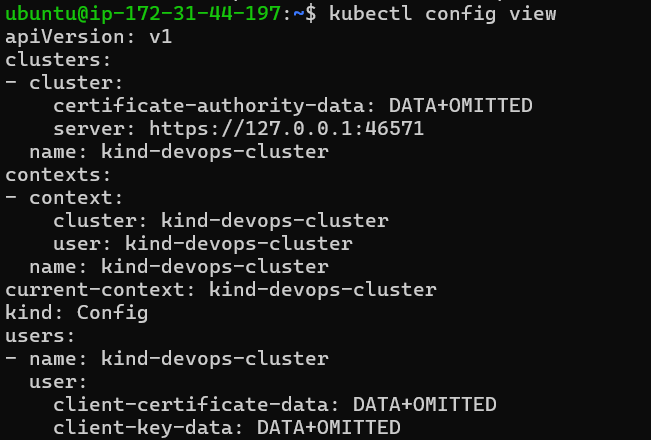
---

## 📁 What is kubeconfig?

* A configuration file used by kubectl
* Stores:

  * Cluster info
  * User credentials
  * Contexts

📍 Location:

```
~/.kube/config
```

---

