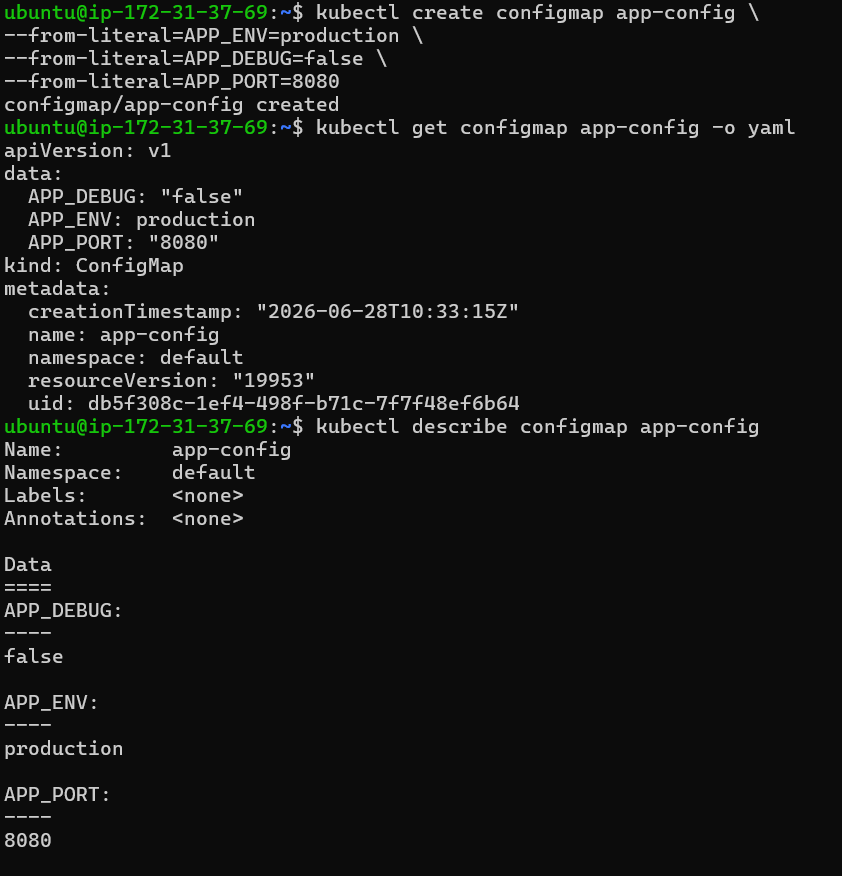
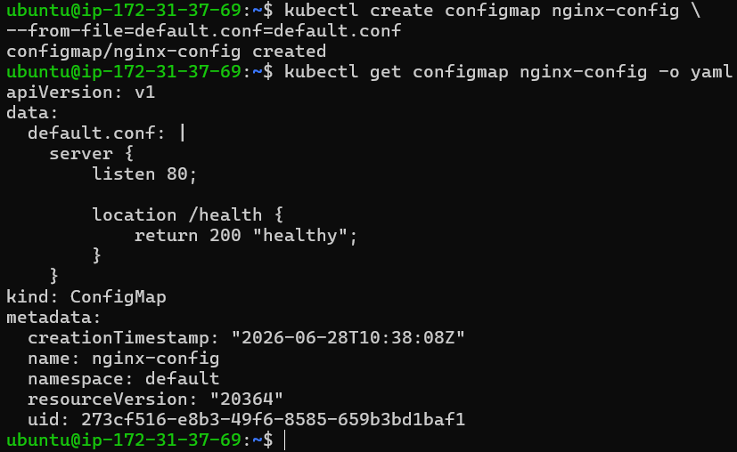
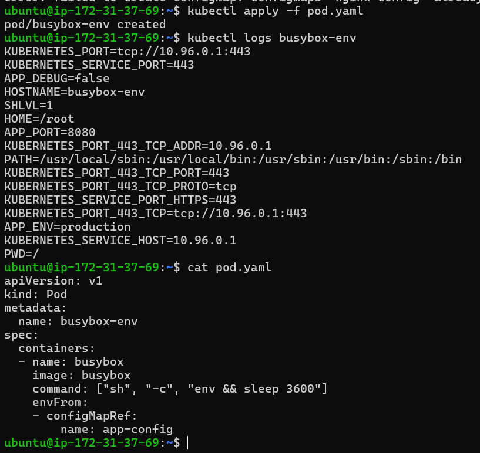
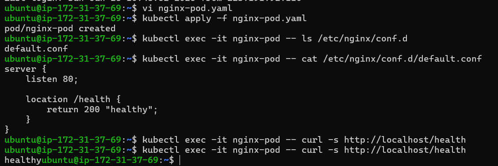
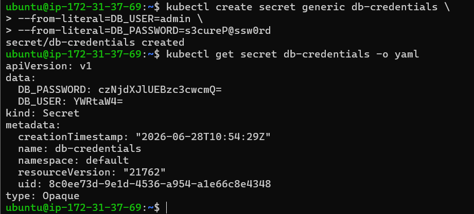
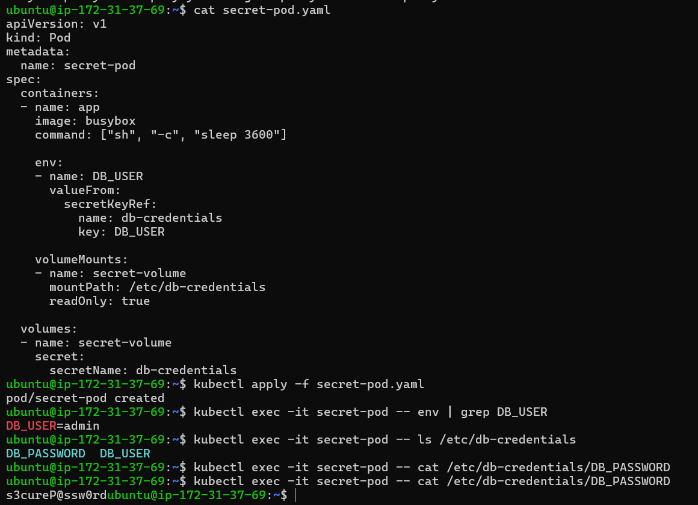
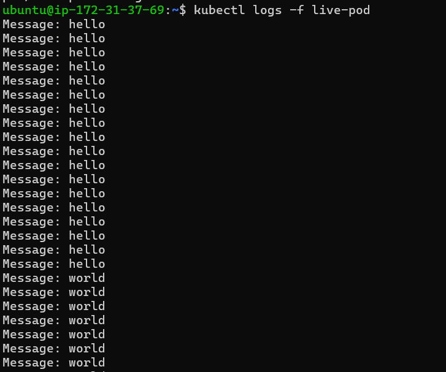
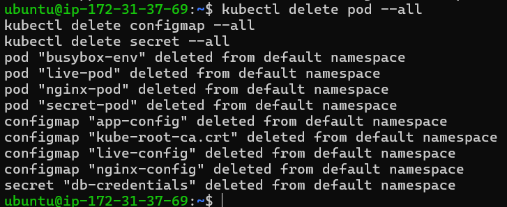

# Day 54 – Kubernetes ConfigMaps and Secrets

## 📌 Introduction

In Kubernetes, applications need configuration like database URLs, passwords, API keys, ports, and feature flags.

If we hardcode these values inside container images:
- We must rebuild images every time a value changes ❌
- It becomes insecure ❌
- It reduces flexibility ❌

Kubernetes solves this problem using:

- ConfigMaps → for non-sensitive configuration
- Secrets → for sensitive data

---

# 🧠 Core Concepts

## 📦 ConfigMap

ConfigMap stores non-sensitive key-value configuration data.

Examples:
- APP_ENV=production
- APP_PORT=8080
- APP_DEBUG=false

Features:
- Stored in plain text
- Easy to update
- Can be injected into Pods as:
  - Environment variables
  - Mounted files

---

## 🔐 Secret

Secret stores sensitive data like passwords and tokens.

Examples:
- DB_PASSWORD
- API_KEYS

Features:
- Stored in base64 encoded form (NOT encrypted)
- Access controlled via RBAC
- Can be used as:
  - Environment variables
  - Mounted files

---

## ⚠️ Important Concept

Base64 encoding is NOT encryption.

Anyone with access can decode it:

```bash
echo "<encoded_value>" | base64 --decode
````

Security depends on:

* Kubernetes RBAC
* Encryption at rest (optional)
* Cluster access control

---

# 🧪 Task 1: Create ConfigMap from Literals

## Command

```bash
kubectl create configmap app-config \
--from-literal=APP_ENV=production \
--from-literal=APP_DEBUG=false \
--from-literal=APP_PORT=8080
```

## Verify

```bash
kubectl get configmap app-config -o yaml
kubectl describe configmap app-config
```

## Output

  

---

# 🧪 Task 2: Create ConfigMap from File

## Step 1: Create file

default.conf

```nginx
server {
    listen 80;

    location /health {
        return 200 "healthy";
    }
}
```

---

## Step 2: Create ConfigMap

```bash
kubectl create configmap nginx-config \
--from-file=default.conf=default.conf
```

---

## Verify

```bash
kubectl get configmap nginx-config -o yaml
```

 
---

# 🧪 Task 3: Use ConfigMap in Pod

---

## A) Environment Variables (envFrom)

```yaml
apiVersion: v1
kind: Pod
metadata:
  name: busybox-env
spec:
  containers:
  - name: busybox
    image: busybox
    command: ["sh", "-c", "env && sleep 3600"]
    envFrom:
    - configMapRef:
        name: app-config
```

### Result:

All ConfigMap keys become environment variables.
 

---

## B) Mount ConfigMap as File (Nginx)

```yaml
apiVersion: v1
kind: Pod
metadata:
  name: nginx-pod
spec:
  containers:
  - name: nginx
    image: nginx
    volumeMounts:
    - name: nginx-config
      mountPath: /etc/nginx/conf.d
  volumes:
  - name: nginx-config
    configMap:
      name: nginx-config
```

---

## Test

```bash
kubectl exec -it nginx-pod -- curl localhost/health
```

Output:


---

# 🧪 Task 4: Create Secret

## Command

```bash
kubectl create secret generic db-credentials \
--from-literal=DB_USER=admin \
--from-literal=DB_PASSWORD=s3cureP@ssw0rd
```

---

## Verify

```bash
kubectl get secret db-credentials -o yaml
```

## Output



---

## Decode Secret

```bash
echo "YWRtaW4=" | base64 --decode
```

Output:

```
admin
```

---

# 🧪 Task 5: Use Secret in Pod

```yaml
apiVersion: v1
kind: Pod
metadata:
  name: secret-pod
spec:
  containers:
  - name: app
    image: busybox
    command: ["sh", "-c", "sleep 3600"]

    env:
    - name: DB_USER
      valueFrom:
        secretKeyRef:
          name: db-credentials
          key: DB_USER

    volumeMounts:
    - name: secret-volume
      mountPath: /etc/db-credentials
      readOnly: true

  volumes:
  - name: secret-volume
    secret:
      secretName: db-credentials
```

---

## Verify

```bash
kubectl exec -it secret-pod -- cat /etc/db-credentials/DB_PASSWORD
```

Output:

```
s3cureP@ssw0rd
```

---

# 🧪 Task 6: ConfigMap Live Update

## Create ConfigMap

```bash
kubectl create configmap live-config \
--from-literal=message=hello
```

---

## Pod

```yaml
apiVersion: v1
kind: Pod
metadata:
  name: live-pod
spec:
  containers:
  - name: app
    image: busybox
    command:
      - sh
      - -c
      - |
        while true; do
          echo "Message: $(cat /config/message)"
          sleep 5
        done

    volumeMounts:
    - name: config-volume
      mountPath: /config

  volumes:
  - name: config-volume
    configMap:
      name: live-config
```

---

## Update ConfigMap

```bash
kubectl patch configmap live-config \
--type merge \
-p '{"data":{"message":"world"}}'
```

---

## Result

After 30–60 seconds:

```
world
```

✔ Volume automatically updates

---

## Important Observation

* ConfigMap mounted as volume → updates live
* Environment variables → DO NOT update after Pod starts

---

# 🧹 Task 7: Cleanup

```bash
kubectl delete pod --all
kubectl delete configmap --all
kubectl delete secret --all
```

---

# 📌 Final Summary

## ConfigMap

* Used for non-sensitive configuration
* Stored as plain text
* Injected as env or volume

## Secret

* Used for sensitive data
* Stored as base64 encoded values
* Requires RBAC for security

---

## env vs volume

| Type   | Live Update | Use Case       |
| ------ | ----------- | -------------- |
| env    | ❌ No        | simple configs |
| volume | ✅ Yes       | config files   |

---

# 🚀 Key Learnings

* Never hardcode secrets in images
* Use ConfigMaps for configuration
* Use Secrets for sensitive data
* Base64 is NOT encryption
* Volume mounts update dynamically, env does not

---