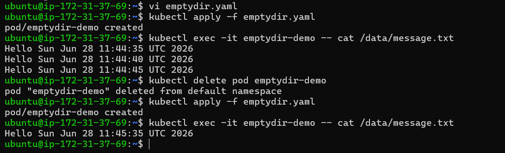
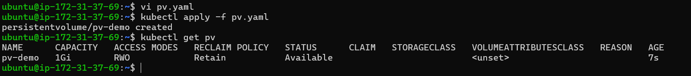
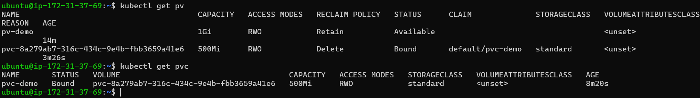
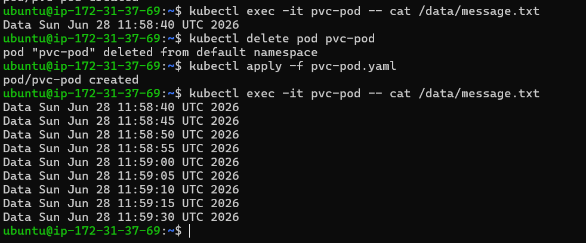
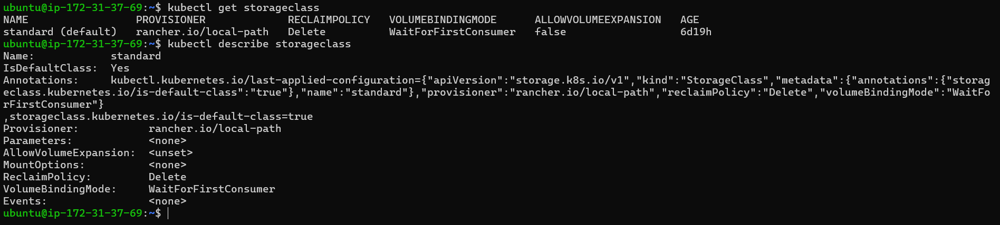
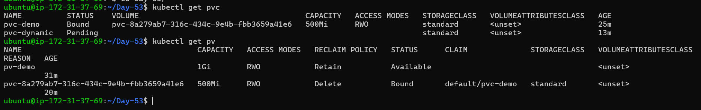
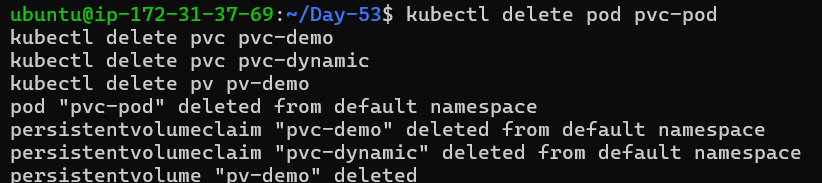

# Day 55 – Persistent Volumes (PV) and Persistent Volume Claims (PVC)

## 1. Introduction

In Kubernetes, containers are ephemeral. This means when a Pod is deleted or restarted, all data inside it is lost.

This becomes a serious issue for applications like databases, file storage, and logs.

To solve this, Kubernetes provides:
- Persistent Volumes (PV)
- Persistent Volume Claims (PVC)

---

## 2. Key Concepts

### Persistent Volume (PV)
A PV is a storage resource in the cluster.

- It is independent of Pods
- Created manually or dynamically
- Exists at cluster level

### Persistent Volume Claim (PVC)
A PVC is a request for storage.

- Created by users/applications
- Requests storage size and access mode
- Kubernetes binds it to a matching PV

---

## 3. How PV and PVC Work

Pod → PVC → PV → Actual Storage

---

## 4. Access Modes

- ReadWriteOnce (RWO): Single node read/write
- ReadOnlyMany (ROX): Multiple nodes read-only
- ReadWriteMany (RWX): Multiple nodes read/write

---

## 5. Reclaim Policies

- Retain: Keeps data after PVC deletion
- Delete: Deletes volume automatically
- Recycle: Deprecated

---

## 6. Task 1 – emptyDir (Data Loss Example)

### Pod YAML

```yaml
apiVersion: v1
kind: Pod
metadata:
  name: emptydir-demo
spec:
  containers:
  - name: app
    image: busybox
    command: ["/bin/sh", "-c"]
    args:
      - while true; do
          echo "Hello $(date)" >> /data/message.txt;
          sleep 5;
        done
    volumeMounts:
    - name: data
      mountPath: /data
  volumes:
  - name: data
    emptyDir: {}
````

### Run

```bash
kubectl apply -f emptydir.yaml
kubectl exec -it emptydir-demo -- cat /data/message.txt
```

### Delete and recreate Pod

```bash
kubectl delete pod emptydir-demo
kubectl apply -f emptydir.yaml
kubectl exec -it emptydir-demo -- cat /data/message.txt
```

### Observation

Data is lost after Pod deletion.

---
   

## 7. Task 2 – Create PersistentVolume (PV)

### PV YAML

```yaml
apiVersion: v1
kind: PersistentVolume
metadata:
  name: pv-demo
spec:
  capacity:
    storage: 1Gi
  accessModes:
    - ReadWriteOnce
  persistentVolumeReclaimPolicy: Retain
  hostPath:
    path: /tmp/k8s-pv-data
```

### Apply

```bash
kubectl apply -f pv.yaml
kubectl get pv
```

### Status

* Available (before binding)

---

  

## 8. Task 3 – Create PersistentVolumeClaim (PVC)

### PVC YAML

```yaml
apiVersion: v1
kind: PersistentVolumeClaim
metadata:
  name: pvc-demo
spec:
  accessModes:
    - ReadWriteOnce
  resources:
    requests:
      storage: 500Mi
```

### Apply

```bash
kubectl apply -f pvc.yaml
kubectl get pvc
kubectl get pv
```

### Status

* PVC → Bound
* PV → Bound

---
  

## 9. Task 4 – Use PVC in Pod

### Pod YAML

```yaml
apiVersion: v1
kind: Pod
metadata:
  name: pvc-pod
spec:
  containers:
  - name: app
    image: busybox
    command: ["/bin/sh", "-c"]
    args:
      - while true; do
          echo "Data $(date)" >> /data/message.txt;
          sleep 5;
        done
    volumeMounts:
    - name: storage
      mountPath: /data
  volumes:
  - name: storage
    persistentVolumeClaim:
      claimName: pvc-demo
```

### Test

```bash
kubectl apply -f pvc-pod.yaml
kubectl exec -it pvc-pod -- cat /data/message.txt
```

### Delete and recreate Pod

```bash
kubectl delete pod pvc-pod
kubectl apply -f pvc-pod.yaml
kubectl exec -it pvc-pod -- cat /data/message.txt
```

### Observation

Data persists across Pod restarts.

---
 

## 10. Task 5 – StorageClass

```bash
kubectl get storageclass
kubectl describe storageclass
```

### Key Info

* Provisioner: creates storage
* ReclaimPolicy: behavior after deletion
* BindingMode: when volume attaches

Default usually:

* standard

---
 

## 11. Task 6 – Dynamic Provisioning

### PVC with StorageClass

```yaml
apiVersion: v1
kind: PersistentVolumeClaim
metadata:
  name: pvc-dynamic
spec:
  accessModes:
    - ReadWriteOnce
  storageClassName: standard
  resources:
    requests:
      storage: 500Mi
```

### Apply

```bash
kubectl apply -f pvc-dynamic.yaml
kubectl get pvc
kubectl get pv
```

### Observation

* PV is created automatically

---
 

## 12. Static vs Dynamic

| Type    | PV Creation | Effort |
| ------- | ----------- | ------ |
| Static  | Manual      | High   |
| Dynamic | Automatic   | Low    |

---

## 13. Cleanup

```bash
kubectl delete pod pvc-pod
kubectl delete pvc pvc-demo
kubectl delete pvc pvc-dynamic
kubectl delete pv pv-demo
```
 

### Behavior

* Dynamic PV → deleted automatically
* Static PV → retained (Released state)

---

## 14. Summary

* Pods are ephemeral
* PV provides storage
* PVC requests storage
* Binding connects them
* StorageClass enables automation

