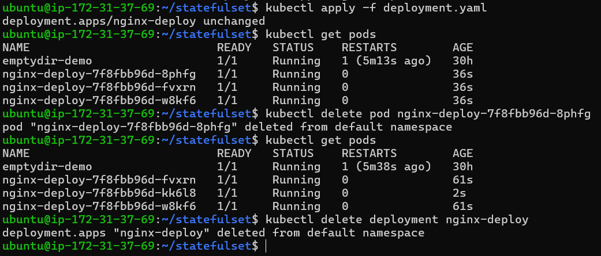
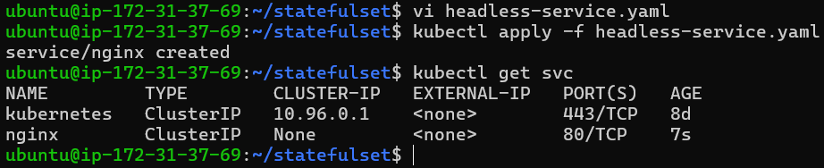
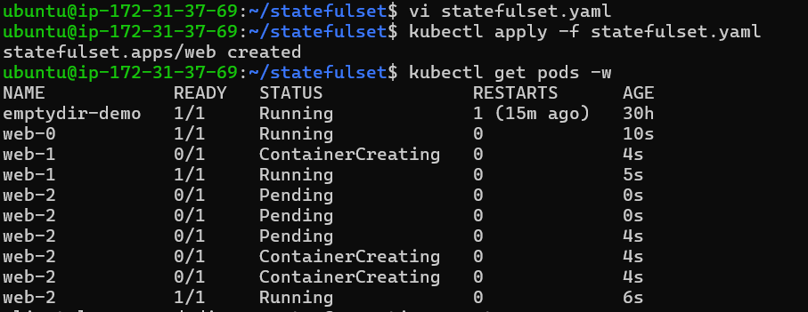
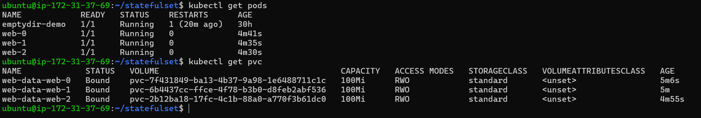
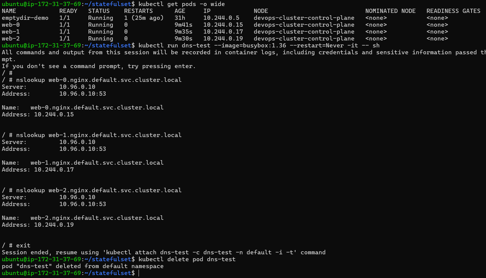
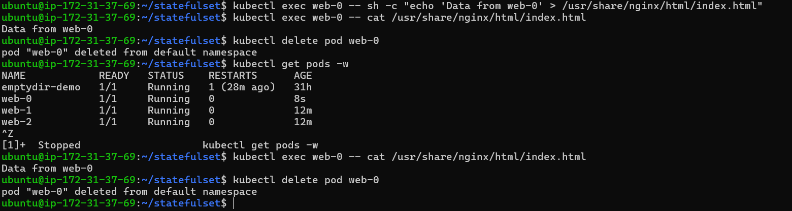
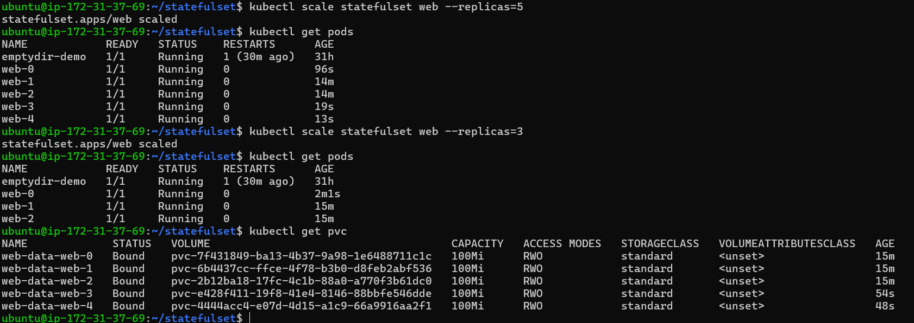
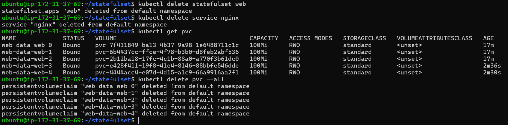

# Day 56 – Kubernetes StatefulSets (Beginner Guide)

> This guide teaches StatefulSets from scratch and walks through every task.

## 1. Why StatefulSets?

### Stateless vs Stateful

**Stateless applications**
- Don't store important data inside the pod.
- If a pod dies, another pod can replace it.
- Examples: Nginx, frontend, REST APIs.

**Stateful applications**
- Store important data.
- Need stable identity and storage.
- Examples: MySQL, PostgreSQL, MongoDB, Kafka, Redis.

### Why Deployments are not enough?

Deployment pods have random names:

```
nginx-6b7c9d8f9-abc12
nginx-6b7c9d8f9-def34
nginx-6b7c9d8f9-ghi56
```

Delete one pod:

```
kubectl delete pod nginx-6b7c9d8f9-abc12
```

Replacement:

```
nginx-6b7c9d8f9-xyz99
```

Identity changes. Databases cannot rely on this.

## Deployment vs StatefulSet

|Feature|Deployment|StatefulSet|
|---|---|---|
|Pod names|Random|Stable (`web-0`,`web-1`)|
|Startup|Parallel|Ordered|
|Shutdown|Random|Reverse order|
|Storage|Usually shared|One PVC per Pod|
|DNS|No stable hostname|Stable hostname|

## 2. Stable Pod Identity

StatefulSet pods are always:

```
web-0
web-1
web-2
```

Delete `web-0`:

```
kubectl delete pod web-0
```

New pod is again:

```
web-0
```

## 3. Stable Storage

Each pod owns its own PVC.

```
web-0 --> pvc-web-0
web-1 --> pvc-web-1
web-2 --> pvc-web-2
```

Deleting the pod does NOT delete the PVC.

## 4. Headless Service

Normal Service:

```
Client -> Service -> Any Pod
```

Headless Service (`clusterIP: None`):

```
web-0.nginx.default.svc.cluster.local
web-1.nginx.default.svc.cluster.local
web-2.nginx.default.svc.cluster.local
```

Each pod has its own DNS.

## 5. volumeClaimTemplates

Instead of creating PVCs manually, StatefulSet creates one PVC per replica.

## Task 1

### deployment.yaml

```yaml
apiVersion: apps/v1
kind: Deployment
metadata:
  name: nginx-deploy
spec:
  replicas: 3
  selector:
    matchLabels:
      app: nginx
  template:
    metadata:
      labels:
        app: nginx
    spec:
      containers:
      - name: nginx
        image: nginx
```

Apply:

```bash
kubectl apply -f deployment.yaml
kubectl get pods
```

Delete one pod:

```bash
kubectl delete pod <pod-name>
```

Observe new random name.

Delete deployment:

```bash
kubectl delete deployment nginx-deploy
```

 

**Verification:** Random names make database clustering difficult because nodes cannot be identified consistently.

## Task 2 Headless Service

## Why do we need a Headless Service?

A normal Kubernetes Service load-balances traffic across all matching Pods, which means you cannot communicate with a specific Pod. However, Stateful applications like MySQL, PostgreSQL, Kafka, and MongoDB require each Pod to have a stable network identity so they can communicate with one another reliably.

By setting:

```yaml
clusterIP: None
```

we create a **Headless Service**. Instead of assigning a single ClusterIP and load-balancing requests, Kubernetes creates a unique DNS record for each StatefulSet Pod.

Example:

```text
web-0.nginx.default.svc.cluster.local
web-1.nginx.default.svc.cluster.local
web-2.nginx.default.svc.cluster.local
```

This allows applications to reach a specific Pod directly, which is essential for database replication, clustering, and leader election.

**Verification:** Running `kubectl get svc` should show `CLUSTER-IP` as `None`.


```yaml
apiVersion: v1
kind: Service
metadata:
  name: nginx
spec:
  clusterIP: None
  selector:
    app: web
  ports:
  - port: 80
```

Apply:

```bash
kubectl apply -f headless-service.yaml
kubectl get svc
```

Expected:

```
NAME    TYPE       CLUSTER-IP
nginx   ClusterIP  None
```
 


## Task 3: Create a StatefulSet

### Why do we need a StatefulSet?

A Deployment is designed for **stateless applications**, where Pods can be created or replaced with random names. However, stateful applications (such as databases) require each Pod to have:

* A **stable name** (e.g., `web-0`, `web-1`, `web-2`)
* Its **own persistent storage**
* An **ordered startup and shutdown**

A StatefulSet provides all these features.

### StatefulSet Manifest

```yaml
apiVersion: apps/v1
kind: StatefulSet
metadata:
  name: web
spec:
  serviceName: nginx
  replicas: 3
  selector:
    matchLabels:
      app: web
  template:
    metadata:
      labels:
        app: web
    spec:
      containers:
      - name: nginx
        image: nginx
        volumeMounts:
        - name: web-data
          mountPath: /usr/share/nginx/html
  volumeClaimTemplates:
  - metadata:
      name: web-data
    spec:
      accessModes:
      - ReadWriteOnce
      resources:
        requests:
          storage: 100Mi
```

### Understanding the Important Fields

* **`serviceName: nginx`** – Connects the StatefulSet to the Headless Service created in Task 2. This enables stable DNS names for each Pod.
* **`replicas: 3`** – Creates three Pods: `web-0`, `web-1`, and `web-2`.
* **`volumeClaimTemplates`** – Automatically creates a separate Persistent Volume Claim (PVC) for each Pod, so every Pod gets its own storage.
* **`volumeMounts`** – Mounts the PVC inside the container at `/usr/share/nginx/html`.

### Apply the StatefulSet

```bash
kubectl apply -f statefulset.yaml
```

Watch the Pods being created:

```bash
kubectl get pods -l app=web -w
```

Notice that Kubernetes creates the Pods **one at a time**:

```text
web-0
web-1
web-2
```

It waits for `web-0` to become **Ready** before creating `web-1`, and waits for `web-1` before creating `web-2`.

### Verify the PVCs

```bash
kubectl get pvc
```

Expected output:

```text
web-data-web-0
web-data-web-1
web-data-web-2
```
 
Each Pod has its **own dedicated PVC**, ensuring that data is not shared between Pods.

### Why is this important?

Unlike a Deployment, a StatefulSet guarantees:

* Stable Pod names
* Stable network identity
* One persistent storage volume per Pod
* Ordered Pod creation and deletion

These features are essential for stateful applications such as MySQL, PostgreSQL, MongoDB, Kafka, and Redis.


```yaml
apiVersion: apps/v1
kind: StatefulSet
metadata:
  name: web
spec:
  serviceName: nginx
  replicas: 3
  selector:
    matchLabels:
      app: web
  template:
    metadata:
      labels:
        app: web
    spec:
      containers:
      - name: nginx
        image: nginx
        volumeMounts:
        - name: web-data
          mountPath: /usr/share/nginx/html
  volumeClaimTemplates:
  - metadata:
      name: web-data
    spec:
      accessModes:
      - ReadWriteOnce
      resources:
        requests:
          storage: 100Mi
```

Explanation:
- `serviceName`: links StatefulSet to Headless Service.
- `replicas`: creates 3 pods.
- `volumeClaimTemplates`: one PVC per pod.
- `mountPath`: mounts storage into nginx html folder.

Apply:

```bash
kubectl apply -f statefulset.yaml
kubectl get pods -w
```

Creation order:

```
web-0
web-1
web-2
```

PVCs:

```bash
kubectl get pvc
```

Expected:

```
web-data-web-0
web-data-web-1
web-data-web-2
```
 

## Task 4 DNS

Get pod IPs:

```bash
kubectl get pods -o wide
```

Run BusyBox:

```bash
kubectl run dns-test --image=busybox:1.36 --restart=Never -it -- sh
```

Inside:

```sh
nslookup web-0.nginx.default.svc.cluster.local
nslookup web-1.nginx.default.svc.cluster.local
nslookup web-2.nginx.default.svc.cluster.local
```

Verify returned IPs equal pod IPs.

Exit:

```sh
exit
kubectl delete pod dns-test
```
 

## Task 5 Persistence

Write data:

```bash
kubectl exec web-0 -- sh -c "echo 'Data from web-0' > /usr/share/nginx/html/index.html"
```

Check:

```bash
kubectl exec web-0 -- cat /usr/share/nginx/html/index.html
```

Delete pod:

```bash
kubectl delete pod web-0
```

Wait:

```bash
kubectl get pods -w
```

Read file again.

Expected:

```
Data from web-0
```
 
Reason: pod recreated and attached to same PVC.

## Task 6 Scaling

Scale up:

```bash
kubectl scale statefulset web --replicas=5
```

Observe:

```
web-3
web-4
```

Scale down:

```bash
kubectl scale statefulset web --replicas=3
```

Deletion order:

```
web-4
web-3
```

PVCs remain:

```bash
kubectl get pvc
```

Five PVCs still exist.
 

## Task 7 Cleanup

```bash
kubectl delete statefulset web
kubectl delete service nginx
kubectl get pvc
```

PVCs remain.

Delete them:

```bash
kubectl delete pvc --all
```
 

## Common Errors

- Pods Pending → no StorageClass/provisioner.
- DNS fails → Headless Service name mismatch.
- serviceName mismatch → StatefulSet won't get stable DNS.
- Wrong labels → Service won't discover pods.

## Interview Questions

1. What problem does StatefulSet solve?
2. Difference between Deployment and StatefulSet?
3. Why Headless Service?
4. Why stable DNS?
5. Why one PVC per pod?
6. Why are PVCs preserved after deletion?

## Revision

- Deployment = Stateless.
- StatefulSet = Stateful.
- Stable pod names.
- Stable DNS.
- One PVC per pod.
- Ordered startup.
- Reverse shutdown.
- PVCs survive scaling and deletion.
