# Day 57 – Resource Requests, Limits, and Probes

## Objective

In this lab, you will learn how Kubernetes manages CPU and memory resources, how Pods behave when they exceed resource limits, and how health probes (Liveness, Readiness, and Startup) help Kubernetes automatically manage application health.

---

# Task 1 – Resource Requests and Limits

## What you will learn

Resource **requests** tell the Kubernetes scheduler the minimum CPU and memory a Pod needs before it can be scheduled onto a node. Resource **limits** define the maximum CPU and memory the container is allowed to consume at runtime. Kubernetes uses these values to schedule workloads efficiently and prevent one Pod from consuming all available resources.

## Create the Pod

Create `resource-pod.yaml`

```yaml
apiVersion: v1
kind: Pod
metadata:
  name: resource-pod
spec:
  containers:
  - name: nginx
    image: nginx
    resources:
      requests:
        cpu: "100m"
        memory: "128Mi"
      limits:
        cpu: "250m"
        memory: "256Mi"
```

## Apply

```bash
kubectl apply -f resource-pod.yaml
```

## Verify

Check the Pod:

```bash
kubectl get pod
```

Describe the Pod:

```bash
kubectl describe pod resource-pod
```

Look for:

* Requests
* Limits
* QoS Class

Example:

```
Requests:
  cpu:     100m
  memory:  128Mi

Limits:
  cpu:     250m
  memory:  256Mi

QoS Class: Burstable
```
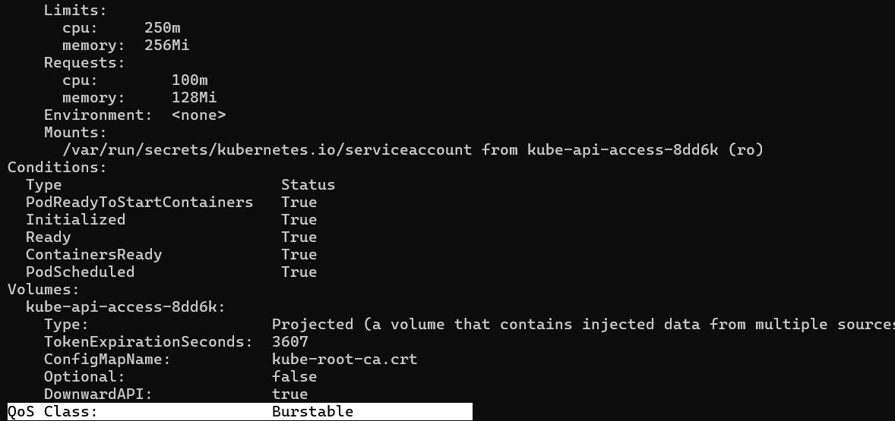 
### Verification Answer

**QoS Class:** `Burstable`

Because the requests are lower than the limits.

---

# Task 2 – OOMKilled (Memory Limit Exceeded)

## What you will learn

Unlike CPU, memory cannot be compressed. If a container uses more memory than its configured limit, Kubernetes immediately terminates it with an **OOMKilled** event. The container exits with status code **137**, which indicates it received a SIGKILL from the kernel due to running out of memory.

## Create the Pod

Create `oom-pod.yaml`

```yaml
apiVersion: v1
kind: Pod
metadata:
  name: oom-pod
spec:
  containers:
  - name: stress
    image: polinux/stress
    command: ["stress"]
    args: ["--vm", "1", "--vm-bytes", "200M", "--vm-hang", "1"]
    resources:
      limits:
        memory: "100Mi"
```

## Apply

```bash
kubectl apply -f oom-pod.yaml
```

Watch the Pod

```bash
kubectl get pod -w
```

Describe the Pod

```bash
kubectl describe pod oom-pod
```

Look for

```
Reason: OOMKilled
Exit Code: 137
```

You can also check:

```bash
kubectl get pod oom-pod
```

or

```bash
kubectl logs oom-pod
```
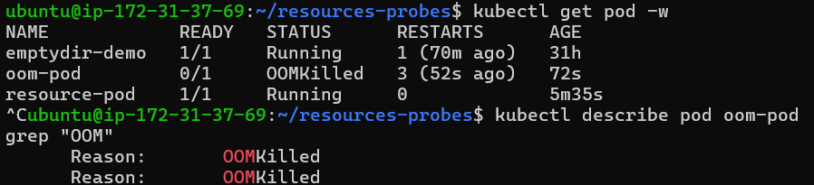 
 
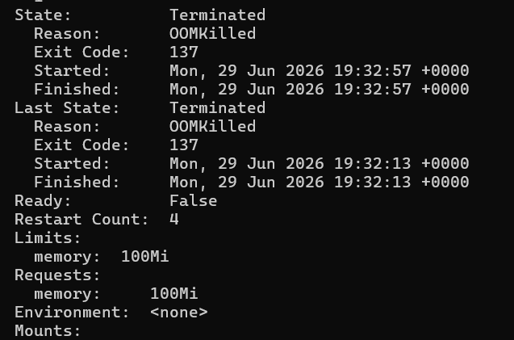 
### Verification Answer

**Exit Code:** `137`

---

# Task 3 – Pending Pod (Insufficient Resources)

## What you will learn

If a Pod requests more CPU or memory than any node in the cluster can provide, Kubernetes cannot schedule it. The Pod remains in the **Pending** state until enough resources become available or the resource requests are reduced.

## Create the Pod

Create `pending-pod.yaml`

```yaml
apiVersion: v1
kind: Pod
metadata:
  name: pending-pod
spec:
  containers:
  - name: nginx
    image: nginx
    resources:
      requests:
        cpu: "100"
        memory: "128Gi"
```

## Apply

```bash
kubectl apply -f pending-pod.yaml
```

Check the Pod

```bash
kubectl get pod
```

It should remain

```
STATUS: Pending
```

Describe the Pod

```bash
kubectl describe pod pending-pod
```

Look under Events.

Example:

```
0/1 nodes are available: 1 Insufficient cpu, Insufficient memory.
```

### Verification Answer

Scheduler event:

```
0/1 nodes are available: 1 Insufficient cpu, Insufficient memory.
```
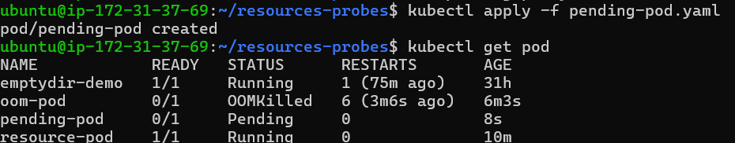 
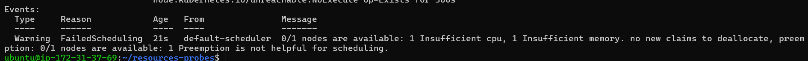 
---

# Task 4 – Liveness Probe

## What you will learn

A liveness probe checks whether a container is still functioning correctly. If the probe fails repeatedly, Kubernetes automatically restarts the container to recover from failures.

## Create the Pod

Create `liveness-pod.yaml`

```yaml
apiVersion: v1
kind: Pod
metadata:
  name: liveness-pod
spec:
  containers:
  - name: busybox
    image: busybox
    command:
      - sh
      - -c
      - touch /tmp/healthy; sleep 30; rm -f /tmp/healthy; sleep 600
    livenessProbe:
      exec:
        command:
        - cat
        - /tmp/healthy
      periodSeconds: 5
      failureThreshold: 3
```

## Apply

```bash
kubectl apply -f liveness-pod.yaml
```

Watch the Pod

```bash
kubectl get pod -w
```

Describe the Pod

```bash
kubectl describe pod liveness-pod
```

Check restart count

```bash
kubectl get pod liveness-pod
```

or

```bash
kubectl describe pod liveness-pod
```

Look for

```
Restart Count
```
 
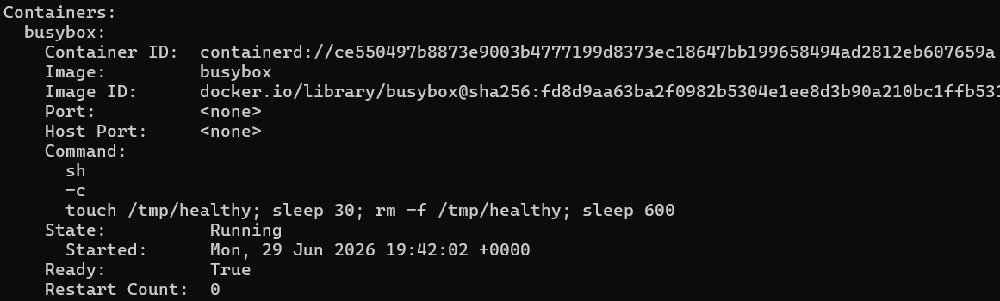 
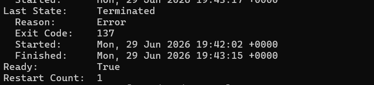 

### Verification Answer

The container should restart after three consecutive probe failures. The restart count should increase from **0** to **1** (and continue increasing if the same failure repeats).

---

# Task 5 – Readiness Probe

## What you will learn

A readiness probe determines whether a Pod is ready to receive traffic. If it fails, Kubernetes removes the Pod from the Service endpoints, but it does not restart the container because the application may still be running.

## Create the Pod

Create `readiness-pod.yaml`

```yaml
apiVersion: v1
kind: Pod
metadata:
  name: readiness-pod
  labels:
    app: readiness
spec:
  containers:
  - name: nginx
    image: nginx
    readinessProbe:
      httpGet:
        path: /
        port: 80
      periodSeconds: 5
```

## Apply

```bash
kubectl apply -f readiness-pod.yaml
```

Expose the Pod

```bash
kubectl expose pod readiness-pod --port=80 --name=readiness-svc
```

Check endpoints

```bash
kubectl get endpoints readiness-svc
```

Break the readiness probe

```bash
kubectl exec readiness-pod -- rm /usr/share/nginx/html/index.html
```

Wait about 15 seconds.

Check

```bash
kubectl get pod
```

Expected

```
READY 0/1
```

Check endpoints again

```bash
kubectl get endpoints readiness-svc
```
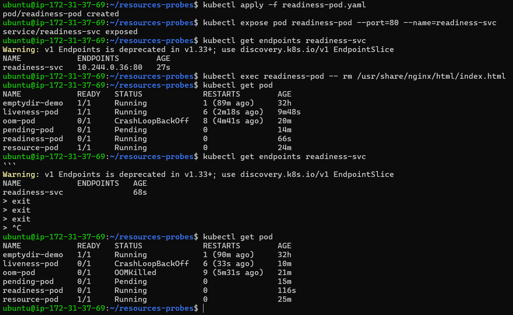 
The endpoint should be empty.

### Verification Answer

**No.** The container is **not restarted**. It is only removed from the Service endpoints.

---

# Task 6 – Startup Probe

## What you will learn

A startup probe is designed for applications that take a long time to initialize. While the startup probe is running, Kubernetes ignores both liveness and readiness probes. This prevents slow-starting applications from being killed before they have finished starting.

## Create the Pod

Create `startup-pod.yaml`

```yaml
apiVersion: v1
kind: Pod
metadata:
  name: startup-pod
spec:
  containers:
  - name: busybox
    image: busybox
    command:
    - sh
    - -c
    - sleep 20 && touch /tmp/started && sleep 600

    startupProbe:
      exec:
        command:
        - cat
        - /tmp/started
      periodSeconds: 5
      failureThreshold: 12

    livenessProbe:
      exec:
        command:
        - cat
        - /tmp/started
      periodSeconds: 5
```

## Apply

```bash
kubectl apply -f startup-pod.yaml
```

Check the Pod

```bash
kubectl get pod -w
```

Describe the Pod

```bash
kubectl describe pod startup-pod
```
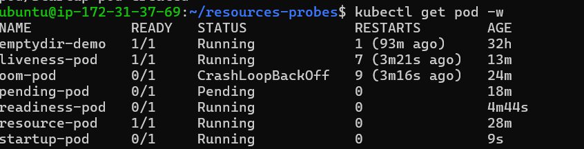 
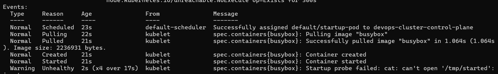 
### Verification Answer

If **failureThreshold** were **2**, Kubernetes would allow only **10 seconds** (2 × 5 seconds) before declaring startup failure. Since the application needs about **20 seconds** to start, Kubernetes would repeatedly kill and restart the container, resulting in a CrashLoopBackOff.

---

# Task 7 – Clean Up

Delete all Pods

```bash
kubectl delete pod resource-pod
kubectl delete pod oom-pod
kubectl delete pod pending-pod
kubectl delete pod liveness-pod
kubectl delete pod readiness-pod
kubectl delete pod startup-pod
```

Delete the Service

```bash
kubectl delete svc readiness-svc
```

Or delete everything at once

```bash
kubectl delete pod --all
kubectl delete svc readiness-svc
```
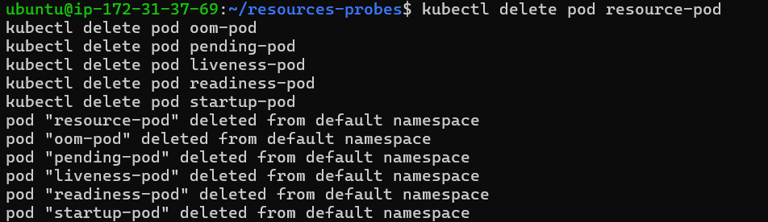 
---

# Key Concepts

## Requests vs Limits

| Requests                                | Limits                                  |
| --------------------------------------- | --------------------------------------- |
| Minimum resources guaranteed to the Pod | Maximum resources the container can use |
| Used by the scheduler                   | Enforced by the kubelet                 |
| Determines scheduling                   | Prevents resource overuse               |

---

## CPU vs Memory Limits

**CPU**

* Can exceed request
* Gets throttled if it reaches the limit
* Container keeps running

**Memory**

* Cannot exceed limit
* Kernel kills the container
* Results in OOMKilled (Exit Code 137)

---
- Requests vs limits (scheduling vs enforcement)
   * `Requests` : 
      - The minimum amount of CPU/memory a container is guaranteed.
      - Kubernetes uses requests during scheduling: the scheduler ensures the node has at 
        least that much capacity before placing the pod.
   * `Limits` : 
      - The maximum amount of CPU/memory a container can use.
      - Enforced at runtime by the kubelet. If the container tries to exceed the limit,
        it gets throttled (CPU) or killed (OOM for memory).

- What happens when CPU or memory limits are exceeded
   * **CPU** - Container is throttled (slowed down, not killed)
   * **Memory** - Container is killed (OOMKilled) and restarted

- Liveness vs readiness vs startup probes

| Probe Type | Purpose | Action | Use case | In short |
|------------|---------|--------|----------|----------|
| Liveness | Checks if the container is still alive | if failed, restart the container | Detects deadlocks or crashes where the app is running but not functioning | Is the app still running? |
| Readiness | Checks if the container is ready to server traffic | if failed, remove the pod from Service endpoints (no traffic routed to it). | Ensures only healthy pods receive requests | Is the app ready to serve traffic |
| Startup | Gives container time to initialize before other probes run | if failed, kill and restart the container | Useful for apps with long startup times, preventing premature liveness/readiness failures | Has the app started yet? |

---