# Day 59 – Helm: Kubernetes Package Manager

## Objective

In this lab, you will learn how to use **Helm**, the package manager for Kubernetes. Instead of manually creating multiple Kubernetes YAML manifests, Helm allows you to package, configure, install, upgrade, and manage applications using reusable charts. You will install Helm, deploy applications from a repository, customize deployments with values, perform upgrades and rollbacks, and finally create your own Helm chart.

---

# Task 1 – Install Helm

## What you will learn

Helm is the package manager for Kubernetes, similar to **apt** on Ubuntu or **yum** on CentOS. Helm packages Kubernetes resources into reusable **Charts**, which can be installed as **Releases** from **Repositories**.

### Install Helm (Linux)

```bash
curl https://raw.githubusercontent.com/helm/helm/main/scripts/get-helm-3 | bash
```

Verify installation:

```bash
helm version
```

Check Helm environment:

```bash
helm env
```

### Three Core Concepts

### Chart

A package containing Kubernetes manifest templates.

### Release

A running instance of a chart installed in a Kubernetes cluster.

### Repository

A collection of Helm charts, similar to an APT repository.

### Verification Answer

```bash
helm version
```

Record the installed Helm version.
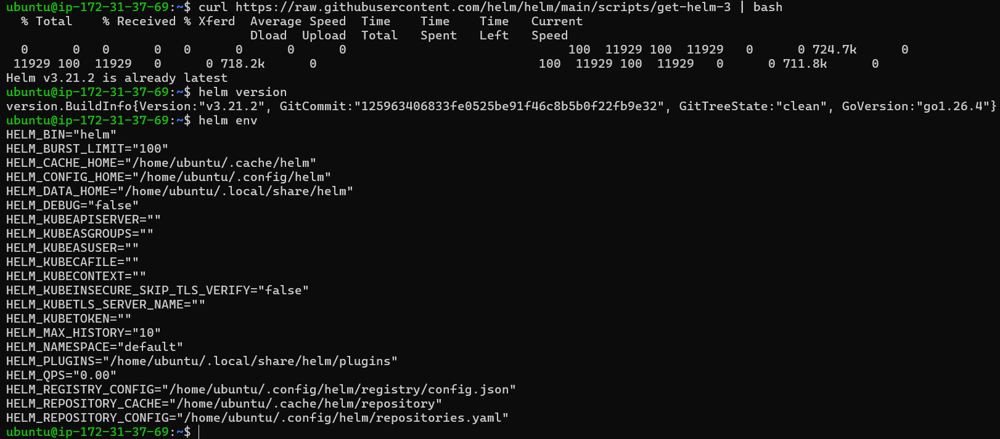 
---

# Task 2 – Add a Repository and Search

## What you will learn

Helm repositories host publicly available charts. Bitnami maintains one of the largest and most popular collections of production-ready Kubernetes applications.

### Add the Bitnami Repository

```bash
helm repo add bitnami https://charts.bitnami.com/bitnami
```

Update repositories:

```bash
helm repo update
```

Search for nginx charts:

```bash
helm search repo nginx
```

Search all Bitnami charts:

```bash
helm search repo bitnami
```
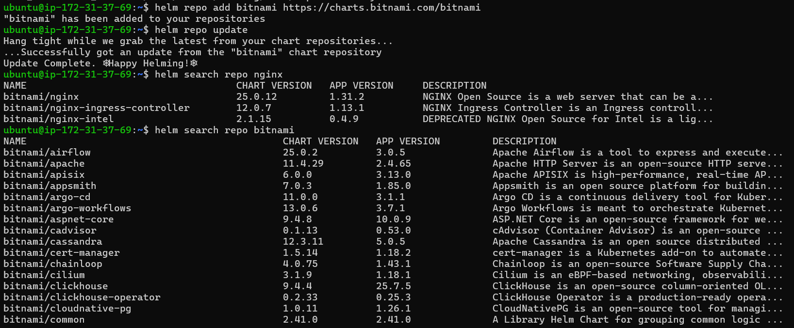 
Count available charts:

```bash
helm search repo bitnami | wc -l
```
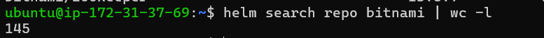 
### Verification Answer

Record how many charts are available in the Bitnami repository.

---

# Task 3 – Install a Chart

## What you will learn

Installing a chart automatically creates all the required Kubernetes resources such as Deployments, Services, ConfigMaps, and Secrets without manually writing YAML files.

Install NGINX:

```bash
helm install my-nginx bitnami/nginx
```
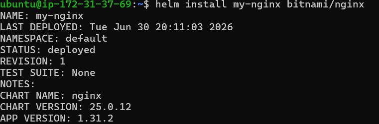 
Check Kubernetes resources:

```bash
kubectl get all
```

List Helm releases:

```bash
helm list
```

Check release status:

```bash
helm status my-nginx
```
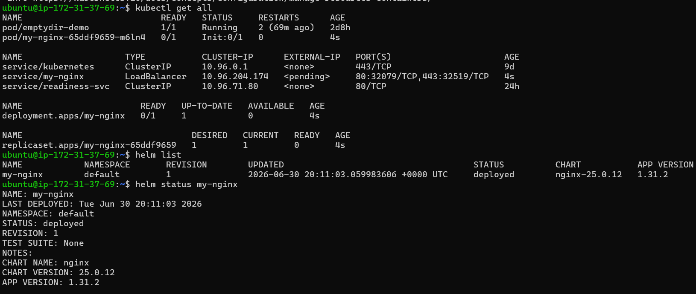 

View generated manifests:

```bash
helm get manifest my-nginx
```
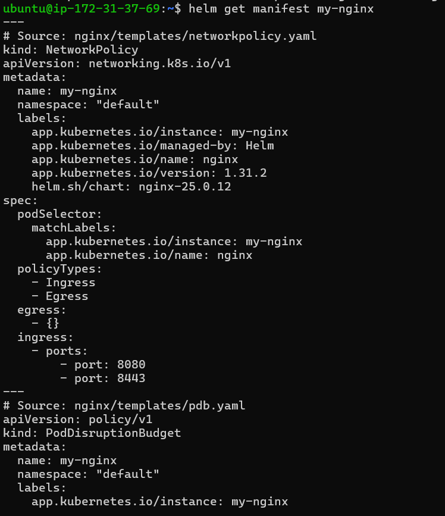 
### Verification Answer

Check Pods:

```bash
kubectl get pods
```

Check Service:

```bash
kubectl get svc
```
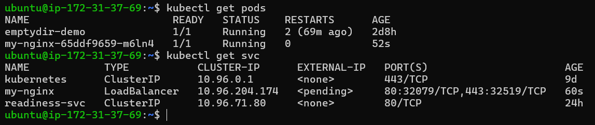 
Record:

* Number of Pods running
* Service type (ClusterIP, NodePort, or LoadBalancer)

---

# Task 4 – Customize with Values

## What you will learn

Helm charts expose configurable parameters through **values.yaml**. These values allow you to customize an application without modifying the chart templates.

View default values:

```bash
helm show values bitnami/nginx
```
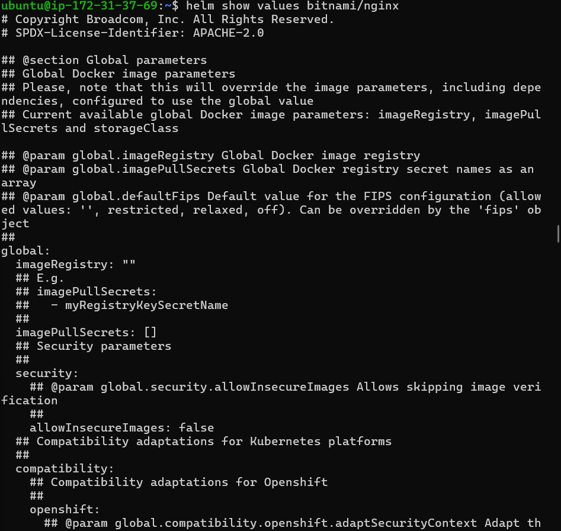 

Install using command-line overrides:

```bash
helm install nginx-cli bitnami/nginx \
--set replicaCount=3 \
--set service.type=NodePort
```
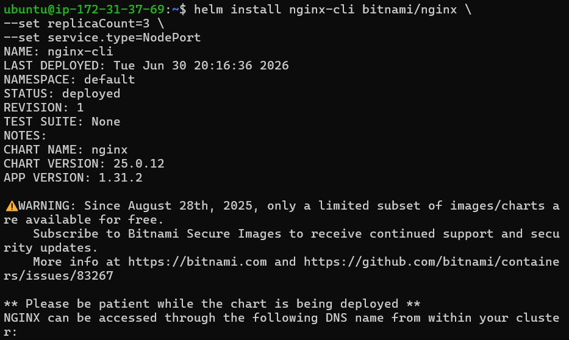 

---

## Create custom-values.yaml

Create a file named:

```text
custom-values.yaml
```

Contents:

```yaml
replicaCount: 3

service:
  type: NodePort

resources:
  requests:
    cpu: 100m
    memory: 128Mi

  limits:
    cpu: 250m
    memory: 256Mi
```

Install using the values file:

```bash
helm install nginx-values bitnami/nginx -f custom-values.yaml
```

Verify custom values:

```bash
helm get values nginx-values
```

Verify Kubernetes objects:

```bash
kubectl get deployment
```

```bash
kubectl get svc
```
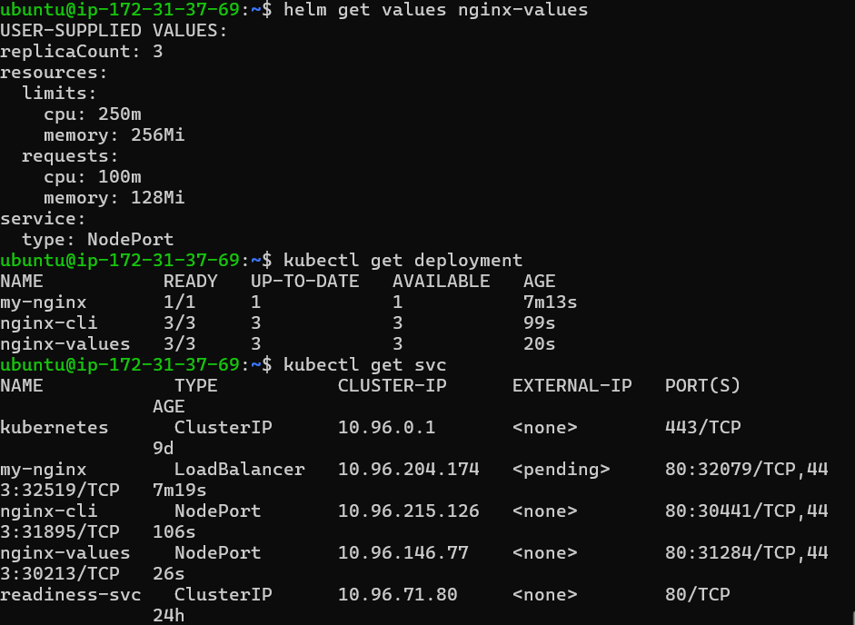 

### Verification Answer

Confirm:

* Replica count = **3**
* Service type = **NodePort**

---

# Task 5 – Upgrade and Rollback

## What you will learn

Helm stores every deployment as a revision. If an upgrade introduces problems, you can quickly roll back to a previous revision.

Upgrade the release:

```bash
helm upgrade my-nginx bitnami/nginx --set replicaCount=5
```
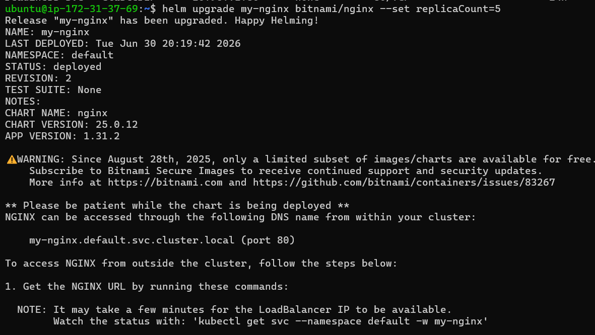 

Verify Deployment:

```bash
kubectl get deployment
```

View history:

```bash
helm history my-nginx
```

Rollback:

```bash
helm rollback my-nginx 1
```

View history again:

```bash
helm history my-nginx
```
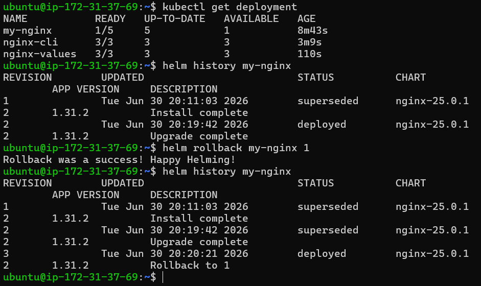 

Expected revisions:

```text
REVISION
1
2
3
```

Revision **3** represents the rollback to revision **1**.

### Verification Answer

After rollback, there should be **3 revisions**.

---

# Task 6 – Create Your Own Helm Chart

## What you will learn

Helm can generate a complete chart structure that you can customize for your own applications. Templates use the Go Template language to dynamically generate Kubernetes manifests.

Create a chart:

```bash
helm create my-app
```
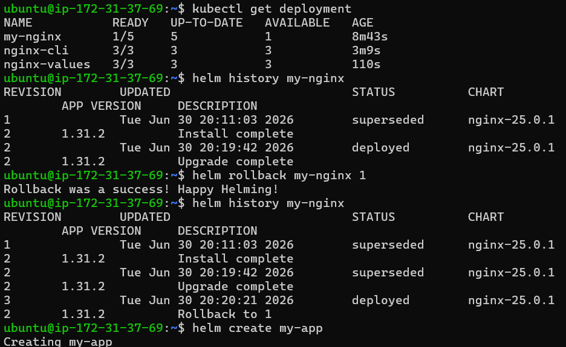 

View directory:

```bash
tree my-app
```

Expected structure:

```text
my-app/
├── Chart.yaml
├── values.yaml
├── charts/
└── templates/
    ├── deployment.yaml
    ├── service.yaml
    ├── ingress.yaml
    ├── serviceaccount.yaml
    ├── hpa.yaml
    ├── NOTES.txt
    └── tests/
```

---

## Explore Important Files

### Chart.yaml

Contains chart metadata such as:

* Name
* Version
* Description

### values.yaml

Stores configurable variables.

### templates/

Contains Kubernetes manifests using Go templates.

Examples:

```yaml
{{ .Values.replicaCount }}
```

```yaml
{{ .Chart.Name }}
```

```yaml
{{ .Release.Name }}
```

---

## Edit values.yaml

Change:

```yaml
replicaCount: 3
```

Update image:

```yaml
image:
  repository: nginx
  tag: "1.25"
```

---

## Validate Chart

```bash
helm lint my-app
```

Expected:

```text
1 chart(s) linted, 0 chart(s) failed
```

---

## Preview Templates

Render manifests without installing:

```bash
helm template my-release ./my-app
```

---

## Install the Chart

```bash
helm install my-release ./my-app
```

Check resources:

```bash
kubectl get deployment
```

There should be **3 replicas**.

Upgrade:

```bash
helm upgrade my-release ./my-app --set replicaCount=5
```

Verify:

```bash
kubectl get deployment
```

Now there should be **5 replicas**.

### Verification Answer

* After install → **3 replicas**
* After upgrade → **5 replicas**
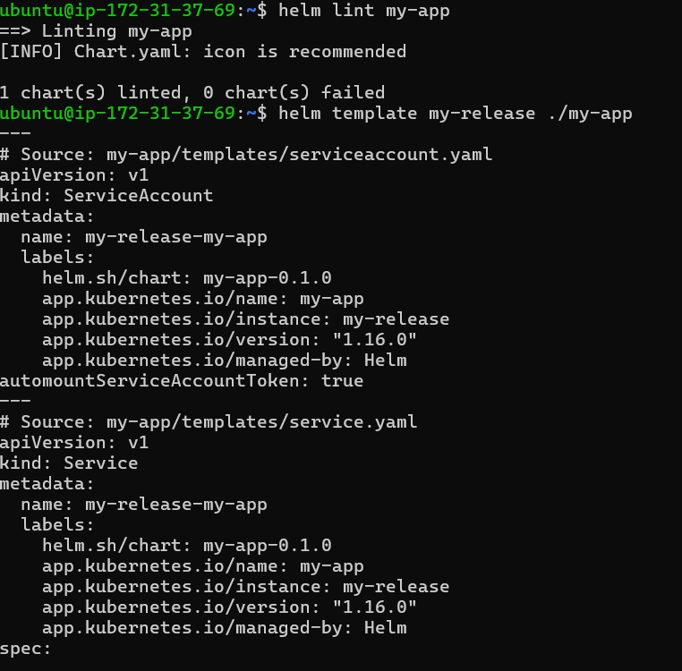 
---

# Task 7 – Clean Up

List releases:

```bash
helm list
```

Remove all releases:

```bash
helm uninstall my-nginx
```

```bash
helm uninstall nginx-cli
```

```bash
helm uninstall nginx-values
```

```bash
helm uninstall my-release
```

(Optional) Keep release history:

```bash
helm uninstall my-release --keep-history
```

Delete local files:

```bash
rm custom-values.yaml
```

```bash
rm -rf my-app
```

Verify:

```bash
helm list
```

Expected:

```text
No releases found.
```
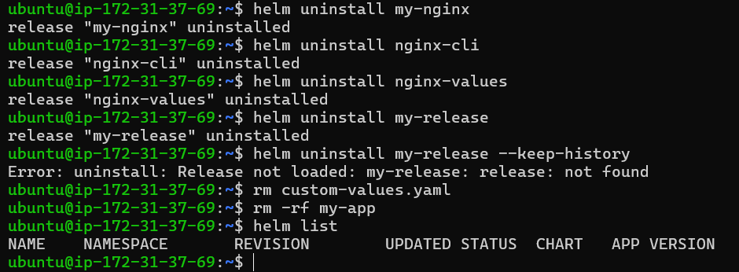 

### Verification Answer

`helm list` should display **zero releases**.

---

# Key Concepts

## What is Helm?

Helm is the package manager for Kubernetes that simplifies deploying and managing applications by packaging Kubernetes manifests into reusable charts.

---

## Three Core Concepts

| Concept    | Description                               |
| ---------- | ----------------------------------------- |
| Chart      | A package containing Kubernetes templates |
| Release    | A deployed instance of a chart            |
| Repository | A collection of Helm charts               |

---

## Helm Workflow

1. Add a repository.
2. Search for a chart.
3. Install a release.
4. Customize using values.
5. Upgrade when needed.
6. Roll back if necessary.
7. Uninstall when finished.

---

## Go Template Variables

Common template variables include:

```yaml
{{ .Values.replicaCount }}
```

Reads values from **values.yaml**.

```yaml
{{ .Chart.Name }}
```

Returns the chart name.

```yaml
{{ .Release.Name }}
```

Returns the installed release name.

---

## Helm Commands Summary

| Command             | Purpose                             |
| ------------------- | ----------------------------------- |
| `helm install`      | Install a chart                     |
| `helm list`         | List releases                       |
| `helm status`       | View release status                 |
| `helm get manifest` | Show generated manifests            |
| `helm get values`   | Show overridden values              |
| `helm show values`  | View default chart values           |
| `helm upgrade`      | Upgrade a release                   |
| `helm rollback`     | Roll back to a previous revision    |
| `helm history`      | Show revision history               |
| `helm template`     | Render manifests without installing |
| `helm lint`         | Validate a chart                    |
| `helm uninstall`    | Remove a release                    |

---

# custom-values.yaml Explanation

```yaml
replicaCount: 3
```

Deploys three Pod replicas.

```yaml
service:
  type: NodePort
```

Exposes the application using a NodePort Service.

```yaml
resources:
  requests:
    cpu: 100m
    memory: 128Mi
```

Defines minimum CPU and memory requirements for scheduling.

```yaml
limits:
  cpu: 250m
  memory: 256Mi
```

Restricts the maximum CPU and memory usage of each container.
