# Day 60 – Kubernetes Capstone Notes

> These notes explain **what to do**, **why you are doing it**, and **how to verify** every task in the capstone project.

# Project Goal

Deploy a complete **WordPress + MySQL** application on Kubernetes using all major concepts learned in Days 52–59.

Architecture:

```text
Browser
   |
NodePort Service
   |
WordPress Deployment (2 Pods)
   |
ConfigMap + Secret
   |
MySQL Headless Service
   |
MySQL StatefulSet
   |
Persistent Volume Claim
   |
Persistent Volume
```

---

# Task 1 – Namespace

## Why?

Namespaces logically separate applications. Everything in this project is placed inside `capstone` so resources are organized and easy to clean up.

## Commands

```bash
kubectl create namespace capstone
kubectl config set-context --current --namespace=capstone
kubectl get ns
```

## Verify

```bash
kubectl config view --minify
```

Current namespace should be `capstone`.
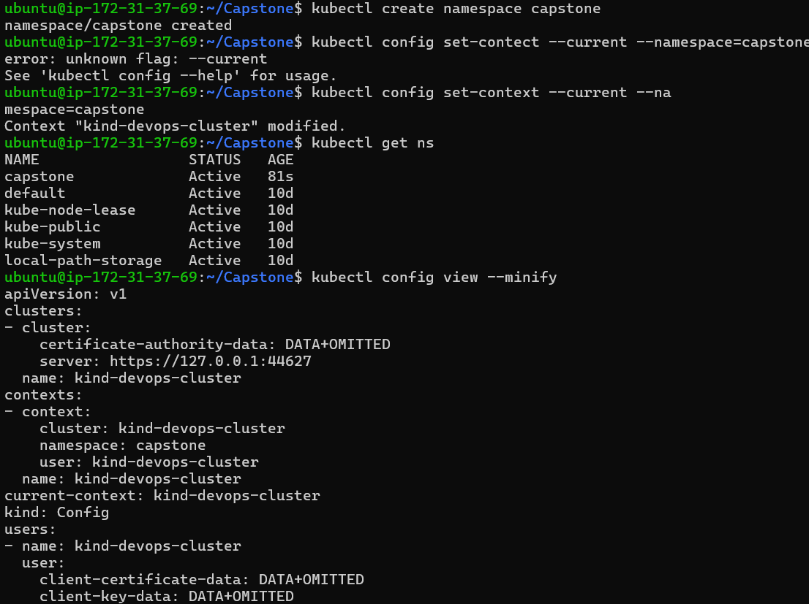 
---

# Task 2 – Deploy MySQL

## Why StatefulSet?

Databases require:

- Stable Pod names
- Stable storage
- Predictable DNS

Deployment cannot guarantee these.

## Why Secret?

Passwords should never be hardcoded in YAML.

Store:

- MYSQL_ROOT_PASSWORD
- MYSQL_DATABASE
- MYSQL_USER
- MYSQL_PASSWORD

using `stringData`.

## Why Headless Service?

StatefulSet Pods need fixed DNS names like

`mysql-0.mysql.capstone.svc.cluster.local`

## Why PVC?

Containers are temporary.

Database data must survive Pod recreation.

PVC provides persistent storage.

## Resources

Requests reserve resources.

Limits prevent one Pod from consuming everything.


## Step 1: Create the Secret

Create a file named `mysql-secret.yaml`.

```yaml
apiVersion: v1
kind: Secret
metadata:
  name: mysql-secret
type: Opaque

stringData:
  MYSQL_ROOT_PASSWORD: root123
  MYSQL_DATABASE: wordpress
  MYSQL_USER: wpuser
  MYSQL_PASSWORD: password123
```

Apply it:

```bash
kubectl apply -f mysql-secret.yaml
```

Verify:

```bash
kubectl get secret
kubectl describe secret mysql-secret
```
 
---

## Step 2: Create the Headless Service

Create a file named `mysql-headless-service.yaml`.

```yaml
apiVersion: v1
kind: Service
metadata:
  name: mysql
spec:
  clusterIP: None
  selector:
    app: mysql
  ports:
    - port: 3306
      targetPort: 3306
```

Apply:

```bash
kubectl apply -f mysql-headless-service.yaml
```

Verify:

```bash
kubectl get svc
```

Expected:

```
NAME      TYPE        CLUSTER-IP   PORT(S)
mysql     ClusterIP   None         3306/TCP
```
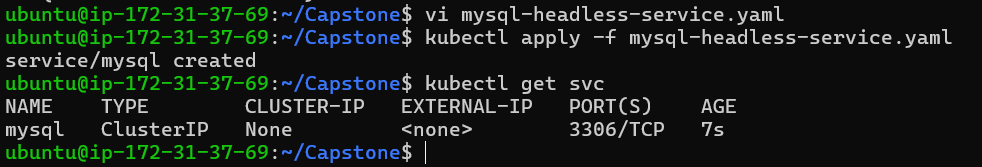 
---

## Step 3: Create the StatefulSet

Create a file named `mysql-statefulset.yaml`.

```yaml
apiVersion: apps/v1
kind: StatefulSet
metadata:
  name: mysql
spec:
  serviceName: mysql
  replicas: 1

  selector:
    matchLabels:
      app: mysql

  template:
    metadata:
      labels:
        app: mysql

    spec:
      containers:
      - name: mysql
        image: mysql:8.0

        ports:
        - containerPort: 3306

        envFrom:
        - secretRef:
            name: mysql-secret

        resources:
          requests:
            cpu: "250m"
            memory: "512Mi"
          limits:
            cpu: "500m"
            memory: "1Gi"

        volumeMounts:
        - name: mysql-storage
          mountPath: /var/lib/mysql

  volumeClaimTemplates:
  - metadata:
      name: mysql-storage

    spec:
      accessModes:
      - ReadWriteOnce

      resources:
        requests:
          storage: 1Gi
```

Apply:

```bash
kubectl apply -f mysql-statefulset.yaml
```
---

## Step 4: Verify Resources

Check StatefulSet:

```bash
kubectl get statefulset
```

Check Pod:

```bash
kubectl get pods
```
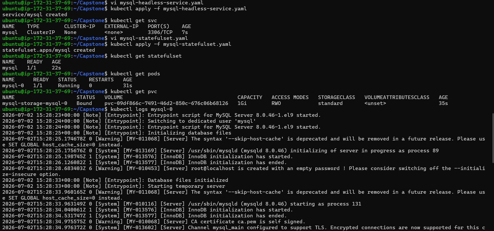 

Check PVC:

```bash
kubectl get pvc
```

Check Logs:

```bash
kubectl logs mysql-0
```

---

## Step 5: Verify MySQL

Open the MySQL client:

```bash
kubectl exec -it mysql-0 -- mysql -u wpuser -ppassword123
```

Inside MySQL:

```sql
SHOW DATABASES;
```

Expected output:

```
information_schema
mysql
performance_schema
wordpress
```

Exit MySQL:

```sql
exit
```
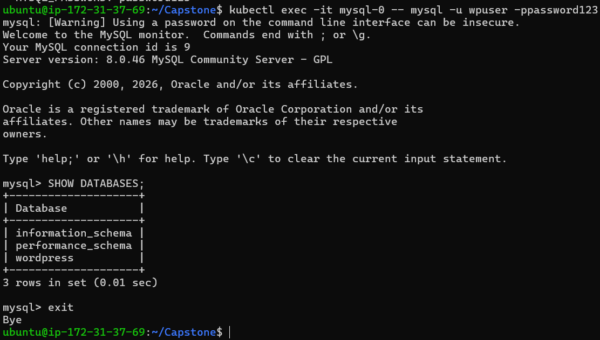 
---

## Success Checklist

- Secret created
- Headless Service created
- StatefulSet running
- PVC bound
- MySQL Pod is `Running`
- `wordpress` database exists

---

# Task 3 – Deploy WordPress

## Why Deployment?

WordPress is stateless.

Deployment provides:

- self healing
- scaling
- rolling updates

## Why ConfigMap?

Stores non-sensitive values:

- DB Host
- DB Name

## Why Secret Key Ref?

Reads username and password securely.

## Why Probes?

Readiness:
Only send traffic when WordPress is ready.

Liveness:
Restart WordPress if it hangs.

## Verify

```bash
kubectl get deploy
kubectl get pods
```

Both Pods should show `1/1 Running`.

## Step 1: Create the ConfigMap

Create a file named `wordpress-configmap.yaml`.

```yaml
apiVersion: v1
kind: ConfigMap
metadata:
  name: wordpress-config

data:
  WORDPRESS_DB_HOST: mysql-0.mysql.capstone.svc.cluster.local:3306
  WORDPRESS_DB_NAME: wordpress
```

Apply the ConfigMap:

```bash
kubectl apply -f wordpress-configmap.yaml
```

Verify:

```bash
kubectl get configmap
kubectl describe configmap wordpress-config
```
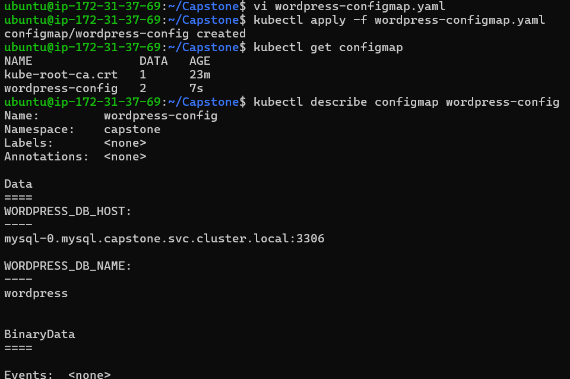 
---

## Step 2: Create the WordPress Deployment

Create a file named `wordpress-deployment.yaml`.

```yaml
apiVersion: apps/v1
kind: Deployment

metadata:
  name: wordpress

spec:
  replicas: 2

  selector:
    matchLabels:
      app: wordpress

  template:
    metadata:
      labels:
        app: wordpress

    spec:
      containers:
      - name: wordpress
        image: wordpress:latest

        ports:
        - containerPort: 80

        envFrom:
        - configMapRef:
            name: wordpress-config

        env:
        - name: WORDPRESS_DB_USER
          valueFrom:
            secretKeyRef:
              name: mysql-secret
              key: MYSQL_USER

        - name: WORDPRESS_DB_PASSWORD
          valueFrom:
            secretKeyRef:
              name: mysql-secret
              key: MYSQL_PASSWORD

        resources:
          requests:
            cpu: "250m"
            memory: "256Mi"
          limits:
            cpu: "500m"
            memory: "512Mi"

        readinessProbe:
          httpGet:
            path: /wp-login.php
            port: 80
          initialDelaySeconds: 30
          periodSeconds: 10

        livenessProbe:
          httpGet:
            path: /wp-login.php
            port: 80
          initialDelaySeconds: 60
          periodSeconds: 20
```

Apply the Deployment:

```bash
kubectl apply -f wordpress-deployment.yaml
```

---

## Step 3: Verify the Deployment

Check the Deployment:

```bash
kubectl get deployment
```

Expected output:

```
NAME        READY   UP-TO-DATE   AVAILABLE
wordpress   2/2     2            2
```
---

## Step 4: Verify the Pods

Check the Pods:

```bash
kubectl get pods
```

Expected output:

```
NAME                         READY   STATUS
wordpress-xxxxxxxxxx-abcde   1/1     Running
wordpress-xxxxxxxxxx-fghij   1/1     Running
mysql-0                      1/1     Running
```

---

## Step 5: Check Deployment Status

Wait for the rollout to complete:

```bash
kubectl rollout status deployment/wordpress
```

Expected output:

```
deployment "wordpress" successfully rolled out
```
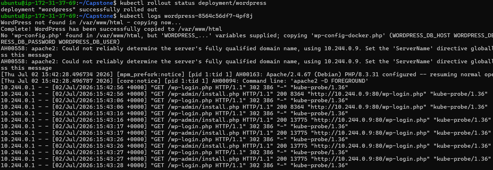 
---

## Step 6: Check the Pod Logs

View the logs of one WordPress Pod:

```bash
kubectl logs <wordpress-pod-name>kube   
```

Example:

```bash
kubectl logs wordpress-6d6b7f6bb7-abcde
```
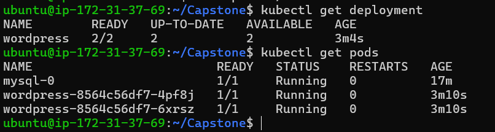 

Verify there are no database connection errors.

---

## Step 7: Verify Environment Variables

Open a shell inside one WordPress Pod:

```bash
kubectl exec -it <wordpress-pod-name> -- bash
```

Check the database-related environment variables:

```bash
env | grep WORDPRESS
```

Expected output:

```
WORDPRESS_DB_HOST=mysql-0.mysql.capstone.svc.cluster.local:3306
WORDPRESS_DB_NAME=wordpress
WORDPRESS_DB_USER=wpuser
WORDPRESS_DB_PASSWORD=password123
```

Exit the container:

```bash
exit
```
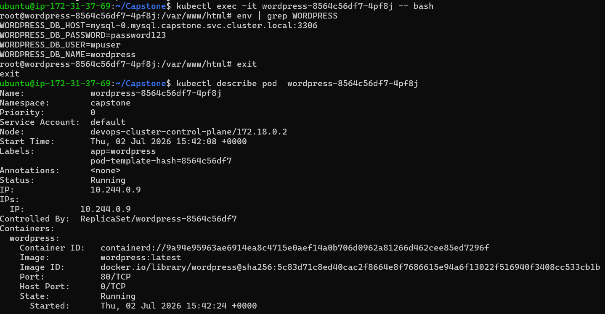 
---

## Step 8: Verify Readiness and Liveness Probes

Describe one WordPress Pod:

```bash
kubectl describe pod <wordpress-pod-name>
```

Scroll to the **Readiness** and **Liveness** sections.

Verify both probes are configured and there are no probe failures in the Events section.
 
---

## Success Checklist

- [ ] ConfigMap created successfully
- [ ] Deployment created successfully
- [ ] Two WordPress Pods are running
- [ ] Both Pods show `1/1 Running`
- [ ] Rollout completed successfully
- [ ] Environment variables loaded correctly
- [ ] No database connection errors in logs
- [ ] Liveness probe configured
- [ ] Readiness probe configured

---

# Task 4 – Expose WordPress

## Why NodePort?

Allows browser access outside the cluster.

## Step 1: Create the NodePort Service

Create a file named `wordpress-service.yaml`.

```yaml
apiVersion: v1
kind: Service

metadata:
  name: wordpress

spec:
  type: NodePort

  selector:
    app: wordpress

  ports:
    - port: 80
      targetPort: 80
      nodePort: 30080
```

Apply the Service:

```bash
kubectl apply -f wordpress-service.yaml
```

---

## Step 2: Verify the Service

Check whether the Service has been created.

```bash
kubectl get svc
```

Expected output:

```text
NAME        TYPE       CLUSTER-IP      EXTERNAL-IP   PORT(S)
wordpress   NodePort   10.xx.xx.xx     <none>        80:30080/TCP
mysql       ClusterIP  None            <none>        3306/TCP
```

You can also describe the Service to verify its configuration.

```bash
kubectl describe svc wordpress
```

Verify:

- Service Type is **NodePort**
- Port is **80**
- TargetPort is **80**
- NodePort is **30080**
- Endpoints show the IP addresses of both WordPress Pods

Example:

```text
Endpoints:
10.244.0.5:80
10.244.0.6:80
```
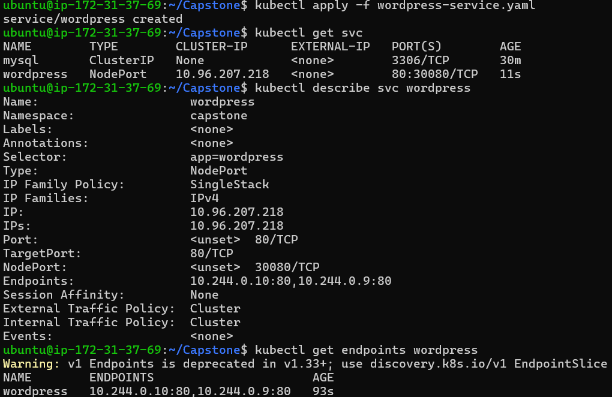 
---

## Step 3: Verify the Endpoints

Check whether the Service is connected to the WordPress Pods.

```bash
kubectl get endpoints wordpress
```

Expected output:

```text
NAME         ENDPOINTS
wordpress    10.244.0.5:80,10.244.0.6:80
```

If the ENDPOINTS column is empty, verify that:

- Both WordPress Pods are Running.
- The Service selector matches the Pod labels (`app: wordpress`).

---

## Step 4: Access WordPress

### If using Kind

Forward the Service to your local machine.

```bash
kubectl port-forward svc/wordpress 8080:80
```

Keep this terminal open.

Open your browser and visit:

```text
http://localhost:8080
```
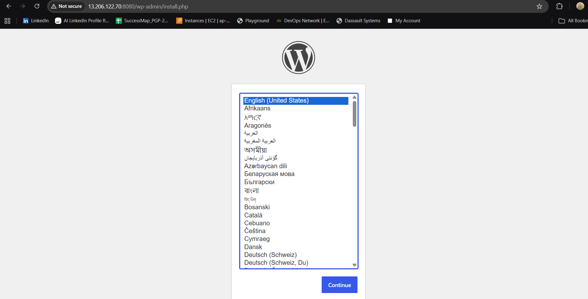 
---

### If using Minikube

Run:

```bash
minikube service wordpress -n capstone
```

Minikube automatically opens the application in your browser.

---

## Step 5: Complete the WordPress Installation

When the WordPress setup page appears:

1. Select your preferred language.
2. Click **Continue**.
3. Enter the following details:

Example:

```text
Site Title: Kubernetes Demo

Username: admin

Password: Admin@123

Your Email: kareenasayta045@gmail.com
```
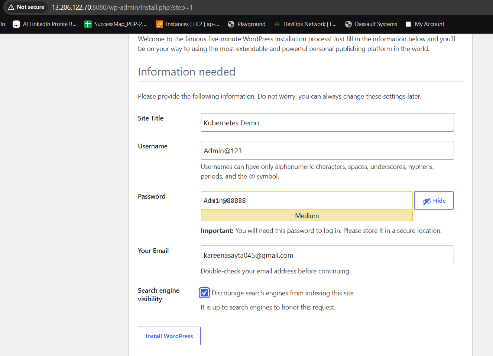 


4. Click **Install WordPress**.

After installation, click **Log In**.

---

## Step 6: Log In to WordPress

Open the login page if it does not appear automatically.

```text
http://localhost:8080/wp-login.php
```

Enter:

```text
Username: admin

Password: Admin@123
```

You should now see the WordPress Dashboard.

---

## Step 7: Create Your First Blog Post

From the Dashboard:

```
Posts
    ↓
Add New Post
```

Example:

```text
Title:
My First Kubernetes Blog

Content:
Successfully deployed WordPress and MySQL on Kubernetes using StatefulSet, Deployment, Services, ConfigMaps, Secrets, PVCs, and HPA.
```

Click **Publish**.

---

## Step 8: Verify the Blog Post

Click:

```
View Site
```

or

```
Posts → All Posts
```

Verify that your published post is visible.

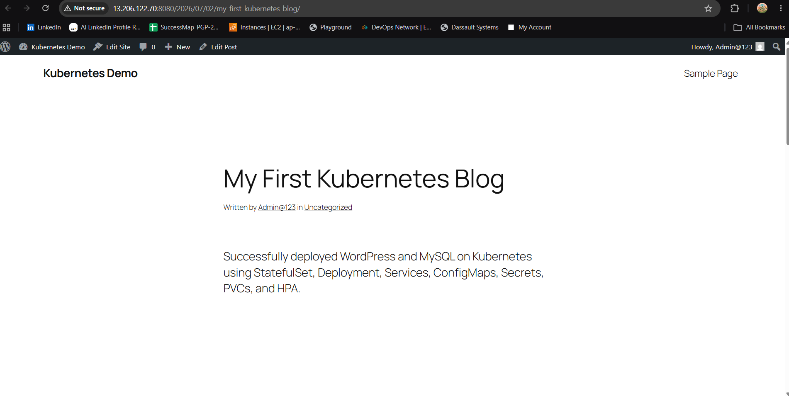 
---

### Kubernetes Resources

Run:

```bash
kubectl get all -n capstone
```

 

## Success Checklist

- [ ] NodePort Service created
- [ ] Service shows NodePort **30080**
- [ ] Endpoints point to both WordPress Pods
- [ ] WordPress setup page opens successfully
- [ ] WordPress installation completed
- [ ] Admin account created
- [ ] Successfully logged in
- [ ] First blog post published
- [ ] Screenshots captured


---

# Task 5 – Self Healing & Persistence

Delete a WordPress Pod.

```bash
kubectl delete pod <wordpress-pod>
```

Deployment creates another automatically.

Delete MySQL.

```bash
kubectl delete pod mysql-0
```
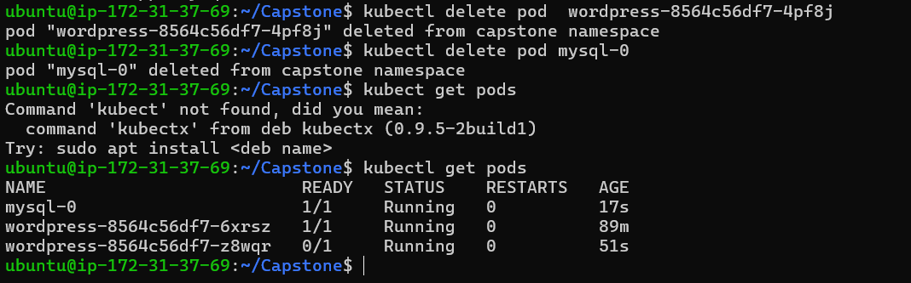 

StatefulSet recreates it using the same PVC.

Refresh WordPress.

Your blog post should still exist because data is stored on persistent storage.

---

# Task 6 – Horizontal Pod Autoscaler

## Step 1: Verify Metrics Server

The Horizontal Pod Autoscaler (HPA) requires the Metrics Server to collect CPU and memory usage from Pods.

Check if the Metrics Server is installed:

```bash
kubectl get deployment metrics-server -n kube-system
```

Or verify by checking node metrics:

```bash
kubectl top nodes
```

If metrics are displayed, the Metrics Server is working.

If you receive the following error:

```text
error: Metrics API not available
```

install the Metrics Server before proceeding.

---

## Step 2: Create the HPA Manifest

Create a file named `wordpress-hpa.yaml`.

```yaml
apiVersion: autoscaling/v2
kind: HorizontalPodAutoscaler

metadata:
  name: wordpress-hpa

spec:
  scaleTargetRef:
    apiVersion: apps/v1
    kind: Deployment
    name: wordpress

  minReplicas: 2
  maxReplicas: 10

  metrics:
  - type: Resource
    resource:
      name: cpu
      target:
        type: Utilization
        averageUtilization: 50
```

---

## Step 3: Apply the HPA

Apply the manifest:

```bash
kubectl apply -f wordpress-hpa.yaml
```

Expected output:

```text
horizontalpodautoscaler.autoscaling/wordpress-hpa created
```

---

## Step 4: Verify the HPA

Check whether the HPA has been created:

```bash
kubectl get hpa
```

Example output:

```text
NAME             REFERENCE                  TARGETS    MINPODS   MAXPODS   REPLICAS   AGE
wordpress-hpa    Deployment/wordpress       5%/50%    2         10        2          15s
```

If you see:

```text
<unknown>/50%
```

the HPA has been created successfully, but the Metrics Server is not yet providing CPU metrics.

---

## Step 5: Describe the HPA

View detailed information:

```bash
kubectl describe hpa wordpress-hpa
```

Verify:

- Target Deployment is `wordpress`
- Minimum replicas = `2`
- Maximum replicas = `10`
- CPU target = `50%`

 
---

## Step 6: Verify All Resources

Check all resources in the `capstone` namespace:

```bash
kubectl get all
```

Expected output should include:

```text
Pods
-----
mysql-0
wordpress-xxxxxxxxxx-xxxxx
wordpress-xxxxxxxxxx-yyyyy

Services
--------
mysql
wordpress

Deployment
----------
wordpress

ReplicaSet
----------
wordpress-xxxxxxxxxx

StatefulSet
-----------
mysql

HorizontalPodAutoscaler
-----------------------
wordpress-hpa
```

---

## Step 7: (Optional) Generate CPU Load

To test autoscaling, create a temporary Pod that continuously sends requests to WordPress.

```bash
kubectl run load-generator \
--image=busybox \
--restart=Never \
-- /bin/sh -c "while true; do wget -q -O- http://wordpress > /dev/null; done"
```

Monitor the HPA:

```bash
kubectl get hpa -w
```

Monitor the Pods:

```bash
kubectl get pods -w
```
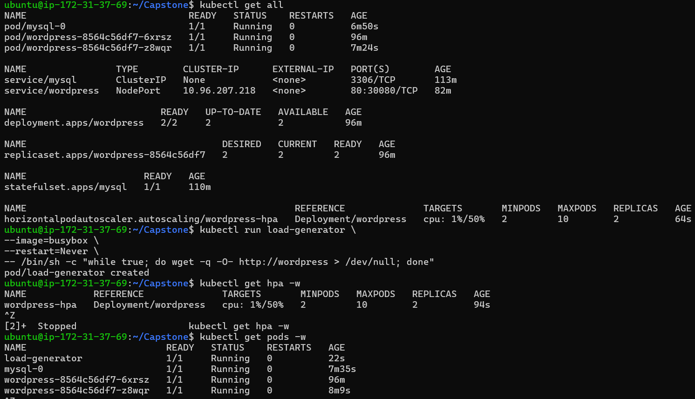 

If CPU usage exceeds **50%**, Kubernetes automatically increases the number of WordPress Pods (up to a maximum of **10** replicas).

After testing, delete the load generator:

```bash
kubectl delete pod load-generator
```
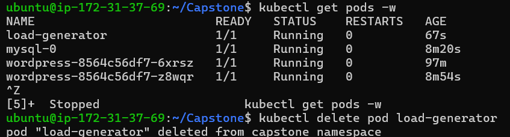 
---

## Success Checklist

- [ ] Metrics Server is installed and running
- [ ] HPA manifest created successfully
- [ ] HPA applied successfully
- [ ] `kubectl get hpa` shows the WordPress HPA
- [ ] Minimum replicas = 2
- [ ] Maximum replicas = 10
- [ ] CPU target = 50%
- [ ] `kubectl get all` shows the HPA resource
- [ ] HPA scales the WordPress Deployment when CPU usage increases
---

# Task 7 – Helm Comparison

Install:

```bash
helm install wp-helm bitnami/wordpress
```

Compare:

- Number of resources
- Manual YAML vs Helm
- Control vs Convenience

Cleanup:

```bash
helm uninstall wp-helm
```
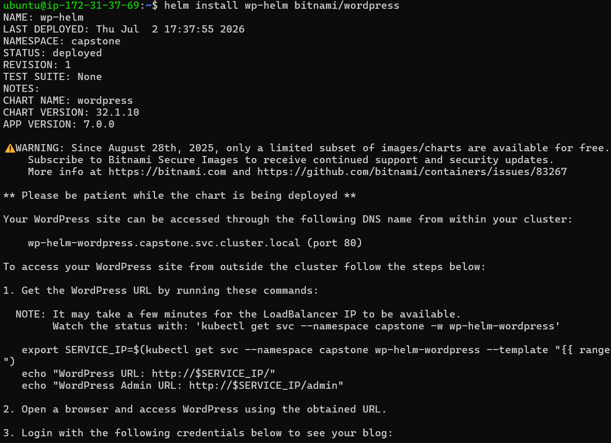 
---

# Task 8 – Cleanup

```bash
kubectl get all
kubectl delete namespace capstone
kubectl config set-context --current --namespace=default
```

Deleting the namespace removes almost every resource created in the project.
 

---

# Concepts Used

| Concept | Purpose |
|---|---|
| Namespace | Organize resources |
| Secret | Store passwords |
| ConfigMap | Store configuration |
| StatefulSet | Database workload |
| Deployment | WordPress application |
| Headless Service | Stable DNS |
| NodePort | External access |
| PVC | Persistent storage |
| Requests/Limits | Resource management |
| Liveness Probe | Restart unhealthy Pods |
| Readiness Probe | Accept traffic only when ready |
| HPA | Auto scaling |
| Helm | Package manager |

# Final Verification Checklist

- Namespace created
- MySQL Secret created
- Headless Service created
- StatefulSet Running
- PVC Bound
- WordPress Deployment Running
- NodePort Accessible
- Blog Created
- WordPress Pod Self-heals
- MySQL Pod Self-heals
- Data Persists
- HPA Created
- Helm Comparison Completed
- Cleanup Completed

# Production Improvements

- Use Ingress instead of NodePort
- Enable TLS
- Configure backups
- Use Network Policies
- Use RBAC
- Monitor with Prometheus & Grafana
- Centralized logging
- External Secrets Manager
- Multiple MySQL replicas (or managed database)
