# Day 62 - Providers, Resources and Dependencies

## Objective

Today the goal is to understand how Terraform builds infrastructure using providers, resources and dependencies.

Instead of creating individual resources, we will create a complete networking infrastructure in AWS consisting of:

- VPC
- Public Subnet
- Internet Gateway
- Route Table
- Route Table Association
- Security Group
- EC2 Instance
- S3 Bucket
- Dependency Graph
- Lifecycle Rules

By the end of this lab you will understand how Terraform automatically decides the order in which infrastructure is created.

---

# Project Structure

```
terraform-aws-infra/
│
├── providers.tf
├── main.tf
├── terraform.tfstate
├── terraform.tfstate.backup
├── .terraform.lock.hcl
└── graph.png
```

---

# Prerequisites

Install

- Terraform
- AWS CLI
- Git
- Graphviz (Optional)

Verify

```bash
terraform version
aws --version
git --version
```

Configure AWS

```bash
aws configure
```

Provide

- Access Key
- Secret Key
- Region

Example

```
ap-south-1
```

---

# Task 1 — Explore AWS Provider

Create project directory

```bash
mkdir terraform-aws-infra

cd terraform-aws-infra
```

Create providers.tf

```hcl
terraform {

  required_providers {

    aws = {

      source  = "hashicorp/aws"

      version = "~> 5.0"

    }

  }

}

provider "aws" {

  region = "ap-south-1"

}
```

Initialize Terraform

```bash
terraform init
```

Expected Output

```
Terraform has been successfully initialized.
```

Check installed provider

```bash
terraform providers
```
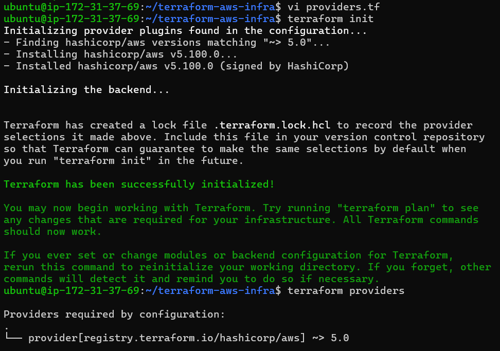 
---

## Understanding .terraform.lock.hcl

Terraform creates

```
.terraform.lock.hcl
```

This file locks the exact provider version used.

Benefits

- Same provider version for every developer
- Prevents accidental upgrades
- Makes builds reproducible
- Keeps infrastructure consistent

Commit this file into Git.

---

## Provider Version Constraints

### ~> 5.0

Means

```
>=5.0
<6.0
```

Terraform can install

```
5.1
5.5
5.60
5.99
```

But never version 6.

Recommended for production.

---

### >=5.0

Means

```
Any version greater than or equal to 5.0
```

Terraform could install

```
5.x
6.x
7.x
```

Can introduce breaking changes.

---

### =5.0.0

Installs only

```
5.0.0
```

No upgrades allowed.

Useful for testing.
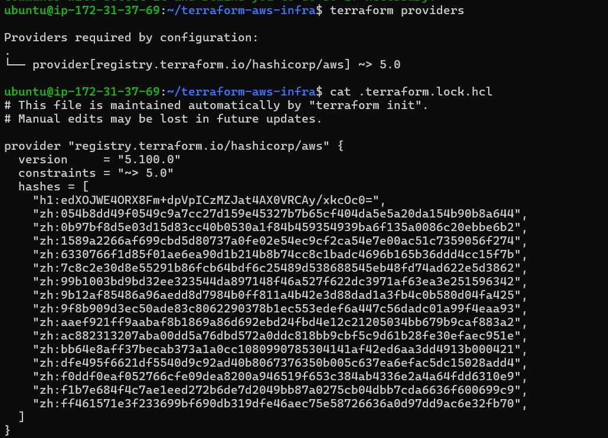 
---

# Task 2 — Build a VPC

Create main.tf

```hcl
##################################
# VPC
##################################

resource "aws_vpc" "main" {

  cidr_block = "10.0.0.0/16"

  tags = {

    Name = "TerraWeek-VPC"

  }

}

##################################
# Public Subnet
##################################

resource "aws_subnet" "public" {

  vpc_id = aws_vpc.main.id

  cidr_block = "10.0.1.0/24"

  map_public_ip_on_launch = true

  tags = {

    Name = "TerraWeek-Public-Subnet"

  }

}

##################################
# Internet Gateway
##################################

resource "aws_internet_gateway" "igw" {

  vpc_id = aws_vpc.main.id

  tags = {

    Name = "TerraWeek-IGW"

  }

}

##################################
# Route Table
##################################

resource "aws_route_table" "public" {

  vpc_id = aws_vpc.main.id

  route {

    cidr_block = "0.0.0.0/0"

    gateway_id = aws_internet_gateway.igw.id

  }

  tags = {

    Name = "Public-Route-Table"

  }

}

##################################
# Route Table Association
##################################

resource "aws_route_table_association" "public" {

  subnet_id = aws_subnet.public.id

  route_table_id = aws_route_table.public.id

}
```

Run

```bash
terraform fmt
```

```bash
terraform validate
```
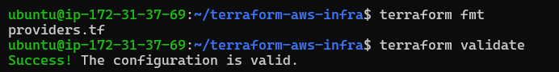 

```bash
terraform plan
```

Expected

```
Plan: 5 to add
```
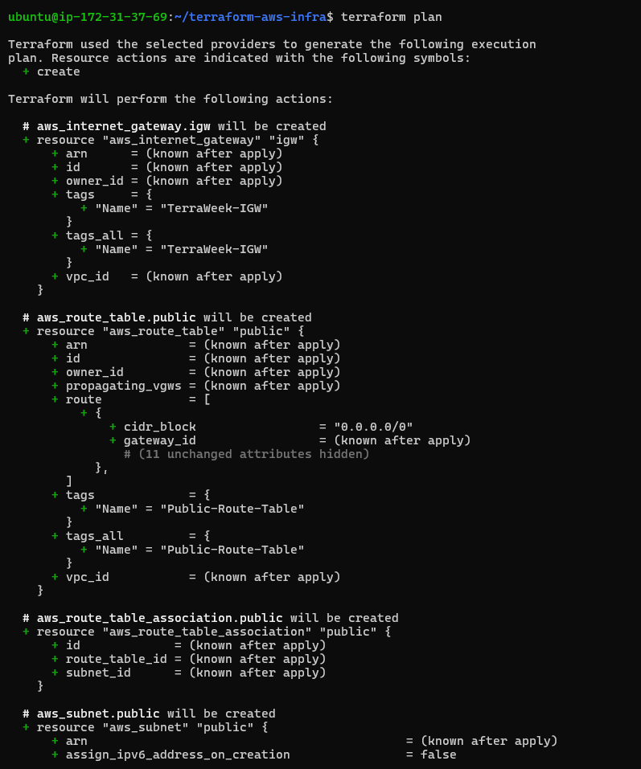 
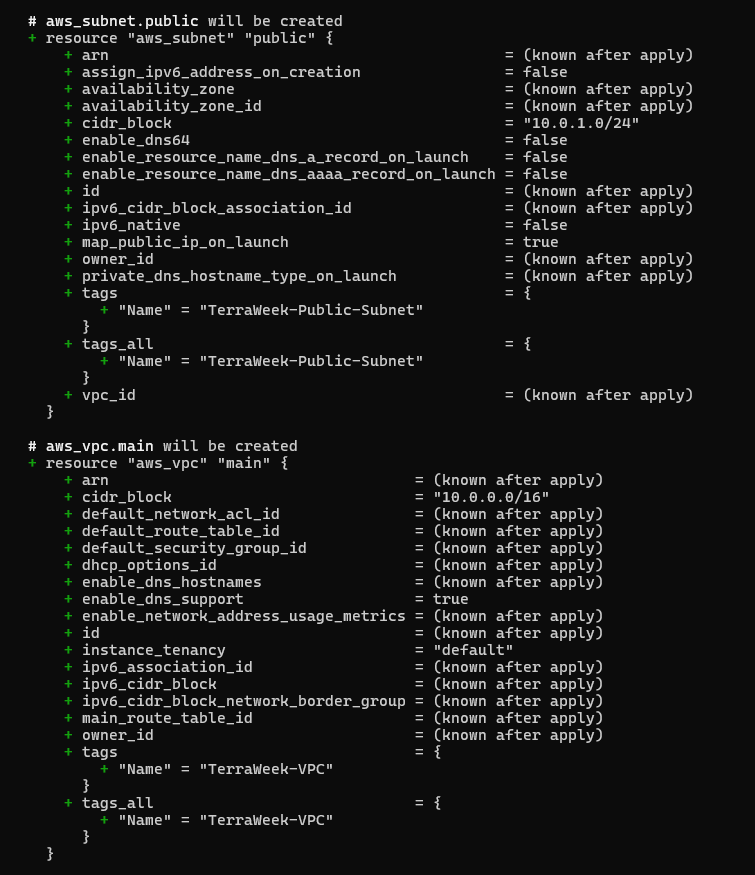 
Apply

```bash
terraform apply
```

Type

```
yes
```

Verify inside AWS Console

You should see

- VPC
- Subnet
- Internet Gateway
- Route Table
- Route Table Association

All connected.
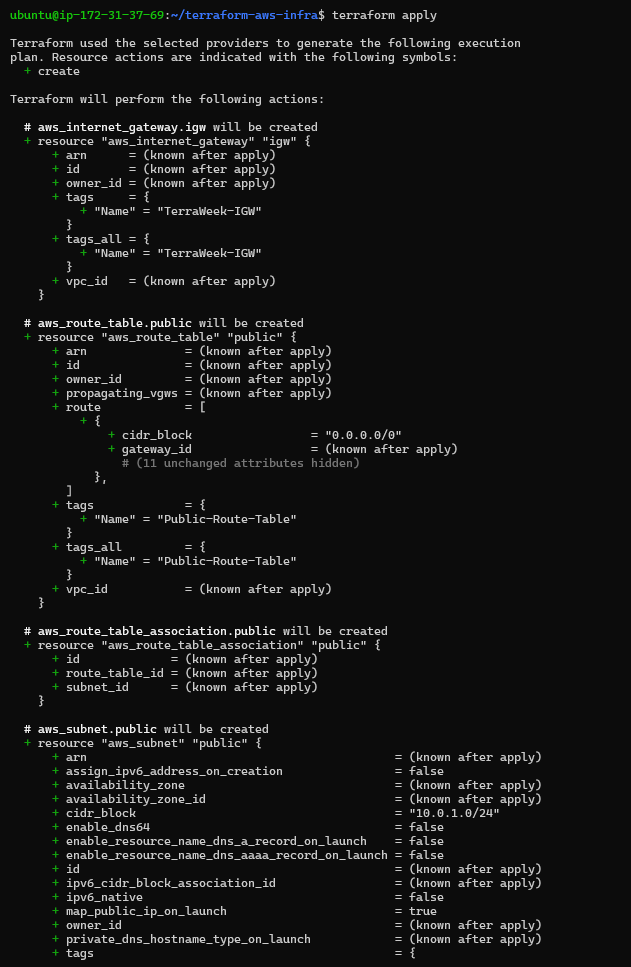 
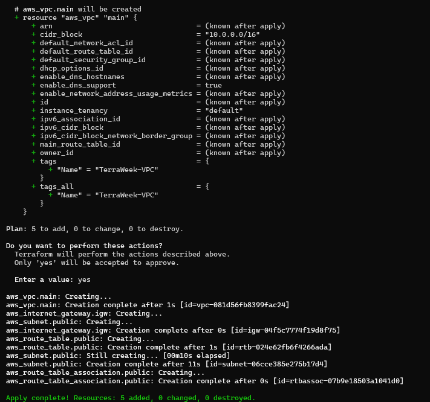 

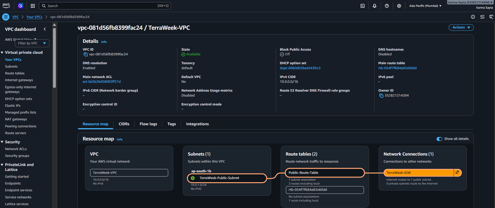 
---

# Task 3 — Understanding Implicit Dependencies

Terraform automatically detects dependencies whenever one resource references another.

Example

```
aws_subnet.public

↓

aws_vpc.main.id
```

Terraform understands

```
VPC

↓

Subnet
```

without us writing anything.

---

## Implicit Dependencies

```
Subnet
↓

depends on

↓

VPC
```

```
Internet Gateway

↓

depends on

↓

VPC
```

```
Route Table

↓

depends on

↓

VPC
Internet Gateway
```

```
Route Table Association

↓

depends on

↓

Route Table

+

Subnet
```

---

### How does Terraform know?

Terraform reads references like

```
aws_vpc.main.id
```

Whenever a resource attribute uses another resource's output, Terraform builds a dependency graph automatically.

---

### What happens if subnet is created first?

AWS returns an error because the referenced VPC does not exist.

Terraform avoids this by creating the VPC first.

---

# Task 4 — Security Group and EC2

Append below main.tf

```hcl
##################################
# Security Group
##################################

resource "aws_security_group" "main" {

  name = "TerraWeek-SG"

  description = "Allow SSH and HTTP"

  vpc_id = aws_vpc.main.id

  ingress {

    from_port = 22

    to_port = 22

    protocol = "tcp"

    cidr_blocks = ["0.0.0.0/0"]

  }

  ingress {

    from_port = 80

    to_port = 80

    protocol = "tcp"

    cidr_blocks = ["0.0.0.0/0"]

  }

  egress {

    from_port = 0

    to_port = 0

    protocol = "-1"

    cidr_blocks = ["0.0.0.0/0"]

  }

  tags = {

    Name = "TerraWeek-SG"

  }

}

##################################
# EC2 Instance
##################################

resource "aws_instance" "main" {

  ami = "ami-0f5ee92e2d63afc18"

  instance_type = "t2.micro"

  subnet_id = aws_subnet.public.id

  vpc_security_group_ids = [

    aws_security_group.main.id

  ]

  associate_public_ip_address = true

  tags = {

    Name = "TerraWeek-Server"

  }

}
```

Run

```bash
terraform plan
```
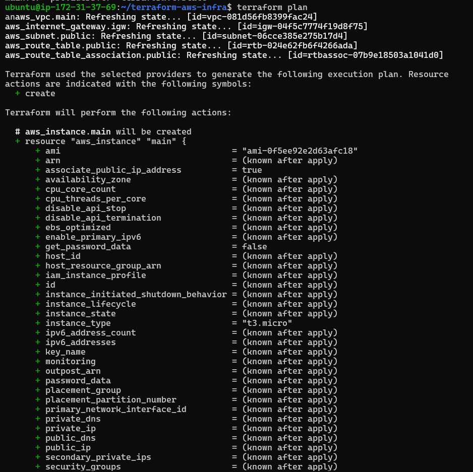 
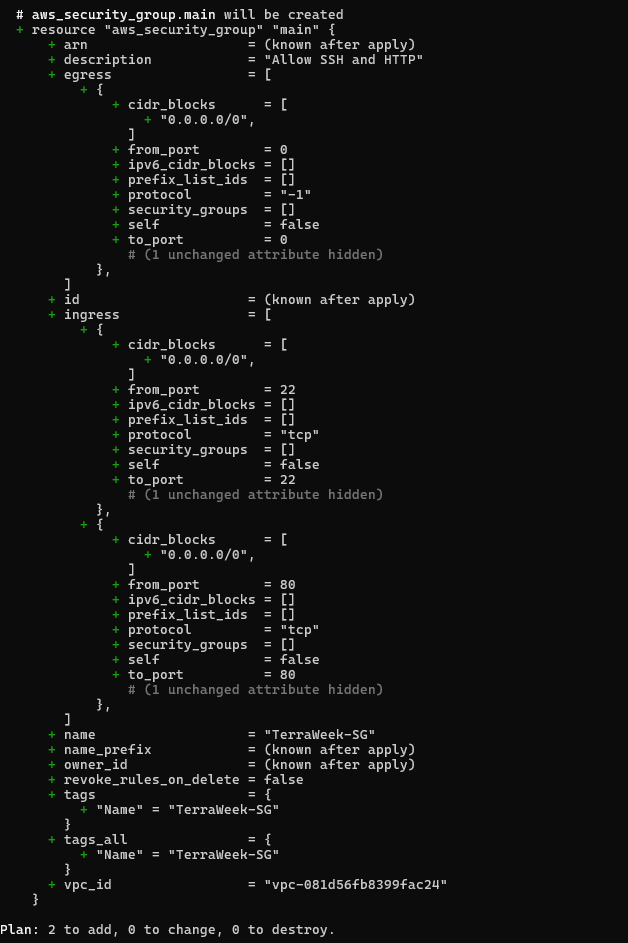 

```bash
terraform apply
```
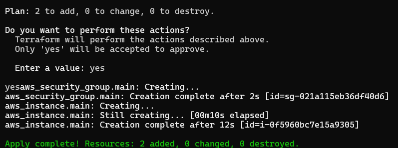 


Verify

- EC2 created
- Public IP assigned
- SSH allowed
- HTTP allowed
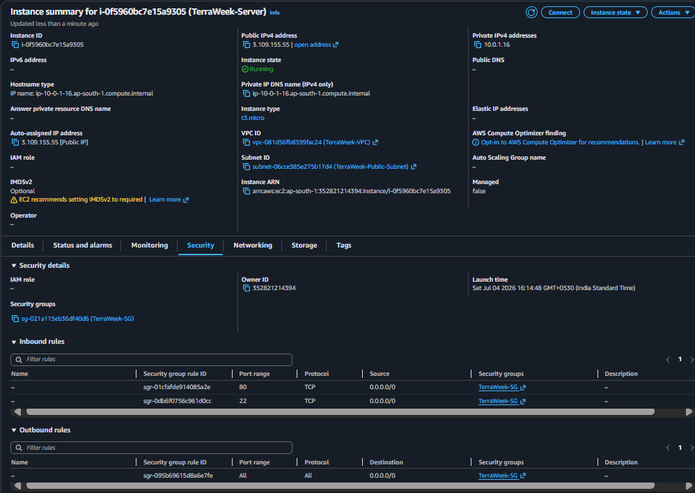 

---

# Task 5 — Explicit Dependency

Add

```hcl
resource "aws_s3_bucket" "logs" {

  bucket = "my-bucket-logs-instance"

  depends_on = [

    aws_instance.main

  ]

}
```

Run

```bash
terraform plan
```

Terraform now creates

```
EC2

↓

S3 Bucket
```

even though the bucket does not reference the EC2.
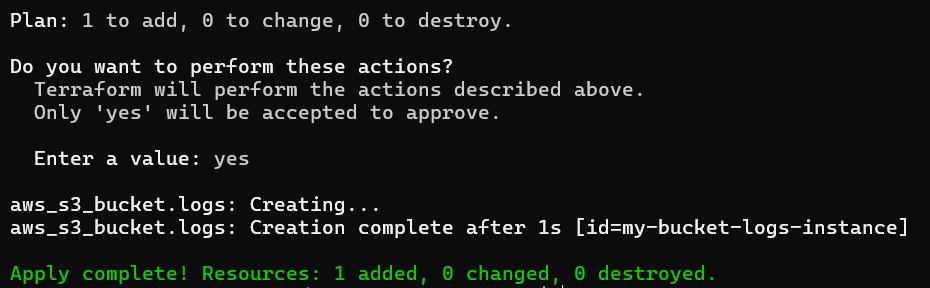 
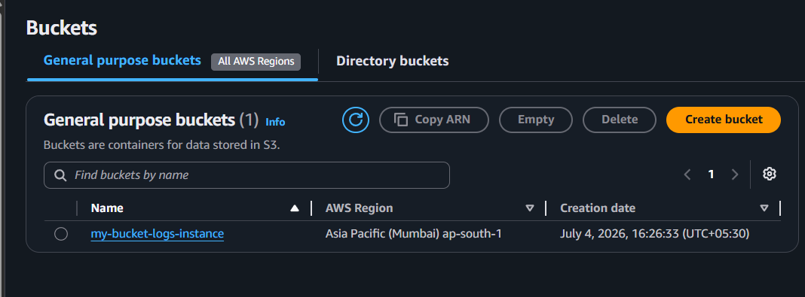 
---

## Generate Dependency Graph

If Graphviz installed

```bash
terraform graph | dot -Tpng > graph.png
```

Otherwise

```bash
terraform graph
```

Paste output into

https://dreampuf.github.io/GraphvizOnline/

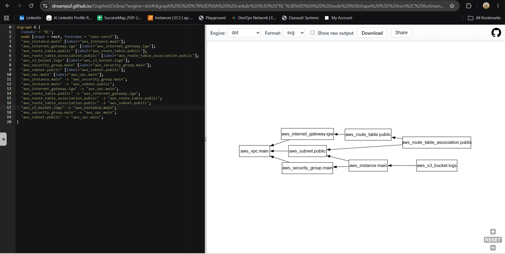 
---

## When to use depends_on

Example 1

Create an EC2 only after IAM Role is completely attached.

Example 2

Create CloudWatch alarms only after Auto Scaling Group exists.

Use `depends_on` only when Terraform cannot infer the dependency automatically.

---

# Task 6 — Lifecycle Rules

Modify EC2

```hcl
lifecycle {

  create_before_destroy = true

}
```

Now change AMI

```hcl
ami = "NEW_AMI_ID"
```

Run

```bash
terraform plan
```

Terraform creates the new instance first and deletes the old one afterward.

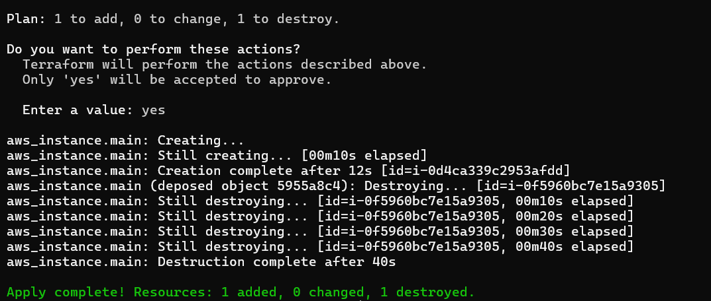 

---

## Lifecycle Arguments

### create_before_destroy

Creates replacement resources before deleting old ones.

Useful for production servers to reduce downtime.

---

### prevent_destroy

Terraform refuses to destroy the resource.

Useful for

- Databases
- Production S3 buckets
- Critical infrastructure

---

### ignore_changes

Terraform ignores changes to specified attributes.

Useful when AWS or another service modifies tags or metadata automatically.

---

# Destroy Infrastructure

Always clean up resources.

```bash
terraform destroy
```

Terraform destroys resources in reverse dependency order.

Example

```
EC2

↓

Security Group

↓

Route Table

↓

Internet Gateway

↓

Subnet

↓

VPC
```

Verify AWS Console

Everything should be deleted.

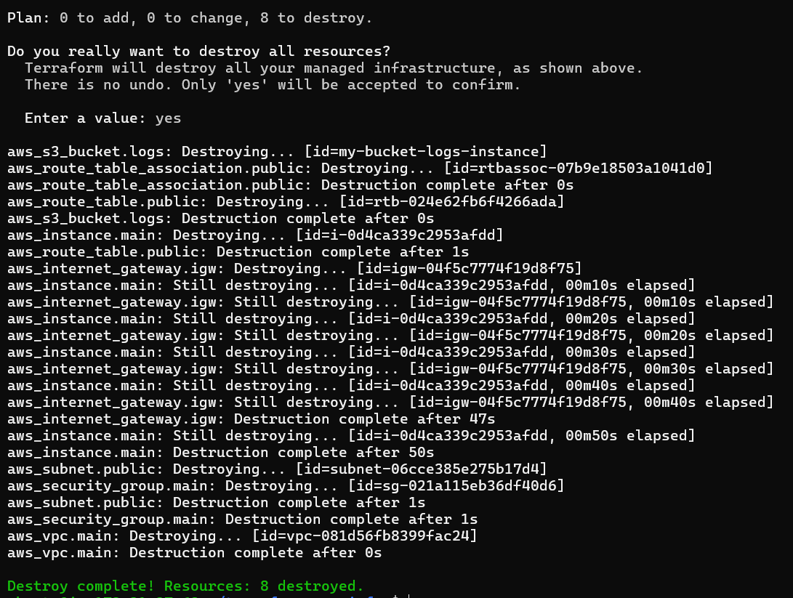 

---

# Commands Used

```bash
terraform init
```

```bash
terraform fmt
```

```bash
terraform validate
```

```bash
terraform plan
```

```bash
terraform apply
```

```bash
terraform graph
```

```bash
terraform destroy
```

---

# Key Learnings

- Providers allow Terraform to communicate with cloud platforms.
- Resources represent actual infrastructure components.
- Terraform automatically creates a dependency graph using resource references.
- Implicit dependencies are detected automatically through references like `aws_vpc.main.id`.
- Explicit dependencies using `depends_on` are needed only when Terraform cannot determine the order itself.
- Lifecycle rules control how Terraform creates, replaces, or protects resources.
- Terraform destroys resources in reverse dependency order, ensuring safe cleanup.

---
