# Day 63 -- Variables, Outputs, Data Sources and Expressions

## Task 1: Extract Variables
Take your Day 62 infrastructure config and refactor it:

1. Create a `variables.tf` file with input variables for:
   - `region` (string, default: your preferred region)
   - `vpc_cidr` (string, default: `"10.0.0.0/16"`)
   - `subnet_cidr` (string, default: `"10.0.1.0/24"`)
   - `instance_type` (string, default: `"t2.micro"`)
   - `project_name` (string, no default -- force the user to provide it)
   - `environment` (string, default: `"dev"`)
   - `allowed_ports` (list of numbers, default: `[22, 80, 443]`)
   - `extra_tags` (map of strings, default: `{}`)

2. Replace every hardcoded value in `main.tf` with `var.<name>` references
3. Run `terraform plan` -- it should prompt you for `project_name` since it has no default

   

**Document:** What are the five variable types in Terraform? (`string`, `number`, `bool`, `list`, `map`)
* `string` : a sequence of Unicode characters representing some text, like `"hello"`.
* `number` : a numeric value. The number type can represent both whole numbers like `15` and fractional values like `6.283185`.
* `bool` : a boolean value, either `true` or `false`. bool values can be used in conditional logic.
* `list` : a sequence of values, like ["us-west-1a", "us-west-1c"]. Identify elements in a list with consecutive whole numbers, starting with zero.
* `map` :  a group of values identified by named labels, like {name = "Mabel", age = 52}.


# Task 1 – Extract Variables

## Objective

In Day 63, many values such as the AWS region, VPC CIDR, subnet CIDR, EC2 instance type, and resource tags were hardcoded directly into the Terraform configuration. While this works for a single environment, it makes the configuration difficult to reuse. Every time you want to deploy the same infrastructure in another region or environment, you have to manually edit the code.

The goal of this task is to move all configurable values into input variables. This makes the Terraform configuration reusable, easier to maintain, and suitable for multiple environments like Development, Staging, and Production.

---

# Why Use Variables?

Variables allow you to write generic Terraform code instead of hardcoding values.

Without variables:

- Same code cannot be reused easily.
- Every environment requires editing the source code.
- More chances of human error.
- Difficult to maintain large projects.

With variables:

- Configuration becomes reusable.
- Easier to manage multiple environments.
- Better collaboration across teams.
- Cleaner and more professional Terraform code.

---

# Project Structure

```
day-63/

├── main.tf
├── provider.tf
├── variables.tf
├── terraform.tfvars
└── outputs.tf
```

---

# Step 1 – Create variables.tf

Create a new file named **variables.tf**.

---

# Understanding Every Variable

## region

Defines the AWS region where Terraform will create resources.

Example:

```hcl
default = "ap-south-1"
```

You can later change it to:

```text
us-east-1
eu-west-1
ap-southeast-2
```

without modifying the infrastructure code.

---

## vpc_cidr

Specifies the IP address range of the VPC.

Default:

```text
10.0.0.0/16
```

This provides 65,536 private IP addresses.

---

## subnet_cidr

Defines the CIDR block for the public subnet.

Default:

```text
10.0.1.0/24
```

This subnet belongs inside the VPC.

---

## instance_type

Specifies which EC2 instance Terraform should launch.

Default:

```text
t2.micro
```

Later you can simply change it to:

```text
t3.small
t3.medium
t2.nano
```

without editing your EC2 resource.

---

## project_name

Unlike other variables, this variable has **no default value**.

```hcl
variable "project_name" {

  type = string

}
```

Terraform will ask for it during execution.

Example:

```
var.project_name

Enter a value:
```

This makes the variable mandatory.

---

## environment

Represents which environment is being deployed.

Possible values:

```
dev

test

staging

prod
```

Useful for naming resources dynamically.

Example:

```
terraweek-dev

terraweek-prod
```

---

## allowed_ports

Stores multiple port numbers.

```hcl
[
22,
80,
443
]
```

Instead of writing three security group rules manually, this list can later be used inside a loop (`for_each` or `dynamic` block).

---

## extra_tags

Stores key-value pairs.

Example:

```hcl
extra_tags = {
Owner = "Karina"
Team  = "DevOps"
}
```

Terraform can merge these tags with common tags.

---

# Step 2 – Replace Hardcoded Values

Update your **provider.tf**

Before:

```hcl
provider "aws" {

  region = "ap-south-1"

}
```

After:

```hcl
provider "aws" {

  region = var.region

}
```

---

Replace the VPC CIDR.

Before

```hcl
cidr_block = "10.0.0.0/16"
```

After

```hcl
cidr_block = var.vpc_cidr
```

---

Replace the subnet CIDR.

Before

```hcl
cidr_block = "10.0.1.0/24"
```

After

```hcl
cidr_block = var.subnet_cidr
```

---

Replace the EC2 instance type.

Before

```hcl
instance_type = "t2.micro"
```

After

```hcl
instance_type = var.instance_type
```

---

Replace resource names.

Instead of writing:

```hcl
Name = "Terraform-VPC"
```

use

```hcl
Name = "${var.project_name}-vpc"
```

Instead of

```hcl
Name = "Terraform-Subnet"
```

use

```hcl
Name = "${var.project_name}-subnet"
```

Instead of

```hcl
Name = "Terraform-Server"
```

use

```hcl
Name = "${var.project_name}-server"
```

This makes the names dynamic based on the project.

---

# Step 3 – Run Terraform Plan

Execute:

```bash
terraform plan
```

Terraform will display:

```
var.project_name

Enter a value:
```

Example:

```
terraweek
```

After entering the value, Terraform continues generating the execution plan.

---

# Expected Output

```
var.project_name

Enter a value:

terraweek

Terraform used the selected providers to generate the following execution plan...
```

This confirms that the variable is required because it has no default value.

---

# Verify

Run:

```bash
terraform validate
```

Output:

```
Success! The configuration is valid.
```

Then run:

```bash
terraform plan
```

Ensure there are no hardcoded values remaining in the configuration.
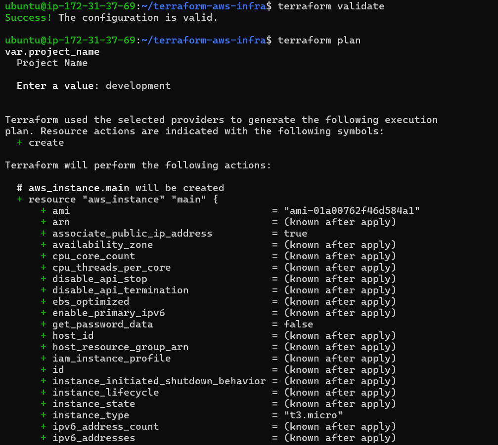 
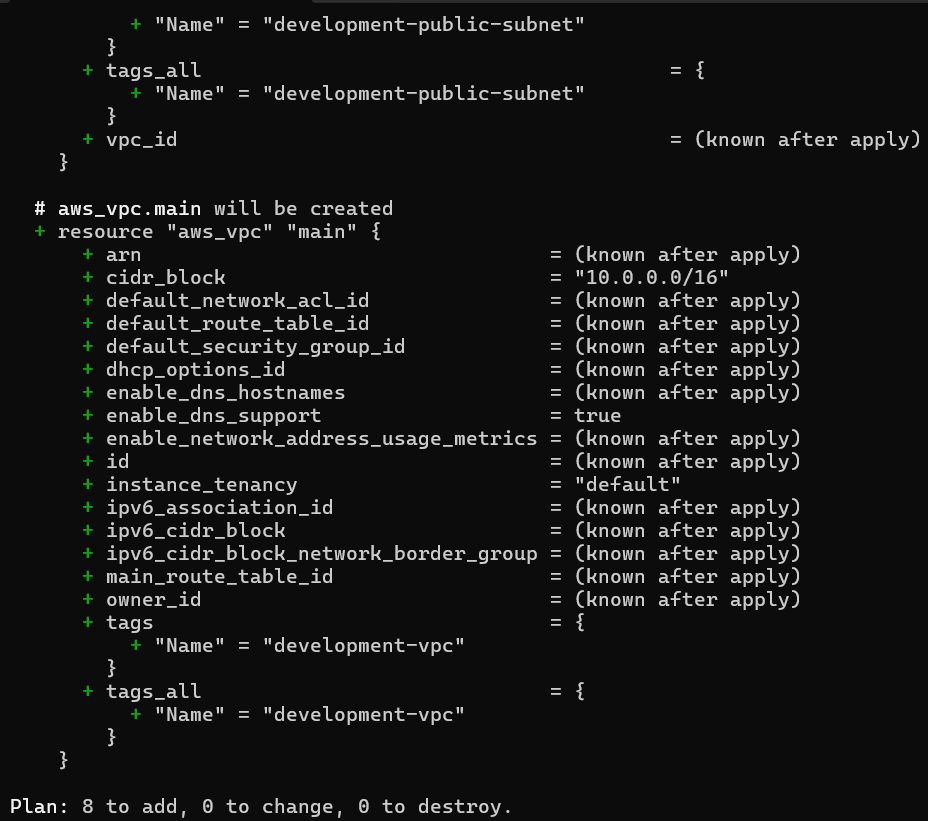 
---

# Terraform Variable Types

Terraform supports several variable types. The five most commonly used are:

| Type | Description | Example |
|------|-------------|---------|
| string | Stores text values | `"DevOps"` |
| number | Stores numeric values | `5` |
| bool | Stores true or false | `true` |
| list | Stores multiple ordered values | `["a","b","c"]` |
| map | Stores key-value pairs | `{Name="Server"}` |

---

## Examples

### String

```hcl
variable "project_name" {

type = string

}
```

---

### Number

```hcl
variable "disk_size" {

type = number

default = 20

}
```

---

### Boolean

```hcl
variable "enable_monitoring" {

type = bool

default = true

}
```

---

### List

```hcl
variable "allowed_ports" {

type = list(number)

default = [
22,
80,
443
]

}
```

---

### Map

```hcl
variable "extra_tags" {

type = map(string)

default = {

Owner = "Karina"

Environment = "Dev"

}

}
```

---

# Key Takeaways

- Variables remove hardcoded values from Terraform configurations.
- Required variables have no default value and Terraform prompts for them.
- Variables improve reusability across different environments.
- Use `var.<variable_name>` to reference input variables.
- Common variable types include `string`, `number`, `bool`, `list`, and `map`.
- Keeping configurable values in `variables.tf` is a Terraform best practice followed in production environments.

---

## Task 2: Variable Files and Precedence

# Objective

In Task 1, you created input variables to make your Terraform configuration dynamic. However, entering values manually every time you run `terraform plan` or `terraform apply` is inefficient, especially when managing multiple environments like Development, Staging, and Production.

Terraform solves this problem using **variable definition files (`.tfvars`)**. These files allow you to store environment-specific values separately from your Terraform code. By switching between different `.tfvars` files, you can deploy the same infrastructure with different configurations without modifying your `.tf` files.

---

# Why Use Variable Files?

Instead of changing values inside `variables.tf` or `main.tf` every time, you can simply create different variable files.

For example:

- **Development** → Small EC2 instance (`t2.micro`)
- **Production** → Larger EC2 instance (`t3.small`)
- Different VPC CIDR blocks
- Different subnet CIDRs
- Different project environments

This makes your Terraform code reusable and production-ready.

---

# Project Structure

```
day-63/

├── providers.tf
├── variables.tf
├── main.tf
├── terraform.tfvars
├── prod.tfvars
└── outputs.tf
```

---

# Step 1 – Create terraform.tfvars

Create a file named **terraform.tfvars**.

```hcl
project_name = "terraweek"

environment = "dev"

instance_type = "t3.micro"
```

### Explanation

This is the default variable file that Terraform loads automatically.

- `project_name` is supplied here, so Terraform will no longer ask for it.
- Environment is set to **Development**.
- EC2 instance type is **t3.micro**.

Whenever you run:

```bash
terraform plan
```

Terraform automatically reads this file.

---

# Step 2 – Create prod.tfvars

Create another file named **prod.tfvars**.

```hcl
project_name = "terraweek"

environment = "prod"

instance_type = "t3.small"

vpc_cidr = "10.1.0.0/16"

subnet_cidr = "10.1.1.0/24"
```

### Explanation

This file represents the Production environment.

Compared to the Development environment:

- Environment changes to **prod**
- Instance size increases
- VPC CIDR changes
- Subnet CIDR changes

Notice that your Terraform code remains exactly the same. Only the variable values change.

---

# Step 3 – Use terraform.tfvars

Run:

```bash
terraform plan
```

Terraform automatically loads:

```
terraform.tfvars
```

You do **not** need to specify the file name.

Expected output:

```
Terraform used the selected providers to generate the following execution plan...
```

Terraform should **not** ask for:

```
var.project_name
```

because the value is already provided in `terraform.tfvars`.

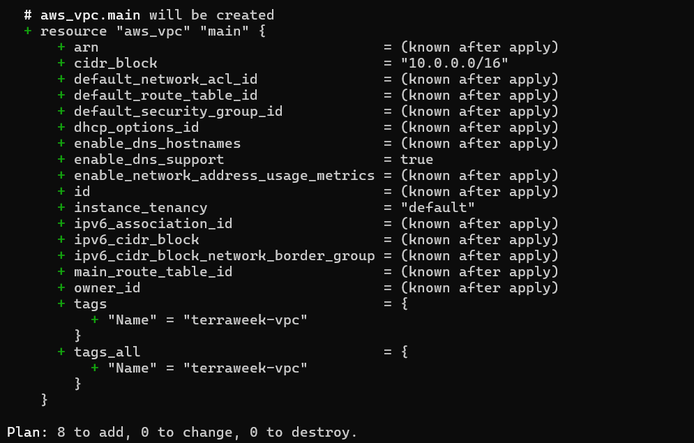
---

# Step 4 – Use prod.tfvars

To deploy using Production values, run:

```bash
terraform plan -var-file="prod.tfvars"
```

Terraform ignores `terraform.tfvars` for the overlapping variables and instead uses the values from `prod.tfvars`.

Verify that:

- Environment = prod
- Instance Type = t3.small
- VPC CIDR = 10.1.0.0/16
- Subnet CIDR = 10.1.1.0/24

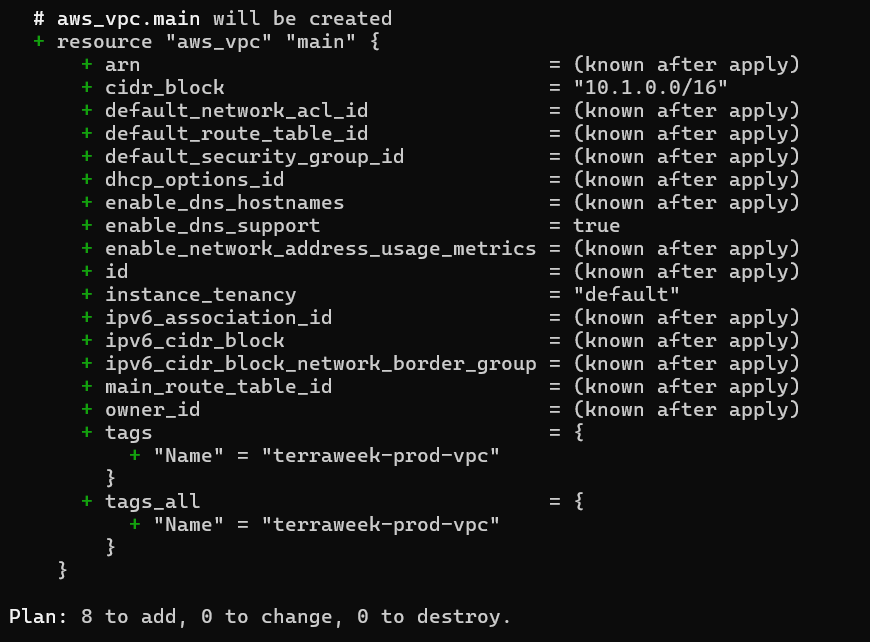
---

# Step 5 – Override Using the CLI

Terraform allows you to override variables directly from the command line.

Example:

```bash
terraform plan -var="instance_type=t3.nano"
```
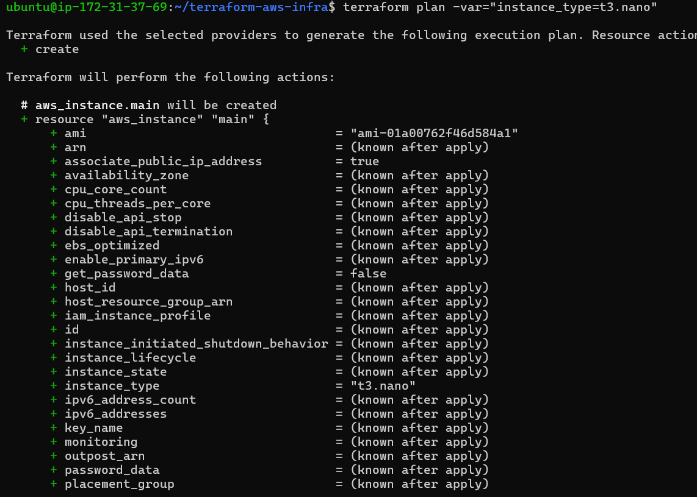

Even if your `.tfvars` file contains:

```hcl
instance_type = "t3.small"
```

Terraform will use:

```
t2.nano
```

because command-line variables have higher priority.

This is useful for quick testing without modifying any files.

---

# Step 6 – Use Environment Variables

Terraform also reads variables from environment variables.

Linux/macOS:

```bash
export TF_VAR_environment="staging"
```

Windows PowerShell:

```powershell
$env:TF_VAR_environment="staging"
```

Now run:

```bash
terraform plan
```

Terraform automatically reads:

```
TF_VAR_environment
```

If `terraform.tfvars` also contains:

```hcl
environment = "dev"
```

Terraform uses the value from `terraform.tfvars` because it has higher precedence than environment variables.
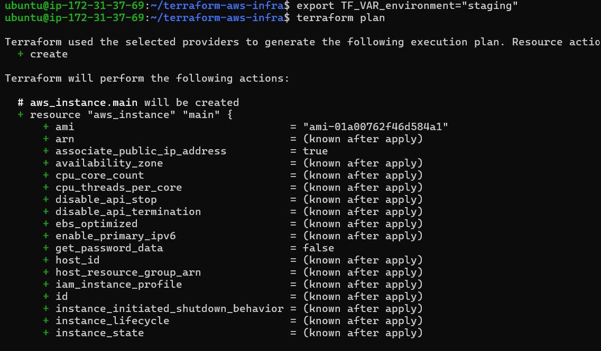
---


---

# Variable Precedence

Terraform may receive the same variable from multiple places. In such cases, it follows a precedence order to decide which value to use.

From **Lowest Priority** to **Highest Priority**:

| Priority | Source |
|----------|--------|
| 1 | Default value in `variables.tf` |
| 2 | Environment Variables (`TF_VAR_*`) |
| 3 | `terraform.tfvars` |
| 4 | `*.auto.tfvars` |
| 5 | `-var-file` |
| 6 | `-var` command-line option |

The value with the **highest priority** always wins.

---

# Example

Suppose you have:

### variables.tf

```hcl
default = "t2.micro"
```

### terraform.tfvars

```hcl
instance_type = "t3.micro"
```

### prod.tfvars

```hcl
instance_type = "t3.small"
```

### CLI

```bash
terraform plan -var="instance_type=t2.nano"
```

Terraform chooses:

```
t2.nano
```

because the `-var` option has the highest priority.

---

# Real-World Example

A DevOps engineer manages three environments.

Development

```
terraform.tfvars
```

Staging

```
staging.tfvars
```

Production

```
prod.tfvars
```

Deploy Development

```bash
terraform apply
```

Deploy Production

```bash
terraform apply -var-file="prod.tfvars"
```

The same Terraform code is reused for every environment.

---

# Best Practices

- Keep `variables.tf` for variable definitions only.
- Store environment-specific values in `.tfvars` files.
- Never hardcode production values inside `.tf` files.
- Use `-var-file` for different environments.
- Use `-var` only for temporary testing.
- Keep secrets out of `.tfvars` files and use secure secret management instead.

---

# Commands Used

Initialize Terraform:

```bash
terraform init
```

Format files:

```bash
terraform fmt
```

Validate configuration:

```bash
terraform validate
```

Use Development variables:

```bash
terraform plan
```

Use Production variables:

```bash
terraform plan -var-file="prod.tfvars"
```

Override a variable:

```bash
terraform plan -var="instance_type=t2.nano"
```

Set an environment variable (Linux/macOS):

```bash
export TF_VAR_environment="staging"
terraform plan
```

Show current configuration:

```bash
terraform show
```

---

# Interview Questions

### Why do we use `.tfvars` files?

To separate configuration values from Terraform code and reuse the same infrastructure across multiple environments.

---

### Does Terraform automatically load every `.tfvars` file?

No.

Terraform automatically loads:

- `terraform.tfvars`
- `*.auto.tfvars`

Any other file must be specified using `-var-file`.

---

### Which has the highest precedence?

The `-var` command-line option.

---

### Which has the lowest precedence?

The default value defined in `variables.tf`.

---

# Key Takeaways

- Variable files make Terraform configurations reusable across environments.
- `terraform.tfvars` is loaded automatically.
- `prod.tfvars` must be specified using `-var-file`.
- The `-var` option overrides all other variable sources.
- Terraform follows a well-defined variable precedence order to resolve conflicts.
- Using separate variable files is a standard practice in real-world Terraform projects.


**Document:** Write the variable precedence order from lowest to highest priority.
  Variable precedence (low to high): default -> `TF_VAR_*` env vars -> `terraform.tfvars` -> `*.auto.tfvars` -> `-var-file` -> `-var` flag  -> CLI prompts (interactive input)

---

# Task 3 – Add Outputs

## Objective

Terraform outputs allow you to display important information about the infrastructure after it is created. Instead of manually checking the AWS Console, you can view values like the VPC ID, EC2 Public IP, or Security Group ID directly from Terraform.

---

## Step 1 – Create `outputs.tf`

Create a new file named **outputs.tf** and add the following:

---

## Step 2 – Apply the Configuration

Run the following command:

```bash
terraform apply
```

After the infrastructure is created, Terraform automatically displays all the outputs.

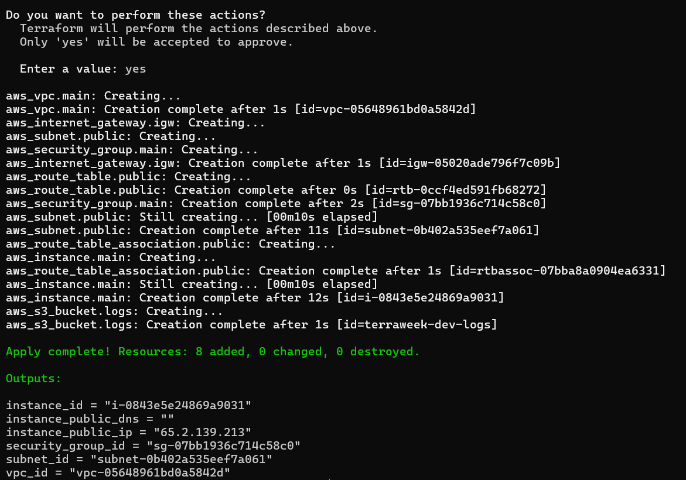

---

## Step 3 – View All Outputs

```bash
terraform output
```

This command displays all the outputs defined in `outputs.tf`.

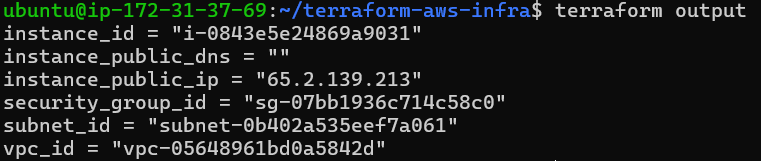

---

## Step 4 – View a Specific Output

```bash
terraform output instance_public_ip
```

This prints only the Public IP address of the EC2 instance.

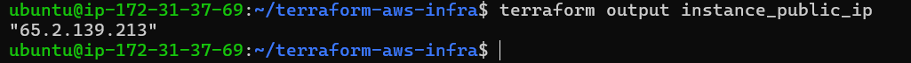

---

## Step 5 – View Outputs in JSON Format

```bash
terraform output -json
```

This displays all outputs in JSON format, which is useful for automation and scripting.

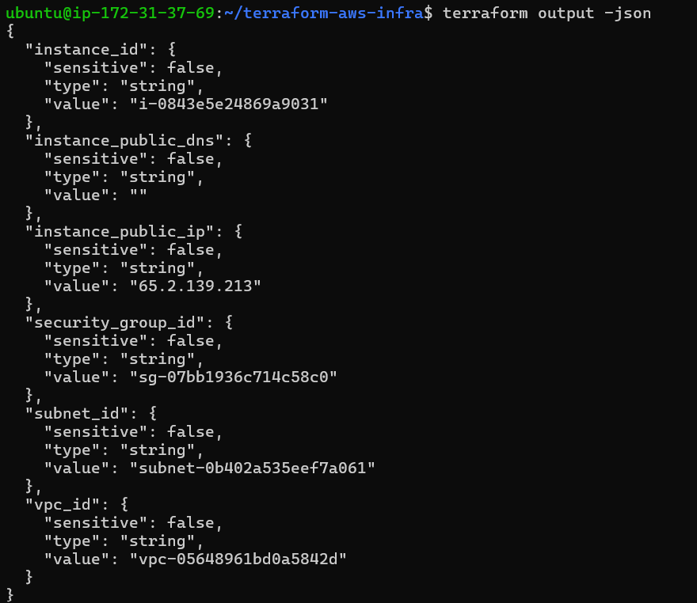

---

## Verification

Verify that the Public IP returned by Terraform matches the Public IPv4 address shown in the AWS EC2 Console.

```bash
terraform output instance_public_ip
```

**Result:** ✅ **YES**

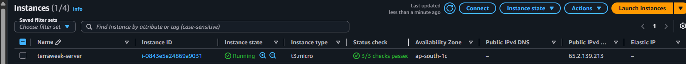

---

## Commands Used

```bash
terraform apply
terraform output
terraform output instance_public_ip
terraform output -json
```

---

## Key Takeaways

- Outputs display useful information after infrastructure deployment.
- Store all outputs in an `outputs.tf` file.
- Use `terraform output` to list all outputs.
- Use `terraform output <output_name>` to display a specific output.
- `terraform output -json` is useful for scripts and CI/CD pipelines.

---

# Task 4 – Use Data Sources

## Objective

Hardcoding an AMI ID is not a good practice because AMI IDs are region-specific and change over time. Instead, Terraform **Data Sources** allow you to fetch existing AWS resources dynamically. In this task, you'll use a data source to get the latest Amazon Linux 2 AMI and the available Availability Zones in your selected region.

---

## Step 1 – Create `data.tf`

Create a new file named **data.tf** and add the following code:
---

## Step 2 – Update `main.tf`

Replace the hardcoded AMI:

**Before**

```hcl
ami = "ami-01a00762f46d584a1"
```

**After**

```hcl
ami = data.aws_ami.amazon_linux.id
```

Update your subnet to use the first available Availability Zone:

```hcl
availability_zone = data.aws_availability_zones.available.names[0]
```

Your subnet resource should now include:

```hcl
resource "aws_subnet" "public" {

  vpc_id                  = aws_vpc.main.id
  cidr_block              = var.subnet_cidr
  availability_zone       = data.aws_availability_zones.available.names[0]
  map_public_ip_on_launch = true

  tags = {
    Name = "${var.project_name}-public-subnet"
  }

}
```

---

## Step 3 – Apply the Configuration

Run:

```bash
terraform apply
```

Terraform automatically finds:

- The latest Amazon Linux 2 AMI
- The first available Availability Zone in your selected region

No manual AMI changes are required when switching AWS regions.

---

## Verification

After the apply completes:

- Verify that the EC2 instance was created successfully.
- Check the EC2 Console and confirm it is using the latest Amazon Linux 2 AMI.
- Verify that the subnet was created in the first available Availability Zone.

---

## Resource vs Data Source

| Resource | Data Source |
|----------|-------------|
| Creates new infrastructure | Reads existing infrastructure |
| Changes your cloud resources | Fetches information only |
| Example: `aws_instance` | Example: `aws_ami` |

### Examples

**Resource**

```hcl
resource "aws_instance" "main" {
  ...
}
```

Creates a new EC2 instance.

**Data Source**

```hcl
data "aws_ami" "amazon_linux" {
  ...
}
```

Fetches the latest Amazon Linux 2 AMI but does **not** create one.
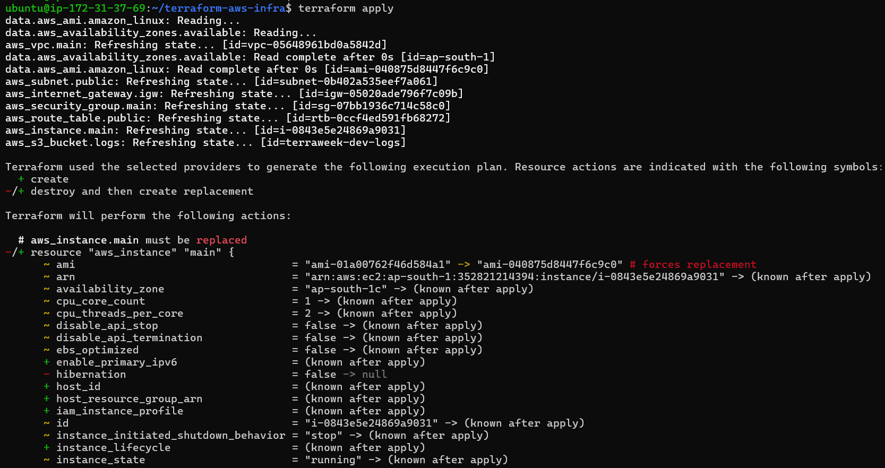
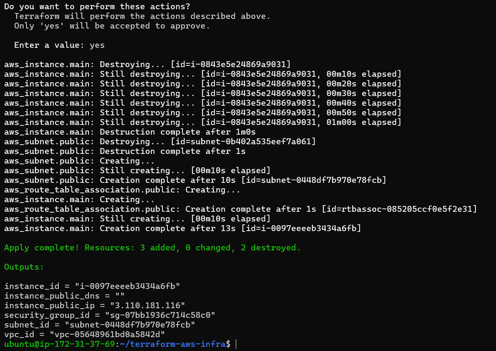
---

## Commands Used

```bash
terraform fmt
terraform validate
terraform plan
terraform apply
```

---

## Key Takeaways

- Data Sources fetch existing AWS information instead of creating resources.
- `aws_ami` dynamically retrieves the latest Amazon Linux 2 AMI.
- `aws_availability_zones` retrieves available Availability Zones in the selected region.
- Using Data Sources makes your Terraform code portable across AWS regions.
- Resources create infrastructure, while Data Sources only read existing information.

---
# Task 5 – Use Locals for Dynamic Values

## Objective

Instead of repeating the same values across multiple resources, Terraform **Locals** let you define reusable values in one place. This improves readability, reduces duplication, and ensures consistent naming and tagging across your infrastructure.

---

## Step 1 – Create `locals.tf`

Create a new file named **locals.tf** and add the following:

## Explanation

- `name_prefix` creates a common prefix for all resource names.
- `common_tags` defines tags that will be applied to every resource.
- This avoids repeating the same values throughout your Terraform configuration.

---

## Step 2 – Update Resource Tags

Replace all hardcoded `Name` tags with `local.name_prefix` and merge the common tags.

### VPC

```hcl
tags = merge(local.common_tags, {
  Name = "${local.name_prefix}-vpc"
})
```

### Public Subnet

```hcl
tags = merge(local.common_tags, {
  Name = "${local.name_prefix}-subnet"
})
```

### Internet Gateway

```hcl
tags = merge(local.common_tags, {
  Name = "${local.name_prefix}-igw"
})
```

### Route Table

```hcl
tags = merge(local.common_tags, {
  Name = "${local.name_prefix}-public-route-table"
})
```

### Security Group

```hcl
tags = merge(local.common_tags, {
  Name = "${local.name_prefix}-sg"
})
```

### EC2 Instance

```hcl
tags = merge(local.common_tags, {
  Name = "${local.name_prefix}-server"
})
```

### S3 Bucket

```hcl
tags = merge(local.common_tags, {
  Name = "${local.name_prefix}-logs"
})
```

---

## Step 3 – Apply the Configuration

Run:

```bash
terraform fmt
terraform validate
terraform apply
```

Terraform updates the resource tags using the local values.

---

## Verification

Open the AWS Console and verify that each resource contains:

- **Project** = `terraweek`
- **Environment** = `dev`
- **ManagedBy** = `Terraform`
- **Name** = Resource-specific name (for example, `terraweek-dev-vpc`)

All resources should now have consistent naming and tagging.


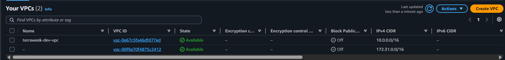

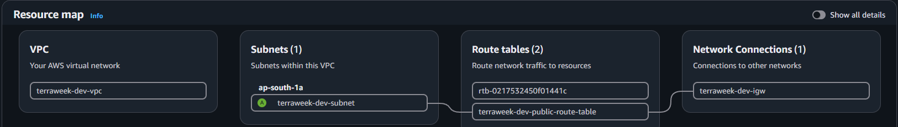


---

## Why Use Locals?

- Reduces duplicate code.
- Keeps resource names consistent.
- Makes updates easier by changing values in one place.
- Improves readability and maintainability.

---

## Key Takeaways

- **Locals** store reusable values within a Terraform configuration.
- **`merge()`** combines multiple maps into a single map.
- Using `local.name_prefix` ensures consistent resource names.
- Using `local.common_tags` applies the same tags to all resources, following Terraform best practices.


## # Task 6 – Built-in Functions and Conditional Expressions

## Objective

Terraform provides many built-in functions that simplify string manipulation, collections, networking, and dynamic configurations. In this task, you'll explore some commonly used functions using `terraform console` and implement a conditional expression to automatically select the EC2 instance type based on the environment.

---

## Step 1 – Open Terraform Console

Run:

```bash
terraform console
```

Use the following functions to understand how Terraform evaluates expressions.

### String Functions

```hcl
upper("terraweek")
```

**Output**

```text
"TERRAWEEK"
```

```hcl
join("-", ["terra", "week", "2026"])
```

**Output**

```text
"terra-week-2026"
```

```hcl
format("arn:aws:s3:::%s", "my-bucket")
```

**Output**

```text
"arn:aws:s3:::my-bucket"
```

### Collection Functions

```hcl
length(["a", "b", "c"])
```

**Output**

```text
3
```

```hcl
lookup({dev = "t2.micro", prod = "t3.small"}, "dev")
```

**Output**

```text
"t2.micro"
```

```hcl
toset(["a", "b", "a"])
```

**Output**

```text
toset([
  "a",
  "b"
])
```

### Networking Function

```hcl
cidrsubnet("10.0.0.0/16", 8, 1)
```

**Output**

```text
"10.0.1.0/24"
```

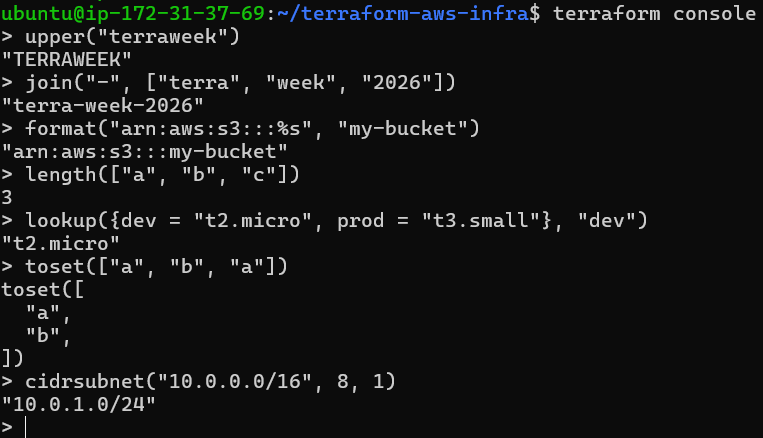

---

## Step 2 – Use a Conditional Expression

Update your EC2 resource in `main.tf`:

```hcl
instance_type = var.environment == "prod" ? "t3.small" : "t2.micro"
```

This expression checks the value of `environment`:

- If `environment` is `prod`, Terraform uses **t3.small**.
- Otherwise, it uses **t2.micro**.

Apply the configuration with:

```bash
terraform apply -var-file="prod.tfvars"
```

---

## Five Built-in Functions I Found Most Useful

### 1. `format()`

```hcl
format("arn:aws:s3:::%s", "my-bucket")
```

Creates formatted strings by replacing placeholders with values. Useful for generating dynamic names and ARNs.

### 2. `lookup()`

```hcl
lookup({dev = "t2.micro", prod = "t3.small"}, "dev")
```

Retrieves a value from a map using a key.

### 3. `cidrsubnet()`

```hcl
cidrsubnet("10.0.0.0/16", 8, 1)
```

Generates subnet CIDR blocks from a larger network. Very useful for VPC and subnet planning.

### 4. `length()`

```hcl
length(["a", "b", "c"])
```

Returns the number of elements in a list or characters in a string.

### 5. `join()`

```hcl
join("-", ["terra", "week", "2026"])
```

Combines multiple strings into one using a specified separator.

---

## Difference Between `variable`, `local`, `output`, and `data`

| Type | Purpose |
|------|---------|
| **variable** | Accepts input values from users, `terraform.tfvars`, CLI, or environment variables. |
| **local** | Stores reusable values within the Terraform configuration to avoid repetition. |
| **output** | Displays important resource information after `terraform apply`. |
| **data** | Fetches information about existing resources without creating or modifying them. |

---

## Key Takeaways

- `terraform console` is useful for testing expressions and functions.
- Built-in functions simplify string formatting, collections, and networking tasks.
- Conditional expressions make Terraform configurations environment-aware.
- Variables accept external input, locals store reusable values, outputs expose resource information, and data sources retrieve existing infrastructure details.