# Day 64 – Terraform State Management & Remote Backends (Fundamentals)

## What is Terraform State?

Terraform State is a file (`terraform.tfstate`) that stores the current state of your infrastructure. It acts as Terraform's source of truth by mapping the resources in your `.tf` files to the actual resources running in your cloud provider. Without the state file, Terraform cannot determine what already exists or what needs to be created, modified, or destroyed.

---

## Why is State Important?

Terraform compares your configuration with the state file to create an execution plan. Every `terraform plan` and `terraform apply` depends on the state file to understand the current infrastructure. If the state file is lost or corrupted, Terraform may attempt to recreate existing resources or lose track of them completely.

---

## Local State vs Remote State

### Local State
- Stored on your local machine.
- Suitable for learning and personal projects.
- Risk of accidental deletion or corruption.
- Cannot be safely shared with a team.

### Remote State
- Stored in a remote backend like AWS S3.
- Accessible by all team members.
- More secure and reliable.
- Supports state locking and versioning.

---

## What is a Backend?

A backend tells Terraform where to store its state file. By default, Terraform uses the local backend, but in production environments, remote backends such as Amazon S3 are preferred.

Example:

```hcl
terraform {
  backend "s3" {
    bucket = "my-terraform-state"
    key    = "dev/terraform.tfstate"
    region = "ap-south-1"
  }
}
```

---

## Why Use S3 for Remote State?

Amazon S3 provides:

- Centralized storage
- High durability
- Versioning support
- Easy sharing across teams
- Disaster recovery

---

## Why Use DynamoDB?

When multiple people run Terraform simultaneously, they could overwrite each other's changes. DynamoDB provides **state locking**, allowing only one Terraform operation to modify the state at a time.

Without locking:

```
Developer A --> terraform apply
Developer B --> terraform apply

❌ Both modify the same state
❌ State corruption
❌ Infrastructure inconsistencies
```

With locking:

```
Developer A --> Lock Acquired ✅
Developer B --> Waiting... 🔒
```

---

# Terraform State Lifecycle

```
Terraform Configuration (.tf)
            │
            ▼
     terraform plan
            │
            ▼
 Compare Config with State
            │
            ▼
    terraform apply
            │
            ▼
 Update Infrastructure
            │
            ▼
 Update terraform.tfstate
```

---

# What is State Drift?

State drift occurs when infrastructure is changed **outside Terraform**, such as through the AWS Console, AWS CLI, or another automation tool.

Example:

```
Terraform says:

EC2 Name = WebServer

↓

Someone manually changes it

↓

EC2 Name = ProductionServer

↓

terraform plan

↓

Terraform detects the difference (Drift)
```

Terraform will either:

- Restore the infrastructure to match the code (`terraform apply`), or
- Accept the manual change by updating the Terraform configuration.

---

# Terraform Import

Not every AWS resource is created using Terraform. Existing resources can be brought under Terraform management using:

```bash
terraform import
```

This command **only imports the resource into the Terraform state**. It does **not** generate Terraform configuration, so you must still write the corresponding `.tf` resource block.

---

# Terraform State Commands

## terraform show

Displays the current state in a human-readable format.

---

## terraform state list

Lists all resources currently tracked by Terraform.

---

## terraform state show

Displays every stored attribute of a specific resource.

---

## terraform state mv

Renames or moves a resource within the Terraform state without recreating it.

Useful during resource renaming or module refactoring.

---

## terraform state rm

Removes a resource from Terraform state without deleting the actual infrastructure.

Terraform simply stops managing that resource.

---

## terraform force-unlock

Removes a stale lock when Terraform believes another operation is still running.

Only use this after confirming no other Terraform process is active.

---

## terraform refresh

Updates the state file with the latest information from the cloud provider without making infrastructure changes.

*(Note: In modern Terraform versions, `terraform refresh` is deprecated. Its functionality is effectively handled by `terraform plan` and `terraform apply`.)*

---

# Local vs Remote State Architecture

```
                Local State

        Developer Laptop
              │
              ▼
      terraform.tfstate
              │
      Single User Only


────────────────────────────────────


               Remote State

        Developer A
             │
             │
        Developer B
             │
             ▼
     Amazon S3 Bucket
             │
             ▼
 terraform.tfstate (Shared)
             │
             ▼
 DynamoDB Table (State Lock)
```

---

# Key Takeaways

- Terraform State is Terraform's source of truth.
- State maps Terraform resources to real cloud resources.
- Local state is suitable only for learning or individual use.
- Remote state stored in S3 is recommended for production.
- DynamoDB prevents simultaneous state modifications through locking.
- State drift occurs when infrastructure changes outside Terraform.
- `terraform import` brings existing resources under Terraform management.
- State commands (`show`, `list`, `mv`, `rm`, `force-unlock`) help manage and troubleshoot infrastructure without directly modifying cloud resources.


### Task 1: Inspect Your Current State
Use your Day 63 config (or create a small config with a VPC and EC2 instance). Apply it and then explore the state:


# Step 1: Verify Your Infrastructure

Navigate to your Terraform project.

```bash
cd ~/terraform/day63
```

Check that Terraform is initialized.

```bash
terraform init
```

Verify that your infrastructure exists.

```bash
terraform plan
```

Expected output:

```text
No changes. Your infrastructure matches the configuration.
``` 
---

# Step 2: Display the Complete Terraform State

Run:

```bash
terraform show
```

This command prints the complete Terraform state in a human-readable format.
It displays:

- All tracked resources
- Resource IDs
- Tags
- Networking information
- Computed values
- Dependencies
- Outputs


Scroll through the output and observe how much information Terraform stores compared to what you defined in your `.tf` files.

---

# Step 3: List All Tracked Resources

Run:

```bash
terraform state list
```

Example output:

```text
aws_vpc.main
aws_subnet.public
aws_internet_gateway.igw
aws_route_table.public
aws_route_table_association.public
aws_security_group.web
aws_instance.web
```

This command lists every resource currently managed by Terraform.

---

# Step 4: Count the Resources

Count the number of resources displayed.

Example:

```text
8 resources
```

Record your answer for the lab.

---

# Step 5: Inspect an EC2 Resource

Run:

```bash
terraform state show aws_instance.main
```

> Replace **main** with your EC2 resource name if it is different.

Terraform displays every stored attribute of the EC2 instance.

Observe attributes such as:

- id
- ami
- instance_type
- private_ip
- public_ip
- subnet_id
- security_groups
- availability_zone
- tags
- root_block_device
- metadata_options
- arn
- owner_id

Notice that Terraform stores many more attributes than you explicitly defined.

---

# Step 6: Inspect the VPC Resource

Run:

```bash
terraform state show aws_vpc.main
```

> Replace **main** with your VPC resource name if necessary.

Observe attributes like:

- id
- cidr_block
- default_network_acl_id
- default_route_table_id
- enable_dns_hostnames
- enable_dns_support
- owner_id
- tags

---

# Step 7: Open the State File

Open the Terraform state file.

```bash
vim terraform.tfstate
```

---

# Step 8: Find the Serial Number

Search for:

```json
"serial":
```

Example:

```json
"serial": 81
```

The **serial** number increases every time Terraform updates the state file after operations like:

- terraform apply
- terraform import
- terraform refresh

It represents the current version of the state file.

---

# Step 9: Observe the State File Structure

Notice important sections inside the file:

```text
version
terraform_version
serial
lineage
outputs
resources
```

Each resource contains:

- type
- name
- provider
- attributes
- dependencies

---

# Task 2: Configure an S3 Remote Backend

## Objective

In this task, you will migrate Terraform's local state file to an Amazon S3 bucket. You will also configure a DynamoDB table for state locking so that multiple users cannot modify the state simultaneously. This is the recommended approach for production environments.

---

Verify your AWS credentials:

```bash
aws sts get-caller-identity
```

---

# Step 1: Create an S3 Bucket for Remote State

Choose a globally unique bucket name.

Example:

```text
terraweek-state-yourname
```

Create the bucket:

```bash
aws s3api create-bucket \
  --bucket terraweek-state-karina \
  --region ap-south-1 \
  --create-bucket-configuration LocationConstraint=ap-south-1
```

Verify the bucket:

```bash
aws s3 ls
```

You should see your newly created bucket.

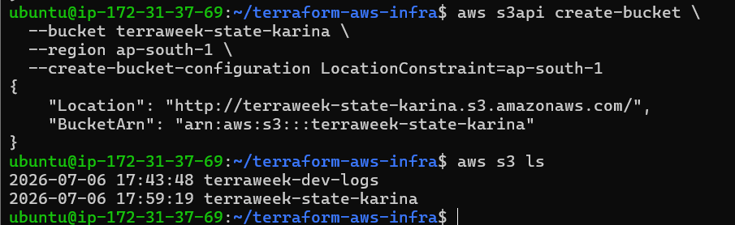
---

# Step 2: Enable Bucket Versioning

Versioning keeps previous copies of your Terraform state, allowing recovery if the state file is accidentally modified or deleted.

Enable versioning:

```bash
aws s3api put-bucket-versioning \
  --bucket terraweek-state-karina \
  --versioning-configuration Status=Enabled
```

Verify versioning:

```bash
aws s3api get-bucket-versioning \
  --bucket terraweek-state-karina
```

Expected output:

```json
{
    "Status": "Enabled"
}
```
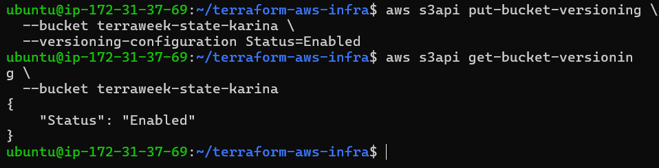
---

# Step 3: Create a DynamoDB Table for State Locking

Create the table:

```bash
aws dynamodb create-table \
  --table-name terraweek-state-lock \
  --attribute-definitions AttributeName=LockID,AttributeType=S \
  --key-schema AttributeName=LockID,KeyType=HASH \
  --billing-mode PAY_PER_REQUEST \
  --region ap-south-1
```

Verify the table:

```bash
aws dynamodb list-tables --region ap-south-1
```

Expected output:

```text
terraweek-state-lock
```
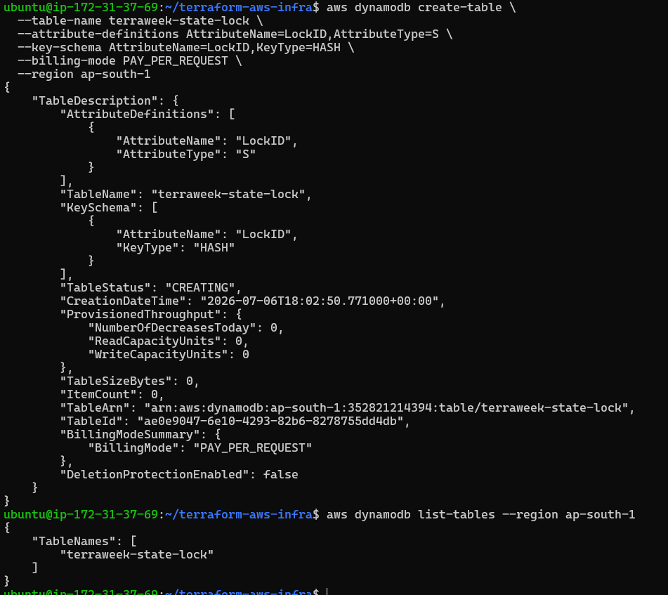
---

# Step 4: Configure the Terraform Backend

Open your Terraform configuration.

```bash
vi main.tf
```

Add the following block near the top of your configuration:

```hcl
terraform {
  backend "s3" {
    bucket         = "terraweek-state-yourname"
    key            = "dev/terraform.tfstate"
    region         = "ap-south-1"
    dynamodb_table = "terraweek-state-lock"
    encrypt        = true
  }
}
```

> Replace **terraweek-state-yourname** with your actual bucket name.

Save the file.

---

# Step 5: Initialize the New Backend

Run:

```bash
terraform init
```

Terraform detects that the backend has changed and prompts:

```text
Do you want to copy existing state to the new backend?
```

Type:

```text
yes
```

Terraform uploads the existing local state file to the S3 bucket.

Expected message:

```text
Successfully configured the backend "s3".
```
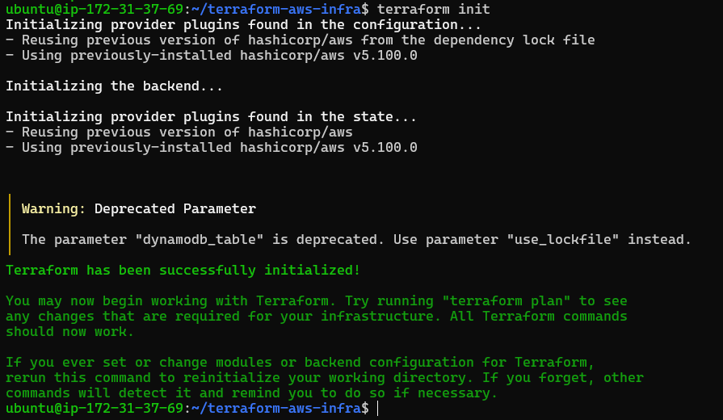
---

# Step 6: Verify the State File in S3

List the objects in the bucket:

```bash
aws s3 ls s3://terraweek-state-yourname/dev/
```

Expected output:

```text
terraform.tfstate
```
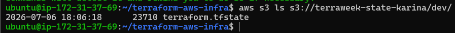
This confirms the state has been migrated successfully.

---

# Step 7: Verify the Local State

Check your project directory:

```bash
ls
```

You should notice that Terraform is now using the remote backend. The local state file is either removed or no longer used for state management.

---

# Step 8: Verify Everything is Working

Run:

```bash
terraform plan
```

Expected output:

```text
No changes. Your infrastructure matches the configuration.
```

This confirms the remote backend is working correctly and the state migration was successful.

---

# Expected Outcome

After completing this task, you should have:

- Created an S3 bucket for storing Terraform state.
- Enabled versioning on the bucket.
- Created a DynamoDB table for state locking.
- Configured the S3 backend in Terraform.
- Migrated the local state to the remote backend.
- Verified the state file exists in S3.
- Confirmed Terraform can read the remote state without any infrastructure changes.


# Task 3: Test Terraform State Locking

# Step 1: Open Two Terminal Windows

Open **two terminal windows** and navigate to the same Terraform project.

---

# Step 2: Start Terraform Apply (Terminal 1)

Run:

```bash
terraform apply
```

Terraform will display the execution plan.

Example:

```text
Terraform will perform the following actions...

Plan: 0 to add, 1 to change, 0 to destroy.
```

At the bottom you'll see:

```text
Do you want to perform these actions?

Terraform will perform the actions described above.
Only 'yes' will be accepted to approve.

Enter a value:
```

**Do not type `yes` yet.**

Leave the command waiting at the confirmation prompt.

At this point, Terraform has already acquired the **state lock**.

---

# Step 3: Try Running Terraform in Terminal 2

Without closing Terminal 1, switch to **Terminal 2**.

Run:

```bash
terraform plan
```

Terraform will attempt to acquire the lock.

Since Terminal 1 already owns the lock, Terminal 2 should fail.

---

# Step 4: Observe the Lock Error

Expected output (similar):

```text
╷
│ Error: Error acquiring the state lock
│
│ Error message:
│ ConditionalCheckFailedException
│
│ Lock Info:
│
│ ID:        3d8d2b8d-2fd6-7b48-9f95-xxxxx
│ Path:      dev/terraform.tfstate
│ Operation: OperationTypeApply
│ Who:       ubuntu@ip-172-31-xx-xx
│ Version:   1.x.x
│ Created:   2026-07-06
│
╵
```
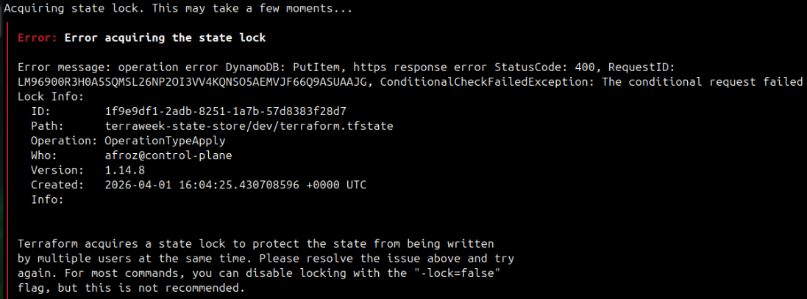
Notice the following details:

- Lock ID
- State file path
- Operation type
- User holding the lock
- Terraform version
- Lock creation time

These details help identify who currently owns the lock.

---

# Step 5: Release the Lock

Return to **Terminal 1**.

You have two options:

### Option 1 (Recommended)

Type:

```text
no
```

Terraform exits without making changes and releases the lock.

---

### Option 2

Press:

```text
Ctrl + C
```

This also cancels the operation and releases the lock.

---

# Step 6: Verify the Lock is Released

Go back to **Terminal 2**.

Run:

```bash
terraform plan
```

Expected output:

```text
No changes. Your infrastructure matches the configuration.
```

This confirms the lock has been released successfully.

---

# Step 7 (Optional): Simulate a Stale Lock

Sometimes Terraform may crash before releasing the lock.

If this happens, Terraform will continue showing:

```text
Error acquiring the state lock
```

To manually remove the lock, use the Lock ID shown in the error:

```bash
terraform force-unlock <LOCK_ID>
```

Example:

```bash
terraform force-unlock 3d8d2b8d-2fd6-7b48-9f95-xxxxx
```

Terraform will ask for confirmation:

```text
Do you really want to force-unlock?
```

Type:

```text
yes
```

> **Note:** Only use `terraform force-unlock` if you are certain no other Terraform operation is currently running.

---

# Verify Everything is Working

Run:

```bash
terraform plan
```

Expected output:

```text
No changes. Your infrastructure matches the configuration.
```

---

# Expected Outcome

After completing this task, you should be able to:

- Understand how Terraform state locking works.
- Observe a state lock acquisition error.
- Identify the Lock ID and lock information.
- Safely release a state lock.
- Use `terraform force-unlock` when necessary.
- Explain why state locking is essential in collaborative environments.

---

# Interview Question

### What is the purpose of Terraform state locking?

Terraform state locking ensures that only one Terraform operation can modify the state file at a time. This prevents concurrent updates that could corrupt the state file or leave infrastructure in an inconsistent state.

---

# Documentation

### What error message did you receive?

```text
Error acquiring the state lock
```

---

### Why is state locking important?

State locking prevents multiple users or automation pipelines from modifying the same Terraform state simultaneously. This ensures the state file remains consistent and prevents accidental overwrites, resource duplication, or infrastructure corruption in team environments.


# Task 4: Import an Existing Resource into Terraform

## Objective

In this task, you will import an existing AWS resource into Terraform state. This is useful when resources were created manually or by another tool and need to be managed by Terraform.

---

# Step 1: Create an S3 Bucket Manually

Open the AWS Management Console.

Navigate to:

```text
AWS Console → S3 → Create bucket
```

Provide a globally unique bucket name.

Example:

```text
terraweek-import-test-karina
```

Keep the default settings and create the bucket.

---

# Step 2: Verify the Bucket Exists

Run:

```bash
aws s3 ls
```

You should see your newly created bucket in the list.
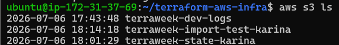

---

# Step 3: Add a Terraform Resource Block

Open your Terraform configuration.

```bash
nano main.tf
```

Add the following resource block:

```hcl
resource "aws_s3_bucket" "imported" {
  bucket = "terraweek-import-test-karina"
}
```

Replace the bucket name with your actual bucket name.

Save the file.

---

# Step 4: Import the Existing Bucket

Run:

```bash
terraform import aws_s3_bucket.imported terraweek-import-test-karina
```

Expected output:

```text
Import successful!
```

Terraform now knows about the existing bucket and adds it to the state file.
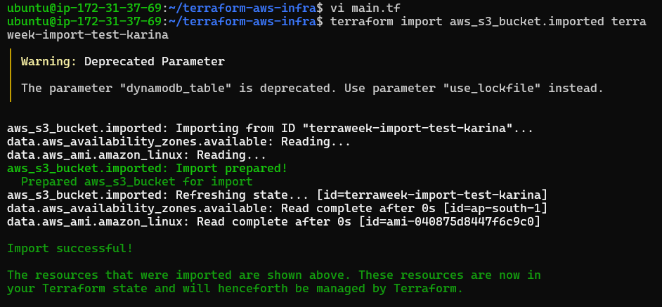

---

# Step 5: Verify the State

Run:

```bash
terraform state list
```

You should now see:

```text
aws_s3_bucket.imported
```

along with your other Terraform resources.
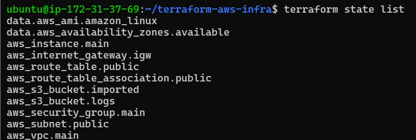
---

# Step 6: Check the Execution Plan

Run:

```bash
terraform plan
```

If your Terraform configuration matches the actual AWS resource, Terraform displays:

```text
No changes.
```

If Terraform detects differences, update your resource block until the plan shows no changes.

---

# Step 7: Inspect the Imported Resource

Run:

```bash
terraform state show aws_s3_bucket.imported
```
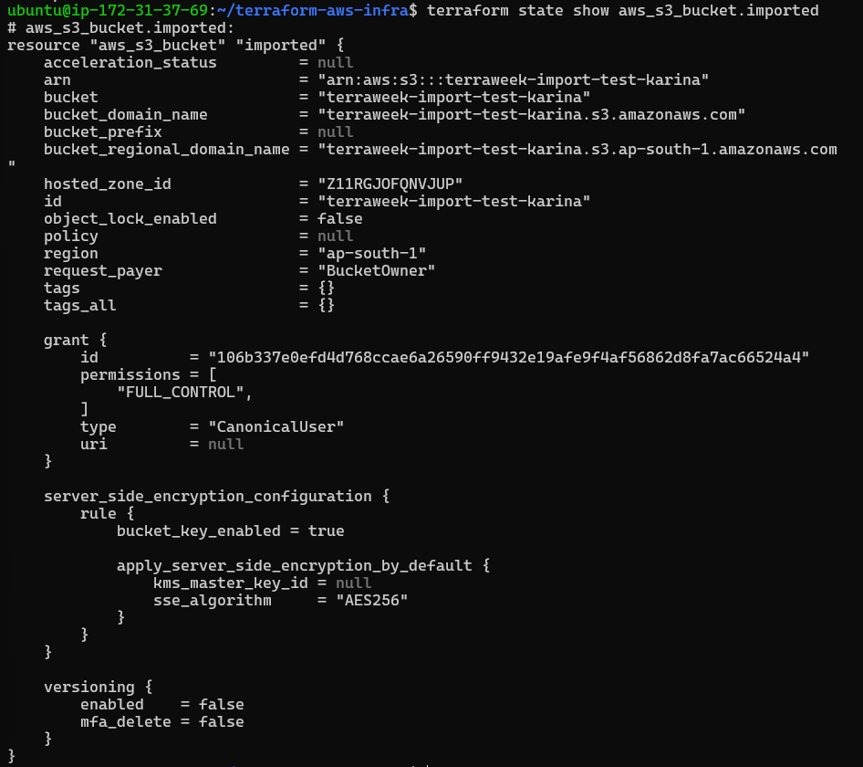

Terraform displays all stored attributes of the imported bucket.

Observe attributes such as:

- ARN
- Bucket name
- Region
- Tags
- Hosted zone ID
- Domain names
- Resource ID

---

# Expected Outcome

After completing this task, you should have:

- Created an S3 bucket manually.
- Added a Terraform resource block.
- Imported the existing bucket into Terraform state.
- Verified the resource appears in `terraform state list`.
- Confirmed `terraform plan` shows no changes.

---

# Documentation Question

### What is the difference between `terraform import` and creating a resource from scratch?

**terraform import**

- Used for resources that already exist.
- Adds the existing resource to Terraform state.
- Does not create new infrastructure.
- Requires a matching Terraform configuration.

**Creating a Resource**

- Terraform provisions a brand-new resource.
- The resource is created during `terraform apply`.
- Terraform manages it from the moment it is created.

--- 

> **Note:** `terraform import` only imports the resource into the **state file**. It does **not** generate Terraform configuration automatically, so you must write the corresponding resource block yourself.


## Task 5: State Surgery -- mv and rm
Sometimes you need to rename a resource or remove it from state without destroying it in AWS.

1. **Rename a resource in state:**
```bash
terraform state list                              # Note the current resource names
terraform state mv aws_s3_bucket.imported aws_s3_bucket.logs_bucket
```

   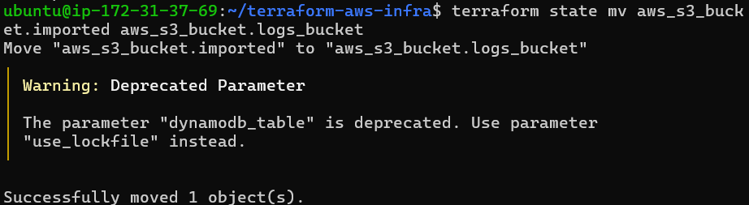

Update your `.tf` file to match the new name. Run `terraform plan` -- it should show no changes.

   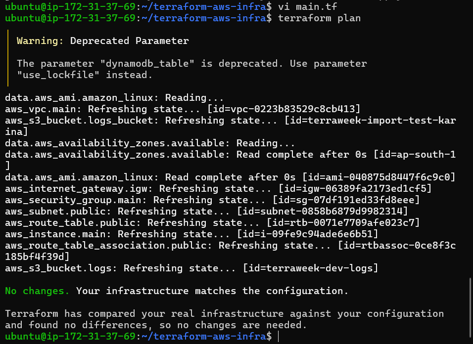

2. **Remove a resource from state (without destroying it):**
```bash
terraform state rm aws_s3_bucket.logs_bucket
```

   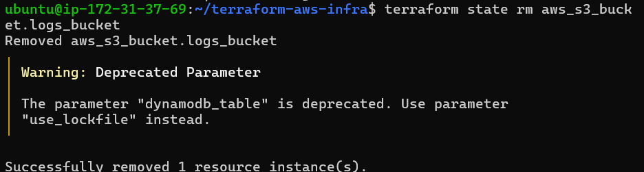

Run `terraform plan` -- Terraform no longer knows about the bucket, but it still exists in AWS.

   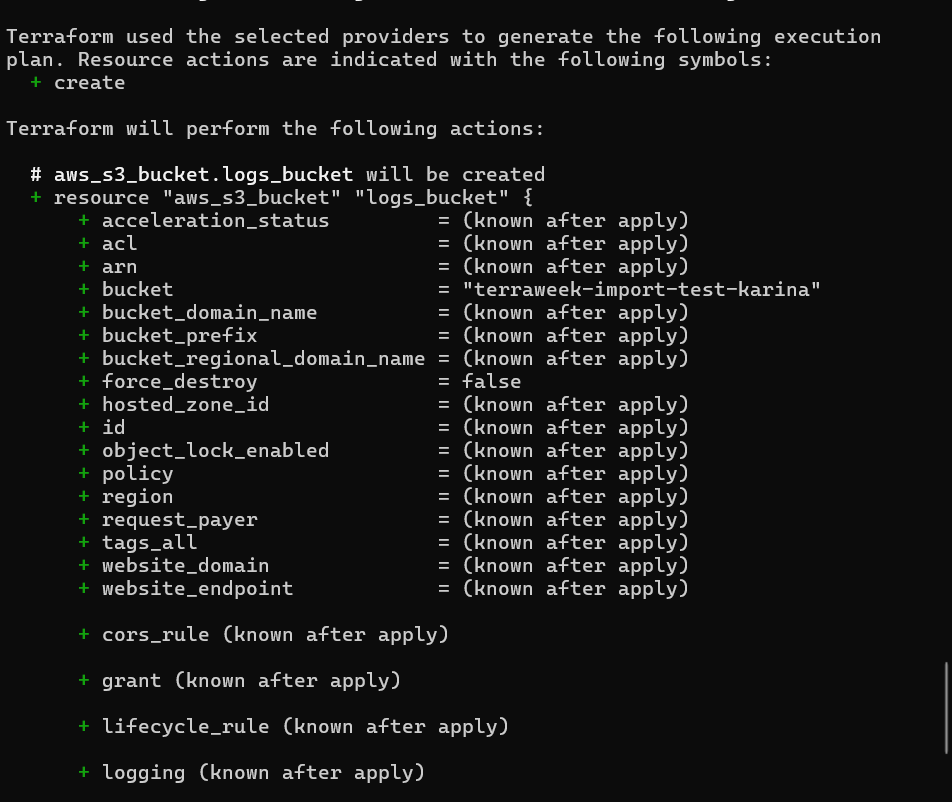

3. **Re-import it** to bring it back:
```bash
terraform import aws_s3_bucket.logs_bucket terraweek-import-test-karina
```

   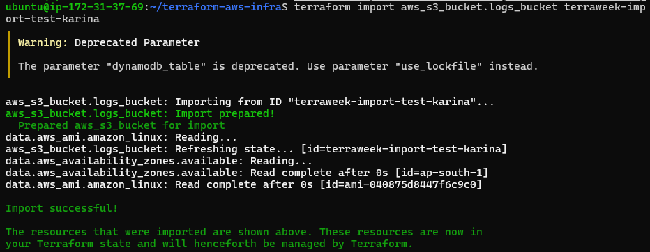

**Document:** When would you use `state mv` in a real project? When would you use `state rm`?
   * `state mv` - When you chnaged name of resource in .tf file and avoid terraform thinking recreate/destroy the resource.
   * You want to change resurce name but keep underlying infrastructure.
   * `state rm` - When you want to remove a resource from terraform's control, so terraform doesn't manage it.

---

## Task 6: Simulate and Fix State Drift
State drift happens when someone changes infrastructure outside of Terraform -- through the AWS console, CLI, or another tool.

1. Apply your full config so everything is in sync
2. Go to the **AWS console** and manually:
   - Change the Name tag of your EC2 instance to `"ManuallyChanged"`
   - Change the instance type if it's stopped (or add a new tag)
3. Run:
```bash
terraform plan
```
You should see a **diff** -- Terraform detects that reality no longer matches the desired state.

   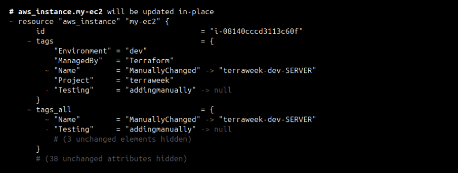 

4. You have two choices:
   - **Option A:** Run `terraform apply` to force reality back to match your config (reconcile)
   - **Option B:** Update your `.tf` files to match the manual change (accept the drift)

5. Choose Option A -- apply and verify the tags are restored.

6. Run `terraform plan` again -- it should show "No changes." Drift resolved.

   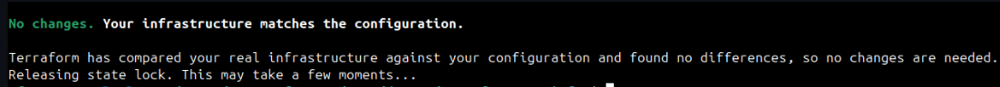

**Document:** How do teams prevent state drift in production? (hint: restrict console access, use CI/CD for all changes)
   * Teams prevent state drift in production by restricting console/CLI access and ensuring all changes go through CI/CD pipelines with version-controlled configurations.

--- 

- Diagram: local state vs remote state setup

   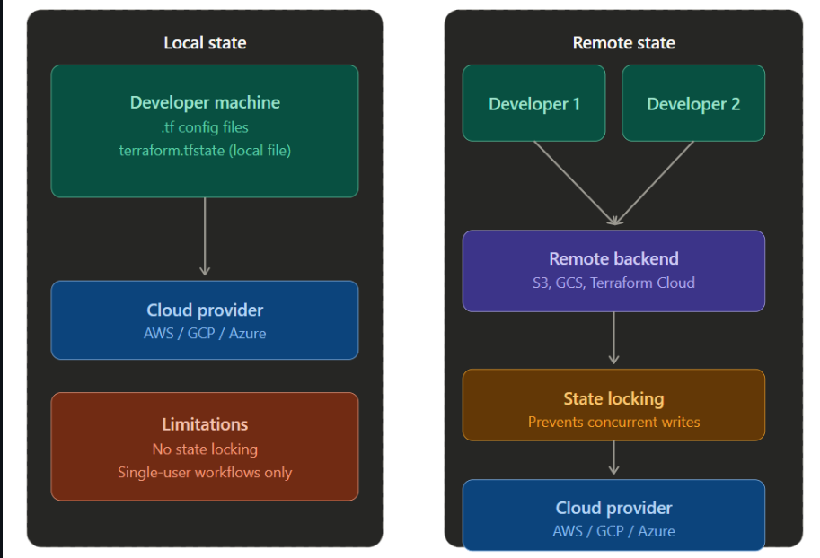

- Steps you followed for `terraform import` and the result
   * Manually created resource `terraform-bucket`
   * Added the `aws_s3_bucket` block in `.tf` config with only bucket name.
   * Import using command : `terraform import aws_s3_bucket.imported terraform-bucket`
   * The result - the bucket was added in the state file, `terraform plan` showed no changes to be made.

- When to use: `state mv`, `state rm`, `import`, `force-unlock`, `refresh`
   * If you changed resource manually then update you .tf and use `state mv`
   * If you don't want terraform to control any resource use `state rm`
   * If you want to add a already existing resource use `import`
   * Unlock a stuck state file after a failed operation `force-unlock`
   * Update state without making changes `refresh`

---