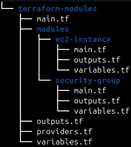
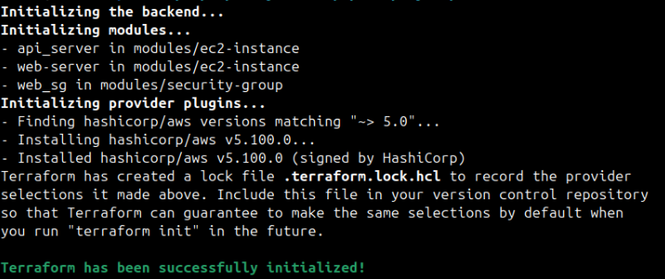
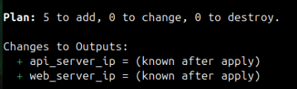
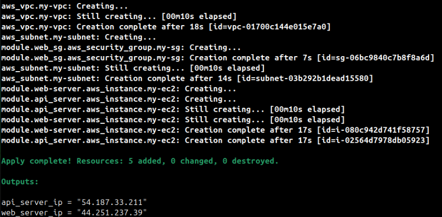
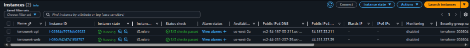
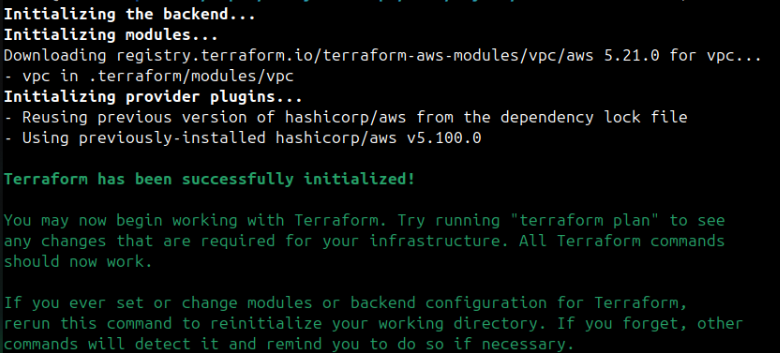
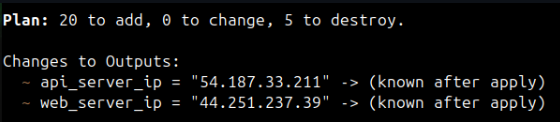
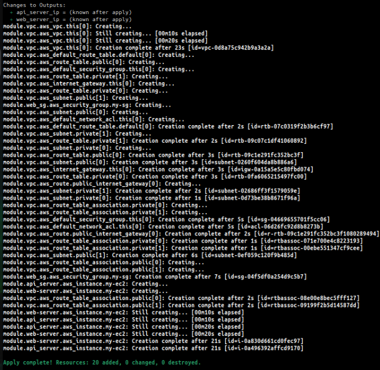
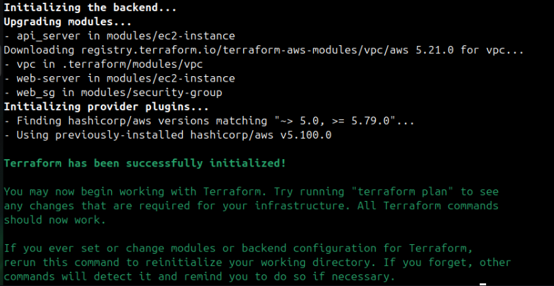
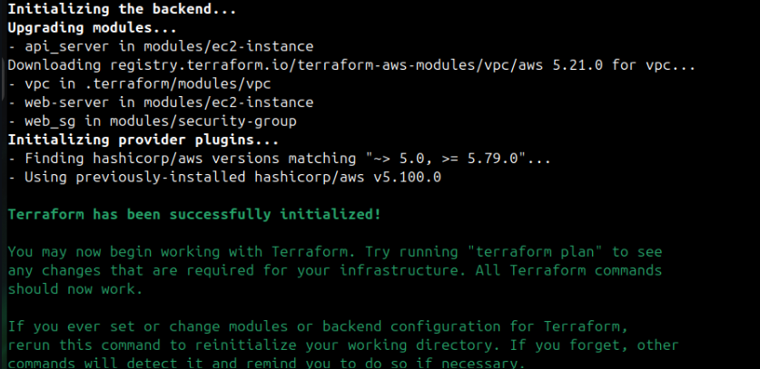

# Day 65 - Terraform Modules: Build Reusable Infrastructure

## Task 1: Understand Module Structure
A Terraform module is just a directory with `.tf` files. Create this structure:

```
terraform-modules/
  main.tf                    # Root module -- calls child modules
  variables.tf               # Root variables
  outputs.tf                 # Root outputs
  providers.tf               # Provider config
  modules/
    ec2-instance/
      main.tf                # EC2 resource definition
      variables.tf           # Module inputs
      outputs.tf             # Module outputs
    security-group/
      main.tf                # Security group resource definition
      variables.tf           # Module inputs
      outputs.tf             # Module outputs
```

Create all the directories and empty files. This is the standard layout every Terraform project follows.

   
   
**Document:** What is the difference between a "root module" and a "child module"?
   * `root module` 
      - It is where terraform commands are run.
      - Entry point with environment specific config.
   * `child module`
      - Called from root using module block.
      - Actual logic is written here. They are reusable like functions.

---

## Task 2: Build a Custom EC2 Module
Create `modules/ec2-instance/`:

## Step 1: Create `variables.tf`

Define the input variables required by the module.

```hcl
variable "ami_id" {
  type = string
}

variable "instance_type" {
  type    = string
  default = "t3.micro"
}

variable "subnet_id" {
  type = string
}

variable "security_group_ids" {
  type = list(string)
}

variable "instance_name" {
  type = string
}

variable "tags" {
  type    = map(string)
  default = {}
}
```

---

## Step 2: Create `main.tf`

Create the EC2 instance using the variables.

```hcl
resource "aws_instance" "this" {
  ami                    = var.ami_id
  instance_type          = var.instance_type
  subnet_id              = var.subnet_id
  vpc_security_group_ids = var.security_group_ids

  tags = merge(
    {
      Name = var.instance_name
    },
    var.tags
  )
}
```

---

## Step 4: Create `providers.tf`

Expose useful outputs from the module.

```hcl
terraform {
  required_providers {
    aws = {
      source  = "hashicorp/aws"
      version = "~> 6.0"
    }
  }
}

provider "aws" {
  region = "ap-south-1"
}
```

---

## Step 4: Validate the Module

Go back to your root Terraform directory and run:

```bash
terraform fmt
terraform validate
```

> **Do not run `terraform apply` yet.** The task only requires creating the reusable EC2 module.

---

# Task 3: Build a Custom Security Group Module 

## Step 1: Create the Module Directory

```bash
mkdir -p modules/security-group
cd modules/security-group
```

Your directory structure should look like:

```text
modules/
└── security-group/
    ├── providers.tf
    ├── variables.tf
    ├── main.tf
    └── outputs.tf
```

---

## Step 2: Create `providers.tf`

> This declares the required provider for the module. The actual AWS provider configuration (region, credentials, etc.) will still come from the **root module**.

```hcl
terraform {
  required_providers {
    aws = {
      source  = "hashicorp/aws"
      version = "~> 6.0"
    }
  }
}

provider "aws" {
  region = "ap-south-1"
}
```

---

## Step 3: Create `variables.tf`

Define the input variables.

```hcl
variable "vpc_id" {
  type = string
}

variable "sg_name" {
  type = string
}

variable "ingress_ports" {
  type    = list(number)
  default = [22, 80]
}

variable "tags" {
  type    = map(string)
  default = {}
}
```

---

## Step 4: Create `main.tf`

Create the Security Group and use a **dynamic block** to generate ingress rules.

```hcl
resource "aws_security_group" "this" {
  name   = var.sg_name
  vpc_id = var.vpc_id

  dynamic "ingress" {
    for_each = var.ingress_ports

    content {
      from_port   = ingress.value
      to_port     = ingress.value
      protocol    = "tcp"
      cidr_blocks = ["0.0.0.0/0"]
    }
  }

  egress {
    from_port   = 0
    to_port     = 0
    protocol    = "-1"
    cidr_blocks = ["0.0.0.0/0"]
  }

  tags = merge(
    {
      Name = var.sg_name
    },
    var.tags
  )
}
```

---

## Step 5: Create `outputs.tf`

Expose the Security Group ID.

```hcl
output "sg_id" {
  value = aws_security_group.this.id
}
```

---

## Step 6: Validate the Module

Return to the root Terraform project and run:

```bash
terraform fmt
terraform validate
```

---

## Understanding the `dynamic` Block

Normally, you would write one ingress block for each port:

```hcl
ingress {
  from_port = 22
  ...
}

ingress {
  from_port = 80
  ...
}
```

With a **dynamic block**, Terraform automatically creates these blocks by looping over the `ingress_ports` list.

For example, if:

```hcl
ingress_ports = [22, 80, 443]
```

Terraform generates:

```text
Ingress Rule 1 → Port 22
Ingress Rule 2 → Port 80
Ingress Rule 3 → Port 443
```

This makes your module reusable and avoids repeating code.

## Task 4: Call Your Modules from Root
In the root `main.tf`, wire everything together:

1. Create a VPC and subnet directly (or reuse your Day 62 config)
2. Call the security group module:
```hcl
module "web_sg" {
  source        = "./modules/security-group"
  vpc_id        = aws_vpc.main.id
  sg_name       = "terraweek-web-sg"
  ingress_ports = [22, 80, 443]
  tags          = local.common_tags
}
```

3. Call the EC2 module -- deploy **two instances** with different names using the same module:
```hcl
module "web_server" {
  source             = "./modules/ec2-instance"
  ami_id             = data.aws_ami.amazon_linux.id
  instance_type      = "t2.micro"
  subnet_id          = aws_subnet.public.id
  security_group_ids = [module.web_sg.sg_id]
  instance_name      = "terraweek-web"
  tags               = local.common_tags
}

module "api_server" {
  source             = "./modules/ec2-instance"
  ami_id             = data.aws_ami.amazon_linux.id
  instance_type      = "t2.micro"
  subnet_id             = aws_subnet.public.id
  security_group_ids = [module.web_sg.sg_id]
  instance_name      = "terraweek-api"
  tags               = local.common_tags
}
```

4. Add root outputs that reference module outputs:
```hcl
output "web_server_ip" {
  value = module.web_server.public_ip
}

output "api_server_ip" {
  value = module.api_server.public_ip
}
```

5. Apply:
```bash
terraform init    # Downloads/links the local modules
terraform plan    # Should show all resources from both module calls
terraform apply
```

   

   

   

**Verify:** Two EC2 instances running, same security group, different names. Check the AWS console.

   

---

## Task 5: Use a Public Registry Module
Instead of building your own VPC from scratch, use the official module from the Terraform Registry.

1. Replace your hand-written VPC resources with:
```hcl
module "vpc" {
  source  = "terraform-aws-modules/vpc/aws"
  version = "~> 5.0"

  name = "terraweek-vpc"
  cidr = "10.0.0.0/16"

  azs             = ["us-west-2a", "us-west-2b  "]
  public_subnets  = ["10.0.1.0/24", "10.0.2.0/24"]
  private_subnets = ["10.0.3.0/24", "10.0.4.0/24"]

  enable_nat_gateway = false
  enable_dns_hostnames = true

  tags = local.common_tags
}
```

2. Update your EC2 and SG module calls to reference `module.vpc.vpc_id` and `module.vpc.public_subnets[0]`

3. Run:
```bash
terraform init     # Downloads the registry module
terraform plan
terraform apply
```

   

   

   

4. Compare: how many resources did the VPC module create vs your hand-written VPC from Day 62?
   * `VPC module` created 20 resources, and `hand-written VPC` created 5 resources.

**Document:** Where does Terraform download registry modules to? Check `.terraform/modules/`.
   * `./terraform/modules/vpc` - vpc module downloaded here

---

## Task 6: Module Versioning and Best Practices
1. Pin your registry module version explicitly:
   - `version = "5.1.0"` -- exact version
   - `version = "~> 5.0"` -- any 5.x version
   - `version = ">= 5.0, < 6.0"` -- range

2. Run `terraform init -upgrade` to check for newer versions

   

3. Check the state to see how modules appear:
```bash
terraform state list
```

   

Notice the `module.vpc.`, `module.web_server.`, `module.web_sg.` prefixes.

4. Destroy everything:
```bash
terraform destroy
```

* Write down five module best practices:
   - Always pin versions for registry modules
   - Keep modules focused -- one concern per module
   - Use variables for everything, hardcode nothing
   - Always define outputs so callers can reference resources
   - Add a README.md to every custom module


* Comparison: hand-written VPC vs registry VPC module (resources created)

   * **Hand-written VPC (Day 62)**
     - VPC 1
     - Subnet 1
     - Internet Gateway 1
     - Route Table 1
     - Route Table Association 1
     - Security Group 1
   Total = 6 resources

   * **VPC Module Terraform Registry**
     - VPC
     - aws_vpc.this 1
     - Default resources (auto-managed by module)
     - aws_default_network_acl.this 1
     - aws_default_route_table.default 1
     - aws_default_security_group.this 1
     - Internet Gateway
     - aws_internet_gateway.this 1
     - Subnets Public 2 , Private 2 Total subnets = 4
     - Route Tables Public 1 Private 2 ,Total = 3
     - Routes aws_route.public_internet_gateway 1
     - Route Table Associations Public 2 Private 2 Total = 4
   Total = 17 resources

---