# Day 66 -- Provision an EKS Cluster with Terraform Modules

# Task 1: Project Setup

## Step 1: Create Project Directory

```bash
mkdir terraform-eks
cd terraform-eks

touch providers.tf variables.tf vpc.tf eks.tf outputs.tf terraform.tfvars
```

Project structure:

```text
terraform-eks/
├── providers.tf
├── vpc.tf
├── eks.tf
├── variables.tf
├── outputs.tf
└── terraform.tfvars
```

---

## Step 2: Configure AWS & Kubernetes Providers

### `providers.tf`

```hcl
terraform {
  required_version = ">= 1.5"

  required_providers {
    aws = {
      source  = "hashicorp/aws"
      version = "~> 5.0"
    }

    kubernetes = {
      source  = "hashicorp/kubernetes"
      version = "~> 2.30"
    }
  }
}

provider "aws" {
  region = var.region
}
```

---

## Step 3: Define Variables

### `variables.tf`

```hcl
variable "region" {
  description = "AWS Region"
  type        = string
}

variable "cluster_name" {
  description = "EKS Cluster Name"
  type        = string
  default     = "terraweek-eks"
}

variable "cluster_version" {
  description = "Kubernetes Version"
  type        = string
  default     = "1.31"
}

variable "node_instance_type" {
  description = "Worker Node Instance Type"
  type        = string
  default     = "t3.medium"
}

variable "node_desired_count" {
  description = "Desired Number of Worker Nodes"
  type        = number
  default     = 2
}

variable "vpc_cidr" {
  description = "VPC CIDR Block"
  type        = string
  default     = "10.0.0.0/16"
}
```

---

## Step 4: Set Variable Values

### `terraform.tfvars`

```hcl
region = "ap-south-1"
```

---

## Verify Project Structure

```bash
tree
```

Expected output:

```text
terraform-eks/
├── eks.tf
├── outputs.tf
├── providers.tf
├── terraform.tfvars
├── variables.tf
└── vpc.tf
```

---

## What We Completed

- Created a new Terraform project.
- Configured the AWS provider (`~> 5.0`).
- Added the Kubernetes provider.
- Defined all required input variables.
- Set the AWS region using `terraform.tfvars`.
- Created the base project structure for the EKS deployment.

---
# Task 2: Create the VPC with Registry Module

## Step 1: Create `vpc.tf`

Use the official Terraform AWS VPC Registry Module.

```hcl
module "vpc" {
  source  = "terraform-aws-modules/vpc/aws"
  version = "~> 5.0"

  name = "terraweek-vpc"
  cidr = var.vpc_cidr

  # Availability Zones
  azs = [
    "ap-south-1a",
    "ap-south-1b"
  ]

  # Public Subnets
  public_subnets = [
    "10.0.1.0/24",
    "10.0.2.0/24"
  ]

  # Private Subnets
  private_subnets = [
    "10.0.11.0/24",
    "10.0.12.0/24"
  ]

  # NAT Gateway
  enable_nat_gateway = true
  single_nat_gateway = true

  # DNS
  enable_dns_hostnames = true

  # Required EKS Tags
  public_subnet_tags = {
    "kubernetes.io/role/elb" = 1
  }

  private_subnet_tags = {
    "kubernetes.io/role/internal-elb" = 1
  }

  tags = {
    Environment = "Dev"
    Project     = "TerraWeek"
    ManagedBy   = "Terraform"
  }
}
```

---

## Step 2: Initialize Terraform

Since this is the first Registry module, download it by running:

```bash
terraform init
```

Terraform will download the **terraform-aws-modules/vpc/aws** module and its dependencies.

---

## Step 3: Review the Execution Plan

```bash
terraform plan
```

Verify that Terraform plans to create:

- VPC
- 2 Public Subnets
- 2 Private Subnets
- Internet Gateway
- NAT Gateway
- Route Tables
- Route Table Associations

---

## Why does EKS need both Public and Private Subnets?

- **Public Subnets:** Used for Internet-facing Load Balancers and NAT Gateway.
- **Private Subnets:** Used for EKS Worker Nodes and Kubernetes Pods to improve security.

### Subnet Tags

```hcl
public_subnet_tags = {
  "kubernetes.io/role/elb" = 1
}
```

Marks public subnets for **Internet-facing Load Balancers**.

```hcl
private_subnet_tags = {
  "kubernetes.io/role/internal-elb" = 1
}
```

Marks private subnets for **Internal Load Balancers**.

---

## Verify

Run:

```bash
terraform init
terraform plan
```

If the plan completes successfully, your VPC configuration is ready for the next task (creating the EKS cluster).

   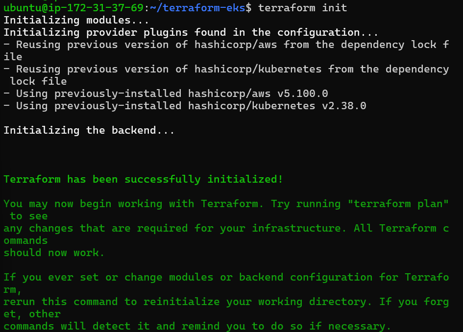

**Document:** Why does EKS need both public and private subnets? What do the subnet tags do?
   - When provisioning an EKS cluster we need both subnets for security and functionality.
   - `pulic subnets` :
     - Hosts internet facing resources (NAT Gateways, Internet-facing Load Balancers (ALB/NLB))
     - Entry point for external traffic.
   - `private subnets` :
     - Hosts cluster workloads (EKS worker nodes, pods, internal databases, Internal Load Balancers)
     - Secure zone for actual workload. External traffic can't reach directly.
   - `subnet tags`
     - The AWS Load Balancer Controller scans subnets for these tags to decide where to 
       place resources  such as Application Load Balancers (ALBs) and Network Load Balancers (NLBs) created by Kubernetes
     - These tags help the controller distinguish between public and private subnets and
       ensure resources are provisioned in the right place.
     - `public_subnet_tags = {"kubernetes.io/role/elb" = 1}`
       - Marks subnet for internet facing application/Network Load Balancers (public ALB/NLB)
     - `private_subnet_tags = {"kubernetes.io/role/internal-elb" = 1}`
       - Marks subnet for internal-only Load Balancers (private ALB/NLB, accessible only within VPC)

---
# Task 3: Create the EKS Cluster with Registry Module

## Step 1: Create `eks.tf`

Use the official Terraform AWS EKS Registry Module.

```hcl
module "eks" {
  source  = "terraform-aws-modules/eks/aws"
  version = "~> 20.0"

  cluster_name    = var.cluster_name
  cluster_version = var.cluster_version

  vpc_id     = module.vpc.vpc_id
  subnet_ids = module.vpc.private_subnets

  cluster_endpoint_public_access = true

  eks_managed_node_groups = {
    terraweek_nodes = {
      ami_type       = "AL2_x86_64"
      instance_types = [var.node_instance_type]

      min_size     = 1
      max_size     = 3
      desired_size = var.node_desired_count
    }
  }

  tags = {
    Environment = "Dev"
    Project     = "TerraWeek"
    ManagedBy   = "Terraform"
  }
}
```

---

## Step 2: Initialize Terraform

Download the EKS module and its dependencies.

```bash
terraform init
```
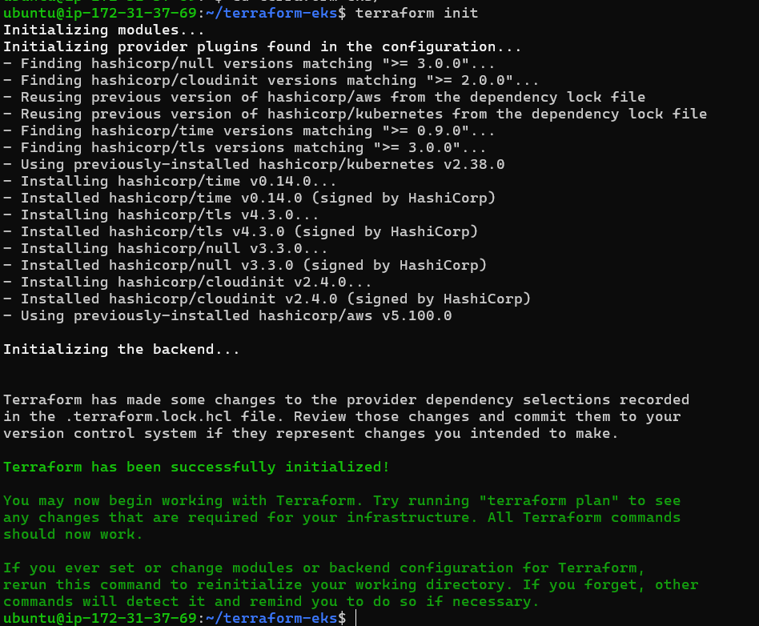
---

## Step 3: Review the Plan

```bash
terraform plan
```

Terraform will create approximately **30+ AWS resources**, including:

- EKS Cluster
- IAM Roles
- Managed Node Group
- Security Groups
- Launch Template
- CloudWatch Log Group
- Auto Scaling Group
- Networking Components

Review the plan carefully before applying.

---

# Task 4: Apply and Connect kubectl

## Step 1: Create the EKS Cluster

```bash
terraform apply
```

> **Note:** EKS provisioning typically takes **10–15 minutes**.

---

## Step 2: Add Outputs

Create or update `outputs.tf`.

```hcl
output "cluster_name" {
  value = module.eks.cluster_name
}

output "cluster_endpoint" {
  value = module.eks.cluster_endpoint
}

output "cluster_region" {
  value = var.region
}
```
 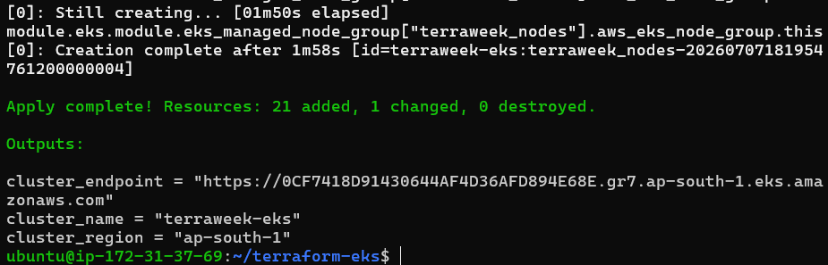
---

## Step 3: Configure kubectl

Update your kubeconfig so `kubectl` can connect to the EKS cluster.

```bash
aws eks update-kubeconfig \
  --name terraweek-eks \
  --region ap-south-1
```

---

## Step 4: Verify the Cluster

Check that the worker nodes are ready.

```bash
kubectl get nodes
```

List all pods in every namespace.

```bash
kubectl get pods -A
```

Display cluster information.

```bash
kubectl cluster-info
```
 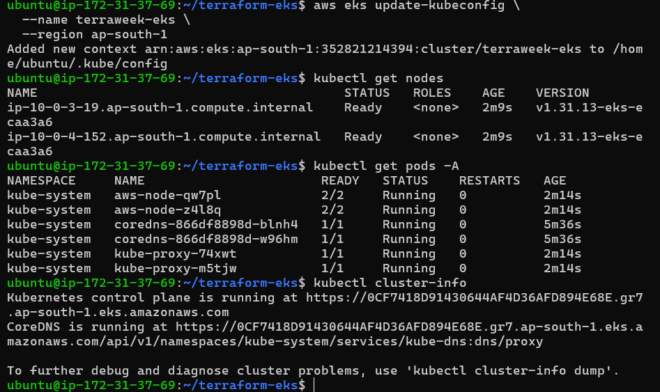

---

## Verify

You should see:

- ✅ 2 Worker Nodes in **Ready** state.
- ✅ `kube-system` pods running.
- ✅ `kubectl` successfully connected to the EKS cluster.

   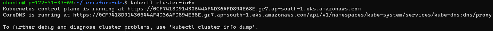

**Verify:** Do you see 2 nodes in `Ready` state? Can you see the kube-system pods running?
* **YES**

---

## Task 5: Deploy a Workload on the Cluster
Your Terraform-provisioned cluster is live. Deploy something on it.

1. Create a file `nginx-deployment.yaml`:
```yaml
apiVersion: apps/v1
kind: Deployment
metadata:
  name: nginx-terraweek
  labels:
    app: nginx
spec:
  replicas: 3
  selector:
    matchLabels:
      app: nginx
  template:
    metadata:
      labels:
        app: nginx
    spec:
      containers:
      - name: nginx
        image: nginx:latest
        ports:
        - containerPort: 80
---
apiVersion: v1
kind: Service
metadata:
  name: nginx-service
spec:
  type: LoadBalancer
  selector:
    app: nginx
  ports:
  - port: 80
    targetPort: 80
```

2. Apply:
```bash
kubectl apply -f nginx-deployment.yaml
```

3. Wait for the LoadBalancer to get an external IP:
```bash
kubectl get svc nginx-service -w
```

   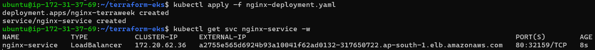

4. Access the Nginx page via the LoadBalancer URL

   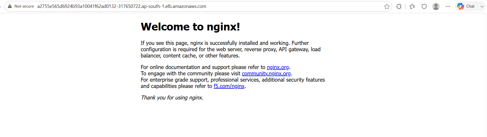

5. Verify the full picture:
```bash
kubectl get nodes
kubectl get deployments
kubectl get pods
kubectl get svc
```

   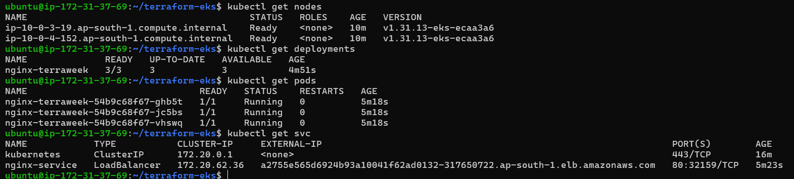

**Verify:** Can you access the Nginx welcome page through the LoadBalancer URL?
* **YES**

---

## Task 6: Destroy Everything
This is the most important step. EKS clusters cost money. Clean up completely.

1. First, remove the Kubernetes resources (so the AWS LoadBalancer gets deleted):
```bash
kubectl delete -f nginx-deployment.yaml
```

2. Wait for the LoadBalancer to be fully removed (check EC2 > Load Balancers in AWS console)

3. Destroy all Terraform resources:
```bash
terraform destroy
```
This will take 10-15 minutes.

4. Verify in the AWS console:
   - EKS clusters: empty
   - EC2 instances: no node group instances
   - VPC: the terraweek VPC should be gone
   - NAT Gateways: deleted
   - Elastic IPs: released

**Verify:** Is your AWS account completely clean? No leftover resources?
* **YES**, clean. No resources left.

---

- Your complete file structure and key config files

   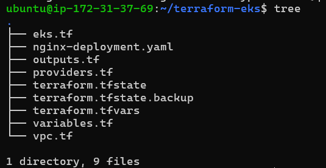

- How many resources Terraform created in total (check the apply output)
   * 57

- The destroy process and verification

   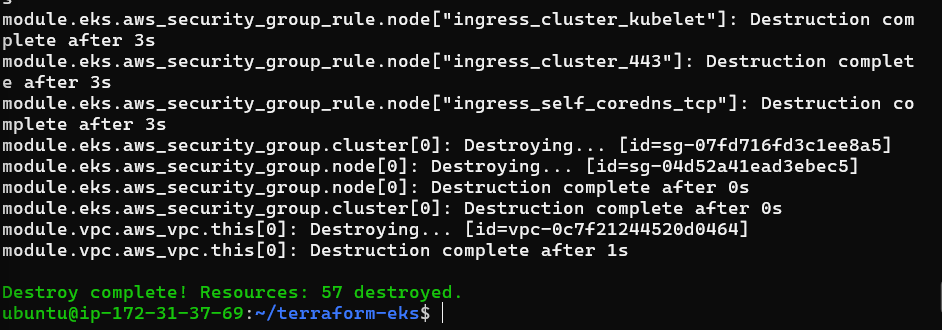

   * No cluster or ec2 instances running. Everything destroyed.

   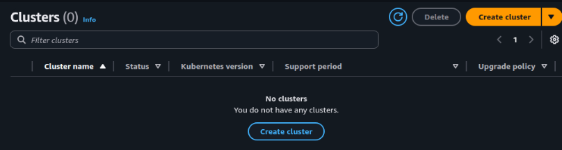

   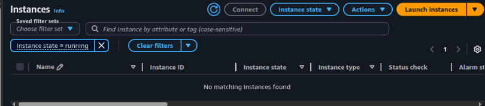

- Reflection: compare this to manually setting up a cluster with kind/minikube (Day 50)

| manual(kind) | aws(eks) |
|--------------|----------|
| Manual SetUP | Automated(Iac) |
| Not reusable (manual steps) | Reusable (code-based, version-controlled) |
| Manual scaling (complex) | Scalable (auto-scaling groups, cluster autoscaler) |
| Limited/manual IAM roles | Native IAM integration (IAM Roles for Service Accounts, EKS Access Entries) |
| Manual HA setup (multi-AZ etcd, control plane) | Highly Available (managed control plane across 3 AZs by default) |
| You patch/upgrade everything| AWS manages control plane patches & upgrades |
| Free (but EC2 costs) | Costly |
| For learning/testing | For production workloads |

---