# Day 67 - TerraWeek Capstone: Multi-Environment Infrastructure with Workspaces and Modules

## Task 1: Learn Terraform Workspaces
Before building the project, understand workspaces:

```bash
mkdir terraweek-capstone && cd terraweek-capstone
terraform init

# See current workspace
terraform workspace show                    # default

# Create new workspaces
terraform workspace new dev
terraform workspace new staging
terraform workspace new prod

# List all workspaces
terraform workspace list

# Switch between them
terraform workspace select dev
terraform workspace select staging
terraform workspace select prod
```

   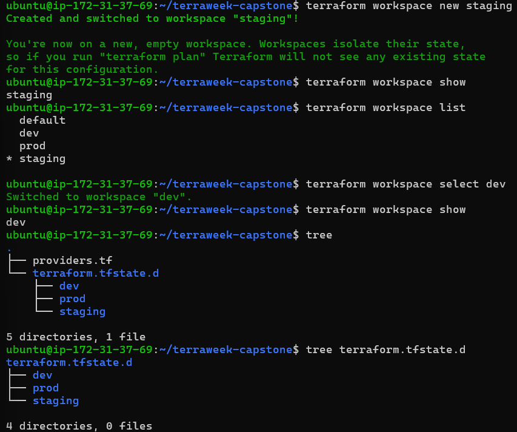

Answer:
1. What does `terraform.workspace` return inside a config?
   - Current workspace
2. Where does each workspace store its state file?
   - terraform.tfstate.d/dev
   - terraform.tfstate.d/staging
   - terraform.tfstate.d/prod
3. How is this different from using separate directories per environment?
   - Workspaces: One codebase, multiple environments via separate state files
   - Directories: Multiple copies of code, one per environment

---

## Task 2: Set Up the Project Structure
Create this layout:

```
terraweek-capstone/
  main.tf                   # Root module -- calls child modules
  variables.tf              # Root variables
  outputs.tf                # Root outputs
  providers.tf              # AWS provider and backend
  locals.tf                 # Local values using workspace
  dev.tfvars                # Dev environment values
  staging.tfvars            # Staging environment values
  prod.tfvars               # Prod environment values
  .gitignore                # Ignore state, .terraform, tfvars with secrets
  modules/
    vpc/
      main.tf
      variables.tf
      outputs.tf
    security-group/
      main.tf
      variables.tf
      outputs.tf
    ec2-instance/
      main.tf
      variables.tf
      outputs.tf
```

Create the `.gitignore`:
```
.terraform/
*.tfstate
*.tfstate.backup
*.tfvars
.terraform.lock.hcl
```

   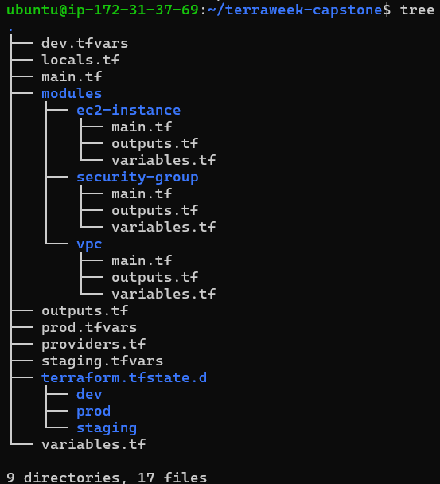

**Document:** Why is this file structure considered best practice?
   - This keeps the code clean and neat.
   - Seperate files like variables, outputs, main to make it more oraganized.
   - Creating modules of resources to make it reusable.
   - Adding environments, using same code with only maintaining different state files.
   - .gitignore for security reasons to not commit secrets and state file etc.

---

## Task 3: Build the Custom Modules
Create three focused modules:

**Module 1: `modules/vpc/`**
- Input: `cidr`, `public_subnet_cidr`, `environment`, `project_name`
- Resources: VPC, public subnet, internet gateway, route table, route table association
- Output: `vpc_id`, `subnet_id`
- All resources tagged with environment and project name

**Module 2: `modules/security-group/`**
- Input: `vpc_id`, `ingress_ports`, `environment`, `project_name`
- Resources: Security group with dynamic ingress rules, allow all egress
- Output: `sg_id`

**Module 3: `modules/ec2-instance/`**
- Input: `ami_id`, `instance_type`, `subnet_id`, `security_group_ids`, `environment`, `project_name`
- Resources: EC2 instance with tags
- Output: `instance_id`, `public_ip`

Write and validate each module:
```bash
terraform validate
```

   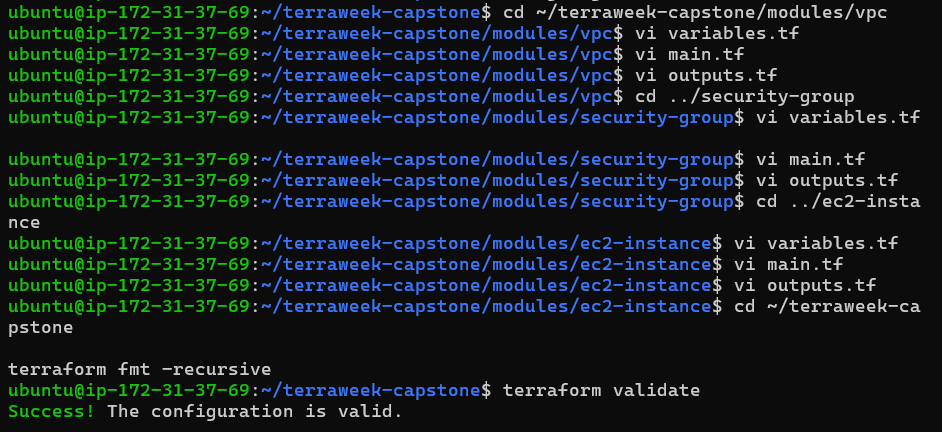

---

## Task 4: Wire It All Together with Workspace-Aware Config
In the root module, use `terraform.workspace` to drive environment-specific behavior.

**`locals.tf`:**
```hcl
locals {
  environment = terraform.workspace
  name_prefix = "${var.project_name}-${local.environment}"

  common_tags = {
    Project     = var.project_name
    Environment = local.environment
    ManagedBy   = "Terraform"
    Workspace   = terraform.workspace
  }
}
```

**`variables.tf`:**
```hcl
variable "project_name" {
  type    = string
  default = "terraweek"
}

variable "vpc_cidr" {
  type = string
}

variable "subnet_cidr" {
  type = string
}

variable "instance_type" {
  type = string
}

variable "ingress_ports" {
  type    = list(number)
  default = [22, 80]
}
```

**`main.tf`** -- call all three modules, passing workspace-aware names and variables.

**Environment-specific tfvars:**

`dev.tfvars`:
```hcl
vpc_cidr      = "10.0.0.0/16"
subnet_cidr   = "10.0.1.0/24"
instance_type = "t2.micro"
ingress_ports = [22, 80]
```

`staging.tfvars`:
```hcl
vpc_cidr      = "10.1.0.0/16"
subnet_cidr   = "10.1.1.0/24"
instance_type = "t2.small"
ingress_ports = [22, 80, 443]
```

`prod.tfvars`:
```hcl
vpc_cidr      = "10.2.0.0/16"
subnet_cidr   = "10.2.1.0/24"
instance_type = "t3.small"
ingress_ports = [80, 443]
```

Notice: dev allows SSH, prod does not. Different CIDRs prevent overlap. Instance types scale up per environment.

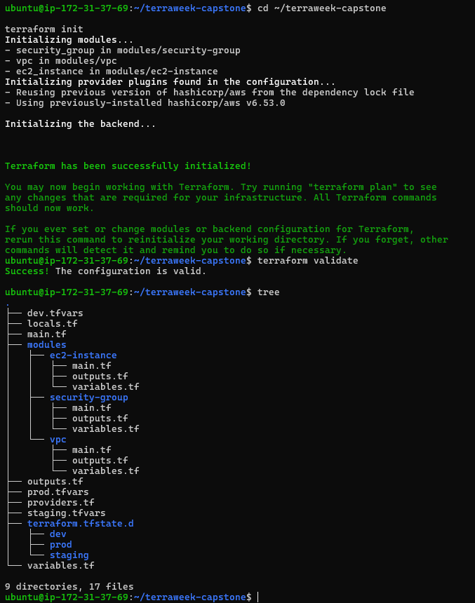

---

## Task 5: Deploy All Three Environments
Deploy each environment using its workspace and tfvars file:

**Dev:**
```bash
terraform workspace select dev
terraform plan -var-file="dev.tfvars"
terraform apply -var-file="dev.tfvars"
```

   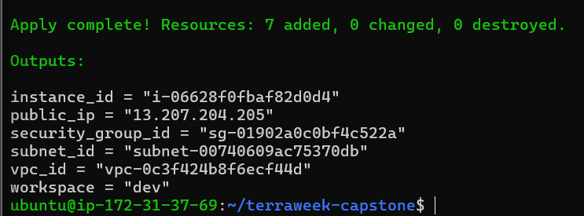

**Staging:**
```bash
terraform workspace select staging
terraform plan -var-file="staging.tfvars"
terraform apply -var-file="staging.tfvars"
```

   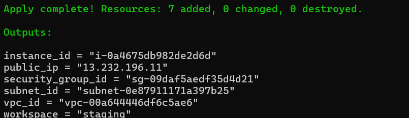

**Prod:**
```bash
terraform workspace select prod
terraform plan -var-file="prod.tfvars"
terraform apply -var-file="prod.tfvars"
```

   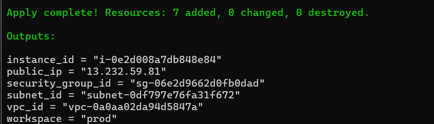

After all three are deployed, verify:
```bash
# Check each workspace's resources
terraform workspace select dev && terraform output
terraform workspace select staging && terraform output
terraform workspace select prod && terraform output
```

   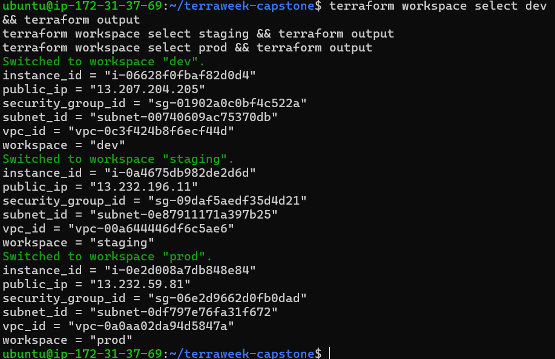

Go to the AWS console and verify:
- Three separate VPCs with different CIDR ranges

   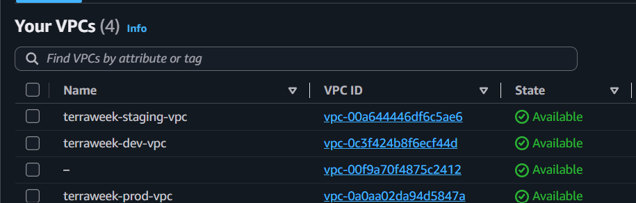

- Three EC2 instances with different instance types

   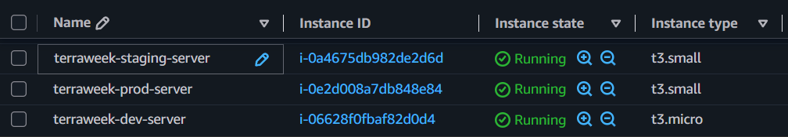

- Different Name tags per environment: `terraweek-dev-server`, `terraweek-staging-server`, `terraweek-prod-server`

**Verify:** Are all three environments completely isolated from each other?
   * **YES**

---

## Task 6: Document Best Practices
Write down everything you have learned this week as a Terraform best practices guide:

1. **File structure** -- separate files for providers, variables, outputs, main, locals
2. **State management** -- always use remote backend, enable locking, enable versioning
3. **Variables** -- never hardcode, use tfvars per environment, validate with `validation` blocks
4. **Modules** -- one concern per module, always define inputs/outputs, pin registry module versions
5. **Workspaces** -- use for environment isolation, reference `terraform.workspace` in configs
6. **Security** -- .gitignore for state and tfvars, encrypt state at rest, restrict backend access
7. **Commands** -- always run `plan` before `apply`, use `fmt` and `validate` before committing
8. **Tagging** -- tag every resource with project, environment, and managed-by
9. **Naming** -- consistent prefix pattern: `<project>-<environment>-<resource>`
10. **Cleanup** -- always `terraform destroy` non-production environments when not in use

---

## Task 7: Destroy All Environments
Clean up all three environments in reverse order:

```bash
terraform workspace select prod
terraform destroy -var-file="prod.tfvars"

terraform workspace select staging
terraform destroy -var-file="staging.tfvars"

terraform workspace select dev
terraform destroy -var-file="dev.tfvars"
```

   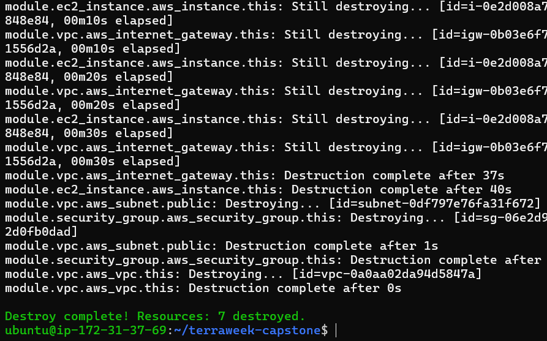

   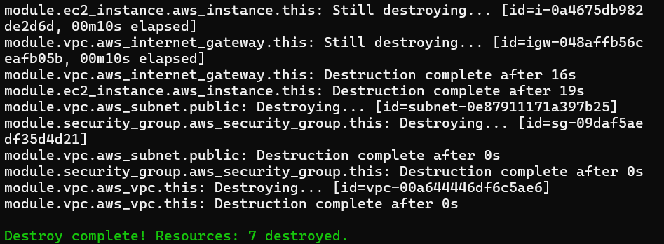

   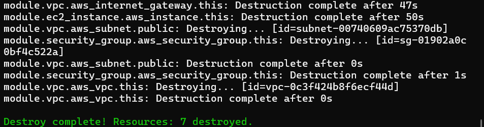

Verify in the AWS console -- all VPCs, instances, security groups, and gateways should be gone.

Delete the workspaces:
```bash
terraform workspace select default
terraform workspace delete dev
terraform workspace delete staging
terraform workspace delete prod
```

   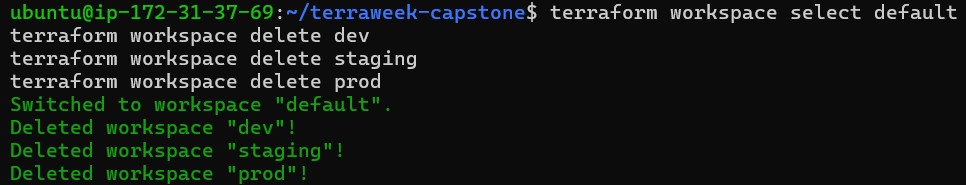

**Verify:** Is your AWS account completely clean? **YES**

   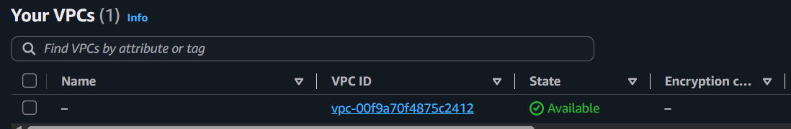

   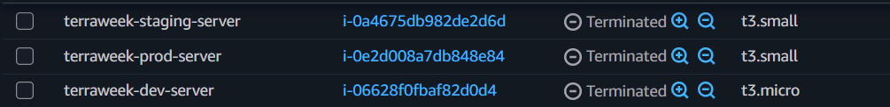

---

- A table mapping each TerraWeek day to the concepts learned:

| Day | Concepts |
|-----|----------|
| 61 | IaC, HCL, init/plan/apply/destroy, state basics |
| 62 | Providers, resources, dependencies, lifecycle |
| 63 | Variables, outputs, data sources, locals, functions |
| 64 | Remote backend, locking, import, drift |
| 65 | Custom modules, registry modules, versioning |
| 66 | EKS with modules, real-world provisioning |
| 67 | Workspaces, multi-env, capstone project |
