# Day 68 -- Introduction to Ansible and Inventory Setup

## Task 1: Understand Ansible
Research and write short notes on:

1. What is configuration management? Why do we need it?
   - Configuration management is the automated process of maintaining system, softwares,
     services in a known, consistent and desired state.
   - It's needed to prevent manual setup errors and ensure consistency. Managing 
     configurations across thousands of servers manually is error-prone, time-consuming, and impossible to scale.

2. How is Ansible different from Chef, Puppet, and Salt?
   - Ansible is `agentless (uses SSH only)` and uses YAML (Playbooks), making it simple  
     and easy to learn. It primarily uses a push model.
   - Chef, Puppet, and Salt are `agent-based` (require installed agents/minions) and use  
     a pull model (agents poll the master for configs). They have a steeper learning curve as they require learning Ruby (Chef/Puppet) or Python (Salt).

3. What does "agentless" mean? How does Ansible connect to managed nodes?
   - `Agentless` mean it does not need any agent installed on managed nodes.
   - Ansible connects to managed nodes using `SSH`. 
   - The nodes' IP addresses, hostnames, private keys are stored in an inventory file.
   - Ansible reads the inventory file and connects to specified host or group of hosts.

4. Draw or describe the Ansible architecture:
   - **Control Node** -- the machine where Ansible runs (your laptop or a jump server)
      - Where all the configuration is set up, all the commands and playbooks are run 
        from here.
   - **Managed Nodes** -- the servers Ansible configures (your EC2 instances)
      - The servers/instances ansible manages. No software installation required.
   - **Inventory** -- the list of managed nodes
      - A file containing a list of managed nodes. It can define IP addresses, hostnames, 
        access key route and organize hosts into groups for easier management.
   - **Modules** -- units of work Ansible executes 
      - Small programs ansible pushes to managed nodes to execute specific tasks (install 
        a package, copy a file, start a service). They represent the desire state of the system and are often idempotent.
   - **Playbooks** -- YAML files that define what to do on which hosts
      - YAML files that define the workflow or configuration instructions. They describe 
        the tasks to be executed on managed nodes.

---

## Task 2: Set Up Your Lab Environment
You need 2-3 EC2 instances to practice on. Choose one approach:

**Option A: Use Terraform (recommended -- you just learned this)**
Use your TerraWeek skills to provision 3 EC2 instances with:
- Amazon Linux 2 or Ubuntu 22.04
- `t3.micro` instance type
- A security group allowing SSH (port 22)
- A key pair for SSH access

**Option B: Launch manually from AWS Console**
Create 3 instances with the same specs above.

Label them mentally:
- **Instance 1:** web server
- **Instance 2:** app server
- **Instance 3:** db server

Verify you can SSH into each one from your control node:
```bash
ssh -i ~/your-key.pem ec2-user@<public-ip-1>
ssh -i ~/your-key.pem ec2-user@<public-ip-2>
ssh -i ~/your-key.pem ec2-user@<public-ip-3>
```
 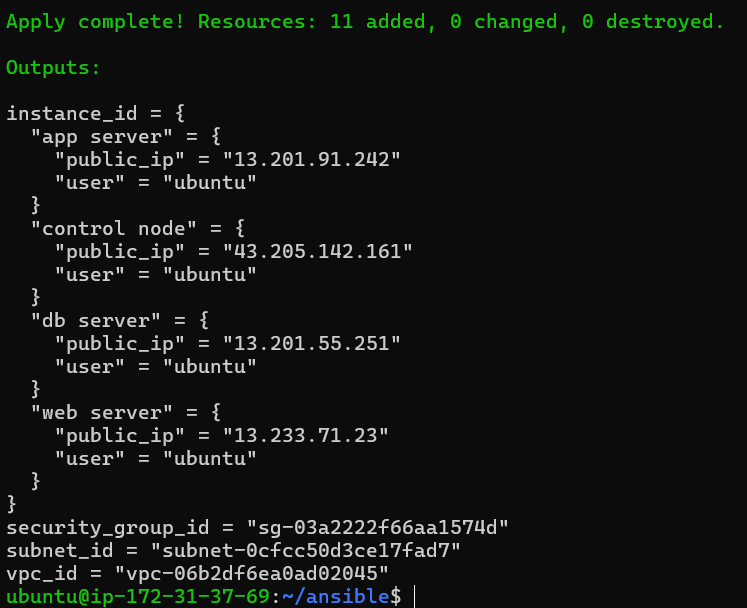
  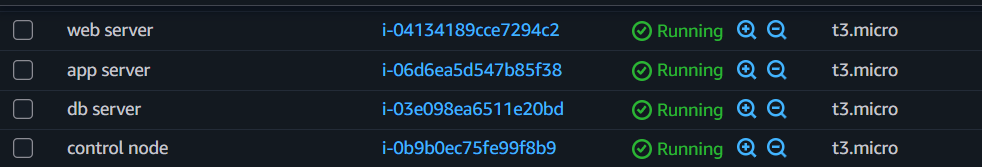

---

## Task 3: Install Ansible
Install Ansible on your **control node** (your laptop or one dedicated EC2 instance):

```bash
# macOS
brew install ansible

# Ubuntu/Debian
sudo apt update
sudo apt install ansible -y

# Amazon Linux / RHEL
sudo yum install ansible -y
# or
pip3 install ansible

# Verify
ansible --version
```

Confirm the output shows the Ansible version, config file path, and Python version.

   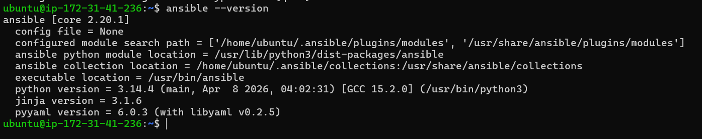

**Document:** On which machine did you install Ansible? Why is it only needed on the control node?
   - Installed ansible on control machine.
   - Since ansible is agentless it needs to be installed only on control node.

---

## Task 4: Create Your Inventory File
The inventory tells Ansible which servers to manage. Create a project directory and your first inventory:

```bash
mkdir ansible-practice && cd ansible-practice
```

Create a file called `inventory.ini`:
```ini
[web]
web-server ansible_host=<PUBLIC_IP_1>

[app]
app-server ansible_host=<PUBLIC_IP_2>

[db]
db-server ansible_host=<PUBLIC_IP_3>

[all:vars]
ansible_user=ec2-user
ansible_ssh_private_key_file=~/your-key.pem
```

Verify Ansible can reach all hosts:
```bash
ansible all -i inventory.ini -m ping
```

   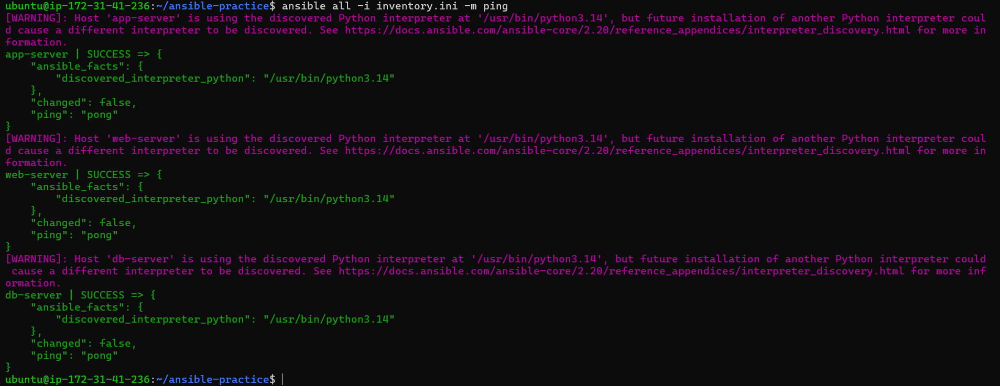

You should see green `SUCCESS` with `"ping": "pong"` for each host.

**Troubleshoot:** If ping fails:
- Check the SSH key path and permissions (`chmod 400 your-key.pem`)
- Check the security group allows SSH from your IP
- Check the `ansible_user` matches your AMI (ec2-user for Amazon Linux, ubuntu for Ubuntu)

---

### Task 5: Run Ad-Hoc Commands
Ad-hoc commands let you run quick one-off tasks without writing a playbook.

1. **Check uptime on all servers:**
```bash
ansible all -i inventory.ini -m command -a "uptime"
```

   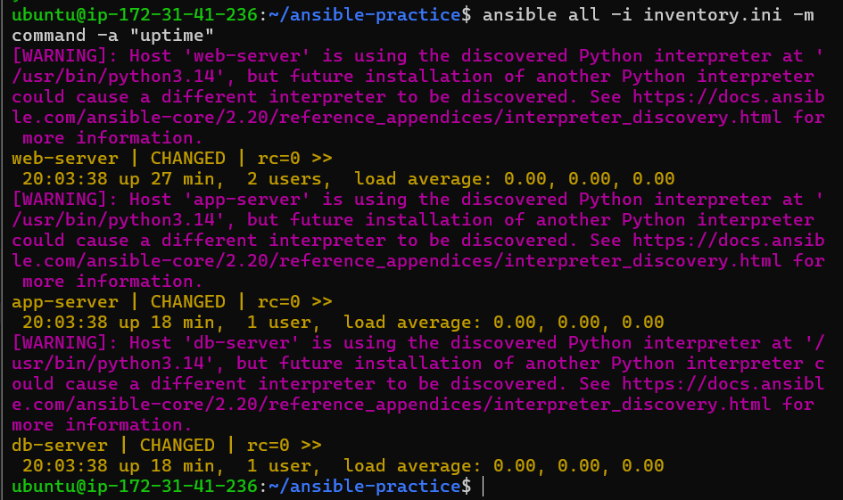

2. **Check free memory on web servers only:**
```bash
ansible web -i inventory.ini -m command -a "free -h"
```

   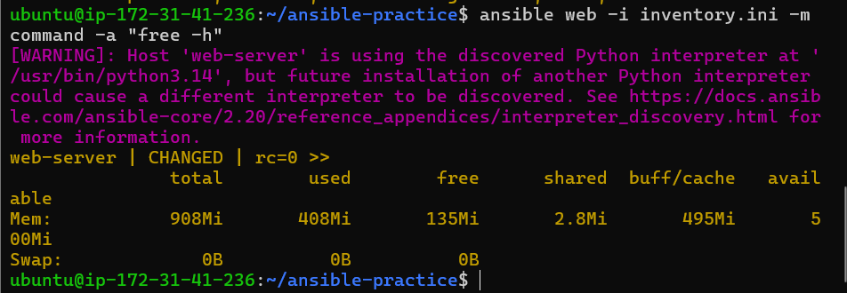

3. **Check disk space on all servers:**
```bash
ansible all -i inventory.ini -m command -a "df -h"
```

   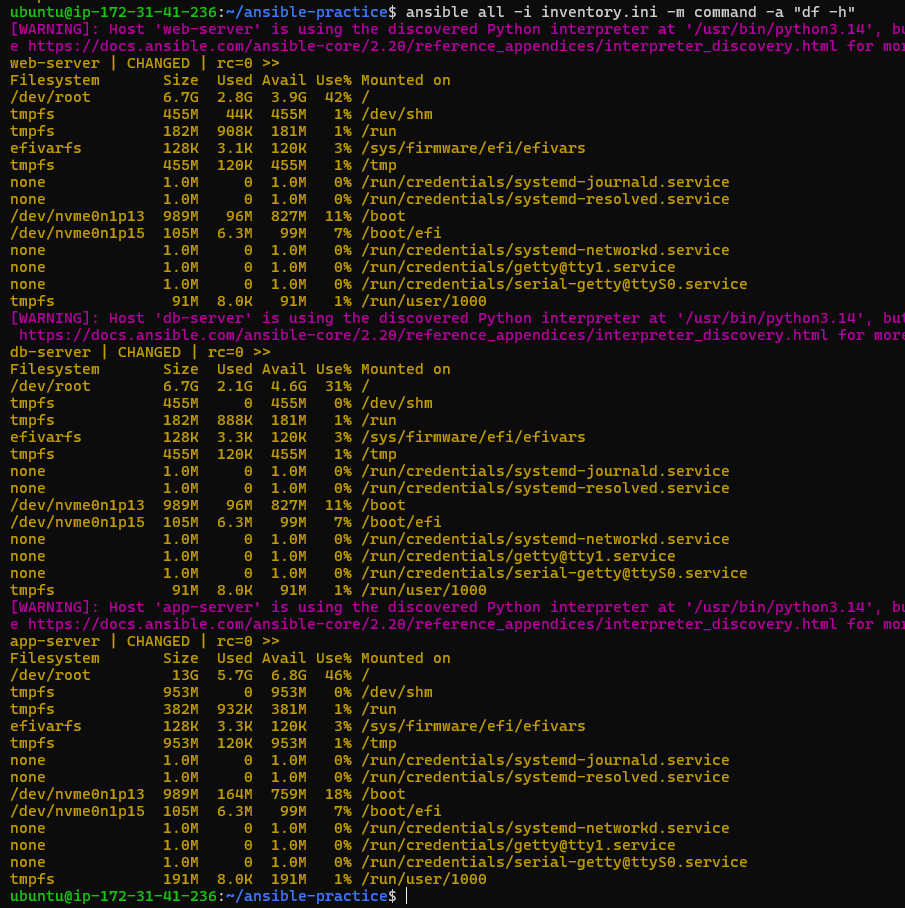

4. **Install a package on the web group:**
```bash
ansible web -i inventory.ini -m apt -a "name=git state=present" --become
```
(Use `apt` instead of `yum` if running Ubuntu)

   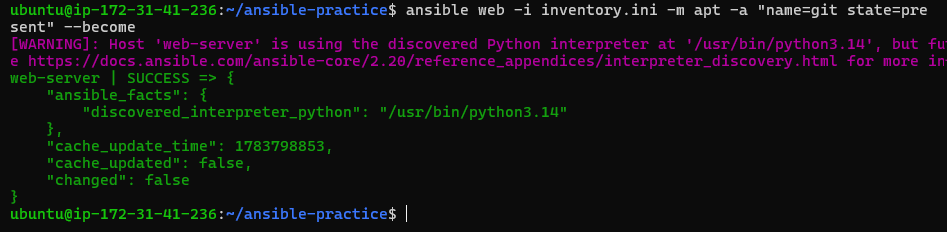

5. **Copy a file to all servers:**
```bash
echo "Hello from Ansible" > hello.txt
ansible all -i inventory.ini -m copy -a "src=hello.txt dest=/tmp/hello.txt"
```

   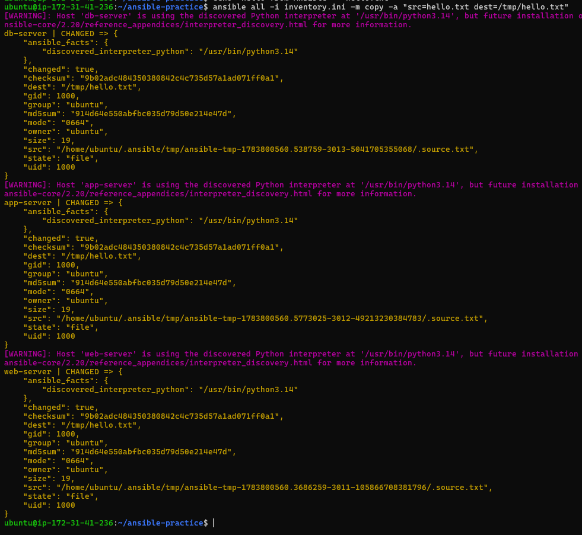

6. **Verify the file was copied:**
```bash
ansible all -i inventory.ini -m command -a "cat /tmp/hello.txt"
```

   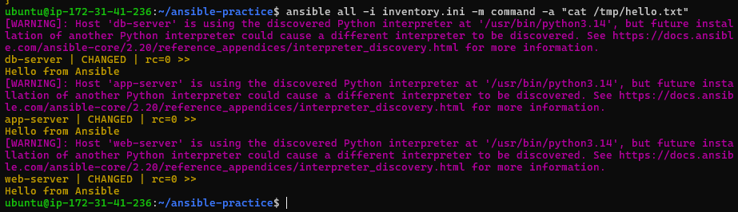

**Document:** What does `--become` do? When do you need it?
   - `--become` executes commands as `root user`. 
   - When you need root access for example installing a packge.
   - `--become` escalates to root (like `sudo`) -- needed for package installation and service management

---

## Task 6: Explore Inventory Groups and Patterns
1. **Create a group of groups** -- add this to your `inventory.ini`:
```ini
[application:children]
web
app

[all_servers:children]
application
db
```

2. Run commands against different groups:
```bash
ansible application -i inventory.ini -m ping     # web + app servers
ansible db -i inventory.ini -m ping               # only db server
ansible all_servers -i inventory.ini -m ping      # everything
```

   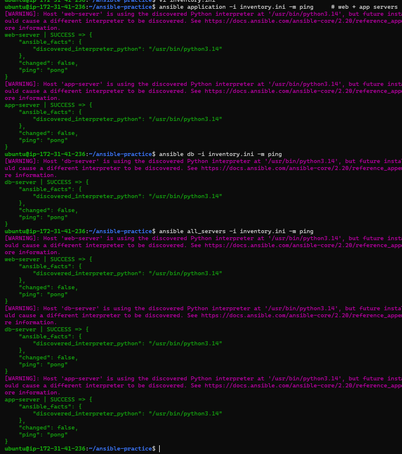

3. **Use patterns:**
```bash
ansible 'web:app' -i inventory.ini -m ping        # OR: web or app
ansible 'all:!db' -i inventory.ini -m ping        # NOT: all except db
```

   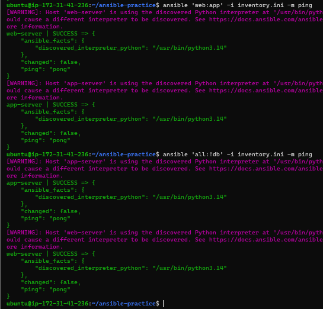

4. **Create an `ansible.cfg`** to avoid typing `-i inventory.ini` every time:
```ini
[defaults]
inventory = inventory.ini
host_key_checking = False
remote_user = ubuntu
private_key_file = ~/your-key.pem
```

Now you can simply run:
```bash
ansible all -m ping
```

   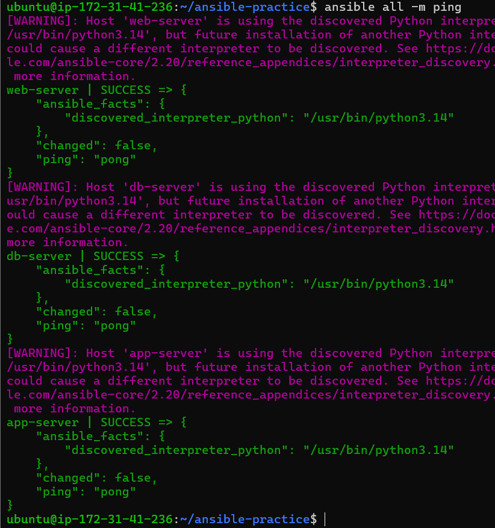

**Verify:** Does `ansible all -m ping` work without specifying the inventory file?
* **YES**

---

## Documentation

- How you set up your lab (Terraform or manual, with instance details)
   - I set up my lap using Terraform.
   - 4 instance created, 1 control node and 3 managed nodes
   - `ubuntu 24.04LTS` OS Family
   - `t3.micro` instance type
   - A security group allowing SSH (port 22)
   - A key pair for SSH access

- Difference between `command` and `shell` modules

   | Command | Shell |
   |---------|-------|
   | Runs simple commands | Supports pipes and redirects |
   | Runs directly without a shell | Runs through `/bin/sh` shell |
   | More secure (no shell injection risk) | Less secure (vulnerable to shell injection) |
   | Use command by default | Only use shell when you absolutely need shell features |

---