# Day 73 - Introduction to Observability and Prometheus

## Task 1: Understand Observability
Research and write short notes on:

1. What is observability? How is it different from traditional monitoring?
   - **Monitoring** tells you _when_ something is wrong (alerts, thresholds)
   - **Observability** tells you _why_ something is wrong (explore, query, correlate)

   | **Monitoring** | **Observability** |
   |----------------|-------------------|
   | Tracks predefined metrics and data points from system components | Collects and analyzes all telemetry data (logs, metrics, traces) to understand system's internal state |
   | Check if system is healthy | Tells why the system is behaving a certain way |
   | Reactive – alerts when something goes wrong | Proactive –  analyzes outputs to understand why issues occur |
   
2. The three pillars of observability:
   - **Metrics** -- numerical measurements over time (CPU usage, request count, error rate). Tools: Prometheus, Datadog, CloudWatch
   - **Logs** -- timestamped text records of events (application output, error messages). Tools: Loki, ELK Stack, Fluentd
   - **Traces** -- the journey of a single request across multiple services. Tools: OpenTelemetry, Jaeger, Zipkin

3. Why do DevOps engineers need all three?
   - Metrics tell you _what_ is broken (high error rate on `/api/users`)
   - Logs tell you _why_ it broke (stack trace showing a database timeout)
   - Traces tell you _where_ it broke (the payment service call took 12 seconds)

4. Draw or describe this architecture -- this is what you will build over the next 5 days:
   ```
   [Your App] --> metrics --> [Prometheus] --> [Grafana Dashboards]
   [Your App] --> logs    --> [Promtail]   --> [Loki] --> [Grafana]
   [Your App] --> traces  --> [OTEL Collector] --> [Grafana/Debug]
   [Host]     --> metrics --> [Node Exporter] --> [Prometheus]
   [Docker]   --> metrics --> [cAdvisor] --> [Prometheus]
   ```

   - grafana is dashboards for logs/metrics/traces.
   - cAdvisor scrapes data and dumps to prometheus, prometheus data is shown using grafana.
   - Promtail scrapes logs and dumps tp loki, then shown through grafana.
   - traces are placed in code, OTEL collector collects its data and shown through grafana.

---

## Task 2: Set Up Prometheus with Docker
Create a project directory for this entire observability block -- you will keep adding to it over the next 5 days.

```bash
mkdir observability-stack && cd observability-stack
```

Create a `prometheus.yml` configuration file:
```yaml
global:
  scrape_interval: 15s
  evaluation_interval: 15s

scrape_configs:
  - job_name: "prometheus"
    static_configs:
      - targets: ["localhost:9090"]
```

This tells Prometheus to scrape its own metrics every 15 seconds.

Create a `docker-compose.yml` to run Prometheus:
```yaml
services:
  prometheus:
    image: prom/prometheus:latest
    container_name: prometheus
    ports:
      - "9090:9090"
    volumes:
      - ./prometheus.yml:/etc/prometheus/prometheus.yml
      - prometheus_data:/prometheus
    command:
      - '--config.file=/etc/prometheus/prometheus.yml'
    restart: unless-stopped

volumes:
  prometheus_data:
```

Start Prometheus:
```bash
docker compose up -d
```

   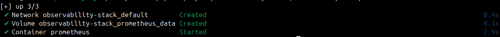

Open `http://localhost:9090` in your browser. You should see the Prometheus web UI.

**Verify:** Go to Status > Targets. You should see one target (`prometheus`) with state `UP`.

   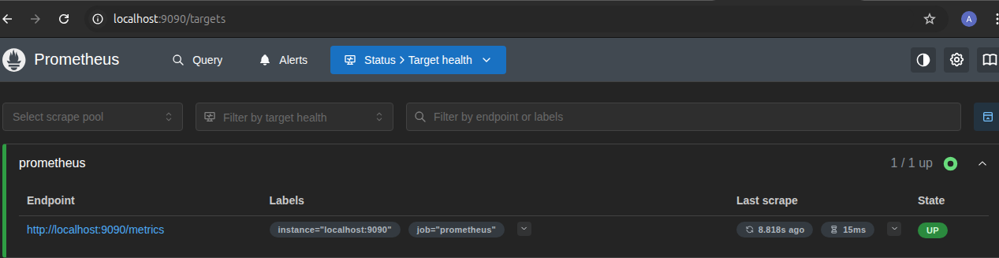

---

## Task 3: Understand Prometheus Concepts
Explore the Prometheus UI and understand these concepts:

1. **Scrape targets** -- endpoints that Prometheus pulls metrics from at regular intervals (pull-based model)
2. **Metrics types:**
   - `Counter` -- only goes up (total requests served, total errors)
   - `Gauge` -- goes up and down (current CPU usage, memory in use, active connections)
   - `Histogram` -- distribution of values in buckets (request duration: how many took <100ms, <500ms, <1s)
   - `Summary` -- similar to histogram but calculates percentiles on the client side
3. **Labels** -- key-value pairs that add dimensions to metrics (e.g., `http_requests_total{method="GET", status="200"}`)
4. **Time series** -- a unique combination of metric name + labels

Go to the Prometheus UI graph page (`http://localhost:9090/graph`) and run these queries:

### How many metrics is Prometheus collecting about itself?
count({__name__=~".+"})

   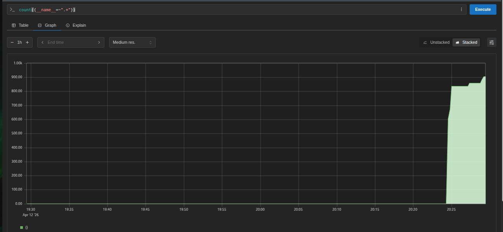

### How much memory is Prometheus using?
process_resident_memory_bytes

   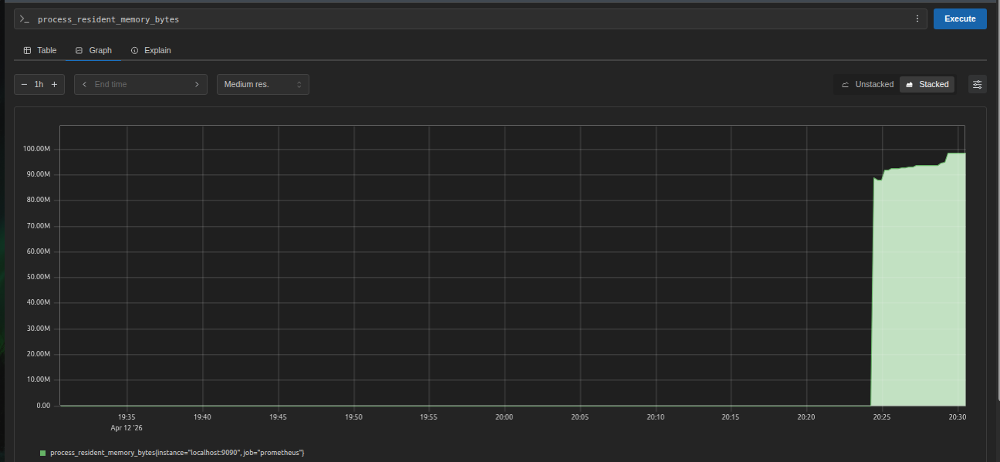
   
### Total HTTP requests to the Prometheus server
prometheus_http_requests_total

   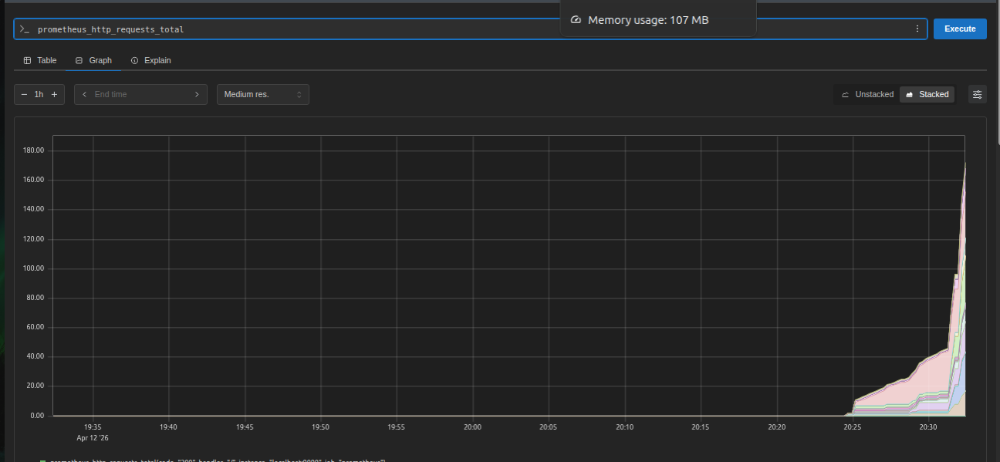

### Break it down by handler
prometheus_http_requests_total{handler="/api/v1/query"}

   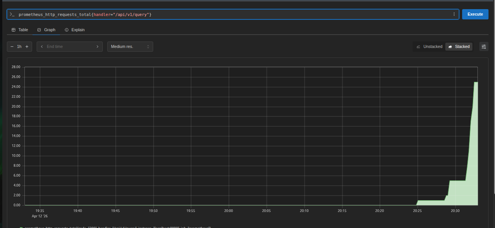

**Document:** What is the difference between a counter and a gauge? Give one real-world example of each.
   - `Counter` -- only goes up (total requests served, total errors).
      - How many times `x` happen.
      - `http_requests_total` (Total request to http server).
   - `Gauge` -- goes up and down (current CPU usage, memory in use, active connections).
      - What is the current status of `x`.
      - `memory_usage_bytes` (Current memory usage).

---

## Task 4: Learn PromQL Basics
PromQL (Prometheus Query Language) is how you ask questions about your metrics. Run these queries in the Prometheus UI:

1. **Instant vector** -- current value of a metric:
```promql
up
```
This returns 1 (up) or 0 (down) for each scrape target.

   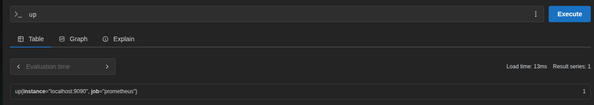

2. **Range vector** -- values over a time window:
```promql
prometheus_http_requests_total[5m]
```
Returns all values from the last 5 minutes.

   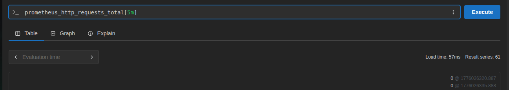

3. **Rate** -- per-second rate of a counter over a time window:
```promql
rate(prometheus_http_requests_total[5m])
```
This is the most common function you will use. Counters always go up -- `rate()` converts them to a useful per-second speed.

   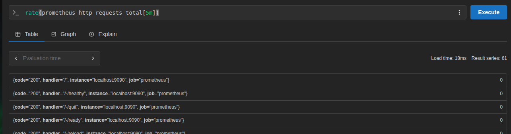

4. **Aggregation** -- sum across all label combinations:
```promql
sum(rate(prometheus_http_requests_total[5m]))
```

   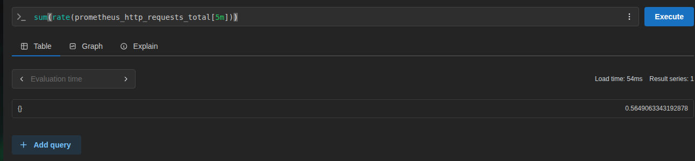

5. **Filter by label:**
```promql
prometheus_http_requests_total{code="200"}
prometheus_http_requests_total{code!="200"}
```

   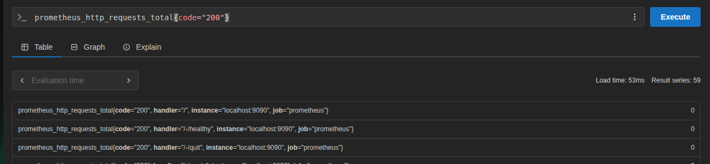

   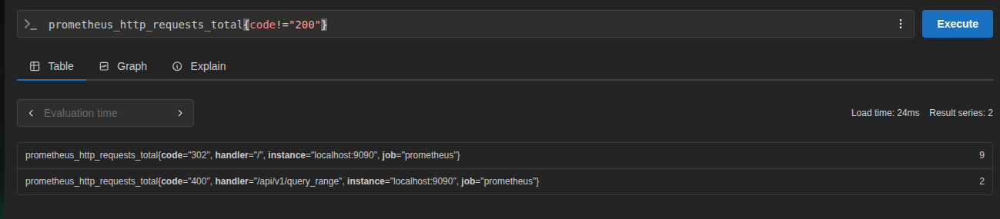

6. **Arithmetic:**
```promql
process_resident_memory_bytes / 1024 / 1024
```
This converts bytes to megabytes.

   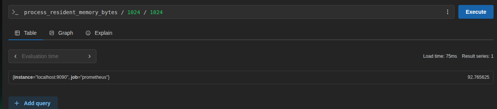

7. **Top-K:**
```promql
topk(5, prometheus_http_requests_total)
```

   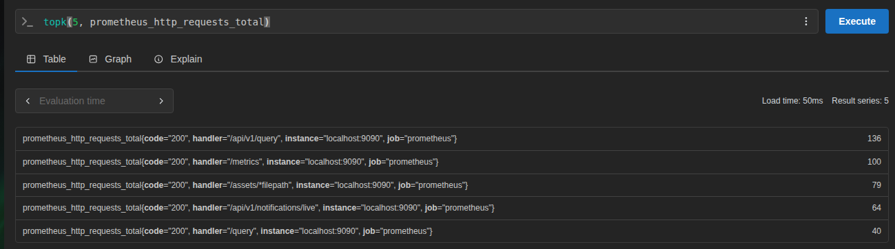

**Try this exercise:** Write a PromQL query that shows the per-second rate of non-200 HTTP requests to Prometheus over the last 5 minutes. (Hint: use `rate()` with a label filter on `code!="200"`)
```promql
rate(prometheus_http_requests_total{code!="200"}[5m])
```

   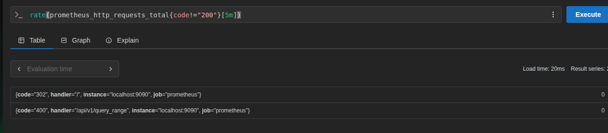

---

## Task 5: Add a Sample Application as a Scrape Target
Prometheus needs something to monitor. Add a simple metrics-generating service.

Update your `docker-compose.yml` to include a sample app that exposes Prometheus metrics:
```yaml
services:
  prometheus:
    image: prom/prometheus:latest
    container_name: prometheus
    ports:
      - "9090:9090"
    volumes:
      - ./prometheus.yml:/etc/prometheus/prometheus.yml
      - prometheus_data:/prometheus
    command:
      - '--config.file=/etc/prometheus/prometheus.yml'
    restart: unless-stopped

  notes-app:
    image: trainwithshubham/notes-app:latest
    container_name: notes-app
    ports:
      - "8000:8000"
    restart: unless-stopped

volumes:
  prometheus_data:
```

Update `prometheus.yml` to scrape the app:
```yaml
global:
  scrape_interval: 15s
  evaluation_interval: 15s

scrape_configs:
  - job_name: "prometheus"
    static_configs:
      - targets: ["localhost:9090"]

  - job_name: "notes-app"
    static_configs:
      - targets: ["notes-app:8000"]
```

Restart the stack:
```bash
docker compose up -d
```

Go back to Status > Targets. You should now see two targets. Generate some traffic to the app:

   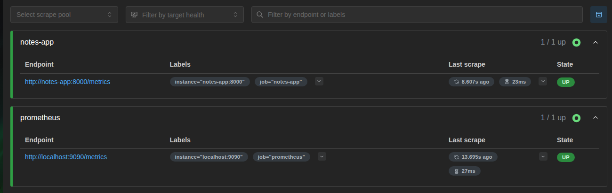

```bash
curl http://localhost:8000
curl http://localhost:8000
curl http://localhost:8000
```

**Note:** Not all applications expose Prometheus metrics natively. In later days you will learn how Node Exporter, cAdvisor, and OTEL Collector act as metric exporters for systems that do not have built-in Prometheus support.

---

## Task 6: Explore Data Retention and Storage
Understand how Prometheus stores data:

1. Check how much disk space Prometheus is using:
```bash
docker exec prometheus du -sh /prometheus
```

   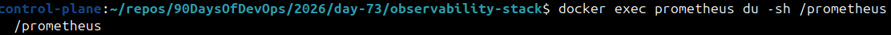

2. Prometheus stores data in a local time-series database (TSDB). Default retention is 15 days. You can change it:
```yaml
command:
  - '--config.file=/etc/prometheus/prometheus.yml'
  - '--storage.tsdb.retention.time=30d'
  - '--storage.tsdb.retention.size=1GB'
```

3. Check the TSDB status in the UI: Status > TSDB Status

   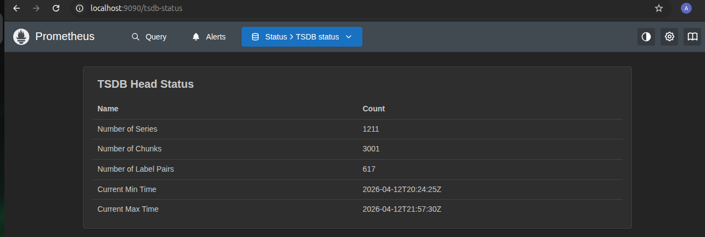

**Document:** What happens when retention is exceeded? Why is a volume mount important for Prometheus data?
   - When Prometheus hits its retention limit (time-based or size-based), it automatically deletes old data to make room for new metrics.
   - Without volume mount data will be lost once container stops/carshes.

---

## Documentation

- Architecture diagram of what you will build over days 73-77

```sh
    ┌───────────────────────────────────────────────────────────────┐
    │                 GRAFANA (Single Pane of Glass)                │
    │  ┌──────────────┐  ┌──────────────┐  ┌──────────────┐         │
    │  │   Metrics    │  │     Logs     │  │    Traces    │         │
    │  │  Dashboards  │  │  (Explore)   │  │  (Tempo)     │         │
    │  └──────────────┘  └──────────────┘  └──────────────┘         │
    └───────────────────────────────────────────────────────────────┘
               ↑                   ↑                   ↑
               │                   │                   │
        ┌──────┴──────┐     ┌──────┴──────┐     ┌──────┴───────┐
        │ Prometheus  │     │    Loki     │     │OTEL Collector│
        │  (Metrics)  │     │   (Logs)    │     │   (Traces)   │
        └──────┬──────┘     └──────┬──────┘     └──────────────┘
            ↑                   ↑                   ↑
        ┌──────┴──────┐     ┌──────┴──────┐     ┌──────┴───────┐
        │Node Exporter│     │   Promtail  │     │  Your App    │
        │  cAdvisor / │     │ (LogShipper)│     │(Instrumented)│
        |  Notes-app  |     |_____________|     |______________|
        |(metrics api)|            |
        └──────┬──────┘
            ↑                   ↑  |
        ┌──────┴──────┐     ┌──────┴──────┐
        │   Host OS   │     │  App Logs   │
        │  Containers │     │  (Docker)   │
        └─────────────┘     └─────────────┘
```

---
