# Day 82 - EKS Networking with Gateway API and Persistent Storage

## Task 1: Understand Gateway API vs Ingress
The AI-BankApp uses the Gateway API instead of the traditional Ingress resource. Research the differences:

| Feature | Ingress | Gateway API |
|---------|---------|-------------|
| API maturity | Stable but limited | GA since Kubernetes 1.26 |
| Traffic splitting | Not supported | Built-in (weighted backends) |
| Header matching | Annotation-dependent | Native HTTPRoute rules |
| Role separation | Single resource | GatewayClass (infra) -> Gateway (ops) -> HTTPRoute (dev) |
| TLS management | Annotation-based | Native TLS config in Gateway listeners |
| Session affinity | Not standardized | BackendTrafficPolicy (with Envoy) |

**The AI-BankApp's Gateway architecture:**
```
[Internet]
    |
[AWS NLB] (created by Envoy Gateway)
    |
[Gateway: bankapp-gateway]
  |-- Listener: HTTP (port 80)
  |-- Listener: HTTPS (port 443, TLS terminated)
    |
[HTTPRoute: bankapp-route]
    |
[Service: bankapp-service:8080]
    |
[Pods: bankapp x2-4] (with session affinity via cookie)
```

---

## Task 2: Install Envoy Gateway
Envoy Gateway is the Gateway API implementation the AI-BankApp uses.

Install via Helm:
```bash
helm install envoy-gateway oci://docker.io/envoyproxy/gateway-helm \
  --version v1.4.0 \
  -n envoy-gateway-system --create-namespace \
  --wait
```

   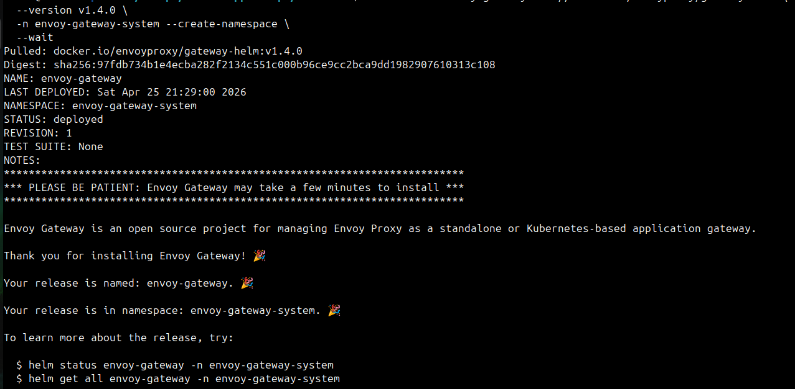

Verify:
```bash
kubectl get pods -n envoy-gateway-system
kubectl get gatewayclass
```

   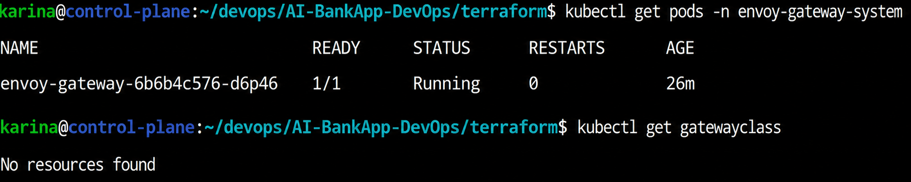

- kubectl get gatewayclass shows no resources because Envoy Gateway does not automatically create a GatewayClass during installation. A GatewayClass must either be enabled via Helm configuration or created manually

Now install the Gateway API CRDs if not already present:
```bash
kubectl get crd gateways.gateway.networking.k8s.io 2>/dev/null || \
  kubectl apply -f https://github.com/kubernetes-sigs/gateway-api/releases/download/v1.2.1/standard-install.yaml
```

   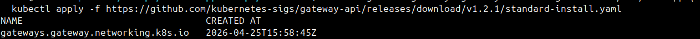

---

## Task 3: Deploy the AI-BankApp with Gateway API
Make sure the app is deployed (from Day 81):
```bash
kubectl get pods -n bankapp
```

   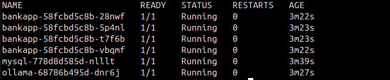

If not running, redeploy the core manifests:
```bash
cd AI-BankApp-DevOps
kubectl apply -f k8s/namespace.yml
kubectl apply -f k8s/pv.yml
kubectl apply -f k8s/pvc.yml
kubectl apply -f k8s/configmap.yml
kubectl apply -f k8s/secrets.yml
kubectl apply -f k8s/mysql-deployment.yml
kubectl apply -f k8s/service.yml
kubectl apply -f k8s/ollama-deployment.yml
kubectl apply -f k8s/bankapp-deployment.yml
kubectl apply -f k8s/hpa.yml
```

**Now study and apply the Gateway configuration.**

Open `k8s/gateway.yml` and understand each resource:

**1. GatewayClass** -- defines which controller handles Gateways:
```yaml
apiVersion: gateway.networking.k8s.io/v1
kind: GatewayClass
metadata:
  name: envoy-gateway
spec:
  controllerName: gateway.envoyproxy.io/gatewayclass-controller
```

**2. Gateway** -- creates the actual load balancer with listeners:
```yaml
apiVersion: gateway.networking.k8s.io/v1
kind: Gateway
metadata:
  name: bankapp-gateway
  namespace: bankapp
spec:
  gatewayClassName: envoy-gateway
  listeners:
    - name: http
      protocol: HTTP
      port: 80
    - name: https
      protocol: HTTPS
      port: 443
      hostname: <your-ip>.nip.io
      tls:
        mode: Terminate
        certificateRefs:
          - name: bankapp-tls
```

When this is applied, Envoy Gateway creates an AWS NLB (Network Load Balancer) automatically.

**3. HTTPRoute** -- routes traffic to the BankApp service:
```yaml
apiVersion: gateway.networking.k8s.io/v1
kind: HTTPRoute
metadata:
  name: bankapp-route
  namespace: bankapp
spec:
  parentRefs:
    - name: bankapp-gateway
      sectionName: https
    - name: bankapp-gateway
      sectionName: http
  rules:
    - matches:
        - path:
            type: PathPrefix
            value: /
      backendRefs:
        - name: bankapp-service
          port: 8080
```

**4. BackendTrafficPolicy** -- session persistence via cookies:
```yaml
apiVersion: gateway.envoyproxy.io/v1alpha1
kind: BackendTrafficPolicy
metadata:
  name: bankapp-session
  namespace: bankapp
spec:
  targetRefs:
    - group: gateway.networking.k8s.io
      kind: HTTPRoute
      name: bankapp-route
  loadBalancer:
    type: ConsistentHash
    consistentHash:
      type: Cookie
      cookie:
        name: BANKAPP_AFFINITY
        ttl: 3600s
```

**Why cookie-based session affinity?** The AI-BankApp uses Spring Security with form-based login. Without session affinity, a user's requests could hit different pods, and they would be logged out. The `BANKAPP_AFFINITY` cookie ensures all requests from a user go to the same pod.

Apply the Gateway configuration:
```bash
kubectl apply -f k8s/gateway.yml
```

   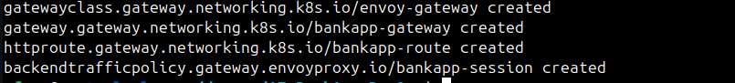

Wait for the NLB to be provisioned:
```bash
kubectl get gateway -n bankapp -w
```

   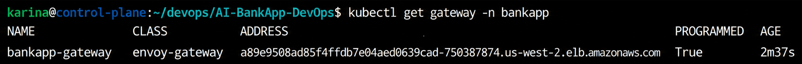

After creating gateway, gateway class is shown:
```bash
kubectl get gatewayclass
```

   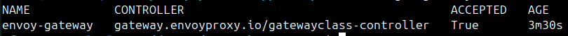

Get the external IP:
```bash
export GATEWAY_IP=$(kubectl get gateway bankapp-gateway -n bankapp -o jsonpath='{.status.addresses[0].value}')
echo "App URL: http://$GATEWAY_IP"
```

   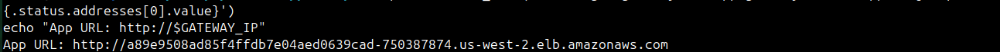

Test access:
```bash
curl http://$GATEWAY_IP
```

---

## Task 4: Set Up TLS with cert-manager
The AI-BankApp uses cert-manager with Let's Encrypt for automatic HTTPS certificates.

Install cert-manager:
```bash
helm repo add jetstack https://charts.jetstack.io
helm repo update

helm install cert-manager jetstack/cert-manager \
  -n cert-manager --create-namespace \
  --set crds.enabled=true \
  --wait
```

   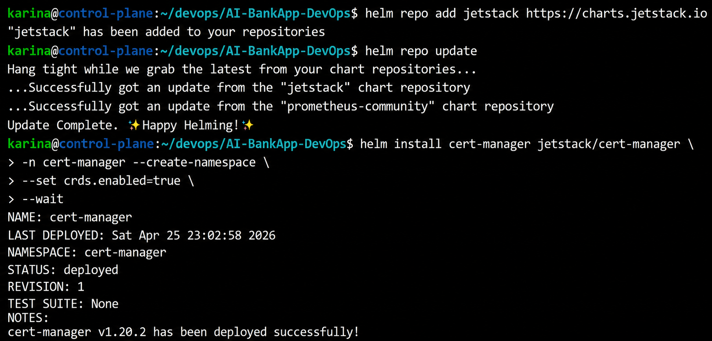

Verify:
```bash
kubectl get pods -n cert-manager
```

   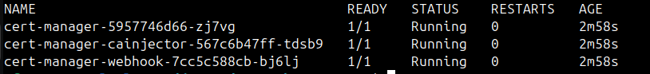

Study and apply the ClusterIssuer from `k8s/cert-manager.yml`:
```yaml
apiVersion: cert-manager.io/v1
kind: ClusterIssuer
metadata:
  name: letsencrypt-prod
spec:
  acme:
    server: https://acme-v02.api.letsencrypt.org/directory
    email: your-email@example.com
    privateKeySecretRef:
      name: letsencrypt-account-key
    solvers:
      - http01:
          gatewayHTTPRoute:
            parentRefs:
              - group: gateway.networking.k8s.io
                kind: Gateway
                name: bankapp-gateway
                namespace: bankapp
```

**How it works:**
1. cert-manager requests a certificate from Let's Encrypt
2. Let's Encrypt sends an HTTP-01 challenge
3. cert-manager creates a temporary HTTPRoute to respond to the challenge
4. Let's Encrypt verifies and issues the certificate
5. cert-manager stores the certificate in the `bankapp-tls` Secret
6. The Gateway uses this Secret for HTTPS termination

To use this, you need a hostname that points to your NLB IP. The AI-BankApp uses `nip.io` for quick DNS:
```bash
export HOSTNAME="${GATEWAY_IP}.nip.io"
echo "HTTPS URL: https://$HOSTNAME"
```

Update the Gateway hostname and apply:
```bash
# For learning: you can skip TLS and just use HTTP
# For production: update gateway.yml with your hostname and apply cert-manager.yml
```
   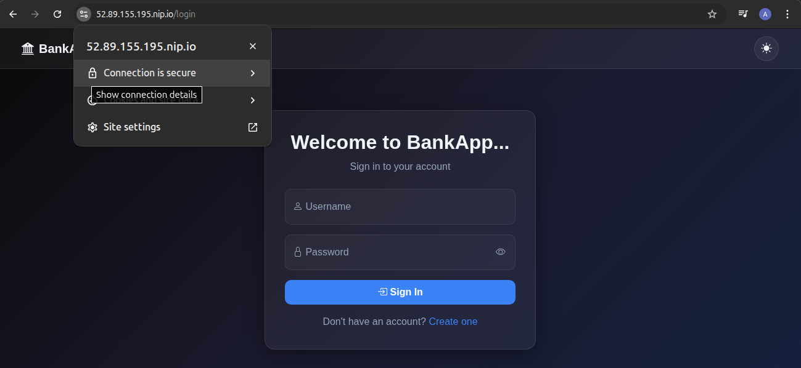

---

## Task 5: Understand EBS Persistent Storage in Action
The AI-BankApp uses EBS volumes for MySQL (5Gi) and Ollama (10Gi). Study how they work on EKS.

Check the storage setup:
```bash
# StorageClass
kubectl get storageclass gp3

# PVCs
kubectl get pvc -n bankapp

# PVs (dynamically provisioned)
kubectl get pv
```

   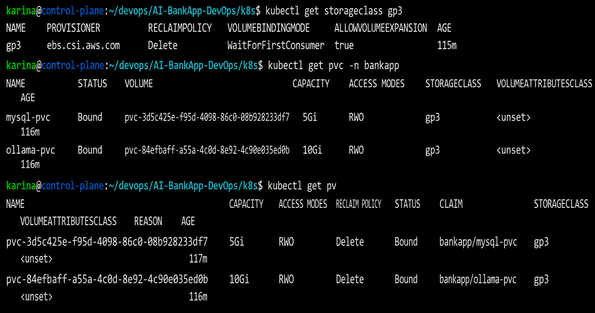

Output should look like:
```
NAME                      STATUS   VOLUME         CAPACITY   STORAGECLASS
mysql-pvc                 Bound    pvc-abc123...  5Gi        gp3
ollama-pvc                Bound    pvc-def456...  10Gi       gp3
```

**Find the actual EBS volumes in AWS:**
```bash
aws ec2 describe-volumes \
  --filters "Name=tag:kubernetes.io/created-by,Values=ebs.csi.aws.com" \
  --query "Volumes[*].{ID:VolumeId,Size:Size,AZ:AvailabilityZone,State:State}" \
  --output table \
  --region us-west-2
```

   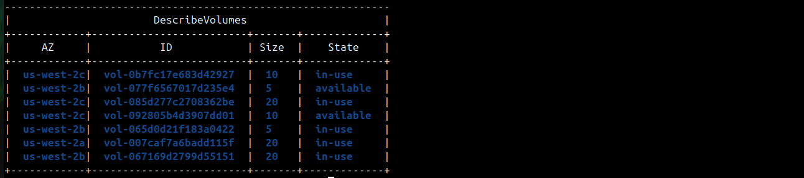

**Key EBS concepts on EKS:**
- `WaitForFirstConsumer` -- the volume is created in the same AZ as the pod that claims it
- `ReadWriteOnce` -- EBS can only attach to one node at a time (MySQL and Ollama use Recreate strategy because of this)
- `gp3` -- latest generation SSD, 3000 IOPS baseline, cheaper than gp2
- `allowVolumeExpansion: true` -- you can grow volumes without recreating them

**Test persistence** -- delete the MySQL pod and watch it come back with data intact:
```bash
# Check current MySQL data
kubectl exec -n bankapp deploy/mysql -- mysql -uroot -pTest@123 -e "SHOW DATABASES;"

# Delete the pod
kubectl delete pod -n bankapp -l app=mysql

# Watch it recreate
kubectl get pods -n bankapp -l app=mysql -w

# Verify data survived
kubectl exec -n bankapp deploy/mysql -- mysql -uroot -pTest@123 -e "SHOW DATABASES;"
```

   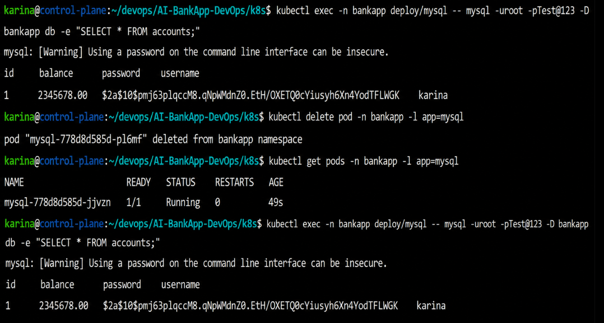

The database is intact because the EBS volume persists independently of the pod.

---

## Task 6: Explore HPA and Node Capacity
The AI-BankApp's HPA scales pods between 2 and 4 based on CPU.

```bash
kubectl get hpa -n bankapp
```

Check resource usage across nodes:
```bash
kubectl top nodes
kubectl top pods -n bankapp
```

   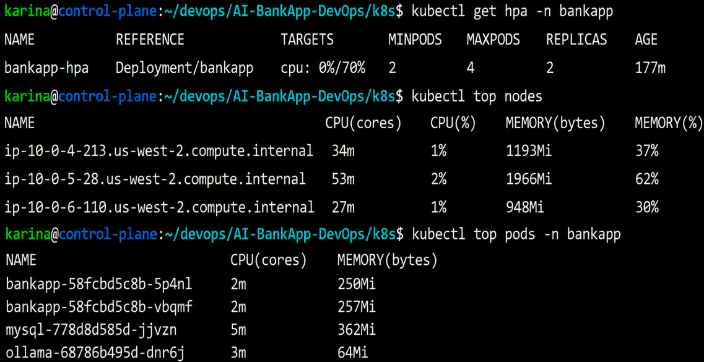

**Resource budget for the AI-BankApp on 3x t3.medium nodes:**

| Component | CPU Request | Memory Request | Instances |
|-----------|-----------|---------------|-----------|
| BankApp | 250m | 256Mi | 2-4 pods |
| MySQL | 250m | 256Mi | 1 pod |
| Ollama | 900m | 2Gi | 1 pod |
| Init containers | 50m | 32Mi | temporary |
| System pods | ~500m | ~500Mi | per node |
| **Total available** | **6000m (3 nodes)** | **12Gi (3 nodes)** | |

Ollama is the heaviest consumer. If you scale BankApp to 4 pods, total CPU requests reach ~2.9 cores + system overhead.

**Clean up the workload (keep the cluster for Day 83):**
```bash
kubectl delete -f k8s/gateway.yml 2>/dev/null
kubectl delete -f k8s/hpa.yml
kubectl delete -f k8s/bankapp-deployment.yml
kubectl delete -f k8s/ollama-deployment.yml
kubectl delete -f k8s/mysql-deployment.yml
kubectl delete -f k8s/service.yml
kubectl delete -f k8s/secrets.yml
kubectl delete -f k8s/configmap.yml
kubectl delete -f k8s/pvc.yml
kubectl delete -f k8s/pv.yml
kubectl delete -f k8s/namespace.yml
```

   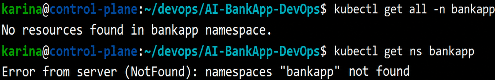

---
